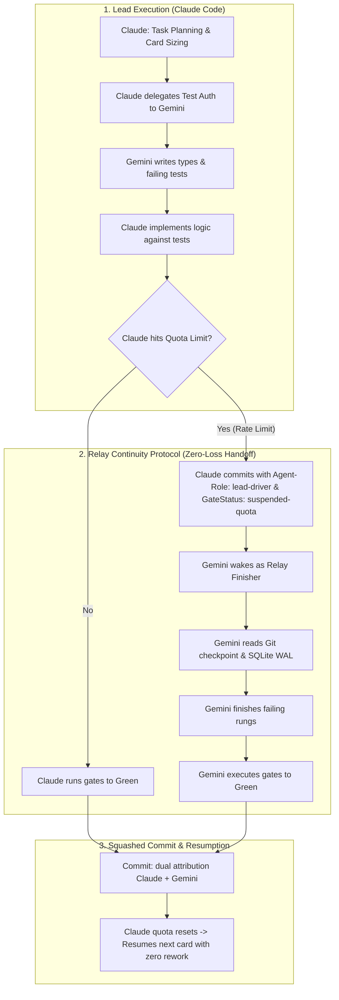

# AGENTS.md — Sekhemet Repository Guidelines & Multi-Agent Protocol

Welcome to **Sekhemet** (`/Users/brennankelley/Desktop/Sekhemet`).
This repository is a board-native, local-first AI coding harness designed for solo developers, pairing small, fast local models with a dual-axis nested kanban, automated executable gates, and event-sourced SQLite WAL state.

This document defines the mandatory development rules, commit attribution standards, and the **Claude + Gemini multi-agent collaboration strategy**.

---

## 1. Mandatory Git Commit Attribution Standard

Every single commit in this repository—whether an intermediate checkpoint commit or a squashed merge commit—**MUST** include structured Git trailers detailing which LLM performed the work, what harness was used, what role it assumed, and proper co-authorship.

### A. Intermediate Checkpoint Commits
During active card execution, every incremental rung completion or gate attempt must be committed to the card's worktree / checkpoint branch:

```git
checkpoint: step 4 passed lint and typecheck

Card: card_8f21
Step: 4/10
Agent-Model: claude-3-7-sonnet-20250219
Agent-Harness: claude-code
Agent-Role: implementer
GateStatus: pass
Co-authored-by: Claude <claude@anthropic.com>
```

### B. Final Squashed Merge Commits
When a card clears all verification gates and is merged into `main` (or integration branch), it must follow Conventional Commits and explicitly attribute all contributing models:

```git
feat(kernel): implement hash-chained event log writer

Card: card_8f21
Agent-Model: claude-3-7-sonnet-20250219
Agent-Harness: claude-code
Agent-Role: implementer
Co-authored-by: Claude <claude@anthropic.com>
Co-authored-by: Gemini <gemini@antigravity.google>
```

### Standard Trailer Schema

| Trailer Key | Allowed Values / Format | Description |
| :--- | :--- | :--- |
| `Card:` | `card_<hex4>` (e.g. `card_8f21`) | Active task/card identifier |
| `Step:` | `<index>/<total>` (e.g. `4/10`) | Execution rung index (for checkpoints) |
| `Agent-Model:` | `claude-3-7-sonnet-20250219`, `gemini-2.5-pro`, `gemini-2.5-flash`, etc. | Exact model ID that generated the patch |
| `Agent-Harness:` | `claude-code`, `antigravity-cli`, `cursor-agent`, `sekhemet` | Harness/CLI executing the agent |
| `Agent-Role:` | `lead-driver`, `delegator`, `implementer`, `architect`, `test-author`, `relay-finisher` | Role performed in this specific commit |
| `GateStatus:` | `pass`, `fail`, `partial`, `suspended-quota` | Status of automated gate checks |
| `Co-authored-by:` | `Name <email>` | Standard Git co-author trailer |

---

## 2. Claude + Gemini Collaboration Strategy

This project leverages **Claude** and **Gemini** in tandem. Claude typically acts as the lead orchestrator and high-velocity implementer, while Gemini acts as subagent specialist, test generator, architect, and the **Relay Finisher** when Claude encounters quota or rate limits.



### Role Division Matrix

1. **Claude (Lead Driver & Delegator)**:
   - Directs high-level task breakdown according to SPIDR boundaries.
   - Enforces card scope (<200 LOC, 1–3 files).
   - Writes core business logic in packages.
   - Delegates test generation and package scaffolding to Gemini subagents.
2. **Gemini (Subagent Architect & Test Author)**:
   - Generates contract interfaces (`types.ts`) and failing test suites (`*.spec.ts`) before implementation starts.
   - Conducts full-repo dependency audits and typecheck runs.
   - Scaffolds package directory structures and Vitest mock adapters.
3. **Gemini (Relay Finisher — The Quota Wall Protocol)**:
   - When Claude reaches hourly token usage or rate-limit walls:
     1. Claude commits current state with `GateStatus: suspended-quota`.
     2. Gemini inspects the worktree and checkpoint trailer (`refs/sekhemet/checkpoints/<card-id>`).
     3. Gemini inspects failing gate rungs (`pnpm test && pnpm typecheck`).
     4. Gemini finishes the implementation rungs until all gates pass green.
     5. Gemini commits the squashed merge commit with:
        ```git
        Agent-Model: gemini-2.5-pro
        Agent-Harness: antigravity-cli
        Agent-Role: relay-finisher
        Co-authored-by: Gemini <gemini@antigravity.google>
        Co-authored-by: Claude <claude@anthropic.com>
        ```
     6. When Claude's quota resets, Claude reads the clean git history and immediately resumes the next card without duplicate effort.

---

## 3. Engineering Invariants & Code Standards

All agents working on Sekhemet must strictly uphold these engineering laws:

1. **Contract-First Card Sizing**:
   - Every card touches at most **1–3 files** and **$<200$ LOC diff**.
   - Acceptance tests are written **first** and must fail before implementation begins.
   - **Test Immutability**: The implementer is strictly forbidden from modifying test fixtures to make tests pass. Only the test author or human may update assertions.
2. **100% Local Inference in v1**:
   - Core harness logic, models package, and loops must run 100% locally (Ollama, llama.cpp, MLX). No cloud API dependencies in runtime v1.
3. **Topological Package Dependency Order**:
   All packages must be implemented according to the acyclic dependency graph:
   ```
   kernel (event log, SQLite WAL)
     └── sandbox (process isolation, Seatbelt/Landlock)
           └── sync (git worktrees, checkpoints, remotes)
                 └── models (local inference adapters, arm selection)
                       └── gates (deterministic verification rungs)
                             └── context (repo map, AST pruning, budgeter)
                                   └── loop (executor, recovery, stall detection)
                                         └── board (kanban state, SPIDR planner)
                                               └── planner (task decomposition, ClarEval ask-vs-assume)
                                                     └── eval (SWE-bench harness, meta-task calibration)
                                                           └── ui (TanStack Virtual canvas, basalt theme)
                                                                 └── apps/harness (CLI entrypoint)
   ```
4. **Deterministic Gate Verification**:
   - Agent self-certification is rejected. A card only transitions to `Review` when automated verification gates return exit code 0 (`tsc --noEmit`, `vitest run`, `biome check`).
5. **No Prohibited Patterns**:
   - No simulated Scrum personas (no fake Standups/Product Owners).
   - No parallel file writes without worktree isolation.
   - No unbounded best-of-N sampling.
   - No vector embedding code RAG (use deterministic Tree-sitter + repo map + LSP).
6. **Anti-Shallow Development & Testing Invariant (`DEFINITION_OF_DONE.md`)**:
   - **Zero Vanity Testing:** No synthetic mocks for core runtime systems (must test against real native SQLite WAL, real OS child processes, real git worktrees).
   - **Mandatory Fault Injection:** Every module must have negative test cases verifying behavior under malformed inputs, permission violations, and disk/hash tampering.
   - **Deep Structural Assertions:** Trivial `toBeDefined()` smoke tests are banned. Tests must assert exact values, complete schemas, and cryptographic hash chains.
   - **Subsystem Completeness:** Zero stubbed or naive implementations; full production enforcement of three-tier permissions, 10 lifecycle hooks, AST symbol tools, and RTK context condensing.
   - All code must pass the binding criteria defined in [DEFINITION_OF_DONE.md](file:///Users/brennankelley/Desktop/Sekhemet/DEFINITION_OF_DONE.md).

---

## 4. Key Developer Commands

```bash
# Install dependencies
pnpm install

# Typecheck all packages
pnpm typecheck

# Run test suites
pnpm test

# Format & Lint
pnpm lint
pnpm format

# Build all packages
pnpm build
```
