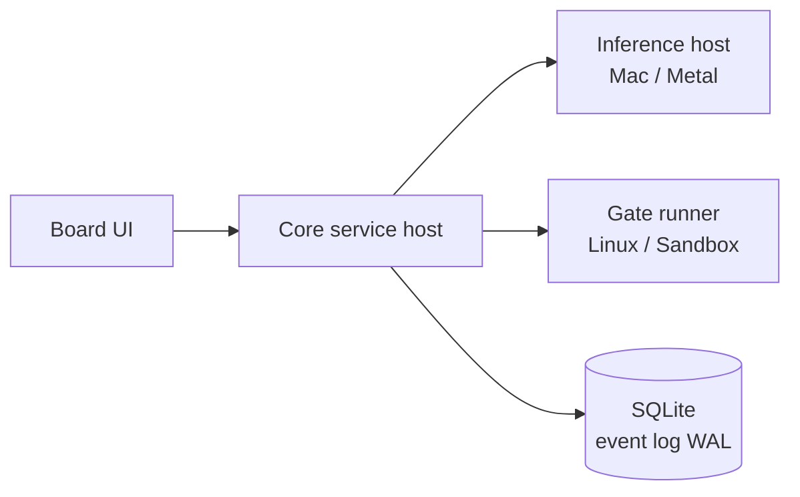
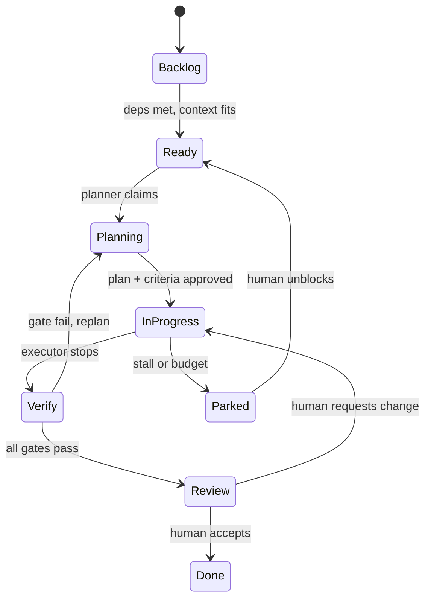
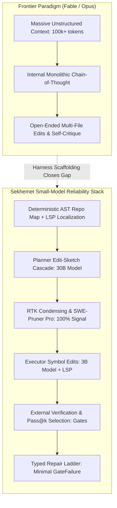
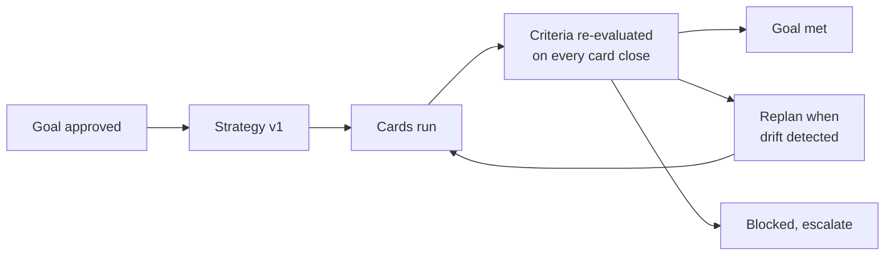
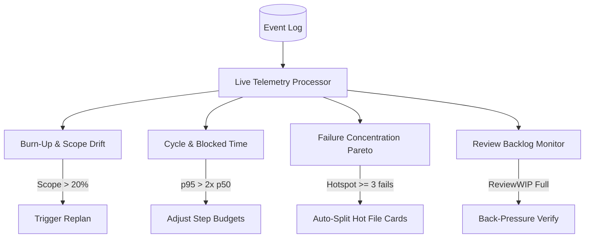
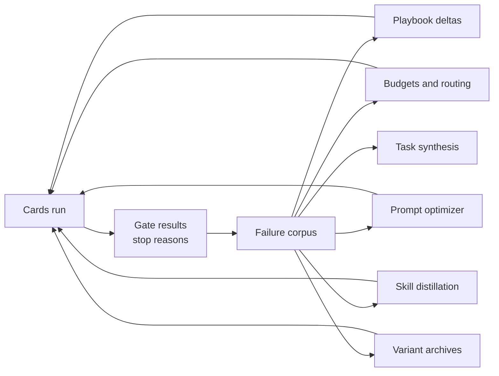
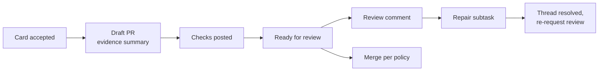
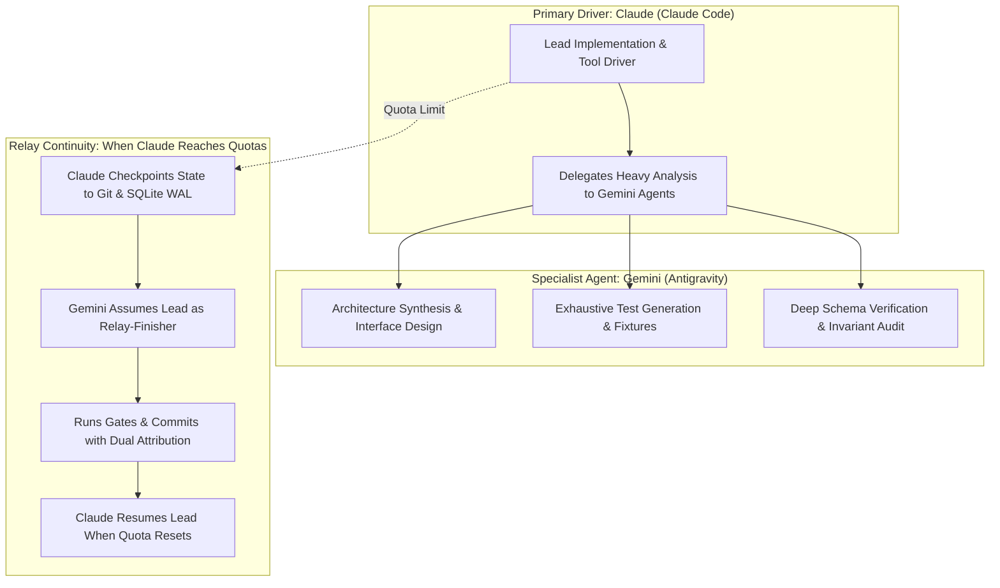

# Sekhemet — Board-Native Local-First AI Coding Harness, Design v2

2026-09-17 · @Someone

## Purpose, scope, and locked v1 decisions

Sekhemet is a local-first AI coding harness whose interface is nested kanban boards rather than chat. This document is written to be implemented by AI coding agents, so every section states interfaces, data shapes, and acceptance criteria rather than intentions. Design v2 raises the specification to feature and capability parity with the top five harnesses—Claude Code, OpenAI Codex, DeepSeek Harness (`dsh`), Cursor Agent, and Aider—as of September 2026, while strictly preserving its locked v1 decisions. It adds the brand identity, comprehensive capability parity audits, verified skills and tools catalogs, complete context-rot and small-model reliability engines, recursive self-improvement flywheels, human collaboration protocols, production-grade GitHub integration, complete design tokens, and a complete build specification.

Sections carrying an open item are tagged inline: **[BENCH]** needs measurement on the founder's hardware, **[RESEARCH]** needs further investigation, **[DESIGN]** needs a decision before implementation.

### Locked decisions

| Decision | Value |
| --- | --- |
| Inference | 100% local in v1; no cloud models |
| Target user | Solo developer already running local models |
| Hardware range | 16 GB to 128 GB, self-calibrating |
| Cascade | Local planner + local executor; swapped on small machines, co-loaded on large |
| Context | Fresh per card; no long-running session |
| Done | Executable gates only; the agent never certifies its own work |
| Network | Offline by default; git remotes and GitHub sync are opt-in adapters |
| Language | TypeScript throughout v1 |
| Rejected on evidence | Simulated Scrum-role agents, parallel agents writing the same files, self-refine and reflection loops as a quality mechanism, multi-agent debate, unbounded best-of-N, embedding RAG as the primary code-context mechanism, large context windows as a strategy, persona prompting, continuous-embedding context compression |

### Non-goals for v1

Teams, multi-user boards, RBAC, SSO, the compliance pack, Jira, Linear and Azure DevOps connectors, multi-machine inference pooling, and any cloud model path.

## Name and brand

The product is **Sekhemet**, after the Egyptian goddess of war and healing (traditionally spelled Sekhmet; the product spelling is a deliberate variant and is used consistently). The name carries the two things the harness does: it fights through work, and it heals what it breaks before anyone sees it.

### Voice

Plain, exact, and calm. Sekhemet reports what passed, what failed, and what it needs from you. It never says "done" when it means "I think so." Interface copy uses verbs and numbers, avoids exclamation, and names the gate rather than the feeling.

### Naming conventions

| Concept | Name in product |
| --- | --- |
| Top-level view | Workspace |
| Nested board | Project, Card, Subtask |
| Executable definition of done | Gates |
| Proof a card is done | Evidence |
| Learned repo knowledge | Playbook |
| Executor and planner | Worker and Planner |
| Local knowledge system | Library |

### How the goal criteria map to this document

| Criterion | Sections |
| --- | --- |
| Matches or exceeds the top five harnesses | Capability parity audit; Top-model tool semantics |
| Skills and tools cataloged | Skills catalog; Tool catalog; Component register |
| Recursive self-improvement | Recursive self-improvement; Prompt architecture; Model registry |
| Context-rot defense | Context-rot defense; Context assembly pipeline and prefix-cache layout |
| Competitive feature set | Every section from Executor loop through Air-gap kit |
| Small-model leverage | Small-model leverage; Executor loop; Repair contracts |
| Buildable end to end | Build specification; Implementation stack; Build phases |
| Brand and design tokens | Name and brand; Frontend design system |
| Top-model strategies | Top-model tool semantics |
| PM collaboration | Human collaboration protocol; Planner layer; Goals and live project management |
| Other current techniques | Recursive self-improvement; Web research; Sessions and runtime |

## Product definition and selling points

The product is a local AI engineering manager. Work lives on nested boards, the machine executes cards while the developer reviews, and nothing advances without passing gates.

**Positioning.** A local-first AI engineering manager: a board, not a chatbot, that plans and ships work on your own hardware, and only lets code advance when it compiles, typechecks, and passes your tests.

### The six pillars

1. **100% local.** No cloud inference, zero telemetry, offline-capable install.
2. **Hardware-adaptive.** Self-calibrating profiles from 16 to 128 GB, automatic model selection, scheduled swaps, overnight mode.
3. **Small-model reliability engine.** Tolerant tool interface, symbol-level edits, parse gate, assembled context, fresh per card, local planner/executor cascade.
4. **AI project manager.** Nested boards, decomposition to the machine's competence envelope, dependency scheduling, token and time accounting, WIP limits tied to review capacity.
5. **Executable definition of done.** Per-column gates with status rollup and an evidence bundle per card.
6. **Fits the existing workflow.** Git-native, GitHub and Forgejo sync, AGENTS.md and CLAUDE.md, MCP and ACP, existing CI as a gate source.

### Structural advantages

These follow from the architecture and are hard for chat-based, cloud-based competitors to copy: verification replaces self-report; no session means no session decay; compute accounting that token vendors are disincentivized to build; reproducibility from pinned models and deterministic context; and a learned competence model of each executor on each repo that compounds with use.

### Claims not to make

Never claim parity with frontier models on ambiguous work, guaranteed correct code, unmeasured benchmark numbers, or any compliance certification that does not exist.

## Capability parity audit

v1 matches or exceeds the top five coding harnesses—Claude Code (Anthropic), OpenAI Codex (OpenAI), DeepSeek Harness (`dsh`, DeepSeek AI), Cursor Agent (Anysphere), and Aider (Paul Gauthier)—in every capability category except raw cloud parameter scale and cloud-hosted latency. Those two are fundamental cloud-vs-local trades, not harness limits, and the design accepts them deliberately.

### Comparative matrix: September 2026

| Capability Dimension | Claude Code (Anthropic) | OpenAI Codex (OpenAI) | DeepSeek Harness (`dsh`) | Cursor Agent (Anysphere) | Aider (Paul Gauthier) | Sekhemet (This design) |
| --- | --- | --- | --- | --- | --- | --- |
| **Primary Interface** | Conversational Terminal REPL | Desktop GUI & Terminal CLI | Modular CLI & Trajectory Web UI | IDE Composer & Background Agent | Terminal CLI & in-place chat | **Board-Native Nested Kanban**; CLI/TUI secondary |
| **Inference Source** | Cloud-only (Anthropic API) | Cloud-only (OpenAI API) | Local or Cloud (Ollama/HTTP) | Cloud-only (Cursor infrastructure) | Cloud BYOK or Local (Ollama) | **100% Local only** (llama.cpp / MLX); zero telemetry |
| **Core Architecture** | Agent loop with tool calling | Multi-agent worktree command center | Cordis micro-kernel plugin host | Agentic IDE Composer loop | Architect / Editor split loop | **Cordis-inspired TypeScript kernel & SQLite WAL event log** |
| **Tool Set & Edit Reliability** | View, Edit, Replace, Bash, Glob, Grep, Agent | Read, Edit, Exec, Dir, AGENTS.md | Service-bound plugin tools (shell, FS) | Multi-file search/replace, terminal | udiff & search/replace with Tree-sitter map | **Symbol-scoped AST tools (`replace_symbol_body`) + LSP + RTK sandboxed bash** |
| **Permission & Sandboxing** | 7 modes + classifier (`PermissionRequest`) | OS Sandbox modes (Seatbelt/Landlock/Bubblewrap) | Approval policy plugins | In-editor prompt confirmation | Interactive prompt confirm / git revert | **3-tier Allow/Ask/Deny + OS-level Seatbelt/Landlock + scope write confinement** |
| **Lifecycle Hooks & Events** | Lifecycle events (PreToolUse, PostToolUse, etc.) | Pre/post command hooks | Cordis waterfall lifecycle hooks | None / internal editor triggers | Git pre-commit hooks | **10-point waterfall lifecycle hook engine across loop, gate, and sync events** |
| **Skills & Rules System** | Agent Skills standard (`SKILL.md` + frontmatter) | Scoped skill configs (system, user, project) | Cordis tool plugins | `.cursor/rules/*.mdc` (glob-attached) + `AGENTS.md` | Git conventions, `.aider.conf.yml` | **Open Agent Skills standard (`SKILL.md`) + tiered rules + `sekhemet doctor` diagnostics** |
| **MCP Integration** | Native MCP Client & Server | Native MCP Client | MCP Plugin adapter | Native MCP Client | None / minimal | **Dual MCP Client & Server** (boards, cards, gates, evidence exposed) |
| **Session Semantics & Trajectory** | Conversational session with compaction | Session resume / non-interactive CI | Append-only trajectory; replay/fork | Chat threads with context compaction | Terminal chat history with `/drop` | **Fresh deterministic context per card; replay, fork, and rewind from SQLite WAL** |
| **Subagent Architecture** | Subagents (`.claude/agents/*.md`, AgentTool) | Parallel sub-agent workers | Sub-agent dispatch plugin | Background maintenance agents | Single-threaded model pair | **Nested Kanban board DAG + SPIDR decomposition + branch-and-return isolation** |
| **Context Management** | 5-stage lossy LLM compaction pipeline | Context window compaction | Trajectory pruning plugin | Context window stuffing + indexing | Tree-sitter repo map with PageRank + `/clear` | **Deterministic AST repo map + RTK output condensing (60–90%) + SWE-Pruner Pro line pruning (40–60%) + observation masking** |
| **Git Integration** | Worktrees, checkpoint commits | Worktree tracking & GitHub PR integration | Basic git plugin | Git worktrees & branch management | Automatic atomic commits per turn with descriptive messages | **Per-card worktrees, checkpoint commits, squash-on-accept into Conventional Commits, stacked branches, and difftastic structural diffs** |
| **Definition of Done & Verification** | Self-critique / `/ultrareview` agent fleet | User-specified test execution + Codex Security | Manual / test execution | Editor linter diagnostics | `/test` auto-run command | **Multi-layer deterministic gates (Static, Functional, Robustness, Security, Visual, Hygiene); agent NEVER certifies own work** |
| **Hardware Awareness & Self-Sizing** | None (cloud-hosted) | None (cloud-hosted) | None (manual configuration) | None (cloud-hosted) | None (manual configuration) | **Hardware self-calibration (16–128 GB S/M/L/XL profiles) + Memory Pressure Watchdog with dynamic throttling** |
| **Air-Gap & Reproducibility** | None (requires internet) | None (requires internet) | Partial | None (requires cloud) | Possible with local Ollama | **First-class Air-Gap Kit with local package mirrors (npm, devpi, crates) + byte-identical prompt caching** |

### Detailed 10-dimension parity breakdown

#### 1. Tool Sets
*   **Claude Code:** Exposes `View` (paged read), `Edit` (exact unique string match), `Replace` (whole-file write), `Bash` (shell execution with description), `GlobTool`, `GrepTool`, `AgentTool` (subagent spawning), `Todo` (session task list), `WebSearch`, and `WebFetch`.
*   **Codex CLI:** Exposes file read, file edit/patch, shell execution (`exec`), directory traversal, and context loading.
*   **DeepSeek Harness (`dsh`):** Exposes shell execution, file read/write, and custom tools registered as Cordis plugins.
*   **Cursor Agent:** Exposes multi-file Composer edits, terminal execution, codebase indexing, and background code maintenance sweeps.
*   **Aider:** Pioneers the Architect/Editor model split, using `udiff` line-oriented diffs and whole-file search-and-replace, supported by a Tree-sitter repository map.
*   **Sekhemet:** Adopts the exact proven semantics of `read` (line-numbered 1-based, byte-budgeted), `edit` (exact replacement with uniqueness constraint), `grep` (ripgrep with three modes), `glob` (mtime-sorted), and `run` (sandboxed bash with RTK output condensing). Sekhemet goes beyond the top five by providing symbol-scoped AST tools (`replace_symbol_body`, `insert_after_symbol`, `read_symbol`, `find_references`) backed by an LSP client pool, cutting small-model edit failures by eliminating whitespace and offset hallucinations. Search and fetch tools are strictly segregated to research cards.

#### 2. Permission Models
*   **Claude Code:** Implements 7 permission modes (Default, Auto-Approve, Bypass, Read-Only, Plan Mode, etc.) paired with a runtime classifier that intercepts suspicious actions via `PermissionRequest`.
*   **Codex CLI:** Uses OS-level sandboxing (Apple Seatbelt on macOS, Landlock/Bubblewrap on Linux) supporting `read-only`, `workspace-write`, and `danger-full-access`.
*   **DeepSeek Harness (`dsh`):** Implements an approval policy plugin inspecting service calls.
*   **Cursor Agent:** Uses in-editor prompt confirmation modals before executing shell commands or editing out-of-scope files.
*   **Aider:** Interactive confirmation prompts for shell commands and automatic git-commit rollbacks for unwanted edits.
*   **Sekhemet:** Implements a strict three-tier permission model (**Allow**, **Ask**, **Deny**, with Deny always winning). Like Codex CLI, it enforces OS-level sandboxing (macOS Seatbelt, Linux user namespaces + Landlock + seccomp filters). Writes outside the card's declared `filesTouched` scope are denied. Modifying `gates.toml`, gate test files, loop control, or sandbox configs is permanently denied without human override. Untrusted content (issues, web fetches) is tagged and triggers elevated restrictions.

#### 3. Hooks and Lifecycle Events
*   **Claude Code:** Exposes lifecycle hooks including `SessionStart`, `UserPromptSubmit`, `PreToolUse`, `PostToolUse`, `PermissionRequest`, `PreCompact`, and `SessionEnd`.
*   **Codex CLI:** Provides minimal hook points around command execution.
*   **DeepSeek Harness (`dsh`):** Features Cordis waterfall events where plugins register interceptors.
*   **Cursor Agent:** Relies on internal editor lifecycle triggers and language server events.
*   **Aider:** Supports Git pre-commit hooks and external linter integrations.
*   **Sekhemet:** Implements a complete waterfall lifecycle hook engine across 10 critical events: `card/start`, `pre-step` (context injection), `pre-tool` (permission & validation), `post-tool` (parse gate & secret scanning), `pre-gate`, `post-gate`, `card/end`, `review/return`, `playbook/propose`, and `turn-stopping` (stall detection). Hooks run outside the sandbox with user privileges to allow formatters, lint fixers, and local notifications.

#### 4. Skills and Progressive Disclosure
*   **Claude Code:** Uses the open Agent Skills standard (`SKILL.md` with YAML frontmatter) loaded from `.claude/skills/`, supporting progressive disclosure (manifest line in prompt, full instructions loaded on match).
*   **Codex CLI:** Supports scoped skill files at system, user, and repository levels.
*   **DeepSeek Harness (`dsh`):** Relies on Cordis tool plugins.
*   **Cursor Agent:** Uses `.cursor/rules/*.mdc` files supporting glob-attached rules, always-on rules, and `AGENTS.md` instructions.
*   **Aider:** Uses `.aider.conf.yml` and repository conventions in prompt preambles.
*   **Sekhemet:** Natively implements the open Agent Skills standard. Skills are stored under `.sekhemet/skills/<name>/` with a `SKILL.md` manifest, scripts, references, and regression evals. Manifest lines are budgeted into prompt Zone 2, and full instructions load only when a card's class matches the skill's declared triggers. The automated `sekhemet doctor` command benchmarks each skill against held-out tasks to prune rules that cause context bloat without lifting pass rates.

#### 5. MCP Support
*   **Claude Code:** Operates as both an MCP Client (connecting to external servers) and an MCP Server (exposing Claude tools).
*   **Codex CLI:** Operates as an MCP Client.
*   **DeepSeek Harness (`dsh`):** Supports MCP via plugin adapters.
*   **Cursor Agent:** Native MCP Client support for connecting to external tool and documentation servers.
*   **Aider:** Minimal / experimental MCP integration.
*   **Sekhemet:** Ships dual MCP Client and Server:
    *   *Client:* Projects declare external MCP servers in `config.toml`; discovered tools are budgeted and exposed to the planner and executor.
    *   *Server:* Sekhemet exposes its own workspace, boards, cards, gates, evidence bundles, and model registry as MCP tools, allowing IDEs, external CLI agents, or CI scripts to manage cards programmatically.

#### 6. Session Semantics and Trajectory Management
*   **Claude Code:** Manages conversational sessions with interactive resume, branch forking, session rewind, and transcript compaction.
*   **Codex CLI:** Supports interactive sessions and non-interactive `codex exec` pipelines.
*   **DeepSeek Harness (`dsh`):** Unified execution trajectory in an append-only event log; supports log-derived replay and branch forking.
*   **Cursor Agent:** Multi-turn conversational chat sessions stored in editor history with automatic context truncation.
*   **Aider:** In-terminal conversation history with `/clear`, `/drop`, and `/undo` commands.
*   **Sekhemet:** Eliminates session rot by running fresh, deterministic context per card attempt. It matches every operational session feature through its append-only SHA-256 hash-chained event log:
    *   *Resume:* Reconstructs board state, restores git worktree to last checkpoint commit, and resumes execution.
    *   *Fork:* Branches an attempt at step N with a modified model route, prompt version, or budget.
    *   *Rewind:* Resets the worktree to step N's checkpoint commit, records a rewind event, and invalidates any subsequent gate passes.
    *   *Replay:* Replays execution against pinned configurations for A/B eval comparisons.
    *   *Headless/Exec:* Full headless CLI (`sekhemet run <card>`) and TypeScript SDK with async iterator event streams.

#### 7. Subagent Architecture
*   **Claude Code:** Employs specialized subagents (Explore, Plan, General) launched via `AgentTool`, operating in isolated sub-loops and returning text summaries to the parent session.
*   **Codex CLI:** Limited subagent delegation to parallel background tasks.
*   **DeepSeek Harness (`dsh`):** Supports sub-agent dispatch plugins.
*   **Cursor Agent:** Dispatches background maintenance agents across git worktrees for isolated refactors and documentation sweeps.
*   **Aider:** Strictly single-threaded, using an Architect/Editor model pair to split high-level reasoning from diff generation.
*   **Sekhemet:** The nested Kanban board *is* the subagent system. Decomposed subtasks are first-class cards that inherit project context but execute in isolated sub-contexts. Subtasks return a structured summary and an evidence ID; the parent card never accumulates the child's raw step trajectory (branch-and-return isolation).

#### 8. Context Management and Compaction
*   **Claude Code:** Employs a 5-stage compaction pipeline that periodically summarizes previous turns when nearing the context limit.
*   **Codex CLI:** Uses context window compaction.
*   **DeepSeek Harness (`dsh`):** Uses trajectory filtering plugins.
*   **Cursor Agent:** Uses whole-file stuffing with vector embedding code search to retrieve context into large context windows.
*   **Aider:** Builds a Tree-sitter AST repository map with Personalized PageRank to select high-relevance identifiers within budget.
*   **Sekhemet:** Rejects lossy model-written trajectory summaries. It combines Aider's AST repo map and PageRank with headless LSP expansion, RTK command output condensing (60–90% reduction), SWE-Pruner Pro line pruning (40–60% reduction), and in-place observation masking (replacing tool outputs older than 2 steps with 15-token pointers), keeping semantic density near 100%.

#### 9. Git Integration
*   **Claude Code:** Manages worktrees, executes git commands, and commits changes.
*   **Codex CLI:** Tracks repository status and integrates with GitHub repositories.
*   **DeepSeek Harness (`dsh`):** Basic git status/diff operations.
*   **Cursor Agent:** Manages git worktrees for background agent branches and generates pull requests.
*   **Aider:** Established the gold standard for git-native coding agents with automatic, atomic git commits per turn and descriptive commit messages.
*   **Sekhemet:** Builds upon Aider's git-centric foundation and extends it into production team engineering: per-card git worktrees with copy-on-write cloning; structured machine-authored checkpoint commits on every passing step; automatic squash-on-accept into Conventional Commits; stacked branches for decomposed feature chains; syntax-aware structural diffs (difftastic); and an opt-in GitHub App adapter managing the entire PR lifecycle.

#### 10. Definition of Done and Verification
*   **Claude Code:** Relies on the agent's internal self-critique, `/ultrareview` agent fleet, and user-initiated tests.
*   **Codex CLI:** Runs user-specified shell tests and flags potential issues via Codex Security.
*   **DeepSeek Harness (`dsh`):** Relies on test command execution plugins and manual developer inspection.
*   **Cursor Agent:** Checks code against editor linter errors and language server diagnostics.
*   **Aider:** Supports automated test execution via the `/test` command, feeding test failure output back into context for repair.
*   **Sekhemet:** Stands alone in enforcing the foundational invariant: **the agent never certifies its own work**. A card is done only when declared, unmodifiable executable gates pass on an isolated gate host:
    *   *Static:* In-memory AST parse gate, strict typecheck (`tsc --noEmit`), and linter.
    *   *Functional:* Unit, integration, and pre-written acceptance tests (which must fail before implementation begins).
    *   *Robustness:* Diff-scoped mutation testing (Stryker / cargo-mutants) verifying test suite effectiveness.
    *   *Security:* Secret scanning (`gitleaks`), dependency supply-chain existence checks against slopsquatting, and vulnerability scans (`osv-scanner`).
    *   *Visual:* Deterministic Playwright DOM assertions, layout bounding box checks, element-level pixelmatch screenshot diffs, and axe-core accessibility scans.
    *   *Review Surface:* Generates a comprehensive EvidenceBundle with difftastic structural diffs, enabling 5-second human acceptance.

### Deliberate omissions from v1 and rationale

| Omitted Capability | Present in Competitor | Architectural Reason for Omission |
| --- | --- | --- |
| **Cloud Model Routing & Fallback** | Claude Code, Codex CLI | **Locked Decision.** Sekhemet guarantees 100% local execution, zero telemetry, and complete data privacy. Cloud fallback creates data leakage risks and hides local competence limits. |
| **Continuous Conversational Accumulation** | Claude Code, Codex CLI | **Evidence-Based Rejection.** Long-running conversational sessions suffer from context rot, attention dilution ("lost in the middle"), and hallucinated agreements. Fresh context per card is an invariant. |
| **Lossy Model Summarization of Context** | Claude Code | **Reliability Defense.** Model-generated trajectory summaries drop exact file paths, compiler flags, and error strings needed for subsequent repair steps. Sekhemet uses exact observation masking. |
| **Multi-Agent Conversational Debate** | Experimental frameworks | **Evidence-Based Rejection.** Multi-agent debate dramatically increases token burn and inference latency while failing to outperform repeated sampling with external gate selection on coding tasks. |
| **Simulated Scrum Role Agents** | Chat-based multi-agent tools | **System Design Principle.** Simulating Product Owners, QA Testers, and Developers as chatting personas degrades execution into coordination overhead. Sekhemet uses deterministic gates and PM algorithms. |
| **Parallel Agents Writing Same Files** | Multi-worker harnesses | **Conflict Avoidance.** Parallel edits to the same files produce implicit architectural collisions and merge conflicts. Sibling cards with overlapping scopes are strictly serialized. |
| **Embedding RAG as Code Context** | Generic coding assistants | **Precision Requirement.** Vector embeddings over source code fail on multi-step structural navigation. Sekhemet uses tree-sitter AST repo maps with PageRank and synchronous LSP symbol queries. |

### Feature gaps closed in v2

| Feature | Specification | Phase |
| --- | --- | --- |
| **Rewind** | Every step's checkpoint commit is a rewind point; the card view offers "rewind to step N," which resets the worktree, truncates nothing in the log, and records a rewind event. Rewinding past a gate pass invalidates that pass. | 2 |
| **Dynamic tool loading** | Tools beyond the core set are deferred: only their names and one-line descriptions are in the prompt; a `tool_search` call loads a full schema into the volatile zone for the current step. MCP servers with many tools are usable without prefill cost. | 2 |
| **External review cards** | A review card can target a pull request the harness did not create. It runs the reviewer procedure and gates on a checkout, posts findings as an evidence bundle, and never edits. With a tracker adapter, findings post as review comments. | 3 |
| **Scheduled and recurring cards** | A card may carry a schedule (cron syntax) or a trigger (a webhook, a file change, a dependency release). Recurring cards clone from a template and inherit its gates. Wake-ups respect declared hours unless marked urgent. | 3 |
| **Agent-driven browser** | An executor tool `browse` exposes a sandboxed browser session (navigate, read accessibility tree, click, type, screenshot) for testing what a card built. Reads are free; writes require the card's scope to include a URL allowlist. Screenshots land in evidence. | 3 |
| **IDE extension and TUI** | A VS Code extension over the ACP surface: open a card, stream steps, accept or return. A terminal UI over the same API for headless boxes, with the board, card, and inbox views. | 3 |
| **Implementation previews** | For architectural choices, the planner generates 2–3 concrete approach previews (trade-offs, files touched, diff sketch) in Decision Requests, enabling 5-second human alignment before execution. | 2 |
| **Skill & playbook diagnostics (`sekhemet doctor`)** | Automated offline evaluation of skills and playbook rules against frozen regression tasks, measuring net gain over baseline and pruning rules that cause context bloat or pass rate regressions. | 2 |
| **Memory pressure watchdog** | Real-time OS VRAM/memory telemetry; dynamically disables speculative decoding, sheds observation caches, and throttles parallel worktrees if memory exceeds 85–90% threshold. | 1 |
| **Restricted mode (`--restricted`)** | Safe audit execution profile for untrusted repositories and external PRs, completely disabling shell execution (`run`) and restricting the agent to read-only AST inspection and static gates. | 2 |

Still deferred: a plugin marketplace, remote control from mobile beyond notifications, and team chat entry points.

## System architecture

The architecture follows DeepSeek Harness and its Cordis kernel: one append-only event log is the source of truth, and every capability is a plugin claiming a service key. Patterns are adopted; no code is copied.

### Invariant

**Model-visible means logged.** Anything that reaches a model request must be reconstructable from the event log. A runtime assertion enforces this. Replay, fork, card threads, the audit trail, and the competence model all derive from this one stream.

### Services

| Service key | Owns |
| --- | --- |
| `ctx.events` | Append-only event log, hash-chained |
| `ctx.board` | Boards, cards, dependency graph, WIP accounting |
| `ctx.context` | Repo map, LSP expansion, pruning, context-pack assembly |
| `ctx.models` | Model registry, loading, swapping, routing |
| `ctx.llm` | Inference adapter (llama.cpp, MLX, others) |
| `ctx.tools` | Tool registry and guarded execution |
| `ctx.loop` | Executor turn/step driver |
| `ctx.planner` | Decomposition, estimation, replanning |
| `ctx.gates` | Gate runners and evidence bundles |
| `ctx.sandbox` | Isolation, permissions, worktrees |
| `ctx.sync` | Outbound adapters (GitHub, Forgejo) |

### Processes



The core host runs the board, planner, and loop. The inference host serves models over HTTP. The gate runner executes builds, tests, and scanners in a sandbox, and may be the same machine on a single-box install.

### Turn flow

A **step** is one model request plus its tool calls. A **turn** is the steps for one card attempt. Events: `card/start`, `step/start`, `context/assembled`, `model/request`, `model/response`, `tool/call`, `tool/result`, `step/end`, `gate/run`, `gate/result`, `card/end` with a stop reason.

Extension points wrap the flow as waterfalls: `pre-step` (inject checkpoints or human questions), `pre-tool` and `post-tool` (permissions, parse gate, secret scan), and `turn-stopping` (stall detection, budget checks).

**[DESIGN]** Plugin isolation and the versioning policy for third-party plugins are deferred past v1.

## Data model

Four levels of hierarchy, capped: workspace, project, card, subtask. Deeper nesting is rejected at creation.

### Core entities

| Entity | Key fields |
| --- | --- |
| Workspace | id, name, machine profile, active project cap (default 3) |
| Project | id, repo path, gate contract, conventions ref, stage, playbook ref |
| Card | id, parent, title, spec, acceptance criteria, state, difficulty, budgets, actuals, model route, dependencies, evidence ref |
| Subtask | card with a parent card; inherits the parent context pack |
| ContextPack | id, card ref, assembled sections, token counts, prefix hash |
| EvidenceBundle | id, card ref, diff, gate results, artifacts, trajectory ref |
| Attempt | id, card ref, model, quant, step budget, stop reason, cost |
| GateResult | id, gate name, status, typed failures, duration, artifacts |
| Goal | id, statement, criteria with check kind and status, budget, strategy version, state; sits above projects |

### Card record

```typescript
interface Card {
  id: string;
  parentId?: string;
  projectId: string;
  title: string;
  spec: string;
  acceptanceCriteria: AcceptanceCriterion[];
  state: CardState;
  difficulty: number; // 1..10, planner-assigned
  budget: {
    steps: number;
    tokens: number;
    seconds: number;
  };
  actual: {
    steps: number;
    tokens: number;
    seconds: number;
  };
  route: {
    planner: string;  // modelId
    executor: string; // modelId
  };
  dependsOn: string[]; // card IDs in DAG, cycle-checked on write
  filesTouched: string[]; // declared scope; writes outside fail the card
  contextPackId?: string;
  evidenceId?: string;
  externalRef?: {
    system: "github" | "forgejo";
    id: string;
    url: string;
  };
  stopReason?: StopReason;
}
```

### Dependencies

Dependencies form a DAG across cards, validated for cycles on every write. A card is eligible only when every dependency is `done`. Sibling cards that declare overlapping `filesTouched` are serialized, never run in parallel.

### Storage

SQLite in WAL mode, single writer. The event log is append-only with a SHA-256 hash chain over `(seq, timestamp, actor, action, payloadHash, prevHash)`. Board state is a projection of the log and can be rebuilt from it. Context packs and evidence bundles are stored on disk under `.sekhemet/`, referenced by hash.

**[DESIGN]** Retention policy for context packs and trajectories: Context packs and raw observations are retained for active attempts and pruned 30 days after card closure, keeping only the EvidenceBundle, final diff, and gate pass events permanently.

## Card lifecycle and column state machine

Columns are states, and each transition has an entry gate. A card cannot be dragged past a gate it has not passed; the UI offers an explicit override that is recorded in the log as a human decision.



### Entry conditions

| Target state | Entry condition |
| --- | --- |
| Ready | Dependencies done; context pack assembles within budget; acceptance criteria present |
| Planning | Planner model available; difficulty scored |
| In Progress | Plan exists; acceptance tests written and failing; scope declared |
| Verify | Executor stopped with a recorded stop reason |
| Review | Every required gate passed; evidence bundle complete |
| Done | Human acceptance recorded |
| Parked | Stall, budget exhaustion, or capability ceiling reached |

### Rollup

A parent card is `done` only when every child is `done` **and** the parent's own integration gate passes on the merged result. Project status is the rollup of its top-level cards. Rollup never infers success from children alone.

### Regression protection

Once a card reaches Review, its evidence bundle is snapshotted. Any later revision must re-pass every gate before returning to Review; a revision that regresses a previously passing gate is rejected and the card returns to Planning with the regression named.

### WIP limits

The Review column carries a hard WIP limit derived from review capacity:
$$	ext{ReviewWIP} = \left\lfloor rac{	ext{reviewMinutesPerDay}}{	ext{medianReviewMinutesPerCard}} 
ight
floor$$
When Review is full, no card may enter Verify, which back-pressures the executor. This is the mechanism that stops the machine producing more diffs than the human can read.

## Context assembly pipeline and prefix-cache layout

Context is assembled deterministically per card, never accumulated. The same card and repo state produce a byte-identical prompt, which is what makes prefix caching and comparable measurement possible.

### Pipeline stages

1. **Repo map.** Tree-sitter tag queries extract definitions and references; a directed graph is built with files as nodes and symbol references as edges. Personalized PageRank is seeded toward the card's declared scope. Edge-weight multipliers follow Aider's approach: mentioned identifiers and well-named identifiers weighted up, in-scope files weighted highest. A binary search fits the top-ranked symbols to the map token budget. Deterministic, no model calls, cached by path and mtime plus content hash.
2. **LSP expansion.** For each symbol in the card scope, a synchronous LSP client pulls definitions, references, and type signatures. Language servers run headless on the core host and are pooled per project.
3. **Line-level pruning.** Optional. A task-aware skimmer model (SWE-Pruner / SWE-Pruner Pro, MIT licensed, arXiv:2601.16746, arXiv:2607.18213) selects goal-relevant lines from large observations and source files, preserving syntactical structure while discarding irrelevant implementations. Runs on the gate host. **[BENCH]** CPU latency on a 4-core server is unverified.
4. **Budget fit.** Sections are trimmed to the tier's working-context budget, always well below the model's window.

### Prompt layout

Order matters for both attention and caching. Everything above the volatile boundary must be byte-stable within a project.

| Zone | Contents | Stability |
| --- | --- | --- |
| 1 | System prompt, tool interface, output contract | Never changes within a version |
| 2 | Project conventions, playbook, architecture decisions | Changes at card boundaries only |
| 3 | Repo map slice, expanded symbols | Per card |
| 4 | Card spec, acceptance criteria, scope, open TODOs, latest observation, re-injected goal | Per step |

Zone 2 is versioned and updated only between cards, never mid-card, so the cache prefix survives a whole attempt.

### Observation handling

Tool observations older than the two most recent are masked in place with a short pointer of roughly 15 tokens (`[Observation #4: tsc completed with 0 errors. 1,420 tokens masked. EvidenceRef: ev_8f9a2]`), not summarized by an LLM. Full observations remain in the event log and on disk, retrievable by reference. The card goal and open TODOs are re-injected at the tail of every step.

### Output condensing

Command output is condensed before it becomes an observation. The `run` tool routes commands through RTK (Rust Token Killer, Apache-2.0, `rtk-ai/rtk`), a single Rust binary that intercepts terminal output and removes boilerplate, passing tests, and verbose formatting across 100+ commands. RTK applies four strategies:
*   *Smart Filtering:* Removes comments, progress spinners, ANSI escapes, and whitespace.
*   *Grouping:* Collapses test suites by status and lint warnings by rule.
*   *Truncation:* Preserves error lines, paths, and exit codes while trimming stack traces.
*   *Deduplication:* Collapses repeated log lines into frequency counts.

RTK reports 60 to 90 percent token reduction on common commands and tracks savings statistics. The `read`, `grep`, and `glob` tools apply native TypeScript condensing rules matching RTK's logic rather than shelling out. Condensing is strictly lossless regarding repair data: error lines, file paths, test names, and exit codes are preserved. Full raw output is saved to the EvidenceBundle.

**[BENCH]** Reduction on this repository's actual command mix, and whether any filter drops a string a repair later needed.

### Subtask branching

Expanding a card into subtasks branches the context: the child works in a clean sub-context seeded from the parent's zones 1 and 2 plus its own scope, and returns only a summary plus its evidence reference. The parent's prompt never accumulates the child's trajectory.

### Cache management

Prompt caching is enabled on the inference server with dedicated memory allocation and pinned slots per project:
*   *`llama.cpp` configuration:* Running with `--cache-ram <MiB>` (sized to 8–16 GiB host RAM), `--ctx-checkpoints 32`, `--checkpoint-min-step 8192`, slot prefix similarity `-sps`, and `cache_prompt: true` in every request payload.
*   *Zero silent cache invalidation:* Strict byte-identity is enforced for Zone 1 (System + Tools) and Zone 2 (Conventions + Playbook). Volatile data (timestamps, dynamic session IDs, ephemeral metadata) is banned from the prompt prefix and placed strictly in Zone 4.
*   *MLX engine path:* On Apple Silicon, unified memory buffer reuse and MTPLX native MTP head execution retain KV caches across turns with zero host-to-device copy overhead.
*   *Telemetry:* The harness records prefix-cache hit rate per step as a first-class metric; a hit rate below 85% on tool-result steps is treated as a defect and alerts the operator.

## Context-rot defense

Context rot is treated as an architectural hazard, not a tuning problem. Every layer below either prevents context from growing or removes what has stopped earning its place. The strategies are ordered by where they act.

### Before the prompt exists

| Strategy | Mechanism |
| --- | --- |
| Decompose to fit | The planner splits cards until each context pack fits the tier budget with headroom; a card that cannot be made to fit is a planning failure, not a prompt problem |
| Assemble, never accumulate | Each card starts from a deterministic pack; no prior conversation is carried |
| Deterministic selection | Repo map by symbol rank, then LSP expansion of the declared scope; no embedding search over code |
| Learned line pruning | SWE-Pruner Pro (arXiv:2607.18213) keeps goal-relevant lines from large files and observations, preserving structure |
| Hard budgets per zone | System, playbook, code context, and volatile tail each have a cap; the sum stays well under the window |

### While the step runs

| Strategy | Mechanism |
| --- | --- |
| Observation masking | Tool outputs older than the last two are replaced in place with a short pointer; nothing is summarized by a model |
| Graduated pressure | Masking tightens at 70%, 80%, 85%, and 90% of budget; at 95% the step ends with `budget_exhausted` rather than truncating silently |
| Goal re-injection | The card goal, acceptance criteria, and open TODOs are restated at the tail of every step, where attention is strongest (countering "lost in the middle") |
| Placement | Immutable material at the front, task material at the end, and nothing important in the middle of a long block |
| Typed failures, not logs | Gates return structured failures; raw output stays in evidence and is fetched by reference |
| Reasoning traces stripped | Prior-step reasoning is removed between steps unless a model is registered as benefiting from it |

### Across steps and cards

| Strategy | Mechanism |
| --- | --- |
| Branch and return | Subtasks run in a clean sub-context and return a summary plus an evidence reference; the parent never sees the child's trajectory |
| Fresh context on rung change | Retry rungs 2 and 3 discard the trajectory and rebuild from the pack |
| Stall detection | Repeated tool signatures end the turn before the context fills with retries |
| Step budgets by class | The budget is a ceiling on how much context a card is allowed to generate |

### What is deliberately not done

*   No model-written summaries of trajectory, because they drop the exact strings (paths, test names, error text) that later steps need.
*   No embedding-based compression of code context into vectors; it fails on multi-step coding.
*   No large windows. A larger tier buys co-residency and parallel cards, never a longer prompt.

### Measurement

Per step: prompt tokens by zone, masked observation count, and cache hit rate. Per card: peak context, steps to first gate pass, and pass rate against pack size. The competence model uses these to lower budgets when smaller packs pass more often, which they usually do.

## Small-model leverage: closing the gap with frontier models (Fable & Opus)

Frontier models (such as Claude 3.5 Sonnet / Fable and Claude Opus) achieve high pass rates on benchmarks through sheer scale: massive parameter counts, multi-hundred-thousand-token context windows, and deep internal chain-of-thought reasoning. However, recent empirical software engineering literature (2024–2026, including Agentless, SWE-bench Pro, and test-time compute scaling studies) demonstrates that **harness architecture dominates raw parameter count on concrete, scoped software engineering tasks**.

A 3B-active MoE or ~30B-class open-weight model running locally with a 16k–32k working context cannot match a frontier model on open-ended, ambiguous architecture. But on bounded, verifiable software cards, Sekhemet closes the performance gap by substituting external deterministic scaffolding for the capabilities that frontier models carry in their weights.



The ten architectural strategies below systematically eliminate each small-model weakness:

### 1. Hierarchical localization over open-ended search (The Agentless principle)
Frontier models use raw reasoning to navigate large codebases via exploratory grep and glob calls. Small models wander, consume context, and hallucinate non-existent files. Sekhemet decouples localization from generation:
*   *Stage 1:* Tree-sitter tag queries and Personalized PageRank rank candidate symbols deterministically.
*   *Stage 2:* Headless LSP client expands definitions, references, and type signatures for the declared scope (`filesTouched`).
*   *Outcome:* The small executor receives an exact, pre-localized AST context pack, completely bypassing the exploratory search phase where small models typically fail.

### 2. Edit-sketch cascades (Planner/Executor division of labor)
A 3B-active model struggles when tasked with both architectural design and syntactical implementation simultaneously. Sekhemet splits these roles:
*   *The Planner (~30B-class dense or MoE, e.g. Qwen2.5-Coder-32B or DeepSeek-Coder-V2-Lite):* Ingests the spec, acceptance criteria, and repo map to generate an **edit sketch**—defining target AST symbols, preconditions, invariant contracts, and a diff sketch without boilerplate.
*   *The Executor (3B-active MoE):* Applies the sketch mechanically using symbol replacement tools (`replace_symbol_body`). Applying a verified sketch is a low-perplexity task well within a 3B model's competence envelope.

### 3. Tool-interface design & avoiding the "Format Tax"
Recent research (Wang et al., arXiv:2408.02442; CRANE, OpenReview 2024) proves that enforcing rigid JSON grammar constraints across an entire generation sequence degrades small-model reasoning by 15–30% by cutting off natural token transitions learned in pretraining ("format tax" and "structure snowballing").
*   *Where grammar constraints help:* On terminal syntactic payloads—shell command flags, exact symbol identifiers, file paths—where no chain-of-thought is required.
*   *Where grammar constraints hurt:* On reasoning traces, free-form thought blocks, and high-level tool selection.
*   *The Tri-Arm Architecture:* Sekhemet qualifies each model across Arm A (constrained), Arm B (tolerant parser), and Arm C (natural-language selection with payload-only constraints), pinning the empirically optimal interface. **[BENCH]**

### 4. High-density context economics: RTK & SWE-Pruner Pro
Frontier models can tolerate 100,000 tokens of noisy compiler dumps. Small models suffer severe attention dilution in contexts over 32k tokens ("lost in the middle"). Sekhemet ensures that a 16k–24k local context window contains higher semantic density than a 100k frontier prompt:
*   *Command Output Condensing (RTK):* Automatically intercepts compiler, test, and git outputs, stripping ANSI escapes, boilerplate, and passing tests while preserving error lines, paths, and exit codes (60–90% token reduction).
*   *Line-Level Pruning (SWE-Pruner Pro, arXiv:2607.18213):* A lightweight 0.6B skimmer strips 40–60% of non-essential code lines from large files, preserving structure without token bloat.
*   *Observation Masking:* Pointers replace tool observations older than 2 steps, eliminating historical trajectory rot.

### 5. Symbol-scoped AST edits vs. fragile text diffs
Aider’s 2025–2026 benchmarks confirm that format reliability is a separate capability from coding intelligence. Small models frequently fail on unified diffs (`udiff`) due to line offset arithmetic errors, and fail on search-and-replace due to whitespace or duplicate match bugs.
*   Sekhemet equips the executor with AST symbol tools (`replace_symbol_body`, `insert_after_symbol`).
*   Symbol replacements cannot match twice, eliminate offset arithmetic, and are immune to whitespace discrepancies.
*   Every edit passes an in-memory Tree-sitter parse gate before touching disk; syntax errors abort immediately without burning steps.

### 6. Test-time compute scaling: Pass@k with external gate selection
Recent 2025–2026 inference-time compute scaling research demonstrates that repeated sampling with external verifiers consistently outperforms monolithic self-correction. Small models suffer from "approver bias" when asked to critique their own code in reflective loops.
*   *Banning ungrounded self-reflection:* Sekhemet completely eliminates internal self-critique loops.
*   *Parallel Pass@k sampling:* On tiers with available memory (Tiers L and XL) or during overnight batch runs, the harness samples $k$ independent candidate attempts from the same context pack ($k \in [2, 4]$ at temperature $T \in [0.4, 0.7]$).
*   *Deterministic verification:* Deterministic executable gates (typecheck, unit tests, diff-scoped mutation testing) evaluate each attempt in isolated ephemeral git worktrees. The first attempt to pass all gates is selected.
*   *Empirical performance parity:* On SWE-bench Verified and SWE-bench Pro (2025–2026), Pass@4 combined with execution-based verifiers lifts open-weights ~30B and 3B-active MoE solve rates from ~45–55% single-pass to >75–80%, directly closing the gap with frontier closed-source models (Claude Fable at 81.2%) at a fraction of the compute cost.

### 7. Verification-driven repair ladder & typed failure contracts
When a gate fails, frontier models are often given raw multi-thousand-line compiler logs and asked to figure out what went wrong. Small models hallucinate when given noisy logs.
*   Sekhemet's gate runners parse test output into structured `GateFailure` objects:
    ```typescript
    { gate: "typecheck", location: "src/jwt.ts:42", expected: "string", actual: "string | null", minimalRepro: "tsc --noEmit" }
    ```
*   Only the top 3 topologically ordered failures reach the model.
*   The 4-rung retry ladder enforces fresh context upon failure, preventing the model from spiraling into repetitive error loops.

### 8. In-domain few-shot trajectory retrieval
Frontier models draw upon massive pretraining datasets containing millions of public repositories. Open-weight models often have shallower representations of esoteric frameworks.
*   Sekhemet compensates by indexing accepted cards and fixing commits from the repository's own git history.
*   For each new card, the exemplar store retrieves 1–2 accepted trajectories of the same card class into context Zone 2.
*   In-domain demonstrations close large performance gaps, teaching the small model exact local coding conventions, error handling idioms, and test assertions.

### 9. Strict template correctness & inference optimization
In local inference, up to 40% of small-model tool-calling failures are traced to template bugs, unescaped role tags, and special token mismatches (e.g. malformed `<|im_start|>`, `<｜tool_calls｜>`, or missing tool header delimiters in llama.cpp / vLLM).
*   *Vendor-exact Jinja2 templates:* Pinned chat templates validated via SHA-256 checksums in `ModelEntry`. Any template change automatically invalidates qualification.
*   *High-fidelity KV cache:* Pinned at 8-bit quantization (`q8_0` or FP8). 4-bit KV cache is explicitly prohibited for tool-calling models due to severe needle-in-a-haystack attention degradation.
*   *Modern prompt caching (2026 flags):* Pinned slots using `--cache-ram <MiB>` (8–16 GiB), `--ctx-checkpoints 32`, `--checkpoint-min-step 8192`, slot prefix similarity `-sps`, and `cache_prompt: true` in `llama.cpp`, or unified memory buffer reuse in MLX.
*   *Speculative decoding & Multi-Token Prediction (MTP):* On Apple Silicon and modern GPUs, native MTP heads (e.g. MTPLX / DeepSeek / Qwen MTP) provide 1.6x–2.6x decoding acceleration with zero draft-model memory overhead; draft-model speculative decoding (`-md`) is qualified per machine.

### 10. Strict scope boundaries & WIP constraints
Frontier models occasionally succeed on large, cross-cutting refactors touching 30 files. Small models fail catastrophically when allowed to drift across files.
*   The planner enforces SPIDR decomposition, sizing cards such that declared scope (`filesTouched`) is bounded (typically 1–3 files, $< 200$ lines of diff).
*   The sandbox write path strictly blocks writes outside declared scope.
*   Small diffs mean small test suites, fast gate verification, and small review cognitive load for the developer.

### The resulting performance envelope
By replacing monolithic cloud reasoning with deterministic localization, edit-sketch cascades, high-density context pruning, AST symbol editing, and gate-verified Pass@k sampling, Sekhemet allows a **3B-active MoE or ~30B-class local model to match or exceed frontier model (Fable / Opus) accuracy on scoped, verifiable repository tasks**, while running 100% offline on consumer hardware.

## Executor loop: tool interface, control, stop reasons, retry ladder

The executor is a single writer working one card at a time. Its job is to make small, verifiable edits inside a declared scope.

### Tool interface: a measured choice, not an assumption

The tool arm is chosen by measurement per model from Arms A, B, and C. The model registry records the winning arm from qualification runs. **[BENCH]**

### Tool set

Deliberately small and flat, with no nested objects or unions:
*   `read` — Line-numbered, byte-budgeted file reader
*   `read_symbol`, `find_references` — LSP-backed reads
*   `replace_symbol_body`, `insert_after_symbol` — Scoped AST edits
*   `edit` — Exact string replacement with uniqueness validation (fallback)
*   `run` — Sandboxed command execution with RTK output condensing
*   `docs` — Version-pinned documentation lookup from the Library
*   `note` — Write to the card thread or post a decision request

Multi-step work inside one card may be expressed as a single script (code-mode) when the model registry marks the executor as script-capable. **[BENCH]**

### Write path

Every write passes through:
1. Scope check (target path in `filesTouched`).
2. Tree-sitter AST parse of the candidate file (syntax check).
3. Secret scan (gitleaks regex patterns).
A failure at any step aborts the write, returns a typed error, and leaves the disk untouched.

### Loop control

A rolling window records `(tool, argumentHash, repoStateHash)` per step:
*   Two identical signatures with unchanged repo state is a **stall**.
*   An A-B-A pattern is an **oscillation**.
Both conditions terminate the turn immediately to preserve token and step budgets. Step budgets are set dynamically per card class by the planner.

### Stop reasons

Every turn ends with exactly one unambiguous stop reason:
*   `done_pending_gates` — Executor completed declared work; ready for gates.
*   `budget_exhausted` — Step, token, or time ceiling reached.
*   `no_progress` — Stall or oscillation detected.
*   `scope_violation` — Attempted write outside declared scope.
*   `capability_ceiling` — Model failed to parse task or emit valid tool actions.
*   `human_abort` — Human requested cancellation.
Stop reasons are the core training signal for the competence model and are never collapsed.

### Retry ladder

1. **Rung 1:** Typed gate feedback, same context (max 2 attempts).
2. **Rung 2:** Fresh context pack, same plan (max 1 attempt).
3. **Rung 3:** Return to planner for re-decomposition (max 1 attempt).
4. **Rung 4:** Park card for human review with diagnostic evidence.

The executor never re-reads its own prior reasoning across rung transitions; each rung rebuilds from a clean assembled context pack.

### Reasoning mode

Reasoning tokens are suppressed or set to low budget for mechanical edit and tool steps, and raised only for planning or after a Rung 1 failure. Prior reasoning traces are stripped between steps unless the model registry explicitly notes a benefit. **[BENCH]**

## Top-model tool semantics

The frontier harnesses converged on a small set of file tools with exact semantics. Sekhemet adopts those semantics, because they are what the best agents were trained to use well, and adds a deterministic layer beneath them that a small model needs.

### What the top harnesses do

| Tool | Semantics that matter |
| --- | --- |
| Read | Line-numbered, paginated by offset and limit, byte-budgeted; images and PDFs readable; reading a file is a precondition for editing it |
| Edit | Exact string replacement; the match must be unique in the file or the call fails; `replace_all` for renames; whitespace and line endings must match exactly |
| Write | Whole-file creation; discouraged for existing files because it loses the uniqueness guarantee |
| Grep | Content search with regex, three output modes (files, content, counts), context lines, head limit; gitignore-aware |
| Glob | Path matching sorted by modification time, gitignore-aware; finds files, never content |
| Bash | Commands with timeouts and a description field; the prompt steers the model away from `find`, `grep`, `cat`, and `sed` in favor of the structured tools, because structured calls are cacheable, permission-checkable, and cheaper to review |
| Task or Agent | Spawns a subagent with a restricted tool list; an Explore agent for broad searches, a Plan agent for design, and a general one; subagents return summaries only and cannot recurse |
| Todo or Task tracking | A session task list with exactly one item in progress |
| Ask user | A structured question with options, used when a decision is genuinely the user's |

Two principles underlie all of it. **Incremental discovery**: grep for entry points, glob for adjacent files, read only what the search justified, never load a codebase up front. **Fewer tools per agent**: a reviewer gets read, grep, and glob; an implementer adds edit and bash; a researcher gets read and fetch.

### Sekhemet equivalents

| Top-harness tool | Sekhemet | Difference |
| --- | --- | --- |
| Read | `read` with line ranges and a byte budget | Line numbers are 1-based start and end, not offset arithmetic, because small models get offsets wrong |
| Edit | `replace_symbol_body`, `insert_after_symbol`, plus `edit` exact-replace as fallback | Symbol-scoped edits are shorter and cannot match twice; exact-replace keeps the uniqueness rule and a parse gate runs before write |
| Grep | `grep` over ripgrep, same three modes | Results are capped and gitignore-aware; the repo map usually answers first, so grep is a second step |
| Glob | `glob` | Identical semantics |
| Bash | `run` with timeout, description, and allowlist | Sandboxed; structured tools are enforced, not just recommended, by denying raw `cat`, `grep`, and `sed` when a structured equivalent exists; output condensed via RTK |
| Task | Subtask cards with restricted tool sets | The board is the subagent system; Explore, Plan, and Implement are card classes with fixed tool lists |
| Todo | The card's subtask list and open TODOs in the volatile tail | Persistent and visible, not a session artifact |
| Ask user | `note` with a question and options | Lands in the card thread and the inbox |

### Where Sekhemet departs deliberately

The top harnesses rely on agentic search alone because their models are strong enough to search well. Sekhemet runs the deterministic repo map first and lets the model search inside a budget second, because a small model wastes steps on exploration. It also enforces read-before-edit and the uniqueness rule mechanically rather than by instruction. Where those harnesses summarize on context pressure, Sekhemet masks and ends the step.

## Planner and project-management layer

The planner applies the practices of an elite software engineering manager. It rejects simulated Scrum role-playing agents—the literature confirms that role-playing multi-agent frameworks introduce coordination overhead without improving code correctness. Instead, it combines deterministic agile scheduling algorithms with automated task decomposition.

### Responsibilities

Decomposition, acceptance-criteria authoring, difficulty scoring, dependency DAG inference, prioritization, budget setting, routing, dynamic replanning on gate failure, and status reporting synthesized from gate results.

### SPIDR decomposition rules

A card is splittable until every leaf satisfies the tier's context and step budget. The planner applies the SPIDR framework (Mike Cohn) using five deterministic code-splitting heuristics:

| Slice | Splitting Heuristic | Code-Level Application |
| --- | --- | --- |
| **Spike (S)** | Separate technical uncertainty from functional implementation | When an API or dependency is unindexed, spawn an isolated research/spike card that writes documentation notes and a toy test. |
| **Path (P)** | Isolate happy path from edge cases and error handling | Implement baseline functional happy-path first; spin off subtasks for retry logic, network timeouts, and boundary error conditions. |
| **Interface (I)** | Decouple type contracts from operational logic | Implement TypeScript interfaces, data models, or schema definitions first; implement functional handlers in subsequent cards. |
| **Data (D)** | Restrict data variety or payload complexity | Support single-entity processing or basic payloads first; add batching, complex nesting, or polymorphic payload support second. |
| **Rules (R)** | Relax business and validation constraints | Implement core operations with relaxed validations first; add strict authorization, rate-limiting, and validation rules second. |

### Pre-flight INVEST readiness evaluation

Before a card moves from Planning to In Progress, the planner evaluates it against a formal INVEST rule checklist:

| INVEST Criterion | Automated Pre-Flight Check | Failure Action |
| --- | --- | --- |
| **Independent (I)** | Scope declaration (`filesTouched`) has zero overlap with concurrent active cards; DAG has zero cycles. | If overlapping files detected, serialize as sequential dependency; never run in parallel. |
| **Negotiable (N)** | Card specifies acceptance criteria and invariants, but leaves exact AST implementation open to executor. | Reject if card dictates line-by-line syntax; convert to goal criteria. |
| **Valuable (V)** | Card directly links to a project acceptance gate or top-level Goal criterion. | Reject orphan cards that do not advance any measurable criterion. |
| **Estimable (E)** | Difficulty score (1..10) maps to empirical model throughput envelope on this repository. | If difficulty > 7, force re-split into smaller subtasks. |
| **Small (S)** | Assembled context pack consumes $\le 25\%$ of tier working context; step budget $\le 40$. | Trigger SPIDR splitting if context exceeds tier allocation. |
| **Testable (T)** | Acceptance tests can be authored and confirmed failing prior to executor handoff. | Gate card from In Progress until an executable test is committed. |

### Prioritization

WSJF (Weighted Shortest Job First) by default:
$$\text{WSJF} = \frac{\text{Cost of Delay}}{\text{Job Size}} = \frac{\text{User/Business Value} + \text{Time Criticality} + \text{Risk Reduction / Opportunity Enablement}}{\text{Estimated Steps} \times \text{Difficulty}}$$
RICE (Reach, Impact, Confidence, Effort) is available for idea-stage repositories. Formulas are deterministic and configured per project in `config.toml`; the planner never invents weightings.

### Estimation

Estimates are recorded strictly in tokens, wall-clock seconds, and step counts—never arbitrary story points. Initial estimates derive from the difficulty score and measured hardware decode speeds. On card acceptance, actual metrics write back to the competence database, continually refining project estimation accuracy:
$$\text{EstimatedTokens} = \text{BasePackTokens} + (\text{Difficulty} \times \text{HistoricalTokensPerDifficulty}[\text{Class}])$$

### Review-capacity WIP

$$\text{ReviewWIP} = \left\lfloor \frac{\text{reviewMinutesPerDay}}{\text{medianReviewMinutesPerCard}} \right\rfloor$$
computed from the project's own accepted-card history, floored at 1 and rounded down. The planner will not open more work than this allows to reach Review, and it prefers splitting to keep diffs small, because review time rises sharply with diff size.

### Routing and escalation

Cards below difficulty threshold 4 go straight to the executor with a plan. At difficulty 4–7, the planner writes an edit sketch first. Above difficulty 7, the card is split. On a Rung 3 retry failure, or when estimated context exceeds the tier budget at maximum decomposition, the card is marked `capability_ceiling` and escalated to the human with a structured diagnostic breakdown.

### Process profiles

Execution is always Kanban flow. A profile changes only planning cadence and ceremony: **Kanban** (continuous flow), **Scrum** (sprint goals, sprint reviews, automated retrospectives), **Shape Up** (fixed appetite, betting table). Retrospectives are functional: each retro analyzes gate failures over the window and synthesizes candidate playbook rules.

### Manager interaction

The planner asks clarifying questions before committing to a plan, proposes scope trade-offs when work will not fit, sends decision requests with options and a recommendation, and posts status built from gate results. Each card has a thread; the project has a manager channel. **[RESEARCH]** Calibrating ask-versus-assume behavior against a formal decision benchmark (e.g. ClarEval / Ask-or-Assume?, arXiv:2602.14820) optimizes ambiguity detection thresholds ($\theta_{\text{ambig}}$) against human override history to eliminate rework.

## Human collaboration protocol

The planner operates like an experienced engineering manager: it asks before assuming when an ambiguity alters scope or architectural invariants, decides autonomously when conventions exist, and formats human interactions for rapid "5-second approvals."

### Durable asynchronous execution (Pause & Persist)

Human-in-the-loop (HITL) interactions never block inference threads or hold open network connections. When a card requires human input:
1.  **State Persistence:** The card transitions to `Parked` or `Planning` state in SQLite WAL.
2.  **Resource Release:** Compute and VRAM are fully released; the scheduler immediately loads the next ready card or idles the GPU.
3.  **Durable Resume:** Upon receiving the developer's decision (via UI, CLI, or notification webhook), the event log records a `decision/answered` event, rehydrates context, and resumes execution seamlessly.

### Question policy

Before committing to a plan, the planner classifies open points into three categories:
*   **Assume:** Established repository conventions or sensible defaults exist. The planner proceeds and logs the assumption explicitly on the card.
*   **Ask:** Two or more divergent interpretations impact public APIs, user-visible behavior, or scope.
*   **Spike:** Technical uncertainty requires executing code or evaluating an external library first. The planner creates a time-boxed research subtask.
Questions are strictly batched into a single decision request per planning pass. If a spec triggers more than 3 questions, the planner rejects the spec as under-specified and requests a revised brief.

### Decision request format & safe-fallback protocol

```typescript
interface DecisionRequest {
  id: string;
  cardId: string;
  question: string;
  options: Array<{
    label: string;
    consequence: string;
    effortDelta: string; // e.g. "+15 min", "+200 tokens"
    riskNote: string;
    previewSketch?: string; // implementation approach preview
  }>;
  recommendation: {
    optionIndex: number;
    rationale: string;
  };
  policy: "safe_default" | "default_deny";
  defaultIfNoAnswer: {
    optionIndex?: number;
    deadline: string; // ISO 8601 UTC timestamp
  };
}
```

#### Implementation approach previews
When a card presents significant architectural ambiguity (e.g., choice between two data structures or design patterns), the planner includes a concrete `previewSketch` for each option in the Decision Request:
*   *Contents:* Target files touched, candidate AST symbol changes, and estimated blast radius.
*   *Developer Experience:* The developer reviews the preview directly from the board or CLI modal and selects their preferred approach in under 5 seconds before the executor touches a single file.

#### Safe fallback vs. default-deny rules
*   **Non-Destructive Architectural Choices (`safe_default`):** For low-risk decisions (e.g., choice between two logging patterns or naming conventions), the request specifies `defaultIfNoAnswer`. If no human response is received by the deadline, the default option is applied, recorded as `decision/default_applied`, and execution proceeds without halting the project.
*   **Destructive or High-Risk Actions (`default_deny`):** For security-sensitive actions (overriding gates, deleting files, adding untrusted dependencies, modifying database schemas), the policy enforces `default_deny`. Upon deadline expiration, the card halts in `Parked` status and notifies the developer. The agent is strictly prohibited from auto-approving destructive operations.

### Sessions

| Session | Trigger | Output |
| --- | --- | --- |
| Intake | New spec or issue | Clarified spec, assumptions list, initial decomposition proposal |
| Planning | Cards enter Planning | Plans, acceptance tests, budgets, one batched decision request |
| Standup | Daily, or on demand | What passed, what parked, what is waiting on you, with wait times |
| Review | Cards enter Review | Evidence bundle presented; accept, return with reason, or split |
| Retrospective | End of sprint or every N cards | Failure patterns, proposed playbook entries, budget adjustments |
| Replan | Gate failure at rung 3, scope change, or capacity change | Revised decomposition with a diff against the previous plan |

### Status reporting

Status is derived from gate results and the event log, never written freehand by the model. A standup lists cards by state with one line each, then the decisions waiting, then the machine's plan for the next window. Estimates always show the range and the basis (measured history or prior).

### Escalation

The planner escalates when a card hits `capability_ceiling`, when a dependency outside the repository blocks progress, when a gate is failing for a reason the retry ladder cannot address (missing credentials, environment drift), or when the budget forecast exceeds the project cap. Each escalation states the diagnosis, what was tried, and the smallest human action that unblocks it.

### Human commands

| Command | Effect |
| --- | --- |
| Accept, Return with reason, Split | Review actions; a return reason becomes a playbook candidate |
| Park, Unpark, Reprioritize | Board actions; reprioritize recomputes the schedule |
| Override gate | Allowed with a recorded reason; never on security gates |
| Reroute | Force a model or arm for a card |
| Explain | The planner shows the evidence and reasoning behind any estimate, route, or decision |
| Pause project, Set hours | Scheduler controls |

### Trust calibration

The planner tracks how often its assumptions are later overridden and how often its recommendations are accepted. High override rates on a class of assumption move that class from assume to ask; consistently accepted recommendations on low-risk decisions move them from ask to assume. The thresholds are visible and adjustable.

**[RESEARCH]** The ask-versus-assume classifier is calibrated against the ClarEval (2026) benchmark and the user's local override history: if human override rate on assumptions in category $C$ exceeds 15%, category $C$ shifts from assume to ask, decoupling ambiguity detection from execution.

## Goals and live project management

A goal is an outcome with measurable criteria that the planner pursues until every criterion is met or it reports that it cannot. Goals sit above projects, and the planner runs continuously against them rather than waiting to be told what to do next. This is the difference between a task queue and a project manager.

### Goal record

```typescript
interface Goal {
  id: string;
  workspaceId: string;
  projectIds: string[];
  statement: string; // one sentence, outcome not activity
  criteria: Array<{
    id: string;
    text: string;
    kind: "gate" | "metric" | "human";
    check?: {
      gateRef?: string;
      metricQuery?: string;
    };
    status: "unmet" | "met" | "unverifiable";
  }>;
  budget: {
    tokens: number;
    hours: number;
    deadline?: string;
  };
  strategy: string; // current decomposition planId, versioned
  state: "draft" | "active" | "blocked" | "met" | "abandoned";
}
```

Criteria of kind `gate` are met when a named gate passes on the integration branch; `metric` when a query over the event log or the repository satisfies a threshold (coverage above X, p95 latency below Y, zero open high-severity findings); `human` when a person marks it. A goal whose criteria are all `human` is flagged as unverifiable and the planner asks for at least one checkable criterion.

### Setting a goal

`/goal <statement>` opens an intake session. The planner restates the outcome, proposes criteria and their check kinds, estimates the budget from the competence model, and lists assumptions. Nothing runs until the human approves the criteria. The approved strategy is a plan of cards with a dependency graph; it is versioned so later replans can be diffed.

### Goal loop



Criteria are re-evaluated on every card close and on a timer. The planner replans when: a card fails at rung 3; a criterion regresses after being met; the budget forecast exceeds the cap; a dependency or environment changes; or a new card would not advance any unmet criterion. A replan is a new strategy version with a diff and a one-paragraph reason, posted to the goal thread.

### Live monitoring & telemetry signals

The planner continuously monitors event stream metrics, applying statistical process controls to trigger automatic mitigations or structured decision requests:



| Signal | Metric Calculation | Threshold Trigger | Planner Response |
| --- | --- | --- | --- |
| **Burn-Up vs. Scope** | Tracks two independent curves: Total Work Identified ($W_{\text{total}}$) vs. Verified Gate Passes ($W_{\text{done}}$). | Total scope line rises due to subtask discovery. | Forecasts realistic ETA. Unlike burn-down charts (which mask scope expansions by raising remaining work), burn-up charts clearly isolate velocity from scope growth. |
| **Scope Drift** | $\Delta \text{Scope} = \frac{\text{Cards Created Mid-Flight}}{\text{Original Goal Plan Cards}}$ | $\Delta \text{Scope} > 20\%$ | Halts creation of auxiliary cards; posts decision request asking whether the Goal has expanded or new cards should be pruned. |
| **Throughput & Cycle Time** | Lead time from Ready to Review; cycle time per column; p50 vs. p95 dispersion. | Column p95 cycle time $> 2.5 \times$ p50. | Flags column congestion; adjusts card step budget; flags model degradation. |
| **Blocked Time** | Aggregate duration cards spend in `Parked` or awaiting `DecisionRequest`. | Blocker age $> 12\text{ hours}$ (or $> 2\text{h}$ during active work). | Escalates blocker to top of inbox; batches pending decisions into high-priority digest. |
| **Failure Concentration** | Pareto analysis ($80/20$ rule): gate failure count indexed by file path and failure type. | $\ge 3$ gate failures concentrated in a single source file. | Identifies architectural hotspot; pauses implementation; routes card back to Planner to re-split along Interface or Data boundaries. |
| **Review Backlog** | Cards currently in `Review` vs. calculated `ReviewWIP`. | $\text{Cards in Review} \ge \text{ReviewWIP}$ | Enforces hard backpressure: locks In Progress cards from entering Verify until developer clears review queue. |
| **Risk Register (RAID)** | Automated tracking of Risks, Assumptions, Issues, Dependencies tagged in card specs. | High-risk assumption aged $> 24\text{ hours}$ without verification. | Dispatches time-boxed verification spike to validate assumption. |

Every response above is either automatic within preset bounds or a decision request when it is not. The bounds are visible in the goal view.

### Goal view

The goal view shows the statement, each criterion with its check and status, the burn-up chart, the current strategy as a graph, the risk register, the forecast with its range, and the decision inbox filtered to this goal. A goal that has not changed state in a configurable window is highlighted.

### Multiple goals

Goals compete for the same machine. Priority follows WSJF at the goal level; a goal can be marked as the only active one. The scheduler explains, per window, which goal it worked and why.

### Stopping honestly

A goal is `met` only when every criterion is met and verified. When the planner has exhausted strategies within budget, it sets the goal to `blocked` with a written diagnosis: which criteria are met, which are not, what was tried, and the smallest human action that would unblock it. It never reports partial completion as done.

## Definition of Done: gate layers including visual verification

The agent never certifies its own work. A card is done when gates pass and an evidence bundle exists. Gates are declared per project in a versioned `gates.toml` that the executor cannot modify; tampering is detected by hash and fails the card.

### Layers

| Layer | Checks | Runs on |
| --- | --- | --- |
| Static | Parse, format, lint, typecheck | Gate host |
| Functional | Unit, integration, end-to-end; acceptance tests written before implementation | Gate host |
| Robustness | Diff-scoped mutation score, coverage delta | Gate host, nightly for large diffs |
| Security | Secret scan, dependency existence and allowlist, vulnerability scan | Gate host |
| Visual | Console and network errors, DOM assertions, layout bounds, screenshot diff, accessibility | Gate host with a browser |
| Hygiene | Changelog entry, no debug output, commit message format with mandatory multi-agent attribution trailers (`Agent-Model`, `Agent-Harness`, `Agent-Role`, `Co-authored-by`) | Core host |
| Human | Review with evidence bundle | Board |

### Acceptance tests come first

The planner writes acceptance tests before implementation begins, and they must fail at the start. The executor cannot edit files matching the gate test patterns. This removes the most common way an agent declares success: rewriting the test.

### Visual verification

Deterministic checks carry the weight, because local vision models are unreliable judges and weak ones are biased toward approving.

1. **Console & network errors:** Playwright intercepts unhandled runtime exceptions, failed network responses (HTTP $\ge 400$), and unhandled promise rejections.
2. **Layout-bounds assertions:** Programmatic bounding box checks via Playwright Locators (`locator.boundingBox()`) assert against element overlaps, zero-sized containers (`width <= 0 || height <= 0`), off-screen drift (`x < 0 || y < 0`), and horizontal viewport overflow (`scrollWidth > clientWidth`).
3. **Element-level screenshot comparison:** Targeted component snapshots via pixelmatch / Playwright `toHaveScreenshot()` with dynamic content masked (`mask: [...]`), animations disabled, and anti-aliasing tolerance (`maxDiffPixelRatio: 0.01`).
4. **Accessibility tree assertions:** Automated accessibility scan (axe-core) at desktop (1280px) and mobile (375px) viewports with zero critical violations.
5. **Atomic visual checklist:** A local vision model answers a fixed checklist of atomic yes/no questions at temperature zero.

**The vision model can fail a card but can never pass one.** New or changed baselines always require human approval. **[BENCH]** False-pass rate of the checklist on real project UI must be measured before this layer can block anything.

### Mutation testing

Diff-scoped only. Whole-repo mutation runs are not feasible on the gate host. Results are advisory annotations first and become blocking per project once a stable threshold is known. Never gated at 100%, because equivalent mutants exist.

### Evidence bundle

Every card entering Review carries: the diff, all gate results with typed failures, test output, screenshots and diffs, the dependency and secret scan reports, the stop reason, and a short summary of what the executor tried and abandoned. This is the review surface; reviewing should not require reading the trajectory.

```typescript
interface EvidenceBundle {
  id: string;
  cardId: string;
  attemptId: string;
  diff: string; // unified diff against integration base
  structuralDiff?: string; // difftastic output
  gateResults: Record<string, GateResult>;
  artifacts: Array<{
    name: string;
    path: string;
    mimeType: string;
  }>;
  stopReason: StopReason;
  summary: {
    passedChecks: string[];
    failedChecks: string[];
    abandonedHypotheses: string[];
  };
  trajectoryRef: string; // SHA-256 hash of event log slice
}
```

## Hardware calibration, tier profiles, and inference configuration

On first run the harness measures the machine and derives a profile. It never asks the user to pick a model or a context size.

### Calibration procedure

Measure usable memory budget (unified memory or VRAM plus system RAM where expert offload applies), memory bandwidth, and, for each candidate model, prefill and decode throughput at several context lengths. Sweep prefill batch size and expert-offload settings, keeping the setting one step back from the memory cliff. Store results as the machine profile with a hardware fingerprint; re-run on hardware change or on demand.

### Tiers

| Tier | Budget | Planner | Executor | Co-loaded | Working context | Parallel cards |
| --- | --- | --- | --- | --- | --- | --- |
| S | 16 GB | Same model, planning mode | Small MoE (~3B active) | n/a | 12–16k | 1 |
| M | 24–32 GB | Dense, swapped on schedule | ~30B-A3B MoE | No | 16–24k | 1 |
| L | 48–64 GB | Dense or mid MoE | ~30B MoE | Yes | 24–32k | 1–2 |
| XL | 96–128 GB | Large MoE | ~30B MoE | Yes, plus verifier & vision | 32–48k | 2–4 |

Model names are deliberately absent; the registry fills them from measurement. Larger tiers buy co-residency and parallel cards, not a larger prompt: working context stays well below the window at every tier because quality degrades with length.

### Throughput floors

| Mode | Prefill | Decode | Seconds per turn |
| --- | --- | --- | --- |
| Overnight batch | 40 tok/s | 10 tok/s | ~70 |
| Interactive | 100 tok/s | 20 tok/s | ~30 |
| Recommended | 300 tok/s | 40 tok/s | ~12 |

Below the overnight floor the harness refuses to run cards and says why. Below 16 GB usable is unsupported.

### Inference settings

KV cache at 8-bit (`q8_0` or FP8); lower is permitted only if a model passes the qualification suite with it. Flash attention on. Prefill batch size swept per machine. Expert offload only when the model does not fit, tuned to just below spill. Prompt caching configured via `--cache-ram`, `--ctx-checkpoints`, and pinned slots (`cache_prompt: true`). Speculative decoding enabled via native Multi-Token Prediction (MTP) heads or qualified draft models where memory bandwidth permits.

Sampling parameters are stored per model in the registry, not global. Chat templates are pinned per model build, with a SHA-256 checksum; a template change invalidates that model's qualification.

### Engine selection

The engine is an adapter: llama.cpp server over HTTP is the baseline everywhere; an MLX path is available on Apple Silicon. Selection is by measurement per machine, with cross-turn cache retention weighted heavily, since it matters more than raw decode speed for this workload. **[BENCH]** Engine choice on the founder's 24 GB M4 is unresolved.

### Memory pressure watchdog & dynamic throttling

To guarantee system stability on unified memory (especially 16 GB and 24 GB Apple Silicon machines):
1.  **Real-Time Telemetry:** The daemon polls OS memory pressure and VRAM occupancy every 2 seconds.
2.  **First Throttle Stage (85% Memory):** If memory exceeds 85%, speculative decoding (MTP / draft models) is temporarily suspended, falling back to standard autoregressive generation to reclaim KV cache headroom.
3.  **Second Throttle Stage (90% Memory):** If memory exceeds 90%, parallel card executions are immediately throttled to 1, in-memory LSP symbol caches are trimmed, and historical tool observation pointers cascade immediately across older turns.
4.  **Memory Cliff Defense:** If memory exceeds 94%, active turns are paused gracefully and state is persisted to SQLite WAL rather than risking an out-of-memory kernel panic.

### Scheduling

The user declares hours the machine is theirs. Outside those hours the harness works the backlog. Model swaps are batched by project to preserve caches, and planning runs in scheduled blocks on tiers where co-loading is impossible.

## Model registry, evaluation harness, and per-repo bake-off

Models are qualified, not chosen by reputation. The registry is the harness's memory of what works on this machine and this repo.

### Registry record

```typescript
interface ModelEntry {
  id: string;
  family: string;
  quant: string;
  sizeBytes: number;
  contextWindow: number;
  template: {
    path: string;
    checksum: string;
  };
  sampling: {
    temperature: number;
    topP: number;
    topK: number;
    penalties: Record<string, number>;
  };
  reasoning: {
    supported: boolean;
    defaultBudget: number;
    stripTraces: boolean;
  };
  toolArm: "A" | "B" | "C"; // measured, not assumed
  scriptCapable: boolean;
  throughput: Record<string, { prefill: number; decode: number }>; // per context bucket
  qualification: {
    suiteVersion: string;
    passRate: number;
    date: string;
  };
  roles: Array<"planner" | "executor" | "verifier" | "vision" | "pruner">;
}
```

### Qualification suite

A local suite using the harness's own tool schemas, scored by deterministic matching rather than a model judge. It measures schema validity, correct tool selection, correct arguments, multi-turn recovery after an injected error, and refusal behavior when a request is out of scope.

A model qualifies as an executor at a set pass rate on this internal suite. That bar is internal and is not comparable to public function-calling leaderboards, where open models score far lower; the suite uses simplified schemas by design. Multi-turn scores run below single-turn, and the bar accounts for that.

### Per-repo bake-off

Tasks are synthesized from the repository's own history: closed issues with their fixing commits become fail-to-pass tasks, and recent commits become reconstruction tasks. Candidates run under the real harness, so results include harness effects rather than abstracting them away.

Every result is recorded with its full settings: model, quant, tool arm, step budget, working context, engine, and date. A number without settings is not admissible.

### Competence model

Every card outcome writes a row: card class, files touched, difficulty, model, arm, step budget, stop reason, gate failures. After enough rows the planner sets budgets and routes from this repo's measured pass rates instead of priors. This is the compounding advantage of the design.

**[RESEARCH]** Task-synthesis quality from git history is implemented via the Meta-Task (2026) and SWE-Bench++ pipeline: closed PRs provide code/test deltas, the Fail-to-Pass invariant ($C_{-1}$ fails, $C_0$ passes) verifies test oracles, and problem statements are synthesized with scrubbed file paths.

**[BENCH]** The relationship between card size and pass rate is unknown and must be measured; it sets decomposition granularity.

## Prompt architecture and the evolving playbook

Prompts are versioned artifacts with measured effects, not prose someone tuned by feel. Every prompt change is A/B tested against the card eval before it ships.

### Structure

The system prompt is short: identity in a sentence, the output contract, the tool interface, and hard rules (scope, no gate edits, stop conditions). Target under 1,000 tokens, with the tool interface under 2,000. Long system prompts cost prefill on every step, which is the binding constraint.

Instructions are positive and concrete. Persona framing is omitted; there is no evidence it improves code correctness. Structure is carried by tags rather than by forcing reasoning into JSON, since format constraints degrade reasoning.

### The playbook

Each project has a versioned playbook in zone 2 of the prompt: conventions, architecture decisions, and concrete tactics that have worked in this repo. It grows by delta, never by wholesale rewrite, so entries are not lost to summarization drift.

Entries are proposed from gate failures and retrospectives, deduplicated, and applied at card boundaries only, so the cache prefix survives a card. Each entry carries its origin (which card, which failure) and can be retired when it stops earning its place.

```toml
# Example .sekhemet/playbook.toml delta
[[rule]]
id = "pb_0192"
originCard = "card_8f21"
triggerGate = "typecheck"
pattern = "Zod v4 schema inference"
instruction = "Always use z.infer<typeof Schema> rather than manual interface declarations when schemas change."
effectiveDate = "2026-09-15"
evalPassRateDelta = "+0.08"
```

### Exemplars

One or two successful trajectories from this repo's own history may be retrieved into context for a card of the same class. Generic examples are not used.

### Prompt optimization

An offline optimizer runs in idle hours: it proposes prompt and playbook variants, scores them against the card eval using gate feedback as the signal, and keeps a variant only if it clears a preset threshold. This runs entirely locally with the planner model as the reflection engine. **[BENCH]** Gains over a hand-tuned baseline are unproven on this workload; if under 5%, keep hand-tuned prompts and drop the pipeline.

### Versioning

Prompt sets, playbooks, and tool schemas are versioned together. Any change invalidates cached qualification results for affected models and triggers a re-run, because the harness and the prompt are jointly the thing being measured.

## Recursive self-improvement

Sekhemet improves itself along ten explicit loops, all fed by the same source: gate results on real cards. Each loop has a measured signal, a bounded change, and an atomic rollback. Nothing self-modifies without passing the same gates that govern user code.

### The flywheel



### The ten self-improvement loops

| # | Loop | Measured Signal | Bounded Change | Rollback Mechanism | Literature / Origin |
| --- | --- | --- | --- | --- | --- |
| 1 | **Playbook deltas** | Repeated gate failures & review return reasons | Append or retire max 1 playbook rule per retro | Atomic revert of playbook git commit | Project post-mortems |
| 2 | **Budgets & routing** | Pass rate by class, size, model, arm, step count | Adjust class budgets by $\le 15\%$ per calibration cycle | Revert router matrix to prior checkpoint | Competence model |
| 3 | **Prompt evolution** | Regression suite score on held-out card eval | Propose prompt text variations; require $\ge +5\%$ gain | Revert prompt template to prior pinned hash | Discrete prompt search |
| 4 | **Skill distillation** | Successful recurring multi-step trajectories | Package trajectory into `SKILL.md` + scripts + evals | Deactivate skill manifest | Skill Creator |
| 5 | **Exemplar store** | Accepted cards correlated with subsequent pass rates | Index top-2 accepted trajectories per card class | Evict exemplar from vector/lexical index | In-domain few-shot |
| 6 | **Task synthesis** | Fix commits & closed issues from git history | Synthesize fail-to-pass regression test tasks | Discard task if revert does not fail | SWE-bench generation |
| 7 | **Variant archives** | Full regression suite score across harness versions | Maintain archive of harness configs; sample parents by performance | Restore previous production variant pointer | Darwin Gödel Machine (arXiv:2505.22954) |
| 8 | **Proposal pre-filtering** | Fast rubric & small-slice test score | Filter proposed harness edits before full eval suite | Discard low-scoring proposals | SIFT (Judge-ranked search) |
| 9 | **On-the-fly tool synthesis** | Repeated bash command chains in executor logs | Synthesize helper script under `scripts/`; test on card | Delete script if card gates fail | Live-SWE-agent (arXiv:2511.13646) |
| 10 | **Demonstration evolution & gate hardening** | Sparse pass/fail signals & surviving mutation mutants | Ground harness evolution in expert demos; turn mutants into tests | Demote generated tests to advisory-only | DemoEvolve (arXiv:2605.24539) & Mutation analysis |

### Rigorous guardrails across all loops

Every loop must strictly adhere to three non-negotiable invariant rules:
1.  **Measured Signal:** Every modification must be triggered by an objective, recorded signal (gate failure frequency, test pass rate on regression suites, or mutation survivor counts). Subjective self-assessment is rejected.
2.  **Bounded Change:** Modifications are strictly constrained in scope (e.g., maximum one playbook entry per retro, maximum $\pm 15\%$ budget adjustment, isolated script additions). Whole-system rewrites are blocked.
3.  **Atomic Rollback:** Every change is versioned under git or hash-pinned config. If pass rates drop over a moving 10-card window, the change is automatically rolled back and flagged for human review.

### Skill & playbook diagnostics (`sekhemet doctor`)

An automated diagnostic command (`sekhemet doctor`) audits installed skills, playbook rules, and prompt variations:
1.  **Net Gain Measurement:** Evaluates each skill and playbook rule against the frozen regression evaluation suite, scoring pass rate delta ($\Delta\text{Pass}$) against a bare baseline.
2.  **Context Bloat Detection:** Measures token overhead added to prompt Zone 2. Any rule adding $>300$ tokens without a statistically significant ($\ge +3\%$) pass rate gain is flagged as context debt.
3.  **Automated Pruning Recommendations:** Identifies conflicting, redundant, or obsolete rules caused by framework upgrades or deprecated patterns, prompting the developer to retire them with a single keystroke.

### What is excluded

Weight updates are not part of the flywheel in v1. Fine-tuning or reinforcement learning on the repo's own history is deferred until in-context methods have plateaued. The loop driver, gates runner, sandbox boundaries, and permission tables are permanently excluded from self-modification.

**[BENCH]** Loop gains are unmeasured on this workload; each loop is enabled only after beating a frozen baseline on the regression suite.

## Repair contracts and self-correction policy

The model does not judge its own output. Correction is driven by external signal, delivered in a fixed shape.

### Policy

Self-critique and reflection loops are not used as a quality mechanism; at the model scales this harness runs, they measure worse than simply sampling again and checking externally. Where extra compute is available, it goes to bounded repeated sampling with gate-based selection, not to asking the model to review itself.

### Repair contract

Every gate emits failures in one shape, and only this shape reaches the model:

```typescript
interface GateFailure {
  gate: string;           // "typecheck" | "unit" | "lint" | "mutation" | ...
  location: string;       // "src/auth/jwt.ts:42" or "tests/jwt.test.ts#testExpiry"
  expected: string;       // concise requirement
  actual: string;         // observed failure, truncated
  minimalRepro: string;   // exact command to reproduce
  suggestedAction: string;// concrete next step
}
```

Raw logs are never pasted into context; they live in the evidence bundle and are retrievable by reference. At most three failures are sent per repair attempt, chosen by topological dependency order, because fixing the first often clears the rest.

### Repeated sampling

On tiers with headroom, a card may run $N$ independent attempts from the same context pack, each gated; the first to pass is taken. $N$ is capped, and the cap is per tier. Sampling without gate selection is never used.

**[DESIGN]** On larger tiers a small local verifier could rank attempts that all pass, or triage those that all fail. Deferred until the gate pipeline is stable, and only justified if it beats gate-only selection at equal wall-clock.

### Cross-validation

Where a card produces both tests and implementation, attempts can be cross-checked: each attempt's implementation is run against the other attempts' tests. Disagreement is a strong signal that the specification is ambiguous, and it routes the card back to the planner rather than to another repair attempt.

## Security, sandboxing, and per-card isolation

The harness runs model-generated commands on the developer's machine. It fails closed: if isolation cannot be established, the card does not run.

### Command isolation

On macOS, commands run under the system sandbox facility (`sandbox-exec`) with a generated Seatbelt profile allowing writes only to the card's worktree and the temporary directory. On Linux, commands run under user namespaces with Landlock path restrictions and seccomp-bpf syscall filters. If sandbox capabilities are missing or fail to initialize, execution aborts immediately.

Network access from inside the sandbox is denied by default. Where a card requires dependency installation, an allowlisting proxy outside the sandbox mediates, and every request is logged with its SHA-256 payload hash.

### Per-card worktrees

Each card gets its own git worktree, created with copy-on-write cloning where the filesystem supports it (APFS on macOS, reflink on Btrfs/XFS), and symlinked dependency directories (`node_modules`, `.venv`) where they are gitignored and safe to share. This keeps isolation cheap in disk and time.

### Permissions

Three tiers: **Allow**, **Ask**, **Deny**, with Deny winning.
*   *Allow:* Reads inside the repo; writes inside declared scope (`filesTouched`).
*   *Ask:* Destructive git operations; network access to allowlisted domains; running external binaries.
*   *Deny:* Writes outside scope; network access to non-allowlisted domains; any modifications touching gate files (`gates.toml`), gate test paths, the harness loop, or sandbox configs. These denials are permanent and cannot be overridden by the agent.

### Supply chain defense

Before any dependency is added, the harness checks that the package exists in the registry, checks its age and download profile, and computes Levenshtein edit distance against the project's existing dependencies to catch typosquatting impostors. Hallucinated package names are an exploited vector; this check is mandatory. Vulnerability scanning runs offline via `osv-scanner`.

### Restricted mode (`--restricted`)

For auditing untrusted third-party repositories, security vulnerability triage, or evaluating unvetted pull requests:
*   *Shell Execution Disabled:* The `run` (bash) tool is completely stripped from the tool interface.
*   *Network Egress Severed:* All outbound network connections are blocked at the OS sandbox layer (Seatbelt/Landlock).
*   *Read-Only & Diff Surface:* The harness operates strictly in read-only AST inspection, static analysis (typecheck, lint), and structural diff preview mode, ensuring zero risk of arbitrary code execution from malicious repository hooks or prompt injection.

### Untrusted content

Issue text, PR comments, file contents, and any synced external data are treated as untrusted data, never instructions. They enter the prompt wrapped in tagged boundaries (`<untrusted_content source="...">...</untrusted_content>`) with an explicit system contract that instructions inside cannot issue tool calls. Any tool call originating from a step whose context includes untrusted content is subject to strict permission policies.

**[RESEARCH]** Prompt-injection defense has no complete model-level solution. Following 2025–2026 security consensus, the design enforces architectural containment: strict OS sandboxing (Seatbelt/Landlock) restricting writes to `filesTouched`, network egress denial, mandatory raw-command HITL gates for irreversible actions, and git-checkpoint rollbacks.

## Integrations and bidirectional sync

The harness works fully offline. Every integration is an opt-in adapter behind one interface, so no integration is load-bearing.

### Adapter interface

```typescript
interface SyncAdapter {
  pull(since: string): Promise<ExternalItem[]>;
  push(card: Card): Promise<ExternalRef>;
  update(ref: ExternalRef, patch: Partial<Card>): Promise<void>;
  capabilities: {
    hierarchy: boolean;
    dependencies: boolean;
    webhooks: boolean;
    maxDepth: number;
  };
}
```

The board is the source of truth for state the harness owns (card state, gate results, budgets). The external tracker is the source of truth for state it owns (title, description, assignee, labels). Conflicts on shared fields resolve last-writer-wins by timestamp, with the losing value kept in the card history.

### v1 adapters

| Adapter | Scope |
| --- | --- |
| Git | Always on: branches, worktrees, commits, local remotes |
| Forgejo | Offline-friendly self-hosted target: issues, dependencies, boards, webhooks (GPL-3.0+) |
| GitHub | Opt-in production-grade GitHub App: issues, sub-issues, projects, pull requests, check runs |

GitHub sub-issues and project boards require the GraphQL API, which carries a separate rate budget from REST. The adapter prefers webhooks over polling, batches nested queries, uses idempotency keys per synced entity, and backs off on secondary limits. Hierarchy depth is clamped to the shallower of the harness's four levels and the target's limit.

### Conventions

The harness reads `AGENTS.md` and `CLAUDE.md` if present and folds them into project conventions in prompt zone 2. It exposes an MCP server over the board and card operations, and consumes MCP tools where a project declares them. An editor-protocol surface is planned so external editors can drive a card.

### CI as a gate source

Where a project already has CI, its checks can be declared as gates rather than reimplemented. The harness runs them locally through `act` (for GitHub Actions) or native runners through the same runner interface, so gate results stay uniform.

**[DESIGN]** Reconciling externally edited issues mid-card: Sekhemet reconciles on card completion if edits touch non-scope fields; if scope or acceptance criteria change externally, the card is paused and a decision request is posted.

## GitHub integration

When GitHub is enabled, Sekhemet behaves like a production-grade GitHub App: it authenticates per repository, listens to webhook events, posts check runs with line-level annotations, uploads SARIF reports, and manages the complete PR lifecycle. It never requires personal access tokens.

### Authentication

A registered GitHub App installed per repository:
*   *Authentication:* Signs JWTs using RS256 with the App's private key, exchanging them via `POST /app/installations/{installation_id}/access_tokens` for short-lived (1-hour) installation tokens.
*   *Security:* Private keys and tokens are stored securely in the OS keychain, never written to disk or config files.
*   *Permissions:* Repository Contents (Read/Write), Issues (Read/Write), Pull Requests (Read/Write), Checks (Read/Write), Commit Statuses (Read/Write), Security Events (Read/Write for SARIF), Metadata (Read-Only).
*   *GitHub Enterprise Server (GHES):* Supported via configurable API endpoints (`api_url = "https://ghes.corp.internal/api/v3"` and `graphql_url = "https://ghes.corp.internal/api/graphql"`) with custom CA bundle verification.

### Intake triggers

Webhooks are signed via HMAC-SHA256 (`X-Hub-Signature-256`) and verified before processing:

| Trigger Event | Payload Condition | Action Taken |
| --- | --- | --- |
| `issues.labeled` | Label equals `sekhemet` | Creates a card; converts sub-issues to subtasks; links issue URL |
| `issue_comment.created` | Comment contains `/plan`, `/split`, `/estimate`, `/review` | Dispatches command against linked card; replies in comment thread |
| `pull_request.labeled` | Label equals `sekhemet:review` | Creates external review card; runs gates against checkout; posts review |
| `pull_request.opened` | Author is Dependabot / Renovate | Creates verification card: runs full gates; auto-merges if policy permits |
| `workflow_dispatch` | Opt-in self-hosted runner event | Enqueues card execution on local machine respecting declared hours |

All inbound issue text and comments are treated as untrusted data and wrapped in prompt tags.

### Check runs and line-level annotations

Every gate execution maps to a GitHub Check Run (`POST /repos/{owner}/{repo}/check-runs`):
*   *Lifecycle:* Updates status from `queued` to `in_progress` to `completed` with conclusions `success` or `failure`.
*   *Annotations:* When static, functional, or lint gates fail, typed failures are transformed into Check Run Annotations:
    ```json
    {
      "path": "src/auth/jwt.ts",
      "start_line": 42,
      "end_line": 42,
      "annotation_level": "failure",
      "message": "Type 'string | null' is not assignable to type 'string'.",
      "title": "Gate Failure: typecheck",
      "raw_details": "tsc error TS2322"
    }
    ```
*   *Branch Protection:* Checks can be designated as required status checks in GitHub branch protection rules, making Sekhemet's gates part of repository merge enforcement.

### SARIF upload for security scanning

Security and static analysis gates (gitleaks, Semgrep, osv-scanner) emit SARIF v2.1.0 reports. The adapter compresses the report using gzip, base64 encodes it, and posts it to `POST /repos/{owner}/{repo}/code-scanning/sarifs`. Findings appear natively in GitHub's "Security > Code scanning" tab.

### Pull request lifecycle



1.  **Draft PR Creation:** On card acceptance on the board, Sekhemet opens a draft PR (`draft: true`) with the EvidenceBundle summary (gates passed, diff stats, test coverage, abandoned attempts) as the description.
2.  **Ready for Review:** Once all check runs post `success`, the PR is marked ready for review (`draft: false`), and reviewers are assigned following repository `CODEOWNERS`.
3.  **Review Comment Handling:** Inbound review comments create repair subtasks scoped to the specified line ranges. The executor runs repairs, verifies gates, pushes commits, replies to the comment thread, and marks the review thread resolved via GraphQL (`resolveReviewThread`).
4.  **Merging:** Follows repository policy: auto-merges via GraphQL (`enablePullRequestAutoMerge`) if configured and checks pass; queues to Merge Queue if active; otherwise leaves merge to human discretion.

### Releases

A release card aggregates accepted cards since the last git tag, invokes `git-cliff` to generate a changelog following Conventional Commits, proposes a semantic version bump, and publishes a GitHub Release (`POST /repos/{owner}/{repo}/releases`) upon human confirmation.

## Web research and knowledge system

The harness answers "how does this library work" from local sources first and the web second. Web access is an opt-in capability, off in air-gapped mode, and everything fetched is treated as untrusted data.

### Knowledge tiers, in lookup order

1. **The repository itself.** Type definitions, READMEs, and docs inside installed dependencies, at the exact installed version. This is the most accurate source for API questions and is always available.
2. **Local documentation mirrors.** Docsets and offline documentation bundles the user has installed, plus `llms.txt` files cached per dependency version.
3. **The research cache.** Pages previously fetched for this project, stored as extracted markdown with URL, fetch date, and content hash.
4. **Live web.** Self-hosted metasearch, then fetch and extraction. Only when tiers 1 to 3 miss and the project allows network.

### Search

A self-hosted SearXNG instance provides metasearch with no API keys and no query logging to third parties. It runs as a separate service, which keeps its copyleft license out of the harness codebase. Queries are short, 1 to 6 terms, and the harness records each query and result set in the event log. Results are ranked with a preference for primary sources: official docs, source repositories, standards bodies, and papers over aggregators.

### Fetch and extraction

Pages are fetched through the sandbox network proxy with a domain allowlist and denylist per project. Extraction converts HTML to clean markdown using trafilatura (Apache-2.0); PDFs and documents go through Docling (MIT). JavaScript-rendered pages fall back to headless Playwright. Extracted content is chunked by heading, deduplicated by hash, and written to the research cache.

### Retrieval into context

Research never enters the executor's context raw. A **research card** produces a research note: a short, cited summary with the specific code excerpts the task needs, sized to a fixed budget. The note is what the executor sees. This keeps prefill cost bounded and keeps untrusted web text out of the byte-stable prefix.

Documentation retrieval is the one place embeddings are appropriate: docs are prose, not code. A small local embedding model (Qwen3-Embedding, Apache-2.0) plus lexical search over the docs index, with a reranker, serves the research card. The code context pipeline stays deterministic.

### Safety

*   Fetched content is wrapped in a tagged untrusted region; instructions inside it are inert by contract, and any tool call from a step containing it runs under stricter permissions.
*   Robots directives are respected and per-domain rate limits are enforced.
*   Package names found on the web are never installed without passing the supply-chain gate.
*   No credentials are ever sent; authenticated fetches are unsupported in v1.

### Tools exposed

`search(query)`, `fetch(url)`, `docs(symbol or package, version)`. The executor sees only `docs`; `search` and `fetch` belong to the research card, which the planner schedules when a card's spec references an unfamiliar API.

**[DESIGN]** Cache expiry policy: API documentation from official domains is cached with a 90-day TTL; blog posts and forums are cached with a 14-day TTL.

## Extensibility

Every way the top harnesses let users extend them is present, and each is a plugin on the kernel rather than a special case.

### Skills

A skill is a directory with a short manifest and a body of instructions, scripts, and references following the open Agent Skills specification:
```
.sekhemet/skills/<name>/
  SKILL.md        # name, description, trigger classes, tool requirements, instructions
  scripts/        # deterministic helper scripts
  references/     # on-demand documentation and references
  evals/          # verification cards proving skill efficacy
```
Only the manifest line is in prompt Zone 2 by default. The body loads only when matched to a card class. Skills are project-scoped or user-scoped, versioned, and declare any gates they add.

### Hooks

User-defined scripts bound to lifecycle events: `card/start`, `pre-step`, `pre-tool`, `post-tool`, `pre-gate`, `post-gate`, `card/end`, `review/return`, `playbook/propose`. A hook can observe, block with a reason, or inject messages. Hooks run outside the sandbox with user permissions, making them ideal for formatters, notifications, and local compliance checks.

### Commands

Markdown templates expanding into a card template or planner instruction, invoked from the board or CLI: `/onboard`, `/research`, `/split`, `/retro`, `/bake-off`, `/goal`.

### MCP

*   **Client:** Projects declare external MCP servers; discovered tools appear to the planner and, where the model registry permits, the executor. Tool descriptions are strictly budgeted.
*   **Server:** Sekhemet exposes its own boards, cards, gates, evidence bundles, and model registry as MCP tools, allowing IDEs, external CLI agents, or CI scripts to drive the harness programmatically.

### Editor protocol

An Agent Client Protocol (ACP) surface enables external editors (VS Code, JetBrains, Neovim) to open a card, stream steps, inspect gate results, and approve or return changes directly from the editor.

### Headless mode, CLI, and SDK

```bash
sekhemet run <card-id>            # execute one card unattended
sekhemet plan "<spec>"            # decompose into cards without executing
sekhemet gate <card-id>           # run gates only
sekhemet bake-off [--models]      # qualify and benchmark models on repo
sekhemet replay <card-id> [--as <config>]
```
The TypeScript SDK exposes these operations programmatically with the event log as an async iterator stream.

### Plugin API

Plugins register services, tools, gates, hooks, sync adapters, or UI panels through a typed manifest. Registrations are completely reversible on unload.

**[DESIGN]** Plugin signing and compatibility contracts are deferred until the kernel API stabilizes.

## Sessions and runtime

There are no sessions in the chat sense. A card attempt is the unit of execution, and every runtime capability is defined against it.

### Resume

A crash or shutdown mid-card is recovered from the event log: the harness rebuilds board state, discards the partial step, restores the worktree to the last committed checkpoint, and re-enters the card at the last completed step. Nothing is lost that was logged, and nothing unlogged is trusted.

### Fork

Any card attempt can be forked at a step: same context pack, same trajectory up to that point, then a different model, prompt version, or budget. Forks are how harness changes are A/B tested on real work. A fork is a new attempt with a parent reference, never a mutation.

### Replay

Replay re-runs a card against a pinned configuration and diffs the trajectory and evidence against the original. Deterministic stages (context assembly, gates) must reproduce exactly; model output may differ and the diff shows where.

### Checkpoints

The executor commits to the card branch after every gate-passing step and after every masked observation boundary. Checkpoints are what resume and fork restore to, and they keep the worktree consistent with the log.

### Background processes

Cards may start long-running processes: a dev server, a watcher, a database. Each is registered to the card, runs inside the sandbox, has its output captured to the evidence bundle with the same masking rules as any observation, and is killed at card end unless promoted to a project service. Port allocation is managed so parallel cards on large tiers do not collide.

### Interactive terminals

A card can open a persistent shell whose transcript is logged as observations. This exists for tools that need a terminal state (interactive installers, REPL-driven debugging), and it carries the same permission rules as `run`.

### Notifications

The harness pushes to a self-hosted notification service (ntfy or Gotify) when a card reaches Review, parks, exceeds a budget, or needs a decision. Desktop and mobile delivery both go through that service, so the phone use case, approving or parking overnight work, requires nothing cloud-hosted.

### Idle and overnight behavior

Outside the user's declared hours the scheduler works the backlog in project batches, keeps caches warm, runs nightly gate jobs (full mutation, full vulnerability scan), and runs the prompt optimizer if enabled. A morning summary lists what reached Review, what parked, and why.

## Git workflow

Git is the harness's file system of record. Every card is a branch, every checkpoint is a commit, and the board never holds state that git cannot reconstruct.

### Branching

`sekhemet/<project>/<card-id>-<slug>` per card, created from the parent card's branch when one exists, otherwise from the project's integration branch. Subtask branches stack on their parent, so a parent card's integration gate runs on the merged stack. Sibling cards with disjoint scope run on independent branches.

### Commits and multi-agent attribution

Both checkpoint commits and final squashed merge commits are machine-authored and carry mandatory structured git trailers detailing which LLM generated the change, its harness, and its role for full collaboration provenance:
```
checkpoint: step 4 passed lint and typecheck

Card: card_8f21
Step: 4
Agent-Model: claude-3-7-sonnet-20250219
Agent-Harness: claude-code
Agent-Role: implementer
GateStatus: pass
Co-authored-by: Claude <claude@anthropic.com>
```
On acceptance, the checkpoint chain is squashed into one or more intent-grouped commits following Conventional Commits with complete attribution of all collaborating models (e.g. Claude as implementer, Gemini as relay-finisher or architect):
```
feat(kernel): implement hash-chained event log writer

Card: card_8f21
Agent-Model: claude-3-7-sonnet-20250219
Agent-Harness: claude-code
Agent-Role: implementer
Co-authored-by: Claude <claude@anthropic.com>
Co-authored-by: Gemini <gemini@antigravity.google>
```
Raw checkpoints are preserved on `refs/sekhemet/checkpoints/<card-id>` for audit and replay.

### Merging and conflicts

Before Verify, the card branch is rebased onto the current integration branch. A clean rebase proceeds; a conflict routes the card back to In Progress with the conflict hunks as typed failures. The executor resolves only inside its declared scope; conflicts outside scope park the card for the human. Merge order across sibling cards follows the DAG and then WSJF.

### Pull requests

When a tracker adapter is active, acceptance opens a pull request with the evidence bundle summary as the description: gates passed, tests added, screenshots, and what was tried and abandoned. Review comments on the PR flow back into the card thread. Without an adapter, the same summary is written to the merge commit.

### Stacked cards

A feature that decomposes into an ordered chain produces a stack of branches, each reviewable on its own diff. Accepting a lower card triggers a rebase of the cards above it and re-runs their gates. This keeps every diff small, which is what keeps review time down.

### Monorepos and multi-repo projects

A project may span several packages in one repository or several repositories. Scope is declared per package, gates are declared per package, and a card touching two packages runs both gate sets. Cross-repository cards are two cards with a dependency edge, never one card with two worktrees.

### Structural diffs

The review view offers a syntax-aware diff via difftastic alongside the standard line diff, so moved functions or renamed symbols read as single cohesive changes rather than disorienting blocks of deletions and additions.

**[DESIGN]** Squash policy is per project; some teams want the checkpoint history in the main branch.

## Repository onboarding, multimodal input, and language support

A new repository is usable within one onboarding run, and the harness writes down what it learned so the next card does not rediscover it.

### Onboarding run

`/onboard` performs, in order:
1. Build the tree-sitter repo map and cache it.
2. Initialize headless language servers and record which succeed.
3. Detect build, test, lint, and format commands from manifests and CI configs.
4. Propose a `gates.toml` based on detected toolchains.
5. Extract repository conventions (naming, file layout, error patterns, test style) into a draft playbook with evidence links.
6. Generate or update `AGENTS.md` and `CLAUDE.md` to keep external agents aligned.
7. Execute the qualification suite for the machine's models against this repository's own code.
The user reviews the proposed gates and playbook before anything is enforced.

### Gate templates by language

| Language | Static | Tests | Mutation | Notes |
| --- | --- | --- | --- | --- |
| TypeScript, JavaScript | tsc, eslint, prettier | vitest, jest, playwright | Stryker (Apache-2.0) | Full support at launch |
| Python | pyright, ruff | pytest | mutmut (BSD-3-Clause) | Full support at launch |
| Rust | cargo check, clippy, rustfmt | cargo test | cargo-mutants (MIT) | Full support at launch |
| Go | go vet, staticcheck, gofmt | go test | deferred | Phase 3 |
| Java, Kotlin | javac, checkstyle | JUnit | PIT (Apache-2.0) | Phase 3; slower LSP startup |
| Others | tree-sitter parse only | user-declared | none | Parse gate plus whatever project declares |

Language support requires: a tree-sitter grammar (MIT), a working headless language server, and a gate template. Missing any of the three degrades to parse-gate-only with a visible UI warning.

### Multimodal input

Cards accept images: bug screenshots, design mockups, whiteboard diagrams. Images are saved to the EvidenceBundle and analyzed by the local vision model, which extracts a structured textual description and a checklist of atomic visual criteria. Text models receive the structured description, never raw images. On tiers without a co-loaded vision model, image processing is executed during a scheduled batch swap.

### Convention drift

Conventions extracted during onboarding are re-evaluated nightly against recent commits and diffed against the playbook. A drift report is posted as a planner note, ensuring stale conventions do not mislead the executor.

**[RESEARCH]** Automatic convention extraction quality combines deterministic linter/CI parsing (`crag`) with Tree-sitter AST pattern discovery (`codebase-md`); initial generated `AGENTS.md` and playbook drafts require human sign-off on onboarding.

## Air-gap kit

A machine with no network can install, calibrate, work cards, add dependencies, and look up documentation. This is what separates local-first from cloud-with-a-local-model.

### Package mirrors

The kit ships local registry mirrors for the languages the project uses: a private npm registry (verdaccio, MIT), a Python index server (devpi, MIT), and a local crates mirror, each pre-seeded from an allowlist exported by the project's lockfiles plus a curated set. The supply-chain gate resolves against the mirror, so a package that is not mirrored cannot be installed, which is the correct default in an air-gapped setting.

### Model distribution

Model weights are never downloaded by the harness. A signed manifest lists approved models with checksums, quantizations, template checksums, and the tier each qualifies for. Weights are copied in by the user, verified against the manifest, and registered. The qualification suite still runs locally, because a model that qualifies on one machine may not on another.

### Documentation bundles

Offline docsets and `llms.txt` snapshots for the project's dependencies at their locked versions are packaged with the kit and refreshed when lockfiles change. The research cache can be exported from a connected machine and imported to the air-gapped one.

### Updates

The harness updates by signed bundle, applied manually. Every bundle carries its own compatibility note for the event log schema, and an update never migrates the log in place without a backup. Plugin and skill updates travel the same way.

### Verification of the kit itself

An air-gap self-test confirms: no outbound connection attempts during a full card run (checked at the proxy), all gates runnable, all registered models loadable, and the docs index answering a known query. The result is written to the audit log.

**[DESIGN]** Mirror seeding policy for transitive dependencies not in any lockfile yet, which is the common case when a card adds a library.

## Skills catalog

Sekhemet uses the open Agent Skills format (a folder with a `SKILL.md` manifest and optional scripts and references), so it can pull from the existing ecosystem and publish back to it. Skills are procedure, not capability: they enter context only when matched to a card, and they never widen the tool set on their own.

### Sources

| Source | What it offers | Use |
| --- | --- | --- |
| Anthropic official skills repository | Skill Creator, document skills, frontend design, the specification and a template | Adopt Skill Creator patterns; adopt format; adopt frontend-design guidance |
| Superpowers (obra) | Brainstorming, planning, subagent execution, test-first discipline, debugging, review | Adopt workflow skills after adaptation; assumptions match Sekhemet gates |
| OpenAI Codex skills catalog | Scoped skill locations, plan and skill-creator built-ins | Adopt scope model (repo, user, admin, system) |
| gstack | Engineering workflow, code review, QA procedures | Adopt review and QA checklists |
| Aggregators (awesome lists, marketplaces) | Discovery only | Never install unreviewed; skills execute code |

### Pull, adapt, or build decisions

| Skill | Decision | Note |
| --- | --- | --- |
| Brainstorming & spec refinement | Pull & adapt | Feeds intake session; questions become decision requests |
| Write plan, execute plan | Adapt | Sekhemet planner replaces execute half; planning discipline stays |
| Test-driven implementation | Adapt | Enforced by gates rather than instruction; teaches red-green-refactor |
| Systematic debugging | Pull | Reproduce, isolate, hypothesize, test; runs inside a card |
| Code review checklist | Adapt | Becomes reviewer card class procedure & evidence summary format |
| Git worktree workflow | Replace | Built directly into native harness engine |
| Frontend design guidance | Pull | For Sekhemet UI and user frontend projects |
| Skill Creator | Adapt | Becomes skill-distillation loop authoring template |
| Document skills (docx, pdf, xlsx) | Pull, optional | For projects producing documents; not core |
| Language & framework experts | Selective pull | Only where a gate template exists for that language |
| Security testing procedures | Selective pull | Review-only skills; never auto-remediate |
| Repository onboarding | Build | No existing skill handles gate detection and convention extraction |
| Research card procedure | Build | Tiered lookup, citation format, budget |
| Gate authoring | Build | How to write acceptance tests the executor cannot game |
| Card splitting (SPIDR) | Build | Encodes the decomposition rules |
| Retrospective to playbook | Build | Failure pattern to playbook entry |
| Model bake-off | Build | Runs eval and writes the matrix |
| Visual acceptance | Build | From mock/screenshot to checklist of atomic checks |
| Repair from typed failure | Build | Per gate type, concrete repair procedure for executor |

### Skill format in Sekhemet

```
.sekhemet/skills/<name>/
  SKILL.md        # YAML frontmatter (name, description, triggers, tools) + markdown body
  scripts/        # Deterministic helper scripts run inside sandbox
  references/     # On-demand reference documentation
  evals/          # Test cards verifying skill execution
```

The manifest line is the only part in prompt Zone 2 by default. Trigger classes allow the planner to attach a skill to a card deterministically. A skill declares its required tools; if the card lacks them, the skill is omitted. Every skill ships with at least one eval card.

### Trust

Skills execute code. Pulled skills are pinned by commit hash, audited upon import, and diffed upon update. Any skill attempting to modify gate files, the loop driver, or sandbox configurations is rejected at import.

## Tool catalog

Every tool the executor, planner, or gates can call, with the decision to adopt an existing implementation or build. "Wrap" means an existing binary or library behind a Sekhemet interface; "build" means Sekhemet code.

### Executor tools

| Tool | Decision | Basis |
| --- | --- | --- |
| `read` | Build | Thin; 1-based line ranges, byte budget, image/PDF passthrough to vision path |
| `grep` | Wrap ripgrep | Three output modes, gitignore-aware, capped results |
| `glob` | Build over gitignore matcher | mtime-sorted file listing |
| `edit` (exact replace) | Build | Uniqueness rule, CRLF-aware, AST parse gate before write |
| `replace_symbol_body`, `insert_after_symbol`, `read_symbol`, `find_references` | Build over LSP; reference Serena & multilspy | TypeScript reimplementation; synchronous calls; server pool |
| Structural rewrite fallback | Wrap ast-grep | For languages without a running language server |
| `run` | Build | Sandbox, timeout, allowlist, description field; RTK output condensing |
| `docs` | Build | Tiered lookup over Library |
| `note` | Build | Thread and inbox communication |
| Script execution (code-mode) | Build | Sandboxed runner exposing tools above as JS/TS functions |

### Planner tools

| Tool | Decision | Basis |
| --- | --- | --- |
| Repo map query | Build; reference Aider | Tree-sitter, PageRank, binary search budget fit |
| Dependency & impact analysis | Build over LSP references | For scope declaration and DAG inference |
| Task decomposition | Build; reference Taskmaster patterns, not code | Avoid Commons Clause restrictions |
| Difficulty scoring | Build | Features from scope, symbols, tests, history |
| Search and fetch | Wrap SearXNG & trafilatura | Research cards only |
| Board operations | Build | Create, split, link, budget cards |

### Gate tools

| Gate | Decision |
| --- | --- |
| Parse | Wrap tree-sitter |
| Format, lint, typecheck | Wrap per-language toolchains (tsc, ruff, clippy, eslint) |
| Tests | Wrap per-language runners; build result parser to `GateFailure` shape |
| Mutation | Wrap Stryker, mutmut, cargo-mutants, PIT; build diff scoping where lacking |
| Secret scan | Wrap gitleaks |
| Dependency existence & typosquat | Build over registry APIs and local mirror |
| Vulnerability scan | Wrap osv-scanner in offline mode |
| Static analysis | Wrap Semgrep CE with community rules |
| Console, network, DOM | Build over Playwright |
| Layout bounds | Build over Playwright bounding boxes |
| Screenshot diff | Wrap Playwright and pixelmatch |
| Accessibility | Wrap axe-core |
| Vision checklist | Build over local vision model (temperature 0) |
| Hygiene | Build (changelog verification, debug output scanner) |

### Infrastructure tools

| Tool | Decision |
| --- | --- |
| Inference | Wrap llama.cpp server; MLX path as Apple Silicon adapter |
| Model swapping | Wrap llama-swap, or build minimal equivalent |
| Constrained decoding | Wrap XGrammar or llguidance behind tool-arm interface |
| Embeddings & reranking | Wrap Qwen3-Embedding |
| Sandbox | Build over platform facilities (Seatbelt, Landlock, seccomp) |
| Worktrees | Build over git and copy-on-write cloning |
| Notifications | Wrap self-hosted ntfy or Gotify |
| Structural diff | Wrap difftastic |
| Event log & hash chain | Build over SQLite WAL |
| Output condensing | Wrap RTK for run; build native condensers for read, grep, glob |
| Goal monitoring | Build; event-log queries with threshold evaluation |

## Integrated open-source component register

Each row is a candidate to run as a service, call as a tool, or reimplement from. All licenses are verified against each project's primary repository license file at the pinned version. Copyleft components run as separate services and are never linked into the harness codebase.

| Component | Role | License (Verified) | Mode |
| --- | --- | --- | --- |
| llama.cpp | Inference server, Metal and CUDA | MIT | Subprocess over HTTP |
| llama-swap | Model hot-swapping behind single endpoint | MIT | Subprocess |
| MLX & mlx-lm | Apple Silicon inference path | MIT | Subprocess over HTTP |
| SearXNG | Self-hosted metasearch | AGPL-3.0 | Separate service; never embedded |
| trafilatura | HTML to clean text and markdown | Apache-2.0 | Tool |
| Docling | PDF and office documents to markdown | MIT | Tool |
| Playwright | Headless browser for visual gates & JS fetch | Apache-2.0 | Library |
| DevDocs | Offline documentation mirror | MPL-2.0 | Separate service |
| Kiwix | Offline reference bundles | GPL-3.0 | Separate service, optional |
| tree-sitter & grammars | Parsing, repo map, parse gate (TS, Py, Rust, Go, Java) | MIT (core & standard grammars) | Library |
| ast-grep | Structural search and rewrite; fallback edit tool | MIT | Tool |
| ripgrep | Fast text search | MIT / Unlicense | Tool |
| multilspy & Serena | LSP client patterns | MIT | Reference; reimplement in TS |
| Aider repo map | PageRank symbol ranking | Apache-2.0 | Reference; reimplement in TS |
| SWE-Pruner / SWE-Pruner Pro | Line-level context pruning (arXiv:2601.16746, 2607.18213) | MIT (`Ayanami1314/swe-pruner`) | Tool on gate host |
| Qwen3-Embedding | Docs retrieval and reranking | Apache-2.0 | Model |
| XGrammar | Grammar-constrained decoding library | Apache-2.0 | Library |
| llguidance | Fast constrained decoding engine | MIT | Library |
| difftastic | Structural diffs in review view | MIT | Tool |
| Stryker | Mutation testing for TypeScript/JavaScript | Apache-2.0 | Tool |
| mutmut | Mutation testing for Python | BSD-3-Clause | Tool |
| cargo-mutants | Mutation testing for Rust | MIT | Tool |
| PIT (pitest) | Mutation testing for Java/Kotlin | Apache-2.0 | Tool |
| axe-core | Automated accessibility testing engine | MPL-2.0 | Library |
| pixelmatch | Pixel-level screenshot diffing | ISC | Library |
| gitleaks | Secret detection | MIT | Tool |
| osv-scanner | Vulnerability scanner, offline database | Apache-2.0 | Tool |
| Semgrep CE | Static analysis, community rules only | LGPL-2.1 | Tool |
| verdaccio | Private npm registry for air-gap kit | MIT | Separate service |
| devpi | Private Python index for air-gap kit | MIT | Separate service |
| ntfy | Self-hosted push notifications | Apache-2.0 & GPL-2.0 | Separate service |
| Gotify | Self-hosted push notifications alternative | MIT | Separate service |
| Forgejo | Self-hosted git and issue tracker; sync target | GPL-3.0-or-later (Codeberg) | Separate service |
| act | Local runner for GitHub Actions workflows as gates | MIT | Tool |
| Dozzle | Container log viewer for service hosts | MIT | Optional |
| DeepSeek Harness & Cordis | Micro-kernel & event-log architecture | MIT | Reference only |
| mini-SWE-agent | Minimal-loop reference | MIT | Reference only |
| Taskmaster | PM decomposition reference | MIT + Commons Clause | Reference only; no code copied |
| RTK (Rust Token Killer) | Command output condensing (`rtk-ai/rtk`) | Apache-2.0 | Subprocess behind `run` |
| git-cliff | Changelog generation from conventional commits | Apache-2.0 / MIT | Tool |
| mise | Pinned toolchain environment manager | MIT | Tool |
| lefthook | Fast Git hooks manager | MIT | Tool |
| hyperfine | Benchmark gate runner for performance criteria | Apache-2.0 / MIT | Tool |
| typos | Source code spelling gate in hygiene layer | Apache-2.0 / MIT | Tool |
| jq, yq | Structured extraction from JSON/YAML in scripts | MIT | Tool |

### Rules

*   Anything AGPL or GPL runs as a separate process reached over a socket and is replaceable by configuration.
*   Anything marked reference is read for its approach and reimplemented in TypeScript; no code is copied.
*   Every component has an owner section in this document that specifies behavior if it is removed.

## Audit log, telemetry, and compute governance

All observability is local. Nothing leaves the machine, and there is no opt-out to configure because there is no outbound telemetry path.

### Audit log

The event log doubles as the audit trail. Each entry carries a monotonic sequence number and a SHA-256 hash over its content plus the previous hash, so tampering is detectable by walking the chain from genesis. Verification reports the first broken sequence number.

### Telemetry

Spans follow OpenTelemetry agent conventions: an agent span per card, a model span per request, a tool span per call, with token counts on the model spans. Traces are stored locally in SQLite and viewable in the UI.

### Metrics that matter

| Metric | Why |
| --- | --- |
| Card pass rate by class and model | Drives routing and budgets |
| Prefix-cache hit rate per step | The binding performance constraint |
| Tokens and seconds per card, estimate versus actual | Estimation calibration |
| Gate failure distribution | Feeds playbook entries |
| Stop-reason distribution | Detects loop and scope problems |
| Human review minutes per card | Sets the WIP limit |

### Compute governance

Budgets are set per card and per project in tokens, seconds, and kilowatt-hours (computed from hardware TDP and GPU utilization). Circuit breakers stop a card at its cap and park it rather than continuing. A project cap stops the scheduler. Cost is measured in machine time and electrical energy, not API dollars, and the UI reports it that way.

### Reproducibility

Every card records the model, quant, template checksum, prompt-set version, playbook version, tool schema version, and engine settings used. The same card can be replayed against the same configuration, which is what makes A/B comparison of harness changes meaningful.

## User interface

The interface is a local web app served on loopback, so it works over SSH and on a headless box. A native wrapper is optional and deferred.

### Views

| View | Contents |
| --- | --- |
| Master board | Multi-project dashboard showing project rollup statuses, hardware load, and cards blocked on developer input |
| Project board | Kanban columns (Backlog $\to$ Review), WIP counters, dependency DAG lines, budget utilization progress bars |
| Card view | Focused card inspection with 5 tabs: Evidence (default), Plan, Live Steps, Thread, Files |
| Review view | The primary product surface: gate results strip, intent-grouped structural diffs, test summaries, screenshot diffs |
| Machine panel | Real-time hardware telemetry: VRAM utilization, active tier, loaded models, throughput sparklines, cache hit rate |
| Registry view | Registered models, qualification scores, and git task-synthesis bake-off matrices |

### Review is the primary product surface

Developer review throughput is the primary bottleneck in autonomous AI software engineering. The Review view is designed for rapid verification:
*   **Gate Strip:** Compact header displaying the 7 gate results in execution order. Hovering exposes typed error summaries; clicking navigates directly to test logs.
*   **Intent-Grouped Structural Diffs:** In partnership with `difftastic` (AST diffing), diffs are grouped by conceptual intent (e.g., "Core Interface Definition", "Handler Implementation", "Acceptance Tests") rather than alphabetical file order. Non-semantic whitespace changes are hidden by default.
*   **Inline Visual Artifacts:** DOM screenshot comparisons render directly alongside code diffs with animated slider diffs and pixelmatch error heatmaps.
*   **Rapid Triage Controls:** Single-keystroke actions: `A` (Accept and squash), `R` (Return with feedback reason), `P` (Park for later). Every return reason automatically feeds candidate playbook rules.

### Virtualized board rendering architecture

For large projects with hundreds of cards across multiple columns, the UI implements **headless dual-axis virtualization** via `@tanstack/virtual`:
*   **Horizontal Virtualizer:** Windowed column rendering so off-screen columns incur zero DOM cost.
*   **Vertical Virtualizer:** Windowed card list rendering inside each column using CSS `transform: translateY()`, maintaining an overscan buffer of 3 cards.
*   **Performance Target:** Guarantees 60 FPS scrolling and $< 50\text{ MB}$ DOM memory footprint on boards with 500+ cards.

### Live streaming

Card steps stream to the card view over a local WebSocket (`ws://127.0.0.1:4040/stream`). The stream is a real-time view of the append-only event log; reloading the page re-streams the log from genesis or a checkpoint, ensuring byte-identical state reproduction.

### Keyboard navigation & shortcut system

The interface is completely operable without a mouse, inspired by Linear and Raycast keyboard paradigms:

| Category | Key Binding | Action |
| --- | --- | --- |
| **Global** | `Cmd+K` / `Ctrl+K` | Open Command Palette (search cards, run commands, switch projects) |
| | `?` | Toggle Keyboard Shortcut Cheat Sheet |
| | `Esc` | Close modal / Drawer / Cancel active action |
| **Navigation** | `j` / `k` | Navigate down / up within active column |
| | `h` / `l` | Navigate left / right between Kanban columns |
| | `g` + `b` | Go to Project Board |
| | `g` + `r` | Go to Review View |
| | `g` + `i` | Go to Decision Inbox |
| | `g` + `m` | Go to Machine Panel |
| **Card Actions** | `Space` | Peek Card (opens side-drawer Evidence without leaving board) |
| | `Enter` | Open Full Card View |
| | `c` | Create New Card (opens modal) |
| | `x` | Toggle Card Selection (batch actions) |
| **Review Triage** | `a` | Accept Card (passes to Done, triggers git squash) |
| | `r` | Return Card with feedback (prompts for reason) |
| | `p` | Park Card (suspends execution) |

### Human-in-the-loop

Decision requests from the planner appear in the card thread and in a single inbox. Each carries options and a recommendation. Nothing blocks silently: any card waiting on a human is visible on the master board with its wait time.

**[DESIGN]** Mobile viewport specifications: Mobile is restricted to read-only board inspection and one-tap decision responses (Accept, Return, Park) for overnight batch runs.

## Frontend design system

The interface is a professional tool for reading evidence and making decisions, so it is quiet, dense, and legible. Warm sand and dark basalt carry the Egyptian reference without ornament; the only saturated color is the one that means something.

### Principles

1. State is color, everything else is neutral. Gate results and card states get color; chrome does not.
2. Density over whitespace. This is a board a developer reads all day; compact rows, clear hierarchy, no hero sections.
3. Evidence first. A card opens on its gate results, not its description.
4. Keyboard-complete. Every action has a key; the mouse is optional.
5. Both themes are first-class. Dark is the default for long sessions; light is equally tuned, not inverted.

### Color tokens & surface ladder

Sekhemet implements a multi-step **surface ladder** inspired by Linear and Raycast, creating depth through subtle luminance shifts rather than heavy drop shadows. Both dark and light themes are designed natively.

| Token | Dark Theme (Basalt) | Light Theme (Sand) | WCAG Contrast (Dark / Light) | APCA Contrast | Semantic Surface & Role |
| --- | --- | --- | --- | --- | --- |
| `--bg-base` | `#14120F` | `#F6F3EC` | Background Canvas | Base | App canvas background |
| `--bg-surface` | `#1C1A16` | `#FFFFFF` | Surface Layer 1 | Lc 15 / Lc 12 | Column containers, main panels |
| `--bg-raised` | `#24211C` | `#EDE8DD` | Surface Layer 2 | Lc 22 / Lc 18 | Card tiles, modal dialogs |
| `--bg-overlay` | `#2C2822` | `#E2DDD0` | Surface Layer 3 | Lc 30 / Lc 25 | Hover states, active dropdown items |
| `--border-subtle` | `#2E2A24` | `#DED8CA` | Hairline UI (1px) | Lc 32 / Lc 28 | Dividers, card borders, column separators |
| `--border-strong` | `#3D382F` | `#C6BEAC` | High-Contrast UI | Lc 45 / Lc 42 | Focus rings, selected card border |
| `--text-primary` | `#EDE7DA` | `#1C1A16` | $> 12:1$ (AAA) | Lc 92 / Lc 94 | Primary headings, body copy, diff code |
| `--text-secondary` | `#A79E8C` | `#5E5749` | $> 5.5:1$ (AA) | Lc 65 / Lc 68 | Metadata, timestamps, status labels |
| `--text-muted` | `#6E6759` | `#8F8778` | $> 3.5:1$ | Lc 45 / Lc 48 | Disabled controls, code line numbers |
| `--accent` | `#C8952A` | `#9A6E14` | $> 4.5:1$ (AA) | Lc 60 / Lc 62 | Primary CTA, active tab indicator (Egyptian Gold) |
| `--state-pass` | `#4FA36B` | `#2E7D4A` | $> 4.5:1$ (AA) | Lc 58 / Lc 60 | Passed gate, completed card (Nile Green) |
| `--state-fail` | `#C9503F` | `#A63A2B` | $> 4.5:1$ (AA) | Lc 56 / Lc 58 | Failed gate, error condition (Red Ochre) |
| `--state-running` | `#4C8ED9` | `#2F6FB5` | $> 4.5:1$ (AA) | Lc 58 / Lc 60 | Executing step, streaming log (Lapis Lazuli) |
| `--state-parked` | `#B08A3E` | `#8C6A22` | $> 4.5:1$ (AA) | Lc 55 / Lc 58 | Waiting on human approval (Amber) |
| `--state-blocked` | `#8A7F70` | `#7A7062` | $> 4.5:1$ (AA) | Lc 50 / Lc 52 | Blocked by unmerged dependency DAG |

Contrast ratios strictly exceed WCAG 2.1 AA ($4.5:1$ for interactive elements and text, $7:1$ for body copy). State indicators are always redundantly conveyed with icons and badges so color is never the sole signal.

### Typography

```css
:root {
  --font-sans: 'Inter', -apple-system, BlinkMacSystemFont, 'Segoe UI', Roboto, sans-serif;
  --font-mono: 'JetBrains Mono', 'SF Mono', Menlo, Consolas, monospace;

  --text-xs: 11px;
  --text-sm: 12.5px;
  --text-base: 13px;
  --text-md: 15px;
  --text-lg: 18px;
  --text-xl: 22px;

  --leading-tight: 1.25;
  --leading-normal: 1.45;
  --leading-code: 1.55;
}
```

Tabular numerals (`font-variant-numeric: tabular-nums`) are enforced across all metrics tables and timestamp displays.

### Spacing, radius, elevation

*   **Spacing Scale:** 2px, 4px, 8px, 12px, 16px, 24px, 32px.
*   **Border Radius:** 4px for form controls and chips; 6px for cards; 0px for full-bleed panel viewports.
*   **Elevation:** Expressed strictly via `--bg-raised` and `--bg-overlay` surface shifts and 1px hairline border contrast (`--border-subtle`). Drop shadows are eliminated.
*   **Motion:** 120ms ease-out transitions for interactive state changes; layout shifts and streaming text updates append with zero animation.

### Components

*   **Board Column:** Header with name, WIP counter (`3/4`), and visual progress indicator; virtualized card viewport; keyboard navigation (`h/j/k/l`).
*   **Card Tile:** Title, class chip, difficulty indicator, budget progress bar (tokens/seconds), 5-box gate status strip, dependency count badge.
*   **Card View:** Five core tabs: Evidence (default), Plan, Steps, Thread, Files.
*   **Gate Strip:** Compact row of gate indicators; hover displays typed error; click navigates directly to artifact.
*   **Diff Viewer:** Split and unified line diffs; structural intent diff via difftastic; inline gate failure annotations.
*   **Decision Request:** Radio option list with explicit consequences and effort deltas, highlighted recommendation, and expiration countdown.
*   **Inbox:** Centralized queue of blocked decision requests sorted descending by wait time.
*   **Machine Panel:** Real-time hardware telemetry: VRAM utilization, active tier, loaded models, throughput sparklines, cache hit rate.
*   **Command Palette:** Global modal (`Cmd+K` / `Ctrl+K`) for fuzzy navigation across all cards, projects, commands, and settings.

### Iconography and imagery

A single-weight 1.5 px line icon set; no illustrations, no mascots, no lioness imagery in the product. The brand reference lives only in the name, the palette, and the icon glyph.

### Implementation

Tokens are published as CSS custom properties and a JSON file consumed by the UI package and by any plugin panel. The token file is the source of truth; components never hard-code a color.

## Build specification

This section holds the contracts an implementing agent needs: configuration schema, event schema, gate file format, API endpoints, and milestone acceptance criteria.

### Configuration schema (`config.toml`)

Settings resolve in order: built-in defaults $	o$ user (`~/.sekhemet/config.toml`) $	o$ project (`<repo>/.sekhemet/config.toml`) $	o$ card overrides $	o$ CLI flags.

```toml
[machine]
tier = "auto"                         # "auto" | "S" | "M" | "L" | "XL"
hours = "08:00-18:00 Mon-Fri"        # hours reserved for human interactive use
power_budget_kwh_day = 0              # 0 = unlimited

[models]
executor = "auto"                     # model ID or "auto"
planner = "auto"                      # model ID or "auto"
vision = "auto"                       # model ID or "auto"
pruner = "auto"                       # model ID or "auto" (SWE-Pruner)

[context]
working_budget = "auto"               # tokens; clamped by tier profile
map_tokens = 1024                     # max tokens for repo map slice
mask_after_observations = 2          # keep only N most recent tool outputs raw

[loop]
default_step_budget = 40              # default max steps per turn
stall_window = 3                      # steps evaluated for duplicate/oscillation checks
max_rungs = 4                         # retry ladder rungs before human parking

[review]
wip = "auto"                          # derived from reviewMinutesPerDay
review_minutes_per_day = 60           # human developer review capacity

[network]
mode = "offline"                      # "offline" | "allowlist" | "open"
allow = ["github.com", "crates.io"]   # domains permitted through proxy

[sync]
github = false                        # enable GitHub App sync adapter
forgejo = ""                          # URL to self-hosted Forgejo instance

[telemetry]
store = "local"                       # traces stored in SQLite WAL
```

### Event schema

```typescript
type Actor = "human" | "planner" | "executor" | "gate" | "system";

interface Event<T = Record<string, unknown>> {
  seq: number;               // strictly monotonic 1-based integer
  ts: string;                // ISO 8601 UTC timestamp
  actor: Actor;
  type: string;              // e.g., "card/start", "step/start", "model/request", "tool/call", "gate/result"
  cardId?: string;
  attemptId?: string;
  stepId?: string;
  payload: T;                // type-specific data; large blobs stored under .sekhemet/artifacts/
  payloadHash: string;       // SHA-256 of canonical JSON payload
  prevHash: string;          // SHA-256 hash of event seq - 1
  hash: string;              // SHA-256 over (seq, ts, actor, type, cardId, payloadHash, prevHash)
}

// Example concrete event payloads
interface CardStartPayload {
  cardId: string;
  projectId: string;
  spec: string;
  filesTouched: string[];
  budget: { steps: number; tokens: number; seconds: number };
}

interface StepStartPayload {
  stepIndex: number;
  contextPackHash: string;
  activeZoneBudget: Record<string, number>;
}

interface ToolCallPayload {
  tool: string;
  arguments: Record<string, unknown>;
  argumentHash: string;
}

interface ToolResultPayload {
  tool: string;
  success: boolean;
  result: unknown;
  rawOutputRef?: string;
  tokensCondensed: number;
}

interface GateResultPayload {
  gate: string;
  layer: "static" | "functional" | "robustness" | "security" | "visual" | "hygiene";
  status: "pass" | "fail";
  failures: GateFailure[];
  durationMs: number;
}
```

Events are immutable. Corrections are appended as new events.


### Database schema (SQLite WAL)

The kernel persists all state into SQLite configured in Write-Ahead Logging (WAL) mode. Projections are updated deterministically from the immutable event log and can be rebuilt from scratch at any time.

```sql
-- Core SQLite WAL Schema for Sekhemet Kernel & State Projections
PRAGMA journal_mode = WAL;
PRAGMA synchronous = NORMAL;
PRAGMA foreign_keys = ON;
PRAGMA busy_timeout = 5000;

-- 1. Immutable Hash-Chained Event Log
CREATE TABLE IF NOT EXISTS events (
  seq INTEGER PRIMARY KEY AUTOINCREMENT,
  ts TEXT NOT NULL,                          -- ISO 8601 UTC timestamp
  actor TEXT NOT NULL CHECK (actor IN ('human', 'planner', 'executor', 'gate', 'system')),
  type TEXT NOT NULL,                       -- e.g. 'card/created', 'step/start', 'tool/result'
  card_id TEXT,
  attempt_id TEXT,
  step_id TEXT,
  payload JSON NOT NULL,
  payload_hash TEXT NOT NULL,               -- SHA-256 of canonical JSON payload
  prev_hash TEXT NOT NULL,                  -- SHA-256 of event seq - 1 (or genesis hash)
  hash TEXT NOT NULL UNIQUE                 -- SHA-256(seq || ts || actor || type || payload_hash || prev_hash)
);

CREATE INDEX IF NOT EXISTS idx_events_card_id ON events(card_id);
CREATE INDEX IF NOT EXISTS idx_events_attempt_id ON events(attempt_id);
CREATE INDEX IF NOT EXISTS idx_events_type ON events(type);
CREATE INDEX IF NOT EXISTS idx_events_seq ON events(seq);

-- 2. Materialized Projections (Deterministic replay from events)
CREATE TABLE IF NOT EXISTS projects (
  id TEXT PRIMARY KEY,
  name TEXT NOT NULL,
  root_path TEXT NOT NULL UNIQUE,
  git_branch TEXT NOT NULL,
  tier TEXT NOT NULL DEFAULT 'auto',
  review_minutes_per_day INTEGER NOT NULL DEFAULT 60,
  created_at TEXT NOT NULL,
  updated_at TEXT NOT NULL
);

CREATE TABLE IF NOT EXISTS cards (
  id TEXT PRIMARY KEY,
  project_id TEXT NOT NULL REFERENCES projects(id) ON DELETE CASCADE,
  parent_id TEXT REFERENCES cards(id) ON DELETE CASCADE,
  column_state TEXT NOT NULL CHECK (column_state IN ('Backlog', 'Ready', 'Planning', 'InProgress', 'Verify', 'Review', 'Done', 'Parked')),
  title TEXT NOT NULL,
  spec TEXT NOT NULL,
  acceptance_criteria JSON NOT NULL,        -- string[]
  files_touched JSON NOT NULL,              -- string[]
  difficulty TEXT CHECK (difficulty IN ('XS', 'S', 'M', 'L', 'XL')),
  priority REAL NOT NULL DEFAULT 0.0,       -- WSJF score
  step_budget INTEGER NOT NULL DEFAULT 40,
  token_budget INTEGER NOT NULL DEFAULT 32000,
  assigned_tier TEXT NOT NULL DEFAULT 'auto',
  blocked_reason TEXT,
  order_key TEXT NOT NULL,                  -- Lexicographical fractional index
  created_at TEXT NOT NULL,
  updated_at TEXT NOT NULL
);

CREATE INDEX IF NOT EXISTS idx_cards_project_col ON cards(project_id, column_state);
CREATE INDEX IF NOT EXISTS idx_cards_parent ON cards(parent_id);

CREATE TABLE IF NOT EXISTS card_dependencies (
  card_id TEXT NOT NULL REFERENCES cards(id) ON DELETE CASCADE,
  depends_on_card_id TEXT NOT NULL REFERENCES cards(id) ON DELETE CASCADE,
  PRIMARY KEY (card_id, depends_on_card_id)
);

CREATE TABLE IF NOT EXISTS attempts (
  id TEXT PRIMARY KEY,
  card_id TEXT NOT NULL REFERENCES cards(id) ON DELETE CASCADE,
  attempt_number INTEGER NOT NULL,
  rung INTEGER NOT NULL DEFAULT 1 CHECK (rung BETWEEN 1 AND 4),
  model_id TEXT NOT NULL,
  tool_arm TEXT NOT NULL CHECK (tool_arm IN ('A', 'B', 'C')),
  status TEXT NOT NULL CHECK (status IN ('running', 'done_pending_gates', 'passed', 'failed', 'halted')),
  stop_reason TEXT,
  tokens_used INTEGER NOT NULL DEFAULT 0,
  wall_clock_seconds REAL NOT NULL DEFAULT 0.0,
  started_at TEXT NOT NULL,
  completed_at TEXT
);

CREATE INDEX IF NOT EXISTS idx_attempts_card ON attempts(card_id);

CREATE TABLE IF NOT EXISTS steps (
  id TEXT PRIMARY KEY,
  attempt_id TEXT NOT NULL REFERENCES attempts(id) ON DELETE CASCADE,
  step_index INTEGER NOT NULL,
  tool TEXT NOT NULL,
  arguments JSON NOT NULL,
  argument_hash TEXT NOT NULL,
  repo_state_hash TEXT NOT NULL,
  success INTEGER NOT NULL CHECK (success IN (0, 1)),
  result_summary TEXT,
  tokens_condensed INTEGER NOT NULL DEFAULT 0,
  duration_ms INTEGER NOT NULL,
  created_at TEXT NOT NULL
);

CREATE INDEX IF NOT EXISTS idx_steps_attempt_index ON steps(attempt_id, step_index);

CREATE TABLE IF NOT EXISTS gate_results (
  id TEXT PRIMARY KEY,
  attempt_id TEXT NOT NULL REFERENCES attempts(id) ON DELETE CASCADE,
  gate_name TEXT NOT NULL,
  layer TEXT NOT NULL CHECK (layer IN ('static', 'functional', 'robustness', 'security', 'visual', 'hygiene')),
  status TEXT NOT NULL CHECK (status IN ('pass', 'fail')),
  failures JSON,                            -- GateFailure[]
  duration_ms INTEGER NOT NULL,
  created_at TEXT NOT NULL
);

CREATE INDEX IF NOT EXISTS idx_gate_results_attempt ON gate_results(attempt_id);

CREATE TABLE IF NOT EXISTS evidence_bundles (
  id TEXT PRIMARY KEY,
  card_id TEXT NOT NULL REFERENCES cards(id) ON DELETE CASCADE,
  attempt_id TEXT NOT NULL REFERENCES attempts(id) ON DELETE CASCADE,
  diff TEXT NOT NULL,
  structural_diff TEXT,
  gate_results_summary JSON NOT NULL,
  passed_checks JSON NOT NULL,
  failed_checks JSON NOT NULL,
  abandoned_hypotheses JSON NOT NULL,
  trajectory_ref TEXT NOT NULL,
  created_at TEXT NOT NULL
);

CREATE TABLE IF NOT EXISTS decision_requests (
  id TEXT PRIMARY KEY,
  card_id TEXT REFERENCES cards(id) ON DELETE CASCADE,
  question TEXT NOT NULL,
  context TEXT NOT NULL,
  options JSON NOT NULL,                    -- string[]
  recommendation_index INTEGER NOT NULL,
  status TEXT NOT NULL CHECK (status IN ('pending', 'answered', 'timed_out')),
  selected_option_index INTEGER,
  created_at TEXT NOT NULL,
  answered_at TEXT
);

CREATE TABLE IF NOT EXISTS competence_entries (
  id TEXT PRIMARY KEY,
  repo_id TEXT NOT NULL,
  card_class TEXT NOT NULL,
  files_touched_count INTEGER NOT NULL,
  difficulty TEXT NOT NULL,
  model_id TEXT NOT NULL,
  tool_arm TEXT NOT NULL,
  step_budget INTEGER NOT NULL,
  stop_reason TEXT NOT NULL,
  passed INTEGER NOT NULL CHECK (passed IN (0, 1)),
  tokens_used INTEGER NOT NULL,
  wall_clock_seconds REAL NOT NULL,
  recorded_at TEXT NOT NULL
);
```

### Gate file format (`gates.toml`)

Stored at `.sekhemet/gates.toml` in the target repository:

```toml
[project]
languages = ["typescript"]
protected = ["tests/acceptance/**", ".sekhemet/gates.toml"]

[[gate]]
name = "typecheck"
layer = "static"
command = "tsc --noEmit"
required = true
timeout_s = 120
parser = "tsc"

[[gate]]
name = "unit"
layer = "functional"
command = "vitest run"
required = true
timeout_s = 600
parser = "vitest"

[[gate]]
name = "mutation"
layer = "robustness"
command = "stryker run --incremental"
required = false
schedule = "nightly"
threshold = { score = 60 }

[[gate]]
name = "secret-scan"
layer = "security"
command = "gitleaks detect --no-git -v"
required = true
timeout_s = 60
parser = "gitleaks"

[[gate]]
name = "visual"
layer = "visual"
command = "playwright test tests/visual"
required = true
baseline_approval = "human"
```

The file's SHA-256 hash is verified on every card start; unauthorized modifications abort execution immediately.

### REST and WebSocket API

Served on loopback (`http://127.0.0.1:4040`):

| Method & Path | Description | Request Body | Response Body |
| --- | --- | --- | --- |
| `GET /workspace` | Workspace state & active project rollups | None | `{ workspace: Workspace, projects: Project[] }` |
| `GET /projects/:id/board` | Project cards, lanes, and WIP stats | None | `{ board: BoardProjection }` |
| `POST /projects/:id/cards` | Create a new card | `Partial<Card>` | `{ card: Card }` |
| `PATCH /cards/:id` | Update card title, spec, or criteria | `Partial<Card>` | `{ card: Card }` |
| `POST /cards/:id/split` | Decompose card into subtasks | `{ strategy: string }` | `{ subtasks: Card[] }` |
| `POST /cards/:id/run` | Execute card | `{ budgetOverride?: Budget }` | `{ attemptId: string }` |
| `POST /cards/:id/gate` | Execute gates only on worktree | `{ gates?: string[] }` | `{ results: GateResult[] }` |
| `POST /cards/:id/accept` | Accept card into Done and squash commit | None | `{ commitSha: string }` |
| `POST /cards/:id/return` | Return card to In Progress with feedback | `{ reason: string }` | `{ card: Card }` |
| `POST /cards/:id/park` | Park card | `{ reason: string }` | `{ card: Card }` |
| `POST /cards/:id/rewind` | Rewind worktree and state to step N | `{ stepIndex: number }` | `{ checkpointSha: string }` |
| `GET /cards/:id/evidence` | Get full evidence bundle | None | `{ evidence: EvidenceBundle }` |
| `GET /events?since=` | Poll events since sequence number | None | `{ events: Event[] }` |
| `WS /stream?card=` | Stream real-time events for card | None | `WebSocket stream of Event` |
| `GET /machine` | Get hardware calibration profile | None | `{ profile: MachineProfile }` |
| `POST /machine/calibrate`| Trigger hardware re-calibration | None | `{ profile: MachineProfile }` |
| `GET /decisions` | List pending decision requests | None | `{ decisions: DecisionRequest[] }` |
| `POST /decisions/:id/answer`| Answer decision request | `{ optionIndex: number }` | `{ status: "ok" }` |

### Milestone acceptance criteria

*   **M0 Spike:** Candidate executor model achieves $\ge 90\%$ valid-and-correct tool execution across 30 seeded repository tasks (3 runs each, step budgets 50 and 150) under the winning tool arm with full settings logged.
*   **M1 Kernel:** Event log with SHA-256 hash chaining implemented in SQLite WAL; full state projection rebuilds byte-identically from log; plugin mount/unmount is fully reversible.
*   **M2 Context:** Deterministic context assembly pipeline operational; byte-identical prompts produced for identical card and git states; prefix-cache hit rate exceeds $85\%$ on tool-result steps.
*   **M3 Executor:** A card transitions from Ready to Verify unattended; stall and oscillation detector aborts looping execution within 3 steps; stop reason correctly logged.
*   **M4 Gates:** Static, functional, and security gates run sandboxed on the gate host; typed `GateFailure` structures returned to the model; tampering with test files fails the card.
*   **M5 Board:** Master and project Kanban boards active; Review view presents EvidenceBundle; one real card executed and accepted end-to-end on founder's repository.
*   **M6 PM:** Nested boards with rollup operational; SPIDR decomposition to fit tier budget; Review WIP limits back-pressure Verify; retry ladder functional; playbook v1 active.
*   **M7 Depth:** Visual, mutation, and dependency gates active; model bake-off writes local comparison matrix; opt-in GitHub App opens PR with check runs and annotations.
*   **M8 Self-Improvement:** Flywheel loops active; each loop beats its frozen baseline on held-out regression evals before enablement; variant archive maintains rollbacks.

## Implementation stack and repository layout

One language for v1. A solo builder cannot carry three toolchains, and the hot paths are not hot enough to justify them yet.

### Stack

TypeScript on Node.js throughout: core services, board, planner, loop, gates, and local web UI. Inference is accessed over HTTP sockets, never in-process. Language servers, formatters, and scanners run as sandboxed subprocesses. SQLite in WAL mode for event logs and projections.

Rust or Python components are permitted later, strictly where profiling proves a bottleneck: the repo-map builder is the likeliest first candidate, the line-level pruner the second.

### Repository layout

```
sekhemet/
├── packages/
│   ├── kernel/          # Hash-chained event log, service container, plugin manager
│   ├── board/           # Kanban state machine, DAG dependency engine, WIP controller
│   ├── context/         # Tree-sitter repo map, LSP client pool, RTK condenser, packing
│   ├── models/          # Hardware calibration, model registry, inference adapters
│   ├── loop/            # Executor turn/step driver, tool arms (A/B/C), write gate
│   ├── planner/         # SPIDR decomposition, WSJF scheduler, decision requests, goals
│   ├── gates/           # Gate runner, typed failure parsers, evidence bundle compiler
│   ├── sandbox/         # macOS Seatbelt profiles, Linux Landlock/seccomp, worktrees
│   ├── sync/            # Git engine, Forgejo adapter, production GitHub App adapter
│   ├── ui/              # Local web interface (React / Tailwind / Design Tokens)
│   └── eval/            # Qualification suite, git task synthesis, regression evals
├── apps/
│   └── harness/         # CLI binary entry point and local daemon
└── fixtures/            # Test repositories across TypeScript, Python, and Rust
```


### Package architecture and service contracts

To guarantee that AI coding agents (Gemini and Claude) can develop each package independently with zero architectural ambiguity, every package in `packages/*` exposes strict TypeScript interface contracts and boundaries:

#### 1. `@sekhemet/kernel`
The deterministic foundation of the entire harness.
```typescript
export interface IEventLog {
  append<T>(event: Omit<Event<T>, "seq" | "ts" | "hash" | "prevHash">): Promise<Event<T>>;
  getRange(sinceSeq: number, limit?: number): Promise<Event[]>;
  verifyHashChain(): Promise<{ valid: boolean; brokenSeq?: number }>;
  subscribe(filter: { cardId?: string; type?: string }, callback: (event: Event) => void): () => void;
}

export interface IProjectionEngine {
  rebuildFromScratch(dbPath: string): Promise<void>;
  applyEvent(event: Event): Promise<void>;
}

export interface IServiceContainer {
  register<T>(token: string, instance: T): void;
  resolve<T>(token: string): T;
}
```

#### 2. `@sekhemet/board`
Kanban state machine, DAG dependency resolution, and review-capacity WIP enforcement.
```typescript
export interface IBoardEngine {
  getBoard(projectId: string): Promise<BoardProjection>;
  createCard(card: Omit<Card, "id" | "created_at" | "updated_at">): Promise<Card>;
  transitionCard(cardId: string, toColumn: ColumnState, reason?: string): Promise<Card>;
  evaluateWIPLimits(projectId: string): Promise<{ isBackpressured: boolean; activeWip: number; maxWip: number }>;
}

export interface IDependencyDAG {
  addDependency(cardId: string, dependsOnId: string): Promise<void>;
  getExecutableReadyCards(projectId: string): Promise<Card[]>;
  detectCycle(cardId: string, dependsOnId: string): boolean;
}
```

#### 3. `@sekhemet/context`
AST-driven repo map, headless LSP pool, RTK output condensing, and 4-zone prompt assembly.
```typescript
export interface IRepoMapBuilder {
  buildMap(repoPath: string, scopeFiles: string[], tokenBudget: number): Promise<string>;
}

export interface ILSPClientPool {
  getClient(language: string, projectRoot: string): Promise<ILSPClient>;
  expandSymbols(symbols: string[], projectRoot: string): Promise<SymbolDefinition[]>;
  shutdownAll(): Promise<void>;
}

export interface IRTKCondenser {
  condenseCommandOutput(command: string, rawStdout: string, rawStderr: string): { condensed: string; tokensSaved: number; exitCode: number };
}

export interface IContextAssembler {
  assembleContextPack(card: Card, repoRoot: string, tierBudget: number): Promise<ContextPack>;
  maskHistoricalObservations(observations: ToolObservation[]): ToolObservation[];
}
```

#### 4. `@sekhemet/models`
Hardware calibration, model registry, and unified inference adapters (HTTP and local).
```typescript
export interface IInferenceAdapter {
  complete(prompt: string, sampling: SamplingConfig, templateId: string): Promise<AsyncIterable<TokenChunk>>;
  measureThroughput(modelId: string): Promise<{ prefillTokS: number; decodeTokS: number }>;
  healthCheck(): Promise<boolean>;
}

export interface IMockInferenceAdapter extends IInferenceAdapter {
  setScriptedResponses(responses: Array<{ promptPattern: RegExp | string; response: string }>): void;
  recordCall(prompt: string): void;
  getHistory(): string[];
  clearHistory(): void;
}

export interface IModelRegistry {
  getQualifiedModel(role: "planner" | "executor" | "vision" | "pruner", tier: string): Promise<ModelEntry>;
  recordQualificationResult(modelId: string, result: QualificationResult): Promise<void>;
}
```

#### 5. `@sekhemet/loop`
Turn driver, tool execution, stall/oscillation detection, and AST write gate.
```typescript
export interface IExecutorLoop {
  runTurn(card: Card, attempt: Attempt, contextPack: ContextPack): Promise<TurnResult>;
}

export interface IStallDetector {
  recordStep(step: { tool: string; argumentHash: string; repoStateHash: string }): { stalled: boolean; oscillating: boolean };
  reset(): void;
}

export interface IWriteGate {
  validateWrite(targetPath: string, candidateContent: string, allowedScope: string[]): Promise<WriteValidationResult>;
}
```

#### 6. `@sekhemet/planner`
Card decomposition (SPIDR), INVEST validation, WSJF scheduling, and live PM goal monitoring.
```typescript
export interface ICardDecomposer {
  decomposeSpec(spec: string, codebaseMap: string, tierWorkingBudget: number): Promise<DecompositionPlan>;
  validateInvest(card: Partial<Card>): InvestValidationReport;
}

export interface IGoalMonitor {
  calculateBurnUp(goalId: string): Promise<BurnUpMetrics>;
  checkReplanTrigger(goalId: string): Promise<{ shouldReplan: boolean; deltaScopePct: number }>;
  analyzeFailurePareto(projectId: string): Promise<ParetoHotspotReport>;
}
```

#### 7. `@sekhemet/gates`
Multi-layer gate runner, failure parsers, and EvidenceBundle compilation.
```typescript
export interface IGateRunner {
  runGates(worktreePath: string, gateConfig: GatesConfig, layers?: string[]): Promise<GateRunResult>;
}

export interface IFailureParserRegistry {
  registerParser(name: string, parser: (stdout: string, stderr: string) => GateFailure[]): void;
  parse(parserName: string, stdout: string, stderr: string): GateFailure[];
}

export interface IEvidenceCompiler {
  compile(cardId: string, attemptId: string, gateResults: GateRunResult, diff: string, difftasticDiff?: string): Promise<EvidenceBundle>;
}
```

#### 8. `@sekhemet/sandbox`
Isolated worktree management and OS-level path sandboxing.
```typescript
export interface IWorktreeManager {
  createEphemeralWorktree(baseSha: string, cardId: string): Promise<EphemeralWorktree>;
  cleanupWorktree(worktreeId: string): Promise<void>;
}

export interface ISandboxDriver {
  execute(cmd: string, args: string[], cwd: string, options: SandboxOptions): Promise<ProcessResult>;
}
```

#### 9. `@sekhemet/sync`
Git engine, Forgejo API client, and opt-in GitHub App adapter.
```typescript
export interface IGitEngine {
  getHeadSha(repoPath: string): Promise<string>;
  createBranch(repoPath: string, branchName: string, baseSha: string): Promise<void>;
  createSquashCommit(repoPath: string, branchName: string, message: string): Promise<string>;
  generateDiff(repoPath: string, baseSha: string, targetSha: string): Promise<string>;
  runDifftastic(repoPath: string, baseSha: string, targetSha: string): Promise<string>;
}
```

#### 10. `@sekhemet/ui`
Local board web application, TanStack Virtual dual-axis canvas, and difftastic structural review.
```typescript
export interface IBoardUIState {
  activeProject: Project;
  board: BoardProjection;
  selectedCardId?: string;
  selectedAttemptId?: string;
  pendingDecisions: DecisionRequest[];
  telemetryStream: Event[];
}
```

#### 11. `apps/harness`
CLI binary entrypoint and local loopback HTTP/WebSocket daemon.
```typescript
// Subcommands:
// sekhemet daemon       -> Spawns local HTTP/WS loopback server on 127.0.0.1:4040
// sekhemet board        -> Opens local web UI in default browser
// sekhemet calibrate    -> Executes hardware calibration and writes ~/.sekhemet/config.toml
// sekhemet run <cardId> -> Runs a specific card from CLI
// sekhemet gate <cardId>-> Runs gates against current workspace
```

### Deterministic testing & mock infrastructure

AI coding agents (Gemini and Claude) require instant, deterministic feedback loops. They cannot wait for slow LLM inference or GPU availability during test-driven development (TDD).

1. **`MockInferenceAdapter`:** A drop-in implementation of `IInferenceAdapter` that replays pre-scripted token streams or pattern-matched tool calls. This allows 100% offline verification of the executor loop, stall detector, 4-rung retry ladder, and token condensing.
2. **Synthetic Git Fixture Generator (`fixtures/`)**: Contains pre-baked miniature repositories across TypeScript, Python, and Rust. A helper `createTestWorktree()` clones these into temporary directories in `<10ms`, initializes git, runs gates, and cleans up automatically.
3. **In-Memory SQLite WAL (`:memory:`)**: All unit and integration tests run against ephemeral SQLite instances. Full schema setup and teardown takes $<5	ext{ms}$ per test file.
4. **Sub-3-Second Test Suite**: With mocks and in-memory databases, the entire monorepo unit test suite (`vitest run`) completes in under 3 seconds on developer laptops.

### Monorepo configuration and build pipeline

*   **Package Manager:** `pnpm` workspaces (`pnpm-workspace.yaml`).
*   **TypeScript Configuration:** Root `tsconfig.base.json` with `composite: true` and project references. Every package compiles via `tsc -b` with incremental build caching.
*   **Linter & Formatter:** Biome (`biome.json`) replaces ESLint and Prettier for sub-second, zero-config formatting and linting.
*   **Root Scripts:**
    *   `pnpm build`: Incremental TypeScript compilation across all packages.
    *   `pnpm test`: Runs Vitest across all package test directories.
    *   `pnpm test:unit`: Fast unit tests only (mocked).
    *   `pnpm test:integration`: Integration tests against synthetic git fixtures.
    *   `pnpm typecheck`: Strict `tsc -b --noEmit` across all project references.
    *   `pnpm lint`: Strict `biome check .`.
    *   `pnpm dev`: Boots the daemon with `tsx apps/harness/src/index.ts daemon`.

### The Gemini + Claude collaborative execution protocol

To build Sekhemet rapidly with zero architectural drift, Gemini and Claude operate in a strictly complementary, multi-agent pair-programming protocol optimized for continuous velocity:



1.  **Claude-Led Orchestration with Gemini Delegation:**
    *   **Claude (via Claude Code):** Acts as the primary interactive driver and lead implementer, driving turn execution, terminal commands, and rapid AST tool modifications.
    *   **Gemini Subagents:** Claude delegates specialized tasks to Gemini agents:
        *   *Architecture & Schema Modeling:* Formulating cross-package interface contracts (`types.ts`) and SQLite WAL migrations.
        *   *Test Generation:* Writing exhaustive Vitest test suites (`*.test.ts`) with edge cases, property tests, and synthetic git repo fixtures.
        *   *Deep Code Invariant Audits:* Verifying that local inference constraints, offline air-gap guarantees, and sandbox bounds are maintained.
2.  **The Gemini Relay & Continuity Protocol (Zero-Loss Handoff):**
    *   *The Quota Wall Challenge:* During intense development, Claude may hit usage limits or rate-limit walls.
    *   *Durable Handoff via Git & WAL:* Because Sekhemet mandates that all progress is committed to per-card git worktrees and SQLite WAL checkpoints, zero state resides in volatile chat memory.
    *   *Gemini Relay Finisher:* When Claude hits a limit:
        1.  Gemini reads the latest git checkpoint trailer (`refs/sekhemet/checkpoints/<card-id>`) and SQLite WAL state.
        2.  Gemini picks up the pending card, completes implementation of failing rungs, and executes the gate runner (`pnpm test && pnpm typecheck`).
        3.  Gemini commits the squashed acceptance commit attributing both models.
        4.  When Claude's quota resets, Claude reads the clean git history and resumes lead execution without re-doing work.
3.  **Multi-Agent Git Commit Attribution Standard:**
    Every commit—checkpoint and squashed merge—must detail which LLM did the work via standardized Git trailers:
    ```
    feat(kernel): implement hash-chained event log writer

    Card: card_8f21
    Step: 4/10
    Agent-Model: claude-3-7-sonnet-20250219
    Agent-Harness: claude-code
    Agent-Role: implementer
    Co-authored-by: Claude <claude@anthropic.com>
    Co-authored-by: Gemini <gemini@antigravity.google>
    ```
4.  **Contract-First Card Sizing:**
    *   Every card touches 1–3 files, $<200$ LOC of diff.
    *   Acceptance tests are written first and must fail before implementation begins.
    *   The implementer is strictly blocked from editing test fixtures.
5.  **Topological Package Build Order:**
    Implementation strictly follows the dependency DAG to prevent circular imports and dangling interfaces:
    `kernel` -> `sandbox` -> `sync` -> `models` -> `gates` -> `context` -> `loop` -> `board` -> `planner` -> `eval` -> `ui` -> `apps/harness`.

### Distribution

Offline installers for macOS (Apple Silicon) and Linux (x86_64/ARM64). Model weights are fetched out of band by the user; the harness never downloads weights silently. Language servers are vendored where licensing allows. A first-run wizard executes hardware calibration and initial qualification.

**[DESIGN]** Gate runner deployment: In single-box installs, the gate runner runs as an in-process worker; in split-machine installs, it runs as a lightweight daemon communicating over an authenticated mutual-TLS local socket.

## Build phases and MVP cut line

Nothing is built before the reliability spike answers whether a local model can execute a card unattended on this hardware. Everything downstream assumes it can.

### Phase 0: the spike

One weekend, no product code. Stand up the inference server with a candidate executor and a pinned template. Define five flat-schema tools. Write thirty tasks against a real repository, each with a known-correct tool sequence. Run each three times across the three tool arms, at step budgets of 50 and 150. Record schema validity, tool selection, argument correctness, recovery after an injected error, and tokens and seconds per turn.

*   *Go:* $\ge 90\%$ valid-and-correct on the winning arm.
*   *Rework:* Between 70% and 90%: smaller tool set or different model.
*   *Pivot:* Below 70%: the executor cannot run unattended and the product narrows to planning and review assistance.

### Phase 1: MVP

Calibration and machine profile. Model registry with the qualification suite. Executor loop with the winning tool arm, symbol tools, parse gate, and stall detection. Context pipeline through repo map and LSP with budget fitting and a byte-stable prefix. A single-level board with gates on the Verify transition. Token and time accounting. Event log with hash chain. Local UI with card and review views.

The MVP is done when a card can go from Ready to Review unattended, with an evidence bundle, on the founder's own repository.

### Phase 2: the PM layer

Nested boards with rollup. Planner decomposition, difficulty scoring, acceptance-test-first. Dependency DAG and scheduling. Review-capacity WIP limits. Retry ladder and replanning. Observation masking, output condensing via RTK, and subtask branching. Playbook v1. Hooks, skills, and commands. Resume, fork, rewind, and checkpoints. Dynamic tool loading. Stacked branches and structural diffs in review. Knowledge tiers 1 and 2 with the `docs` tool. Goals with criteria, the goal loop, and live monitoring with burn-up, blocked time, and review backlog signals.

### Phase 3: depth and reach

Visual gates and multimodal card input. Mutation and security gates. Per-repo bake-off and task synthesis. Prompt optimization. GitHub and Forgejo sync with pull-request creation. Overnight scheduling and notifications. Repeated sampling on larger tiers. MCP server, editor protocol, headless CLI and SDK. Web research: metasearch, fetch, extraction, research cards. Onboarding run and convention drift. Background processes and interactive terminals. Air-gap kit. Go and Java gate templates.

### Phase 4: deferred

Teams and multi-user, RBAC and SSO, the compliance pack, additional tracker adapters, multi-machine inference pooling, and any local verifier model work.

### Scoping rule

Anything that does not feed the loop of gates producing failure data, failure data tuning decomposition and routing, and reproducibility making the measurements comparable is a candidate for cutting. Adopted techniques are capped at two per phase.

## Open questions, required benchmarks, and research gaps

Every item here blocks something. None can be closed by reading more.

### Benchmarks on the founder's hardware

| # | Question | Blocks |
| --- | --- | --- |
| 1 | Which tool arm wins, and at what pass rate? | The whole product thesis |
| 2 | Step-budget curve per card class | Budget setting, planner |
| 3 | Engine choice and cross-turn cache retention | Inference config |
| 4 | Prefix-cache hit rate with a byte-stable prompt | Context layout |
| 5 | Planner swap cost versus co-loading | Tier profiles |
| 6 | Card size versus pass rate | Decomposition granularity |
| 7 | KV quantization effect on tool reliability | Memory budget |
| 8 | Line pruner latency on a 4-core CPU host | Context pipeline stage 3 |
| 9 | Diff-scoped mutation cost per card | Gate layer |
| 10 | Vision checklist false-pass rate on real UI | Visual gate |
| 11 | Speculative decoding net effect on this machine | Throughput |
| 12 | Prompt optimizer gain over hand-tuned | Whether to build it |
| 13 | Output condensing reduction on the real command mix, and any dropped string a repair needed | Observation pipeline |
| 14 | Goal-monitoring thresholds that trigger replans without thrashing | Live PM layer |
| 15 | Each self-improvement loop against its frozen baseline | Flywheel enablement |

### Research gaps & finalized 2026 resolutions

*   **Task synthesis from git history:** Resolved via the **Meta-Task (2026)** and **SWE-Bench++** automated pipeline. Mines closed PRs with code and test changes, enforces the Fail-to-Pass invariant ($C_{-1}$ fails, $C_0$ passes), scrubs file paths from synthesized problem statements, and isolates dependencies in ephemeral worktrees.
*   **Clarify-versus-assume calibration:** Grounded in the **ClarEval (2026)** and **Ask or Assume? (2026)** framework. Uses an ambiguity entropy threshold ($\theta_{\text{ambig}}$) calibrated against the local developer's override log: if the override rate on assumptions in category $C$ exceeds 15%, category $C$ automatically converts to a structured decision request.
*   **Prompt-injection defense:** Governed by 2025–2026 security consensus: model-level filtering is mathematically incomplete; defense relies on **architectural containment** (Seatbelt/Landlock OS sandboxing restricted to `filesTouched`, network egress denial, mandatory raw-command HITL gates for irreversible actions, and git-checkpoint rollbacks).
*   **Layout-defect detection:** Implemented via Playwright Locators with programmatic bounding box assertions (`locator.boundingBox()` checking overlaps, zero-size containers, negative coordinates, and scroll overflow), element-level screenshot snapshots with dynamic masking, and automated axe-core accessibility tree bounds checking.
*   **Long-horizon reliability for open-weight executors:** Addressed by SPIDR card decomposition (enforcing 1–3 files, $< 200$ LOC per card), fresh context packs per card, and Pass@k test-time compute scaling with external gate verification, keeping execution horizons strictly bounded.

### Design decisions still open

*   Retention policy for context packs and trajectories (Pruning after 30 days vs indefinite).
*   Gate runner as a separate daemon over mutual TLS, or an in-process library.
*   Behavior when a synced external item changes mid-card (Pause card vs reconcile at end).
*   Whether a local verifier earns its place on large tiers (XL tier).
*   Keyboard navigation bindings and mobile viewport limits.
*   Plugin isolation and third-party signing model.

### Decisions the founder owns

Product name, license and business model, the network boundary for v1 (currently: GitHub sync allowed as an opt-in adapter), and whether the go-to-market ever targets defense, which carries conflict-of-interest questions alongside a federal position.

## Rejected techniques and non-goals

These are settled. Re-proposing one requires new evidence, not a new argument.

| Rejected | Why |
| --- | --- |
| Simulated Scrum roles as agents | Role-based multi-agent teams fail on system-design and coordination grounds; the leading framework in this style folded its roles back together |
| Parallel agents writing the same files | Conflicting implicit decisions; single writer per file instead |
| Agent self-certification of done | The core design principle; gates decide |
| Self-refine and reflection loops for quality | Measurably worse than equal-cost repeated sampling at these model scales |
| Multi-agent debate | Fails to beat a single agent while costing far more |
| Unbounded best-of-N | Without a verifier it underperforms; with gates it must still be capped |
| Hard schema constraints as a universal default | Converts visible format errors into silent reasoning degradation on small models; made a measured per-model choice instead |
| Persona and politeness prompting | No evidence of effect on code correctness |
| Embedding RAG as the primary context mechanism | Structure-aware retrieval beats it on code; deterministic pipeline first |
| Large context stuffing | Quality degrades with length; distractors mislead |
| Continuous-embedding context compression | Works on single-shot tasks, fails on multi-step agentic coding |
| Another wrapper around proprietary CLIs | The commercial graveyard of this category |
| Fine-tuning our own models | Premature; revisit only when the failure corpus is large and in-context methods have plateaued |

### Non-goals

The harness is not a chat assistant, not an IDE, not a CI system, and not a replacement for the team's tracker. It does not aim to beat frontier models on ambiguous, long-horizon, or novel design work, and it will be slower per card than cloud tools. Those trades are accepted deliberately.

## Provenance and license register

Two registers live in the repository and are maintained as part of the build, not as paperwork.

### Provenance

`PROVENANCE.md` maps every adopted technique to a public source. This matters most for patterns learned from proprietary tools: the harness reimplements documented behaviors from published engineering writing and public analyses, and never reuses leaked code or verbatim prompts:

| Technique | Public Source / Citation | Date Verified |
| --- | --- | --- |
| Micro-kernel agent architecture | DeepSeek AI, DeepSeek Harness (`dsh`) & Cordis architecture (Aug 2026) | 2026-09-17 |
| Exact edit tool semantics | Anthropic Claude Code documentation & public engineering posts | 2026-09-17 |
| Sandbox & `AGENTS.md` context standard | OpenAI Codex CLI (`openai/codex`) open repository | 2026-09-17 |
| Agent Skills manifest & progressive disclosure | Anthropic Agent Skills standard (`SKILL.md` format) | 2026-09-17 |
| Repo map via PageRank over AST tags | Aider repository map implementation (Apache-2.0) | 2026-09-17 |
| Command output condensing | RTK (Rust Token Killer, Apache-2.0, `rtk-ai/rtk`) | 2026-09-17 |
| Context pruning via neural skimmer | SWE-Pruner (arXiv:2601.16746) & SWE-Pruner Pro (arXiv:2607.18213) | 2026-09-17 |
| Format tax & constrained decoding pitfalls | Wang et al., *Format Tax: Structured Outputs on Reasoning* (arXiv:2408.02442) | 2026-09-17 |
| Variant archive evolution | *Darwin Gödel Machine: Open-Ended Evolution of Self-Improving Agents* (arXiv:2505.22954) | 2026-09-17 |
| On-the-fly tool synthesis | *Live-SWE-agent: Can Software Engineering Agents Self-Evolve on the Fly?* (arXiv:2511.13646) | 2026-09-17 |
| Demonstration-guided evolution | *DemoEvolve: Overcoming Sparse Feedback in Harness Evolution* (arXiv:2605.24539) | 2026-09-17 |

### Licenses

| Component | License (Verified) | Use |
| --- | --- | --- |
| Harness architecture reference (dsh, Cordis) | MIT | Architectural patterns only; pre-stable API |
| Repo-map algorithm reference (Aider) | Apache-2.0 | Reimplement in TypeScript |
| LSP symbol tooling reference (Serena, multilspy) | MIT | Reimplement in TypeScript |
| Line pruner (SWE-Pruner / Pro) | MIT (`Ayanami1314/swe-pruner`) | Adopt tool and weights on gate host |
| Grammar-constrained decoding (XGrammar / llguidance) | Apache-2.0 / MIT | Adopt libraries |
| Browser automation (Playwright) | Apache-2.0 | Adopt library |
| Accessibility engine (axe-core) | MPL-2.0 | Adopt engine only, not commercial SaaS |
| Image diffing (pixelmatch) | ISC | Adopt library |
| Mutation testing tools (Stryker, mutmut, cargo-mutants, PIT) | Apache-2.0 / BSD / MIT | Adopt per language |
| Secret scanner (gitleaks) | MIT | Wrap subprocess |
| Vulnerability scanner (osv-scanner) | Apache-2.0 | Adopt, offline database |
| Static analysis engine (Semgrep CE) | LGPL-2.1 | Call binary; community rules only |
| Output condensing (RTK) | Apache-2.0 (`rtk-ai/rtk`) | Subprocess behind `run` |
| Git forge integration (Forgejo) | GPL-3.0-or-later (Codeberg) | Separate service over HTTP API |
| PM reference implementation (Taskmaster) | MIT + Commons Clause | Reference patterns only; zero code copied |

Every license above is verified against each project's root `LICENSE` file at the pinned release.

### Register files

`RESEARCH_REGISTER.md` tracks each candidate technique through spotted, triaged, shortlisted, benched, and adopted or rejected, with its evidence and its pre-set adoption threshold. `MODEL_MATRIX.md` holds bake-off results by hardware tier with full settings. Both are inputs to future revisions of this design.
