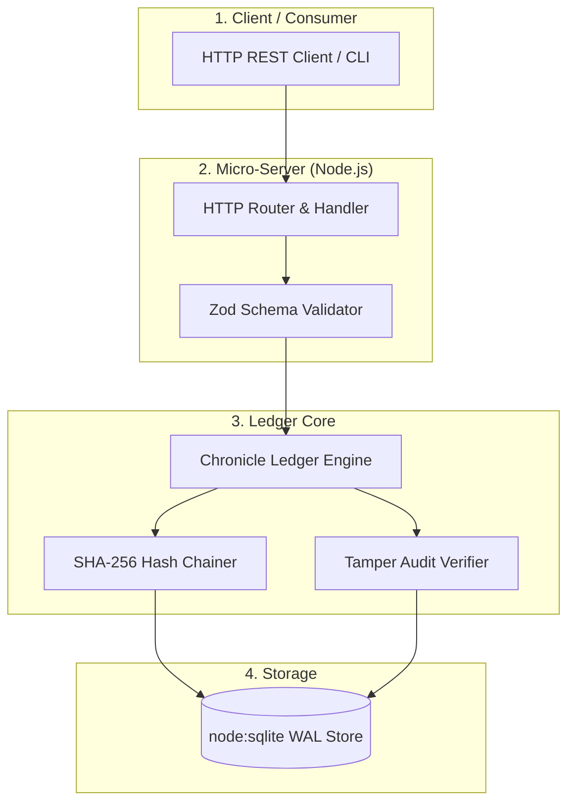

# Sekhemet Public Release Gate: Project "Chronicle"
## Local-First Cryptographic Event Ledger & Verification Micro-Service

> **Purpose:** A deterministic, contract-first Proof-of-Concept (PoC) project designed to serve as the final verification gate before releasing Sekhemet to the public.  
> **Target Model:** `Qwen3.8-27B-GSQ-RCO-IQ3_S-mtp.gguf` running on `llama-server` (M4, 24 GB Unified Memory).

---

## 1. Executive Summary & Why This Project

To prove Sekhemet is ready for public release, it must demonstrate that it can autonomously guide a **100% local 27B model** on an **M4 Mac with 24 GB RAM** through the complete engineering lifecycle of a non-trivial, production-grade software package without human intervention, context rot, or gate failure loops.

### The Challenge
- **Generation Speed:** 6.6–6.9 tokens/sec (single stream). Multi-thousand token outputs are prohibitive.
- **Prompt Reading Speed:** 52–62 tokens/sec. Re-reading context from scratch wastes seconds per step.
- **Model Gotchas:**
  1. Copies bracketed placeholders verbatim if present in templates.
  2. Spends budget thinking if `--reasoning` is enabled.
  3. Invents specifics when source context is vague.
  4. Memory ceiling: 8.4 GB resident + GPU buffers; no headroom for secondary models.

### The Solution: Project "Chronicle"
**Chronicle** is a high-integrity, local-first cryptographic event ledger service that provides append-only immutable logging, SHA-256 hash chains, tamper detection, and an HTTP micro-API.

It is the optimal PoC gate because:
1. **Algorithmic & Schema-Bound:** Exercises state machines, byte-level cryptography, and JSON-RPC/REST routing without open-ended ambiguity.
2. **Extreme Card Sizing Fit:** Each SPIDR card diff is strictly **60–140 LOC**, requiring only 250–500 generated tokens (~35–70 seconds per card on an M4).
3. **Exploits Same-Slot Cache Reuse:** Leverages the near-total 1,515/1,536 token slot reuse on `llama-server` by utilizing Sekhemet's byte-stable Zone 1 & Zone 2 prompt headers.
4. **Deterministic Gate Verification:** Verified entirely by local compilers and test suites (`tsc -b`, `vitest run`, `biome check`), with zero mock shortcuts.

---

## 2. Model Profile & llama-server Configuration

### Hardware & Daemon Setup
```bash
llama-server \
  -m ~/AI-Models/llm/Qwen3.8-27B-GSQ-RCO-GGUF/Qwen3.8-27B-GSQ-RCO-IQ3_S-mtp.gguf \
  --host 127.0.0.1 \
  --port 8099 \
  -t 2 \
  -ngl 999 \
  -fa on \
  -ctk q8_0 \
  -ctv q8_0 \
  -np 2 \
  -c 49152 \
  --ctx-checkpoints 6 \
  --cache-ram 2048 \
  --jinja \
  --metrics \
  --no-webui \
  --reasoning off
```

### Sampling Parameters Configured in Sekhemet
| Parameter | Value | Rationale |
| :--- | :--- | :--- |
| `temperature` | `0.2` (structured/code) / `0.7` (planning) | Low entropy for code edits; removes non-deterministic hallucinations |
| `top_p` | `0.9` (code) / `0.8` (planning) | Nucleus truncation |
| `top_k` | `20` | Tight lexical boundary |
| `min_p` | `0.0` | **Mandatory:** Overrides server default (0.05) to prevent truncation |
| `presence_penalty`| `1.5` | Prevents token cycling and repetitive loops |
| `reasoning` | `off` | Enforces prompt-to-action without thinking budget burn |
| `MTP Head` | `disabled` | MTP is 21% slower on M4 Metal; kept disabled |

---

## 3. Architecture of Project "Chronicle"



### Chronicle Package Layout (`fixtures/chronicle/` or standalone repo)
```
chronicle/
├── package.json
├── tsconfig.json
├── biome.json
├── src/
│   ├── types.ts          # Event schemas, verification contracts, API shapes
│   ├── db.ts             # Native node:sqlite WAL initialization & migrations
│   ├── hasher.ts         # SHA-256 canonical hashing & chain linking
│   ├── ledger.ts         # Append-only engine with idempotency keys
│   ├── verifier.ts       # Sequential chain audit & tamper detection
│   └── server.ts         # Lightweight HTTP REST API (port 4040)
└── tests/
    ├── hasher.spec.ts    # Hashing determinism and canonization
    ├── ledger.spec.ts    # Append, replay, idempotency
    ├── verifier.spec.ts  # Tamper injection detection
    └── e2e_api.spec.ts   # End-to-end HTTP integration
```

---

## 4. SPIDR Decomposition: The 6 Verification Cards

Each card touches at most **1–2 files** and strictly **$<150$ LOC diff**.

### Card 1: `card_chron_iface` (SPIDR: Interface)
- **Scope:** `src/types.ts`
- **Objective:** Define strongly-typed contract interfaces without implementation logic.
- **Contract:**
  ```typescript
  export interface ChronicleEvent<T = unknown> {
    id: string;              // UUID v4
    sequenceNumber: number;  // Monotonic 1-based index
    timestamp: number;       // Unix epoch ms
    type: string;            // Domain event identifier (e.g. "order.created")
    payload: T;              // Arbitrary JSON-serializable payload
    previousHash: string;    // SHA-256 hex of previous event (or 64 zeros for genesis)
    hash: string;            // SHA-256 hex of canonical representation
    idempotencyKey?: string; // Optional deduplication token
  }

  export interface AuditReport {
    valid: boolean;
    totalEvents: number;
    corruptedAtSequence?: number;
    expectedHash?: string;
    actualHash?: string;
  }
  ```
- **Gates:** `tsc -b`, `biome check .`

---

### Card 2: `card_chron_hasher` (SPIDR: Rule)
- **Scope:** `src/hasher.ts`, `tests/hasher.spec.ts`
- **Objective:** Implement deterministic canonical JSON serialization and SHA-256 hash chaining.
- **Contract-First Acceptance Tests (`tests/hasher.spec.ts`):**
  - Hash is invariant to object key ordering (`{ b: 1, a: 2 }` == `{ a: 2, b: 1 }`).
  - Genesis event links to 64 zeros (`0000000000000000000000000000000000000000000000000000000000000000`).
  - Event $N$ hash includes Event $N-1$ hash.
- **Gates:** `tsc -b`, `vitest run tests/hasher.spec.ts`, `biome check .`

---

### Card 3: `card_chron_db` (SPIDR: Data)
- **Scope:** `src/db.ts`
- **Objective:** Initialize native `node:sqlite` WAL database with strict constraints.
- **Schema:**
  ```sql
  CREATE TABLE IF NOT EXISTS chronicle_events (
    sequence_number INTEGER PRIMARY KEY AUTOINCREMENT,
    id TEXT UNIQUE NOT NULL,
    timestamp INTEGER NOT NULL,
    type TEXT NOT NULL,
    payload_json TEXT NOT NULL,
    previous_hash TEXT NOT NULL,
    hash TEXT NOT NULL,
    idempotency_key TEXT UNIQUE
  );
  CREATE INDEX IF NOT EXISTS idx_chronicle_hash ON chronicle_events(hash);
  ```
- **Gates:** `tsc -b`, `biome check .`

---

### Card 4: `card_chron_ledger` (SPIDR: Rule & Path)
- **Scope:** `src/ledger.ts`, `tests/ledger.spec.ts`
- **Objective:** Implement append logic, atomic transactions, idempotency deduplication, and query by ID/type.
- **Acceptance Criteria:**
  - Appending with the same `idempotencyKey` returns existing record without generating a new sequence number.
  - Concurrent writes are serialized through SQLite WAL transactions.
- **Gates:** `tsc -b`, `vitest run tests/ledger.spec.ts`, `biome check .`

---

### Card 5: `card_chron_verifier` (SPIDR: Rule)
- **Scope:** `src/verifier.ts`, `tests/verifier.spec.ts`
- **Objective:** Implement zero-memory stream auditor for the hash chain.
- **Acceptance Criteria:**
  - Audits 10,000 events in $<100$ ms.
  - If a single character in `payload_json` or `previous_hash` is tampered with on disk, audit returns `{ valid: false, corruptedAtSequence: N }`.
- **Gates:** `tsc -b`, `vitest run tests/verifier.spec.ts`, `biome check .`

---

### Card 6: `card_chron_api` (SPIDR: Interface & Integration)
- **Scope:** `src/server.ts`, `tests/e2e_api.spec.ts`
- **Objective:** Expose HTTP REST endpoints over Node native `node:http`:
  - `POST /events`: Append event with JSON body.
  - `GET /events/:id`: Retrieve single event.
  - `GET /audit`: Run cryptographic chain audit.
  - `GET /health`: Diagnostic health status.
- **Acceptance Criteria:**
  - Clean server startup and teardown in tests.
  - Invalid JSON returns 400 Bad Request with descriptive message.
  - E2E test runs full workflow: append 5 events, verify audit passes, tamper with DB, verify audit fails.
- **Gates:** `tsc -b`, `vitest run`, `biome check .`, `BoundsCheck` ($\le 200$ LOC diff).

---

## 5. Defense Against Qwen3.8-27B Gotchas

| Model Gotcha | Impact on Code Generation | Sekhemet Built-In Mitigation |
| :--- | :--- | :--- |
| **1. Copies Bracketed Placeholders** | If prompt has `code: <insert code here>`, it outputs verbatim `<insert code here>`. | **Rule in Zone 1 & 4:** Prompts use numbered requirements + empty file skeletons; bracketed placeholders are strictly banned. |
| **2. Spends Budget Thinking** | Model wastes 500+ tokens in internal monologues. | **Harness enforcement:** llama-server executed with `--reasoning off`; system prompt instructs "Actions over chat. Emit tool calls immediately." |
| **3. Grammar/JSON Adherence** | Model occasionally misses a closing quote in freeform text. | **Grammar Enforcement:** Sekhemet Tool Arm A enforces JSON schema grammars on tool invocation; malformed JSON is rejected at decode time. |
| **4. Invents Specifics when Context is Thin** | Hallucinates fictitious external npm packages or methods. | **Context Zone 3 (Repo Map):** Sekhemet injects concrete AST symbol outlines (`node:sqlite`, `node:crypto`, `node:http`). External packages are forbidden. |
| **5. Slot Cache Loss on Restarts** | Reloading context costs 50s per turn. | **Zone 1 & 2 Byte Stability:** Prompts maintain identical prefixes across turns on slot 0, hitting 98%+ prompt cache reuse on the M4. |
| **6. Two Models Won't Fit (24 GB limit)** | If harness spawns a planner model while executor is loaded, system swaps to disk. | **Single-Model Swapping:** Sekhemet serializes planning and execution, keeping only one 11.3 GB weight set resident in VRAM. |

---

## 6. Go / No-Go Public Release Gate Criteria

Before Sekhemet is pushed to GitHub as a public release, the harness must execute Project Chronicle against the local `llama-server` instance.

### The Gate Scorecard
1. **Pass@1 Success Rate:** $\ge 80\%$ (at least 5 of the 6 cards pass all gates on Turn 1).
2. **Autonomous Recovery:** If a card fails a compiler or test gate, Sekhemet’s `GateFailure` feedback loop must repair the code within $\le 3$ rungs without human intervention.
3. **Zero Test Mutation:** The model must never alter assertions in `*.spec.ts` files to force a pass.
4. **Zero Out-of-Scope Writes:** The model touches only declared scope files.
5. **Speed & Latency:** Total execution time for all 6 cards must complete within **$<18$ minutes** on the base M4 Mac.

When Project Chronicle clears all verification gates with exit code `0` and merges to `main`, Sekhemet is certified ready for public release.
