# Sekhemet — Comprehensive Definition of Done & Anti-Shallow Engineering Contract

> **Scope:** Monorepo (`/Users/brennankelley/Desktop/Sekhemet`)  
> **Applicability:** All contributing AI models (Claude, Gemini, Qwen), human engineers, and subagents.  
> **Principle:** *Zero Vanity Testing. Zero Stubbed Code. Zero Hallucinated Completion.*

---

## 1. The Anti-Shallow Philosophy

A common pathology in AI-assisted coding is **shallow development**:
- Writing code that only satisfies a happy-path interface while omitting error handling, concurrency, boundary safety, and sanitization.
- Writing "vanity tests" that assert trivialities (`expect(res).toBeDefined()`, `expect(true).toBe(true)`) or rely on in-memory mocks that mask real-world failures.
- Declaring a feature "Done" when the agent finishes speaking, rather than when rigorous, deterministic verification gates confirm its correctness on disk.

In **Sekhemet**, this pathology is strictly outlawed. A card or release is **DONE** if and only if it satisfies the deep engineering invariants defined in this contract.

---

## 2. Anti-Shallow Testing Invariants

### A. Zero Mocking of Core Runtime Infrastructure
When testing kernel state, sandboxing, process execution, git synchronization, or database persistence:
1. **Real SQLite WAL Storage:** Tests for `@sekhemet/kernel` and `@sekhemet/board` must execute against real native `node:sqlite` database files on disk. In-memory synthetic mocks that disguise SQL syntax or lock contention are forbidden.
2. **Real Subprocess Containment:** Tests for `@sekhemet/sandbox` must spawn real OS subprocesses, verify real stdout/stderr pipes, and verify that timeout thresholds trigger real `SIGTERM` followed by un-catchable `SIGKILL`.
3. **Real Git Worktrees:** Tests for `@sekhemet/sync` must create real git worktrees (`git worktree add`), generate real commit objects, and update real ref namespaces (`refs/sekhemet/checkpoints/*`).

### B. Mandatory Fault Injection & Negative Testing
For every happy path tested, there must be at least **two negative or boundary test cases**:
1. **Malformed Inputs & Corrupt Data:** Test how the parser, serializer, and state machine handle truncated JSON, invalid types, empty strings, and out-of-range indices.
2. **Cryptographic Tamper Detection:** Event logs and hash chains must be tested by actively corrupting disk bytes (flipping a bit in an event payload or hash) and asserting that the verifier detects the exact corrupted sequence number.
3. **Permission Violations:** Test that directory traversal (`../../etc/passwd`), out-of-scope edits, and protected file modifications (`gates.toml`) are rejected with explicit `deny` tiers.
4. **Subprocess Failures:** Test non-zero exit codes, buffer overflows, and process killing under resource strain.

### C. Deep Structural & Value Assertions
1. **No Trivial Assertions:** Tests relying solely on `toBeDefined()`, `toBeTruthy()`, or `toBeInstanceOf()` are rejected.
2. **Exact Equality on State:** Tests must assert exact values (`toEqual`), complete returned schemas, and exact state transition results.
3. **Test Immutability Law:** An implementer agent is strictly forbidden from editing test fixtures, assertions, or expectations to make a test pass. Only the test author or human may modify test contracts.

---

## 3. Anti-Shallow Implementation Invariants

### A. Input Sanitization & Path Confinement
1. **Path Traversal Defense:** All file-accessing tools (`read_file`, `write_file`, `replace_lines`, `edit`, `read_symbol`) must reject relative path escapes (`../`) and absolute paths outside the active worktree.
2. **CRLF & Whitespace Tolerance:** All surgical line and symbol replacements must handle CRLF (`\r\n`) and LF (`\n`) line endings transparently without corrupting surrounding indentation.
3. **Exact Uniqueness Constraint:** Whole-string replacements (`edit`) must assert that the target chunk exists **exactly once** in the file. If zero or $>1$ occurrences exist, it must abort with an error rather than guessing.

### B. Three-Tier Permission Confinement
Every tool execution must pass through the `PermissionEngine`:
1. **Permanent Deny (Deny Always Wins):**
   - Modifying `gates.toml`, test files (for implementers), loop configs, or `.sekhemet/events.db`.
   - Modifying files outside the card's declared `scopeFiles`.
   - Path traversal outside the worktree.
2. **Ask Tier (Requires Human Confirmation):**
   - Destructive commands (`rm -rf`, `sudo`, `git reset --hard`).
   - Network commands (`curl`, `fetch`) when running in offline mode.
3. **Allow Tier:**
   - Safe reads and writes within declared card scope.

### C. Context Hygiene & Compaction
1. **RTK Command Output Condensing:** Command outputs exceeding line budgets must strip ANSI escapes and progress bars, preserving relevant head and tail compiler errors while omitting noise.
2. **In-Place Observation Masking:** Turn history older than 2 steps must mask verbose tool outputs into compact semantic pointers (`[Output of read_file from Turn 2 preserved in WAL: 85 lines omitted]`), keeping prompt token density near 100%.

### D. Complete Lifecycle Hook Engine
The kernel must provide all 10 waterfall lifecycle hooks (`card/start`, `pre-step`, `pre-tool`, `post-tool`, `pre-gate`, `post-gate`, `card/end`, `review/return`, `playbook/propose`, `turn-stopping`) with safe unregistration and error propagation.

---

## 4. Verification Gate Thresholds

Before any commit or public release is accepted, it must clear the full verification gate:

```bash
pnpm format && pnpm lint && pnpm typecheck && pnpm test && pnpm build
```

| Verification Rung | Command | Strict Standard |
| :--- | :--- | :--- |
| **1. Formatting** | `pnpm format` (`biome check --write .`) | 0 unformatted files; zero format drift |
| **2. Static Analysis** | `pnpm lint` (`biome check .`) | 0 errors, 0 warnings across all 13 workspace projects |
| **3. Type System** | `pnpm typecheck` (`tsc -b`) | 0 compiler errors; strict composite references; exact optional types |
| **4. Test Suites** | `pnpm test` (`vitest run`) | **100% test pass rate** across all suites; 0 skipped; 0 failed |
| **5. Build Artifacts**| `pnpm build` (`tsc -b`) | Clean `.d.ts` and `.js` compilation for all packages |
| **6. Diagnostics** | `pnpm sekhemet doctor` | Unified memory, inference sockets, worktree isolation, gate runners all PASS |
| **7. Public Server** | `apps/harness/dist/server.js` | HTTP dashboard returns 200 with complete Basalt UI; `/api/board` returns 200 |
| **8. MCP Server** | `apps/harness/dist/mcp.js` | Stdio JSON-RPC responds to `tools/list` with complete schema definitions |

---

## 5. Card-Level vs Release-Level DoD Matrix

```mermaid
flowchart TD
    subgraph CardDoD["Card-Level DoD (Per Task)"]
        C1[Acceptance Tests Written First] --> C2[Diff &#8804; 200 LOC across 1-3 Files]
        C2 --> C3[Three-Tier Permissions Validated]
        C3 --> C4[Gates Pass: tsc, vitest, biome = 0]
        C4 --> C5[Intermediate Checkpoint Committed to refs/sekhemet/checkpoints]
        C5 --> C6[Squashed Merge to main with Full LLM Attribution Trailers]
    end

    subgraph ReleaseDoD["Public Release DoD (Full Product)"]
        R1[All Workspace Packages Pass 100% Tests] --> R2[Visual Dashboard & MCP Server Verified Live]
        R2 --> R3[Clean Diagnostic Audit: pnpm sekhemet doctor]
        R3 --> R4[Anti-Shallow Audit: Zero Core Mocks, Deep Fault Injection]
        R4 --> R5[Full Public Documentation: README, LICENSE, Specifications]
        R5 --> R6[Working Tree Clean with Zero Staged or Untracked Residue]
    end

    CardDoD --> ReleaseDoD
```



---

## 6. Zero Tolerance Policy

Any contribution that introduces:
- A dummy test designed solely to inflate test counts,
- A bypassed permission check or scope escape,
- A modified test assertion to hide an implementation failure, or
- A commit missing structured Git trailers (`Agent-Model`, `Agent-Harness`, `Agent-Role`, `GateStatus`, `Co-authored-by`),

is considered a **critical invariant violation** and must be immediately reverted.
