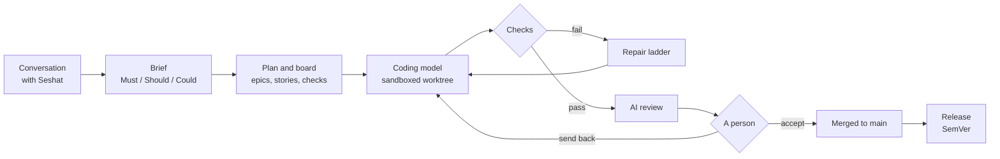

# Sekhemet: a coding harness for professional teams

[](LICENSE)
[](#project-status)
[](docs/reference/INSTALL.md)
[](#requirements)

Sekhemet runs the whole professional software process on your own machine, with
local models. You describe what you want to Seshat, its project manager. Seshat
writes a brief with prioritised requirements, and the plan becomes a backlog on a
board that reads like Jira or Linear. A local Coding model builds each issue in
its own sandboxed git worktree against executable checks. An independent AI
review reads the result, and a person accepts it.

**The rule everything else follows: checks decide completion, and the model never
certifies its own work.** Nothing is done until its checks pass and a person
accepts it.

> **Status: pre-release.** Phase B's build workstreams are committed and the core
> runs end to end, but Sekhemet is not published yet: no npm package or server
> image exists, several capabilities are partial, and the measurements that
> decide v1 are still running. [Project status](#project-status) says exactly
> where things stand.

## Contents

- [Why Sekhemet](#why-sekhemet)
- [How it works](#how-it-works)
- [Features](#features)
- [Requirements](#requirements)
- [Install and quickstart](#install-and-quickstart)
- [Models](#models)
- [Solo and Team](#solo-and-team)
- [Security](#security)
- [How it is measured](#how-it-is-measured)
- [Project status](#project-status)
- [Roadmap](#roadmap)
- [Documentation](#documentation)
- [Contributing](#contributing)
- [Licence](#licence)

## Why Sekhemet

Most coding assistants give you a chat window and a diff. Whether the result has
a plan, tests, reviewable increments and a definition of done depends on you.
That works for someone who already practises software engineering. For everyone
else it produces code that is hard to bring into a team's workflow.

Sekhemet runs the process itself. The professional move is the easy one because
the tools, the loop, the refusals and the checks are built that way, not because a
prompt asks the model to be careful.

| Audience | What they get |
| --- | --- |
| **Professional developers** | A board with familiar columns, issue types and keys (`CHR-7`); issues with their checks and activity; review in minutes |
| **Juniors learning the practice** | *Tips* that explain the practice where it happens (what a WIP limit is for, why a story is sliced thin, what done means), and that experts switch off |
| **Non-developers** | A conversation with Seshat to start a project and to ask how it is going, and a Status page in plain words |

**Local and private.** Every model runs on your machine or your team's server.
The network is off by default; research, git remotes and sync are opt-in and
logged. Sekhemet sends no telemetry.

## How it works



1. **Seshat and the brief.** Seshat asks only what the request needs: a
   calculator needs no consultation, a payments service does. The brief lists
   requirements as *Must have*, *Should have* and *Could have*, and *Later* for
   what is out of the release.
2. **The plan and the board.** The planner turns the brief into epics and thin
   vertical stories. Each issue traces to a requirement, has checkable
   acceptance criteria and red-first acceptance tests, and appears on the board.
3. **The Coding model works each issue.** One issue owns one git worktree, one
   branch, one declared file scope and one budget. The model finds, edits and
   verifies in small steps inside an OS sandbox, with a context assembled fresh
   for that issue.
4. **Checks.** Tests, types, lint, security scans and, for web projects, visual
   and accessibility checks. They are declared in `.sekhemet/gates.toml`, hash-pinned,
   and the model cannot edit them. Failures come back typed: location, expected,
   actual, and the command that reproduces them.
5. **The repair ladder.** A failed check escalates by strategy, not by
   temperature: direct repair, then a fresh context, then a written edit sketch,
   then a stop that asks a person.
6. **AI review.** The Review model gives one finding per acceptance criterion, with
   a verdict and a checked `file:line`. A criterion it skipped is *unclear*, never
   *met*.
7. **A person accepts.** Accept squash-merges to `main` without touching your
   working copy, and can be undone. Send back returns the issue with its reason.
8. **Releases.** Accepted requirements roll up into releases ("Release 1 · 5 of 11
   requirements done") with SemVer versions and a changelog. A release is proven
   when every Must-have requirement has passing tests on `main`, and done when a
   person accepts it.

Every step is an event in one hash-chained log. The board, the audit trail,
replay and every measurement are projections of it.

## Features

Status marks: no mark means built and tested; **(partial)** means built in part,
or built but not yet proven with a live model. The per-capability truth is in each
specification's *State today* table.

### The PM: Seshat

- A conversation that starts a project and answers questions about it
  (partial: the live, model-backed start of a project waits on the B4.4 milestone
  run).
- A brief with Must/Should/Could requirements, a depth profile (*Prototype*,
  *Internal tool*, *Production*, *Regulated*), comparables and a user-journey
  walkthrough.
- A reuse survey before planning: existing libraries and repositories, with an
  SPDX licence classifier.
- Taking over an existing repository: trust first, an offline history secret scan,
  an as-built inventory and an evidenced backlog.
- Suggestions, not orders: triage comes as *Suggested / Why / Apply / Dismiss*,
  and a dismissed suggestion is not raised again. Seshat never assigns people or
  sets a project's health.
- Standups, sprint forecasts and weekly update drafts, written from the event log
  for a person to edit and post.

### The board and dashboard

- A board with familiar columns and issue types (Story, Bug, Task, Spike, Epic).
- **Status:** health set by a person, requirements by Must/Should/Could, a
  forecast as 50% and 85% dates, risks and *Needs you*.
- **Projects**, **Review** (evidence, the diff and AI review findings),
  **Insights**, a **story map** and a **burn-up** chart.
- **Tips**, the teaching layer for juniors, which experts switch off.
- **Configuration:** model folders scanned, roles recommended, the benchmark.
- A terminal board for the command line.

### Checks and containment

- Checks per issue: tests, types and lint; security (a bundled gitleaks secret
  scan, plus semgrep and osv-scanner when they are installed); and visual and
  accessibility checks in a local headless Chromium, with an axe-style rule
  subset.
- Three project checks: reachability, regression and architecture.
- A parse check that refuses a write which would make a source file unparseable.
- An OS sandbox for every command the model runs: Seatbelt on macOS, bubblewrap on
  Linux (partial: Linux's runtime proofs wait on a Linux VM run).
- Home-directory secrets masked from the sandbox: one table of 37 paths feeds both
  platforms, plus agent and Docker sockets.
- A per-issue egress proxy with its requests logged; the network is denied
  unless a policy opens it.
- A prompt-injection suite of 14 fixtures across four channels, run against the
  real Coding model (macOS: 14 of 14 held).

### Models

- Local models only in v1, served by llama.cpp's `llama-server`.
- Four roles, each assigned a model you choose: the **Coding**, **Planning**,
  **Review** and **Research** models.
- Qualification: a model is *verified on this machine* per engine, host,
  settings and prompt version before a role uses it.
- **Smart Swap:** a residency scheduler that decides when to load and unload
  models on a machine that cannot hold them all, with every load recorded and
  slow loads flagged.
- A reasoning floor per model architecture, so a model that cannot turn thinking
  off is given room to think.
- A benchmark (`sekhemet benchmark`) and a bake-off to compare model
  combinations on your own machine.

### Teams

- **Solo** (one person, loopback, no sign-in) and **Team** (one server, accounts)
  (partial: see [Solo and Team](#solo-and-team)).
- Four access levels (Admin, Member, Stakeholder, Viewer) and a per-project
  Accept rule.
- Invites, passwords, passkeys and company sign-in (OIDC).
- `@Agent` and `@Seshat` as labelled AI teammates; the Agent acts with the
  permissions of the person who started it.
- Inbox, My issues, @mentions, review threads with a *Comment* verdict, presence,
  and an Admin audit log that can be exported.
- A fair model queue, shared by tokens, with a per-person Agent cap.

### Integrations

- GitHub: one adapter, merge-aware, with owner and delegate mapped.
- An MCP server over stdio, and an MCP client for outside tool servers.
- Export and import for Jira and Linear boards (no live two-way sync in v1).

### Measurement

- The frozen suite: 30 issues across four fixture projects, run through the
  product's own queue.
- A recorded, frozen baseline (B2.5) and paired comparisons against it.
- Milestone runners that produce evidence files (`pnpm milestone <id>`).

## Requirements

| | |
| --- | --- |
| **Operating system** | macOS or Linux. Windows is not supported in v1. |
| **Memory** | 24 GB or more. 16 GB is not supported in v1 ([DEC-47](docs/design/DECISIONS.md#dec-47--the-finish-line-decisions)). |
| **Node.js** | 22.13 or newer (the built-in `node:sqlite`); developed and tested on Node 26. |
| **pnpm** | 10 (the repository pins `pnpm@10.30.3`). |
| **git** | Any recent version. |
| **Inference** | llama.cpp's `llama-server`, and GGUF model files. |
| **Linux only** | `bubblewrap` and `socat` from your distribution. |

macOS needs nothing extra for the sandbox: Seatbelt is built in.

## Install and quickstart

The npm package and the server image are **not published yet**. Today Sekhemet
installs from source.

Clone the repository:

```bash
git clone <this repository's URL> sekhemet
```

Install the dependencies:

```bash
cd sekhemet && pnpm install
```

Build every package:

```bash
pnpm build
```

Check the machine, the inference server, the sandbox and the model weights:

```bash
pnpm sekhemet doctor
```

From a checkout, `pnpm sekhemet <command>` runs `node apps/harness/dist/index.js
<command>`. The commands below use `sekhemet` for short.

Register a GGUF file you already have (see [Models](#models)):

```bash
sekhemet models add <path-to.gguf>
```

In your project's repository, set up on first run and open the board. The first
run checks the machine, says which models it found, derives the checks from the
project and asks once; with no model set up it opens the Configuration page:

```bash
sekhemet
```

Describe what you want; Sekhemet plans the work and runs it:

```bash
sekhemet "<what you want>"
```

Ask Seshat how it is going, from the terminal:

```bash
sekhemet ask "<question>"
```

See the next issue waiting on you:

```bash
sekhemet review
```

Accept it, which merges it to `main`:

```bash
sekhemet accept <issue>
```

Or send it back with a reason:

```bash
sekhemet send-back <issue> "<reason>"
```

Start the web dashboard on its own (it listens on `http://127.0.0.1:4040`):

```bash
sekhemet serve
```

Adopt an unfinished project instead of starting a new one:

```bash
sekhemet take-over
```

Every other command, including `run`, `queue`, `plan`, `gate`, `park`, `revert`,
`release`, `benchmark`, `log`, `backup`, `mcp` and `acp`, is listed by:

```bash
sekhemet dev --help
```

To build the npm tarball or the Team server image yourself, follow
[INSTALL.md](docs/reference/INSTALL.md). The server image has not yet been built
and run on a Linux host by this project.

## Models

v1 supports machines with 24 GB of memory or more. The recommended set for 24 GB
([DEC-47](docs/design/DECISIONS.md#dec-47--the-finish-line-decisions)):

| Role | Model | State |
| --- | --- | --- |
| Coding model | nail-mtp | Verified on the current build |
| Planning model | Qwen3.8-27B GSQ-RCO (IQ3_S) | Recommended |
| Research model | Apodex-1.1-mini | Recommended |
| Review model | *Unfilled* | No model has passed admission yet (recall of at least 0.3 on a 22-defect seeded set) |

The Review role stays unfilled until a model from a different family from the
Coding model passes that admission; the product says so on screen. The managed
defaults in code still name Cyber-Tiel-Coder-35B-A3B as the Coding model, which
the baseline measured. A default set per hardware tier, with each model's source,
hash and licence recorded, is planned (W11).

**Your own models.** Register any GGUF file. Its header is read and its SHA-256
recorded; the model is not loaded:

```bash
sekhemet models add <path-to.gguf>
```

Download a registered model from its recorded source, verified by its published
hash (this goes through the network policy):

```bash
sekhemet models fetch <model>
```

Assign a model to a role (`worker`, `planner`, `reviewer` or `researcher` are the
internal names of the Coding, Planning, Review and Research models):

```bash
sekhemet models assign <role> <model>
```

Verify it for that role on this machine:

```bash
sekhemet qualify --models <model> --role <role>
```

A model is used for a role only once it is verified on this machine. A change to
the role's prompt, the engine or the model's settings asks for verification
again, and `sekhemet doctor` names anything owed. The Configuration page does the
same from the dashboard.

**The reasoning floor.** Some models cannot turn thinking off. The registry keeps a
reasoning floor per GGUF architecture and adds the thinking budget to the reply
budget, so a review is never cut off mid-thought and read as clean. A truncated or
unreadable review counts as a failed review.

Model research, with every benchmark number sourced, is in
[MODEL_CANDIDATES.md](docs/research/MODEL_CANDIDATES.md).

## Solo and Team

One product, two setups ([DEC-35](docs/design/DECISIONS.md#dec-35--one-product-two-setups-solo-and-team)):

- **Solo** is one person on their own machine. The dashboard binds loopback, and
  there is no sign-in and no roles screen.
- **Team** is one install on your team's server. People sign in at one of four
  access levels, and each project's Accept rule decides who may accept. A project
  moves from Solo to Team without migration.

The AI is a teammate that proposes, and people decide
([DEC-36](docs/design/DECISIONS.md#dec-36--the-ai-is-a-teammate-that-proposes-people-decide)).

**State (partial).** The Team setup is built in code and tested on a real server:
the B4.10 milestone passes with five people at four levels. The full team journey,
from a stakeholder's conversation to an accepted release (B4.11), has not yet run
with live models, and the teams specification's front matter still reads
`not-built` until its rows are re-marked (W4). Details:
[teams.md](docs/design/specs/teams.md).

## Security

The Coding model is treated as untrusted: the sandbox, not the prompt, is its
guardrail.

- **Confinement.** Every command runs through one sandboxed execution path that
  fails closed. On macOS, `sandbox-exec` with a generated Seatbelt profile; on
  Linux, bubblewrap. Writes are allowed only inside the issue's worktree and a
  private scratch directory, never to its git metadata. The parent environment is
  not inherited. Git runs with hooks and fsmonitor disabled.
- **Permissions.** Deny always wins: path traversal, writes outside the issue's
  declared scope, and edits to protected paths (tests for the Coding model,
  `gates.toml`, the harness's own sources) are refused.
- **Secrets.** Home-directory secrets and session sockets are masked from the
  sandbox. A bundled gitleaks rule set scans for secrets, and found secrets are
  redacted in what the harness persists or sends to the Research model. Credentials live in the OS
  keychain on macOS and the Secret Service on Linux.
- **Network.** Egress is denied by default. When a policy opens it, requests go
  through a per-issue proxy that refuses loopback, private, link-local and
  metadata addresses, and logs every request.
- **The dashboard.** A Host allowlist on every request (against DNS rebinding), a
  per-start mutation token in Solo, a strict Content Security Policy,
  `frame-ancestors 'none'`, and Origin checks on the event stream and WebSocket.
  A Team server behind a proxy must set `[identity] public_url`.

**Known gaps.** Linux's runtime containment proofs wait on a Linux VM run. On
macOS, whether the SSH agent socket is reachable from the sandbox needs a
containment test and a deny. Both are tracked in the
[finish-line plan](docs/reference/FINISH_LINE_PLAN.md). The full model is in
[security.md](docs/design/specs/security.md). A `SECURITY.md` with a private
reporting route is planned before release (W3); until then, please do not open
public issues for vulnerabilities.

## How it is measured

"Better" is a measured claim, never a feeling. One trial at non-zero temperature
is not a finding.

**The frozen suite.** 30 issues across four fixture projects (Chronicle, Onyx,
Basalt Canvas, Vanguard), each with contract-first acceptance tests, run through
the product's own queue from clean repositories. A run compares only with runs of
the same suite hash.

```bash
node scripts/run_suite.mjs --worker cyber-tiel --out <file>
```

**The B2.5 baseline** (frozen 2026-09-29): six arms, two rounds each, on build
`5937e83`, with Cyber-Tiel-Coder-35B-A3B as the Coding model. Suite 1.0.0,
hash `d70f689d`. Each arm changes one switch from the reference.

| Arm | Switch | Round 1 | Round 2 | Passed of 60 |
| --- | --- | --- | --- | --- |
| ref | — | 20 | 18 | 38 |
| thinking-surgical | thinking = surgical | 22 | 21 | 43 |
| thinking-all | thinking = all | 21 | 21 | 42 |
| strict | working method = strict | 18 | 20 | 38 |
| fixed-tools | tool arm = fixed | 18 | 20 | 38 |
| evidence-gate | evidence gate = on | 18 | 19 | 37 |

No arm differs from ref by a margin the suite can resolve. Every one of the 124
failures is named with its stop reason. The full RunProfile is in
[SUITE_RUNS.md](docs/reference/SUITE_RUNS.md).

**The regression pair** (2026-09-28): nail-mtp on two builds, the same 30 issues
and sampling. Paired on the 26 issues measured on both: 20 and 21 passed, one
discordant issue, median tokens per issue unchanged. Verdict: no clear
difference, and no regression.

**Milestones.** Each runner writes an evidence file; a verdict is PASS only when
every check passed. From [MILESTONES.md](docs/reference/MILESTONES.md):

| Milestone | What the owner can see | Verdict |
| --- | --- | --- |
| B1 | The Coding model cannot leave its sandbox, on macOS and Linux | NOT RUN (macOS passes: 162 of 162 containment tests, 14 of 14 injection fixtures held; Linux waits on the VM) |
| B2.5 | A recorded, reproducible baseline | NOT RUN (every check passes but the planning measure, which waits on confirmed golden briefs) |
| B3 | Accept, undo and send back on a real repository; the log survives a crash and an upgrade | PASS |
| B4.4 | A non-developer starts or takes over a project by conversation | NOT RUN (needs live models) |
| B4.10 | A team shares one server, with access levels, the Accept rule and fair turns | PASS |
| B4.11 | A team of five takes a project from a conversation to an accepted release | NOT RUN (needs the capstone run) |
| C | v1: the Definition of Done on one release commit | NOT RUN |

```bash
pnpm milestone <id>
```

**The capstone comparison (planned; no results yet).** A freshly written
timesheet and overtime-rules app, with a mid-project California change request,
scored by a sealed hidden suite of 112 tests tagged Must, Should and Could. Every
arm gets byte-identical input. The result is a grid:

| | nail-mtp | Qwen3.8-27B | Opus 5.5 | Sonnet 5 | Haiku 4.5 |
| --- | --- | --- | --- | --- | --- |
| **One shot** (one request, no tools) | planned | planned | planned | planned | planned |
| **With its harness** | Sekhemet | — | Claude Code | Claude Code | Claude Code |

Rows show the harness effect; columns show the model effect. One Web-Bench
project (`fastify`) is a second, external comparison. The protocol, runner and
scorer are built; the runs have not started, and results will be published with
their protocol whatever they show. Screenshots of every arm's app will be
published under `docs/showcase/capstone/`. The protocol is in
[CAPSTONE_SELECTION_2026-09.md](docs/research/CAPSTONE_SELECTION_2026-09.md).

## Project status

*As of 2026-09-29.* The latest gate on the committed tree: `tsc -b` clean,
`biome check .` clean, 5,255 tests passed and 45 skipped in 667 files.

**Phase B is complete.** The build workstreams B0 to B4.11 are committed (the
sandbox, the measurement path and baseline, the kernel and safe Accept, the
planner, Seshat, the board, Tips, Status, the Reviewer, GitHub, the Team setup
and working together), followed by a close-out. Most of their specification rows
remain *partial* until live model runs and paired A/Bs complete them.

**The finish-line plan.** [FINISH_LINE_PLAN.md](docs/reference/FINISH_LINE_PLAN.md)
takes Sekhemet from feature complete to published, in workflows run one at a time:

| Workflow | Purpose | State |
| --- | --- | --- |
| W1 | Security hardening: the dashboard guard, Linux secret masks, the Linux secret store, process-level errors | Done |
| W2 | Capstone preparation: the brief, the frozen prompt, the seed, the sealed hidden suite, the runner and scorer | Done |
| W2b | The Sekhemet arm's driver, long messages to Seshat, the Web-Bench runner, the hidden suite on an encrypted image | In progress |
| W4 | Spec truth and the v1 scope: every row re-marked against the code | Next |
| W16 | Completeness audit: hollow controls and missing features | To do |
| W5 | UI/UX audit: heuristics, walkthroughs, the design system | To do |
| W3 | Docs, install and CLI: a user guide, a CLI reference, per-command help, CHANGELOG, SECURITY.md | To do |
| W6 | UI fixes and accessibility: tokens, visual baselines, axe on every page | To do |
| W8 | Reliability and upgrade: fault injection, crash reports, upgrade tests | To do |
| W7 | Supply chain: OSV, an SBOM, provenance (CI deferred) | To do |
| W9 | Performance budgets for the board, issue page and Review | To do |
| W11 | Models for new users: a default set per hardware tier, `models fetch` | To do |
| W18 | Model settings per role, *Find best settings*, the benchmark built out | To do |
| W10 | End-to-end tests of the audience tasks and the first run | To do |
| W17 | Vibe-gap checks for the software Sekhemet builds | To do |
| W12 | The Phase B report and the Phase C proposal | To do |
| W13 | An independent release security review | To do |
| W15 | Cut the release | To do |

**The model-run stream**, on frozen snapshot builds, beside the workflows:

- **R-tune:** reference against surgical thinking on nail-mtp, to set the shipped
  Coding model's thinking policy (running).
- **Admissions:** the Review model (a prompt that makes it prove each verdict, and
  gpt-oss-20b with a larger thinking cap), Seshat old against new, and the
  reuse-query admission.
- **Linux containment:** the injection fixtures and a clean install in a Lima VM.
- **The capstone runs:** a dry run, then two or three runs per arm, and Web-Bench.

**Exit criteria for "published"** (§G of the plan), all on one release commit:
the release gate green on macOS and Linux; no open critical or high security
issue; the frozen suite measured with an exact interval and compared, paired, with
the baseline; every role admitted or shipped unfilled and saying so; the audience
tasks passing as end-to-end tests; WCAG 2.2 AA; the performance budgets; a
clean-machine install to a first accepted issue on macOS and Ubuntu; the claims,
this README and the specs agreeing with the code; a user guide, CLI reference,
SECURITY.md and CHANGELOG; an SBOM and provenance; the capstone and Web-Bench
results published; no dead control on any page.

## Roadmap

**v1.** A release candidate (`1.0.0-rc.N`) is cut when `pnpm release-gate` passes
on macOS and Linux, the frozen suite is measured on the candidate with every
failure named, the release security review finds no critical or high issue, the
claims-table test passes and the tree is clean. `1.0.0` is tagged by a person.

**After v1: proposals, not commitments.** Each needs its own decision.

- Make Anthropic's `sandbox-runtime` (srt) the default sandbox engine once it
  passes on both platforms and a suite run shows no clear difference
  ([DEC-39](docs/design/DECISIONS.md#dec-39--reuse-an-existing-sandbox-engine-instead-of-extending-our-own)).
  Both engines exist today behind `SEKHEMET_SANDBOX_ENGINE`.
- Preview URLs for the apps Sekhemet builds, so a person can try an issue's work
  before accepting it.
- A vision role for screenshots and UI checks (a `vision` capability flag exists
  in the registry; no role uses it yet).
- Windows through WSL2.
- Continuous integration on macOS and Ubuntu (deferred by the owner).
- Outside betas (deferred by the owner).
- Cloud models per role, as an option, never a dependency.
- Fine-tuning, only once the failure history is large and in-context methods
  plateau.
- The checks v1 does not run on the software it builds (DEC-47): internationalisation,
  a complexity or code-smell gate, API-level deprecation beyond the project's own
  lint, load testing, metrics and crash reporting, deployment and rollback of your
  services, similarity search for reproduced code, and a dead-control crawl of your
  web apps.

## Documentation

| Document | What it is |
| --- | --- |
| [docs/README.md](docs/README.md) | The index of every document |
| [SPINE.md](docs/design/SPINE.md) | Start here: what Sekhemet is, the spine, how the parts fit, the claims table |
| [specs/](docs/design/specs/README.md) | One specification per subsystem, each with its *State today* |
| [DECISIONS.md](docs/design/DECISIONS.md) | Every settled decision, its reason and what would reopen it |
| [INSTALL.md](docs/reference/INSTALL.md) | The npm tarball, the Team server image, and from source |
| [FINISH_LINE_PLAN.md](docs/reference/FINISH_LINE_PLAN.md) | From feature complete to published |
| [MODERNIZATION_PLAN.md](docs/reference/MODERNIZATION_PLAN.md) | Phases A to C, and the milestones |
| [SUITE_RUNS.md](docs/reference/SUITE_RUNS.md) | Every recorded suite score |
| [MILESTONES.md](docs/reference/MILESTONES.md) | Each milestone's verdict and evidence |
| [DEFINITION_OF_DONE.md](DEFINITION_OF_DONE.md) | What done means, for an issue, a spec, a workstream and the product |

## Contributing

Sekhemet is developed in the open, one workstream at a time. The rules:

- **Tests first** for new behaviour: write the failing test, see it fail, then
  implement.
- **The spec changes in the same commit** as the code: behaviour, status and
  contract together.
- **`pnpm gate`** (`tsc -b`, `biome check .`, `vitest run`) passes on the exact
  tree you commit.
- **Never loosen a check** or edit the frozen suite to make a result look better.
- **Every commit ends with trailers** naming the card, the agent model, the
  harness, the role and the gate status.

The full working rules are in [CLAUDE.md](CLAUDE.md) and [AGENTS.md](AGENTS.md).
A `CONTRIBUTING.md` is planned with the release documents (W3).

## Licence

Sekhemet is licensed under the [Functional Source License, version 1.1, with Apache-2.0 as the future licence](LICENSE) (FSL-1.1-ALv2). Copyright 2026 Brennan Kelley.

- **You may** use, copy, change and redistribute it for any purpose except a *Competing Use*: offering Sekhemet, or something substantially similar, as a commercial product or service. Using it inside your company, for teaching, for research, and in professional services for a licensee are all expressly allowed.
- **Two years after each version is released,** that version also becomes available under Apache-2.0.
- **Third-party material** bundled in the repository keeps its own licences; see [NOTICE](NOTICE).
- **Code that Sekhemet's models write for you is yours.** Sekhemet claims no rights to it ([DEC-47](docs/design/DECISIONS.md)).

See [DEC-48](docs/design/DECISIONS.md#dec-48--the-licence-is-fsl-11-alv2) for why this licence was chosen.
