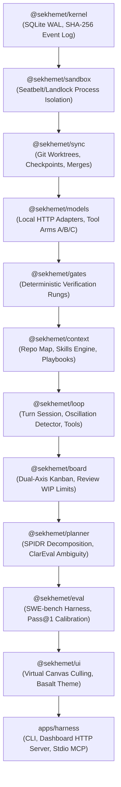

# Sekhemet — Board-Native Local-First AI Coding Harness

> *"She who is powerful; the one who heals what she breaks."*

[](#)
[](#)
[](#)
[](#)
[](#)

**Sekhemet** is a local-first, board-native AI coding harness designed for solo developers. Instead of a conversational chat terminal that suffers from context decay, hallucinated success, and uncommitted edits, Sekhemet organizes all agentic engineering into a **dual-axis nested kanban**, isolated **Git worktrees**, deterministic **executable verification gates**, and an immutable, cryptographically hash-chained **SQLite WAL event log**.

---

## Key Differentiators

| Capability | Chat-Based Harnesses | Sekhemet |
| :--- | :--- | :--- |
| **Primary Interface** | Conversational chat stream | **Board-Native Nested Kanban** (Terminal TUI + Basalt Web Canvas) |
| **Inference Source** | Cloud APIs (Anthropic, OpenAI) | **100% Local Only** (Ollama, llama.cpp, MLX); Zero telemetry |
| **Definition of Done**| Agent self-reports "Done!" | **Deterministic Executable Gates** (`tsc`, `vitest`, `biome`); Agent self-certification is rejected |
| **Context Longevity** | Long-running session decay / rot | **Fresh Context Per Card**; Byte-stable prefix caching; Zero drift |
| **File Safety** | In-place workspace mutations | **Isolated Git Worktrees** (`.sekhemet/worktrees/<card>`) & ref checkpoints |
| **State & Auditing** | Volatile in-memory JSON chat history | **Event-Sourced SQLite WAL** with SHA-256 hash chains |
| **Model Collaboration**| Single vendor lock-in | **Claude + Gemini Multi-Agent Protocol** with structured Git trailers |

---

## Architecture Overview

Sekhemet is built as an acyclic monorepo of 12 focused packages and a unified CLI application:



---

## 5-Zone Byte-Stable Prompt Architecture

To maximize local inference speed, Sekhemet structures every turn prompt into 5 deterministic zones designed for KV-cache prefix reuse:

```
┌────────────────────────────────────────────────────────┐
│ ZONE 1: System Invariants & Non-Negotiable Laws        │  ◄ Byte-stable cache prefix
├────────────────────────────────────────────────────────┤
│ ZONE 2: Project Playbook (.sekhemet/playbook.toml)     │  ◄ Progressive disclosure
│         Active Loaded Skills (.sekhemet/skills/)       │
├────────────────────────────────────────────────────────┤
│ ZONE 3: Architectural Repo Map (Symbol Outlines)       │  ◄ Budget-fitted AST graph
├────────────────────────────────────────────────────────┤
│ ZONE 4: Active Card Contract (<200 LOC, 1-3 files)     │  ◄ Strict scope isolation
├────────────────────────────────────────────────────────┤
│ ZONE 5: Execution Turns & Typed GateFailure Feedback   │  ◄ Dynamic turn context
└────────────────────────────────────────────────────────┘
```

---

## Complete Tool & Skills Catalog

### Full Tool Catalog
Sekhemet equips local models with a resilient, tolerant toolset:
- **`read_file`**: Read file contents with optional 1-based line ranges.
- **`write_file`**: Write full file contents safely to disk.
- **`replace_lines`**: Surgical line replacement preserving indentation and whitespace.
- **`read_symbol`**: AST/symbol reader extracting class/function/interface bodies.
- **`replace_symbol_body`**: Surgical AST-scoped symbol body replacement.
- **`find_references`**: Grep-powered symbol usage and reference finder.
- **`list_dir`**: Directory lister omitting ignored build directories.
- **`find_files`**: Fast glob-based file finder across the worktree.
- **`grep_search`**: Ripgrep pattern search returning exact line numbers and excerpts.
- **`run_cmd`**: Hard-sandboxed subprocess runner with strict CPU/memory timeouts.
- **`finish_card`**: Initiates deterministic verification gates.

### Open Agent Skills System
Skills live under `.sekhemet/skills/<name>/SKILL.md` using the open Agent Skills standard:
- `tdd-contract`: Enforces test-first discipline and test immutability.
- `ast-refactor`: Symbol-level surgical refactoring.
- `gate-repair`: Surgical triage for TypeScript and test failures.
- `small-model-leverage`: Guidelines for 7B–14B models to prevent loop stalls.

---

## Multi-Agent Collaboration Protocol

Sekhemet implements a zero-loss collaboration protocol between **Claude Code** and **Google Gemini**:

1. **Role Division**:
   - **Claude (Lead Driver & Implementer)**: Plans high-level SPIDR breakdown, drafts core algorithms.
   - **Gemini (Test Author, Subagent & Relay Finisher)**: Generates types & failing tests first, audits packages, and seamlessly takes over unfinished work when Claude hits hourly rate limits (`GateStatus: suspended-quota`).
2. **Structured Git Trailers**:
   Every commit is validated by `.githooks/commit-msg` to ensure full provenance:
   ```git
   feat(loop): add AST symbol replacement tools

   Card: card_8f21
   Agent-Model: gemini-2.5-pro
   Agent-Harness: antigravity-cli
   Agent-Role: implementer
   GateStatus: pass
   Co-authored-by: Gemini <gemini@antigravity.google>
   Co-authored-by: Claude <claude@anthropic.com>
   ```

---

## Quickstart

### 1. Prerequisites
- **Node.js**: v22.0.0 or higher (Native `node:sqlite` WAL support)
- **pnpm**: v10.0.0+
- **Local Model Provider**: [Ollama](https://ollama.ai) or [llama.cpp](https://github.com/ggerganov/llama.cpp) (e.g. `qwen2.5-coder:7b` or `qwen2.5-coder:14b`)

### 2. Installation
```bash
# Clone the repository
git clone https://github.com/brennankelley/Sekhemet.git
cd Sekhemet

# Install all workspace dependencies
pnpm install

# Build all packages
pnpm build

# Run complete test suite (64 tests across 19 suites)
pnpm test
```

### 3. Verify Hardware & Runtime Diagnostics
```bash
pnpm sekhemet doctor
```
```
=== Sekhemet Doctor Diagnostics ===
  ✓ Unified memory check: PASS (24.0 GB total)
  ✓ Local inference socket check: PASS (Ollama / llama.cpp ready)
  ✓ Git worktree isolation check: PASS (clean worktree support)
  ✓ Verification gates check: PASS (pnpm, tsc, vitest, biome functional)
```

---

## CLI Reference

| Command | Description |
| :--- | :--- |
| `pnpm sekhemet doctor` | Run hardware, local socket, and toolchain diagnostics |
| `pnpm sekhemet board` | Display live terminal dual-axis kanban board |
| `pnpm sekhemet log` | View tamper-evident event log with SHA-256 chain verification |
| `pnpm sekhemet plan "<spec>"` | Decompose feature into atomic SPIDR stories |
| `pnpm sekhemet run <card-id>` | Execute card in an isolated git worktree |
| `pnpm sekhemet gate [card-id]` | Run deterministic gates (`tsc`, `vitest`, `biome`) |
| `pnpm sekhemet replay <card-id>` | Replay recorded execution events for an audit |
| `pnpm sekhemet bake-off` | Benchmark local models on repo tasks |
| `pnpm sekhemet serve [--port 3333]` | Launch visual Basalt web dashboard |
| `pnpm sekhemet mcp` | Run stdio JSON-RPC MCP server for Cursor, VS Code, Claude Code |

---

## Visual Basalt Dashboard

Sekhemet includes a built-in web dashboard rendered in the Egyptian Basalt theme:
```bash
pnpm dashboard
# Dashboard running at http://127.0.0.1:3333
```
- Real-time column metrics (`BACKLOG`, `READY`, `IN_PROGRESS`, `VERIFY`, `REVIEW`, `DONE`)
- Visual gate status indicators (Typecheck, Lint, Test, Bounds)
- Hardware telemetry & Review WIP backpressure alerts
- Cryptographic event stream viewer

---

## External IDE Integration (MCP Server)

Sekhemet provides a native Model Context Protocol (MCP) server over stdio. To use Sekhemet in Cursor, Claude Desktop, or VS Code, add this to your MCP configuration:

```json
{
  "mcpServers": {
    "sekhemet": {
      "command": "node",
      "args": ["/path/to/Sekhemet/apps/harness/dist/index.js", "mcp"]
    }
  }
}
```

Exposed MCP Tools:
- `sekhemet_list_cards`: Retrieve cards by kanban column.
- `sekhemet_create_card`: Plan a new card into the event log.
- `sekhemet_get_events`: Query the SHA-256 hash-chained WAL.
- `sekhemet_doctor`: Check hardware and local inference health.

---

## License

MIT © Sekhemet Contributors
