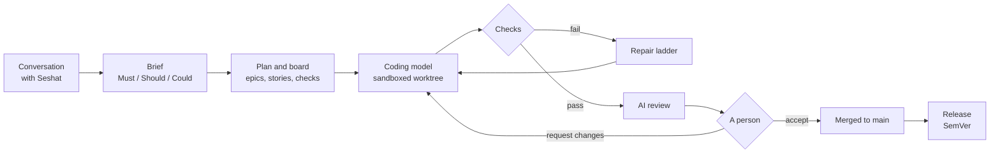

<h1 align="center">Sekhemet</h1>

<p align="center"><strong>A coding harness for professional teams.</strong><br>
Checks decide. People accept. On your own machine, with local models.</p>
<p align="center"><em>Sekhemet is said SEK-eh-met.</em></p>

<p align="center">
<a href="LICENSE"></a>
<a href="#project-status"></a>
<a href="#quickstart"></a>
<a href="docs/reference/INSTALL.md"></a>
</p>

Describe what you want to Seshat, the project manager. Sekhemet writes a brief
with Must, Should and Could requirements, plans it as a backlog on a board that
reads like Jira or Linear, and builds each issue with a local Coding model in its
own sandboxed git worktree, against checks the model cannot edit. An AI review
reads the result, and you accept it or request changes. Your code and your prompts
stay on your machine: the network is off by default and Sekhemet sends no
telemetry.

**Checks decide completion, and the model never certifies its own work.**
Nothing is done until its checks pass and a person accepts it.

> **Pre-release.** Sekhemet is not published yet: there is no npm package or
> server image, so it installs from source. Several capabilities are partial, and
> the measurements that decide v1 are still running.
> [Project status](#project-status) says exactly where things stand.

**[Quickstart](#quickstart) · [How it works](#how-it-works) · [What it does not do yet](#what-sekhemet-does-not-do-yet) · [Features](docs/FEATURES.md) · [Docs](docs/README.md)**

## How it works

1. **Seshat writes the brief.** Seshat asks only what the request needs and
   lists requirements as Must, Should and Could have.
2. **The plan becomes a board.** Epics and thin stories, each traced to a
   requirement, with checkable acceptance criteria and acceptance tests.
3. **A sandboxed build.** One issue owns one git worktree, one branch, one file
   scope and one budget. The Coding model works inside an OS sandbox.
4. **Checks.** Tests, types, lint, security scans and, for web projects, visual
   and accessibility checks, declared in a hash-pinned `.sekhemet/gates.toml`
   the model cannot edit. A failure comes back typed, and a repair ladder takes
   it from there.
5. **AI review.** The Review model gives one finding per acceptance criterion,
   with a checked `file:line`. In v1 this role ships unfilled (see
   [below](#what-sekhemet-does-not-do-yet)), and each issue says so.
6. **You accept.** Accept squash-merges to `main` without touching your working
   copy, and can be undone. Request changes sends the issue back with your
   reason.



Every step is an event in one hash-chained log; the board, the audit trail and
every measurement are read from it. The full catalogue, with what is partial, is
in [FEATURES.md](docs/FEATURES.md).

## Quickstart

**Requirements:** macOS on Apple silicon or Linux x64 · 24 GB of memory or more ·
Node.js 22.13+ · pnpm 10 · git · llama.cpp's `llama-server` (b10809 or later;
`sekhemet doctor` says how to get it). Linux also needs `bubblewrap` and `socat`.

The npm package comes with the public pre-release 0.9.0. Until then, install
from source:

```bash
git clone https://github.com/brennansk1/sekhemet.git && cd sekhemet
pnpm install && pnpm build                   # tsc -b over every package
pnpm sekhemet doctor                         # memory, llama-server, the sandbox; flags missing models
mkdir -p ~/.sekhemet/models
pnpm sekhemet models fetch --recommended --folder ~/.sekhemet/models   # shows sizes and licences, asks first
alias sekhemet="node $PWD/apps/harness/dist/index.js"; cd <your-project> && sekhemet
```

The first run in your project checks the machine, says which models it found,
derives the checks from the project, asks once, and opens the board. Then
describe the work: `sekhemet "add CSV export to the reports page"`. `doctor`
names anything still owed, such as verifying a model on this machine, with the
command to run.

**How long it takes.** The recommended set is about 42 GB to download; download
and first-load times are not measured yet. On our own 30-issue frozen suite, a
full run took 3.6 to 4.5 hours on the 24 GB reference Mac, while the machine was
shared with other work ([SUITE_RUNS.md](docs/reference/SUITE_RUNS.md)).

<details>
<summary>Linux: Ubuntu 24.04 and later need an AppArmor profile for bubblewrap</summary>

AppArmor stops bubblewrap from creating the namespaces it needs until a profile
allows it. `sekhemet doctor` says so, and every command is refused until the
profile is in place:

```bash
printf '%s\n' 'abi <abi/4.0>,' 'include <tunables/global>' 'profile bwrap /usr/bin/bwrap flags=(unconfined) {' '  userns,' '}' | sudo tee /etc/apparmor.d/bwrap
sudo apparmor_parser -r /etc/apparmor.d/bwrap
```

</details>

The full walk-through, every command, the Team server image and the npm tarball
are in [INSTALL.md](docs/reference/INSTALL.md).

## The models

Local models only in v1, served by llama.cpp's `llama-server`. Each of four roles
is assigned a model, and a model is used for a role only once it is verified on
your machine. The recommended set for 24 GB and above:

| Role | Model | State |
| --- | --- | --- |
| Coding model | nail-mtp (14.1 GB) | Qualified on the 24 GB reference host |
| Planning model | Qwen3.8-27B GSQ-RCO (12.1 GB) | Qualified on the 24 GB reference host |
| Research model | Apodex-1.1-mini (16.0 GB) | Recommended; not yet qualified |
| Review model | *Unfilled* | No candidate has reached the admission bar |

All three files are Apache-2.0. You can also register any GGUF file you already
have. Details: [MODELS.md](docs/reference/MODELS.md).

## How it compares

| | Sekhemet | Claude Code | Aider | OpenHands | GitHub Copilot coding agent |
| --- | --- | --- | --- | --- | --- |
| Where models run | Your machine or your team's server; local only in v1 | Anthropic's cloud | Your choice of provider, local or cloud | Your choice of provider, local or cloud | GitHub's cloud |
| Unit of work | An issue on a board, with its own worktree, budget and checks | A session in your terminal | A chat in your terminal, in your git repository | A conversation | A task from GitHub, delivered as a pull request |
| Licence | FSL-1.1-ALv2 (source-available) | Proprietary | Apache-2.0 | MIT | Proprietary |

The other columns say only what each vendor states about its own product, and are
re-checked before each release. Corrections are welcome.

Results from Sekhemet's capstone comparison will be published here, whatever
they show.

## What Sekhemet does not do yet

- **No AI review in v1 for now.** The Review role ships unfilled until a model
  catches at least 0.3 of a 22-defect seeded set; the best candidate so far
  caught 4 of 22. A change reaches you without an AI review, and its issue says
  so.
- **24 GB of memory or more.** 16 GB is not supported in v1.
- **macOS and Linux only.** Windows is not supported. Linux containment passed
  the B1 milestone in an Ubuntu 24.04 VM (a later change to the sandbox means it
  is re-run on the release candidate); macOS is the reference machine.
- **Local models are slower and weaker than frontier models.** Expect hours, not
  minutes, for a batch of issues, and more requests for changes on ambiguous
  work. The capstone comparison that measures this has not run yet.
- **Starting a project by conversation with Seshat is in preview.** Status by
  conversation is built; the milestone for a non-developer starting a project
  (B4.4) has not run.
- **Some checks are not in v1.** Sekhemet does not check internationalisation,
  load, deployment and rollback, or similarity to existing code in what it builds
  ([DEC-47](docs/design/DECISIONS.md#dec-47--the-finish-line-decisions) O-13). A
  check that needs a database or another service reports itself *unavailable*,
  never passed.
- **Not published.** No npm package or server image exists yet, and the Team
  server image has not been built and run on a Linux host by this project.

## Security

The Coding model is treated as untrusted: the sandbox, not the prompt, is its
guardrail.

- **Confinement.** Every command runs through one sandboxed path that fails
  closed: Seatbelt on macOS, bubblewrap on Linux. Writes are allowed only inside
  the issue's worktree and a private scratch directory.
- **Permissions.** Deny always wins: path traversal, writes outside the issue's
  scope, and edits to protected paths (tests, `gates.toml`, Sekhemet's own
  sources) are refused.
- **Secrets.** Home-directory secrets and agent sockets are masked from the
  sandbox, a bundled gitleaks rule set scans for secrets, and credentials live in
  the OS keychain or Secret Service.
- **Network.** Egress is denied by default. When a policy opens it, a per-issue
  proxy refuses loopback, private and metadata addresses and logs every request.
- **The dashboard.** A Host allowlist, a per-start token in Solo, a strict
  Content Security Policy and Origin checks.

The model and its named residuals are in
[security.md](docs/design/specs/security.md). A `SECURITY.md` with a private
reporting route comes before the public pre-release; until then, please do not
open public issues for vulnerabilities.

## Project status

Milestones: B1, B3 and B4.10 pass; B2.5, B4.4 and B4.11 have not run
([MILESTONES.md](docs/reference/MILESTONES.md)). Next: C5 (install, docs and the
user journeys), C6 (checks for the software Sekhemet builds) and C7 (the release
candidate). The public pre-release 0.9.0 follows C5's pre-publication pass, and
1.0 follows the release candidate. Details and the measurements so far:
[STATUS.md](docs/reference/STATUS.md).

## Licence

Sekhemet is **source-available, not open source**. It is licensed under the
[Functional Source License, version 1.1, with Apache-2.0 as the future
licence](LICENSE) (FSL-1.1-ALv2). Copyright 2026 Brennan Kelley.

- **You may** use, copy, change and redistribute it for any purpose except a
  *Competing Use*: making it available to others in a commercial product or
  service that substitutes for it or offers substantially similar functionality.
  Internal use, non-commercial education and research, and professional services
  for a licensee are expressly permitted.
- **Two years after each version is made available,** that version is also
  licensed under Apache-2.0.
- **Code that Sekhemet's models write for you is yours.** Sekhemet claims no
  rights to it.
- Third-party material in the repository keeps its own licences; see
  [NOTICE](NOTICE).

Why this licence: [DEC-48](docs/design/DECISIONS.md#dec-48--the-licence-is-fsl-11-alv2).

## Contributing

Sekhemet is built in the open, one workstream at a time. Issues and Discussions
open with the public pre-release 0.9.0. Code from outside the project can be
accepted only once a contributor licence agreement exists
([DEC-54](docs/design/DECISIONS.md#dec-54--publication-and-contribution)); a
`CONTRIBUTING.md` ships with 0.9.0. The working rules today: tests first, the
specification updated in the same commit, `pnpm gate` green on the exact tree
committed, and no check ever loosened. They are in [AGENTS.md](AGENTS.md) and
[CLAUDE.md](CLAUDE.md).

## Documentation

| Document | What it is |
| --- | --- |
| [docs/README.md](docs/README.md) | The index of every document |
| [FEATURES.md](docs/FEATURES.md) | Every feature, with what is partial |
| [INSTALL.md](docs/reference/INSTALL.md) | From source today; the npm package and the Team server image |
| [MODELS.md](docs/reference/MODELS.md) | The engine, supported hardware and the shipped models |
| [STATUS.md](docs/reference/STATUS.md) | Where the project stands, the measurements and the roadmap |
| [SPINE.md](docs/design/SPINE.md) | The design: the spine, how the parts fit, the claims table |
| [specs/](docs/design/specs/README.md) | One specification per subsystem, each with its *State today* |
| [DECISIONS.md](docs/design/DECISIONS.md) | Every settled decision and its reason |
| [MILESTONES.md](docs/reference/MILESTONES.md) | Each milestone's verdict and evidence |
| [SUITE_RUNS.md](docs/reference/SUITE_RUNS.md) | Every recorded suite score |
| [DEFINITION_OF_DONE.md](DEFINITION_OF_DONE.md) | What done means, for an issue, a spec, a workstream and the product |
