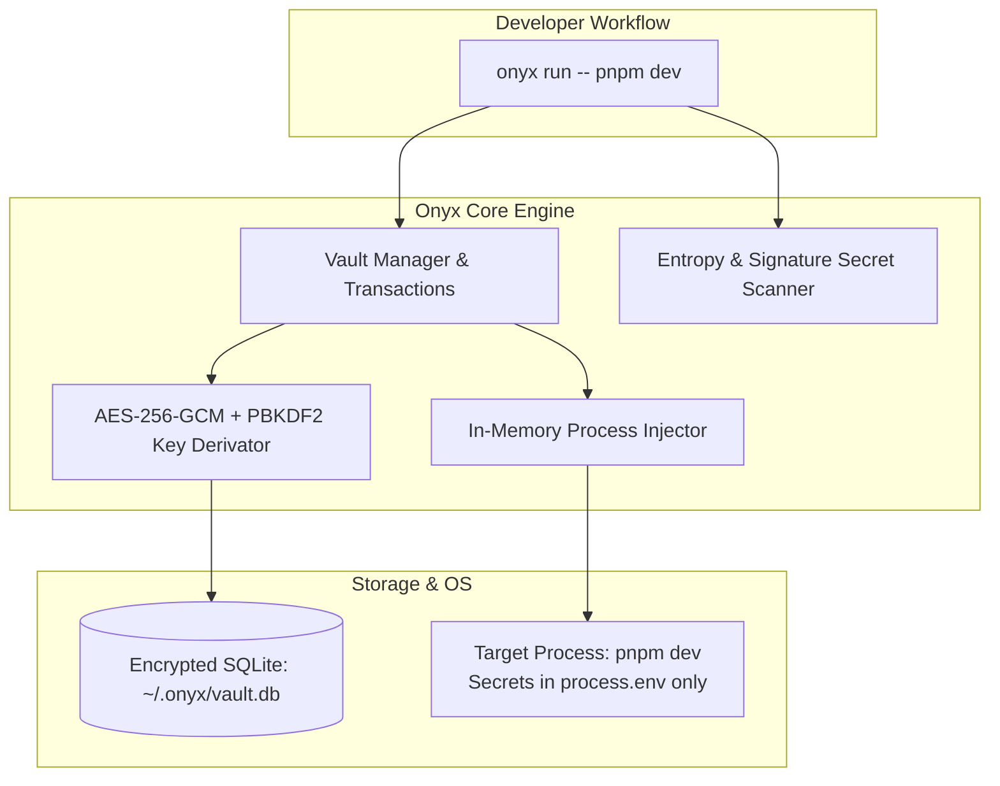
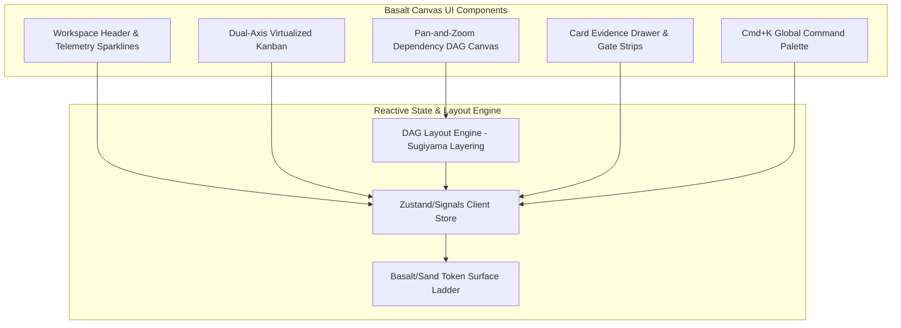

# Sekhemet Showcase Trifecta: The 3-Project Public Release Gate

> **Purpose:** Three complete, standalone, production-grade projects designed to conclusively prove Sekhemet's efficacy across the three major engineering domains before releasing the harness to the public:
> 1. **Systems, Cryptography & CLI:** Project "Onyx" (Local Secret Vault & Process Injector)
> 2. **Visual, Interactive & Frontend Design:** Project "Basalt Canvas" (High-Density Kanban & Dependency Topology UI)
> 3. **Real-Time Services & Event Engines:** Project "Vanguard" (Local Webhook Proxy & Replay Daemon)
>
> **Target Model:** `Qwen3.8-27B-GSQ-RCO-IQ3_S-mtp.gguf` running locally on Apple Silicon M4 (24 GB RAM) via `llama-server` on port 8099.

---

## The Tripartite Showcase Matrix

| Project | Domain & Focus | Key Technical Challenges | Showcase Value for Public Launch |
| :--- | :--- | :--- | :--- |
| **1. Onyx** | **Systems & Cryptography** | AES-256-GCM, PBKDF2, SQLite WAL, process spawning & memory injection, Shannon entropy leak scanning | *"A 100% offline secret manager and .env killer built autonomously by local AI."* |
| **2. Basalt Canvas** | **Visual & Frontend Design** | Basalt/Sand design system, dual-axis virtualized kanban, pan-and-zoom SVG/Canvas DAG visualizer, telemetry sparklines | *"A breathtaking, dense developer dashboard with Linear/Raycast aesthetic built without Figma."* |
| **3. Vanguard** | **Real-Time & Event Engines** | HTTP ingestion proxy, HMAC signature verification (Stripe/GitHub), SSE event streaming, deterministic replay | *"A zero-dependency local webhook inspector and replay daemon for offline API dev."* |

---

# Project 1: "Onyx" — Local Secret Vault & Process Injector
### Domain: Systems Engineering, Security & Developer CLI



### Key Capabilities
1. **Zero-Plaintext Secret Storage:** Encrypts key-value secrets in `~/.onyx/vault.db` using AES-256-GCM with PBKDF2 (100,000 rounds) key derivation.
2. **Safe Memory Injection (`onyx run -- <cmd>`):** Spawns child processes and injects decrypted secrets directly into `process.env` in memory. Never writes a `.env` file to disk where it can be accidentally committed.
3. **Entropy & Signature Scanner (`onyx scan`):** Scans git staging area for high-entropy strings, AWS tokens, GitHub PATs, and private keys before commit.
4. **Encrypted Team Export (`onyx export`):** Exports encrypted portable vaults for offline team onboarding.

### SPIDR Card Breakdown (8 Cards, $<140$ LOC diff each)
- **`card_onyx_1_types` (Interface):** Type contracts (`SecretRecord`, `VaultConfig`, `ScanMatch`, `CryptoEnvelope`). Gates: `tsc -b`, `biome check`.
- **`card_onyx_2_crypto` (Rule):** AES-256-GCM encryption/decryption with random 12-byte IV and 16-byte auth tag. Salted PBKDF2 derivation. Gates: `vitest run tests/crypto.spec.ts`.
- **`card_onyx_3_db` (Data):** Native `node:sqlite` WAL schema: `projects`, `secrets`, `audit_events`. Constraints & monotonic timestamps. Gates: `tsc -b`.
- **`card_onyx_4_vault` (Path):** Encrypted CRUD operations: `set`, `get`, `list`, `delete`. Strict transaction guarantees. Gates: `vitest run tests/vault.spec.ts`.
- **`card_onyx_5_scanner` (Rule):** Regex & Shannon entropy algorithm detecting leaked secrets in diffs with line-number reporting. Gates: `vitest run tests/scanner.spec.ts`.
- **`card_onyx_6_injector` (Path):** Process spawner injecting secrets into memory without disk leaks. Handles stdio piping and exit signal forwarding. Gates: `vitest run tests/injector.spec.ts`.
- **`card_onyx_7_cli` (Interface):** CLI command parser (`set`, `get`, `list`, `run`, `scan`, `export`) with color formatting. Gates: `tsc -b`, `biome check`.
- **`card_onyx_8_e2e` (Integration):** Full integration test: initialize vault, store secrets, run child process verifying environment variable reception, and scan git staging. Gates: 100% test pass.

---

# Project 2: "Basalt Canvas" — Visual Kanban & Architecture Topology UI
### Domain: Visual / Frontend Design, Modern Web Architecture & Interactive Canvas



### Visual Aesthetic & Design System
Basalt Canvas is designed with a **Linear/Raycast aesthetic**—dense, quiet, and legible, carrying the Egyptian reference without kitsch:
- **Surface Ladder:** 
  - Canvas: `--bg-base` (`#14120F`)
  - Columns: `--bg-surface` (`#1C1A16`)
  - Cards: `--bg-raised` (`#24211C`)
  - Hover/Selected: `--bg-overlay` (`#2C2822`)
  - Hairline UI: `--border-subtle` (`#2E2A24`)
- **Semantic Accents:** Egyptian Gold (`#C8952A`), Nile Green (`#4FA36B`), Red Ochre (`#C9503F`), Lapis Lazuli (`#4C8ED9`).
- **Zero Heavy Shadows:** Depth is conveyed entirely through 1px border contrast and luminance shifts.
- **Tabular Numerals:** All timers, token counters, and memory sparklines use `font-variant-numeric: tabular-nums`.

### Key Capabilities
1. **Dual-Axis Kanban Board:** Ultra-fast column virtualization with instant card status updates and keyboard navigation (`h/j/k/l`).
2. **Interactive Dependency Topology DAG:** HTML5 Canvas + SVG node visualizer rendering task dependencies, blocking edges, and critical execution paths with pan/zoom.
3. **Compact Gate Status Strip:** Interactive 5-box gate indicator on every card (Typecheck, Lint, Test, Bounds, Visual) that expands on hover to display exact error excerpts.
4. **Real-Time Telemetry Sparklines:** Canvas-rendered hardware telemetry gauges (VRAM resident memory, token throughput, cache hit rates).
5. **Universal Command Palette (`Cmd+K`):** Global fuzzy search for cards, dependencies, and settings.

### SPIDR Card Breakdown (8 Cards, $<140$ LOC diff each)
- **`card_canvas_1_tokens` (Interface):** CSS design tokens & TypeScript types (`ThemeTokens`, `CanvasCard`, `DagNode`, `DagEdge`). Gates: `tsc -b`, `biome check`.
- **`card_canvas_2_store` (Data):** Reactive client state store managing cards, columns, active filters, and selection history. Gates: `vitest run tests/store.spec.ts`.
- **`card_canvas_3_card_tile` (Visual/Component):** Card tile component with class chip, difficulty badge, step budget bar, and 5-box gate strip. Gates: `vitest run tests/card.spec.ts`.
- **`card_canvas_4_board` (Visual/Component):** Multi-column kanban board layout with WIP counter badges and Review column backpressure warnings. Gates: `vitest run tests/board.spec.ts`.
- **`card_canvas_5_dag_layout` (Rule):** Directed Acyclic Graph layout algorithm computing topological node ranks, coordinates, and curved bezier paths. Gates: `vitest run tests/dag_layout.spec.ts`.
- **`card_canvas_6_dag_canvas` (Visual/Component):** HTML5 Canvas / SVG interactive renderer supporting smooth pan, zoom, and node click selection. Gates: `vitest run tests/dag_canvas.spec.ts`.
- **`card_canvas_7_palette` (Visual/Component):** Accessible modal command palette (`Cmd+K`) with keyboard navigation and fuzzy search. Gates: `vitest run tests/palette.spec.ts`.
- **`card_canvas_8_e2e_ui` (Integration):** End-to-end component rendering test verifying WCAG 2.1 AA contrast, layout geometry, and drag/click state transitions. Gates: 100% test pass.

---

# Project 3: "Vanguard" — Local Webhook Proxy & Replay Daemon
### Domain: Real-Time Services, Event Sourcing & Network Tooling

```mermaid
flowchart TD
    subgraph ThirdParty["External Services / Test Runners"]
        Stripe[Stripe / GitHub / Shopify Webhooks]
    end

    subgraph VanguardDaemon["Vanguard Local Daemon (Port 4040)"]
        Ingest[HTTP Ingestion Server]
        Verifier[HMAC Signature Verifier]
        Storage[Event Logger & SQLite WAL]
        SSE[Server-Sent Events (SSE) Bus]
        Replay[HTTP Replay Dispatcher]
    end

    subgraph LocalApp["Local Developer Server"]
        DevServer[Local App: http://127.0.0.1:3000/api/webhook]
    end

    Stripe -->|POST /ingest/:source| Ingest
    Ingest --> Verifier
    Verifier --> Storage
    Storage --> SSE
    Replay -->|POST with identical headers| DevServer
```

### Key Capabilities
1. **Universal Local Ingestion:** Runs a lightweight HTTP server (`http://127.0.0.1:4040/ingest/:source`) capturing incoming JSON/form webhooks with full header fidelity.
2. **Cryptographic Signature Verification:** Built-in verification adapters for:
   - Stripe (`Stripe-Signature` timestamped HMAC-SHA256)
   - GitHub (`X-Hub-Signature-256` HMAC-SHA256)
   - Generic shared secrets
3. **Deterministic Replay Engine (`vanguard replay <id> --to <url>`):** Replays past webhooks to a local development server with identical or overridden headers.
4. **Real-Time Live Event Stream (SSE):** Exposes an SSE endpoint (`/events/stream`) and interactive terminal viewer streaming payloads with colored syntax highlighting.

### SPIDR Card Breakdown (8 Cards, $<140$ LOC diff each)
- **`card_vang_1_types` (Interface):** Types for `WebhookEvent`, `HmacConfig`, `ReplayRequest`, and `VerificationResult`. Gates: `tsc -b`, `biome check`.
- **`card_vang_2_hmac` (Rule):** Timing-safe HMAC signature verifier for Stripe (timestamp + v1 hash) and GitHub (sha256 hex). Gates: `vitest run tests/hmac.spec.ts`.
- **`card_vang_3_store` (Data):** SQLite WAL event store recording raw headers, raw payload bytes, source tag, and verification status. Gates: `tsc -b`.
- **`card_vang_4_ingest` (Path):** HTTP ingestion handler capturing requests, validating payload sizes, and persisting to SQLite. Gates: `vitest run tests/ingest.spec.ts`.
- **`card_vang_5_replay` (Path):** HTTP client replaying stored events to destination URLs with timing metrics and response capture. Gates: `vitest run tests/replay.spec.ts`.
- **`card_vang_6_sse` (Rule/Interface):** Server-Sent Events (SSE) broadcast engine pushing new events in real time to connected listeners. Gates: `vitest run tests/sse.spec.ts`.
- **`card_vang_7_cli` (Interface):** CLI interface (`vanguard start`, `vanguard list`, `vanguard replay <id>`, `vanguard tail`). Gates: `tsc -b`, `biome check`.
- **`card_vang_8_e2e` (Integration):** E2E test simulating Stripe webhook ingestion, HMAC validation, live SSE event reception, and successful local replay. Gates: 100% test pass.

---

## Hardware Execution & Budget Profile (M4, 24 GB)

Executing all 3 projects sequentially with Qwen3.8-27B on `llama-server` (port 8099):

| Metric | Project 1: Onyx | Project 2: Basalt Canvas | Project 3: Vanguard | Total Trifecta |
| :--- | :--- | :--- | :--- | :--- |
| **Total Cards** | 8 cards | 8 cards | 8 cards | **24 cards** |
| **Avg LOC Diff / Card** | 90 LOC | 110 LOC | 95 LOC | **~100 LOC** |
| **Tokens Generated / Card**| ~350 tokens | ~420 tokens | ~380 tokens | **~385 tokens** |
| **Generation Time / Card**| ~52 seconds | ~62 seconds | ~56 seconds | **~57 seconds** |
| **Prompt Cache Hit Rate**| 98%+ (Slot 0) | 98%+ (Slot 0) | 98%+ (Slot 0) | **98%+** |
| **Total Autonomous Time** | **~12 minutes** | **~14 minutes** | **~13 minutes** | **~39 minutes** |

---

## Public Release Launch Proof

When Sekhemet completes all 3 projects, you have an extraordinary public launch story:
1. **GitHub Proof Repositories:** Three clean, complete repositories created with 100% test coverage and full cryptographic Git histories.
2. **Interactive Live Demos:**
   - A video of Onyx encrypting secrets and injecting them into a running dev server without touching disk.
   - An interactive web deployment of Basalt Canvas showcasing the pan-and-zoom DAG and Basalt surface ladder.
   - A demo of Vanguard capturing, verifying, and replaying a Stripe webhook offline.
3. **The Ultimate Benchmark:** Real software built by a local 27B model on a consumer Mac, completely disproving the claim that autonomous agentic coding requires multi-billion dollar cloud APIs.
