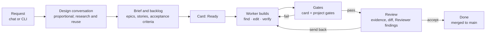

# Sekhemet — the spine of the design

*Design v3, 2026-09-22. This page is the design's entry point: what Sekhemet is, the rules nothing may break, how the parts fit, and where each part is specified. Behaviour lives in the [specifications](specs/README.md); decisions and their reasons in [DECISIONS.md](DECISIONS.md); vocabulary in [NAMING.md](NAMING.md). It replaces the single 3,539-line design document of 2026-09-17 and its companions; where each old section went, and how to read the old text, is in [specs/README.md](specs/README.md#where-the-old-design-went).*

## What Sekhemet is

**Sekhemet is a coding harness for professional teams.** Other coding agents assume the person driving them already practises software engineering: they give you a chat window and a diff, and whether the result has a plan, tests, reviewable increments and a definition of done depends on you. That is why so much of what they produce is hard to bring into a professional team's workflow.

**Sekhemet runs the process itself.** A senior project manager turns a request into a brief and a planned backlog on a board any team already knows how to read. A senior engineer builds each card against executable gates. Nothing is done until the gates pass and a person accepts it. It runs on your machine or your company's server, every role's model is yours to choose, and a frozen benchmark tells you whether your choice helped.

**Three audiences, one product.**

| Audience | What they get | Where it is specified |
| --- | --- | --- |
| **Developers** | A board that reads like Jira, Linear or GitHub Projects; cards with evidence; review in minutes, not archaeology | [dashboard](specs/dashboard.md), [review-git](specs/review-git.md), [gates](specs/gates.md) |
| **Beginners** | The practice taught where it happens — what a WIP limit is for, why a story is sliced thin, what done means — through a Learn layer that experts switch off | [dashboard](specs/dashboard.md), [planner-pm](specs/planner-pm.md) |
| **Non-developers** | A conversation with the project manager to start a project and to ask how it is going; a status page in plain words | [planner-pm](specs/planner-pm.md), [design-stage](specs/design-stage.md), [dashboard](specs/dashboard.md) |

**Where the edge is.** Board-plus-agent is no longer rare: Linear's agent lets non-developers chat with a PM, and Jira and GitHub hand cards to cloud agents ([research, group C](../research/WEB_RESEARCH_2026-09.md)). What nobody combines is **local and private**, **"accepted" meaning proven by gates**, and **teaching the practice**. Every part of this design serves one of those three, or it is a candidate for removal.

## The spine

Fixed. Changing any of these needs the owner.

1. **Gates decide completion; the model never certifies its own work.** Every column boundary is an entry condition decided by an executable check the model cannot edit.
2. **The event log is the only durable channel.** Anything a model saw can be reconstructed from it — *model-visible means logged*, enforced at runtime. The board, replay, the audit trail and every measurement are projections of that one stream.
3. **A card is the unit of work.** One card owns one worktree, one branch, one declared file scope, one deterministically assembled context, one budget, one evidence bundle and one measured outcome. There is no long-running session.
4. **The human is the rate limiter.** Measured review capacity sets the Review WIP limit, which back-pressures Verify, which back-pressures the Worker. The machine cannot produce more diffs than a person can read.

Three consequences follow and are held to the same standard:

- **What the system learns, it learns only from a recorded signal** — a gate result, a stop reason, a send-back — and spends it in one place: the stable zone of the next prompt, at a card boundary.
- **A project is done the way a card is: by evidence.** The brief becomes a graph of accepted requirements; a release slice is proven when every must-have requirement has passing tests on `main`, and done when a person accepts it. No model decides that a project is finished, or how much to build ([DEC-11](DECISIONS.md#dec-11)).
- **The harness may do less, but never claims more.** A language without a parse gate, a gate that did not run, a sandbox weaker than designed: each is stated on the card and in the evidence bundle.

## A project's journey

1. **Request.** Anyone describes what they want, in the dashboard, to the PM or on the command line ([surface](specs/surface.md), [planner-pm](specs/planner-pm.md)).
2. **Design, in proportion.** The PM asks only what the request needs — a calculator needs no consultation; a payments service does. A depth profile, a quality checklist, comparable products and a walkthrough of each user's journey decide how deep to build, so coverage does not depend on what the model happens to ask. Before anything is planned, research looks for legally usable libraries, repositories and literature that already solve the problem ([design-stage](specs/design-stage.md)).
3. **Brief and backlog.** The brief's requirements are laid out as a story map — the walking skeleton first, then release slices, each with an appetite. The planner turns them into epics and thin vertical stories, every card tracing to a requirement, each card at most 200 changed lines across 1–3 files, with checkable acceptance criteria and red-first acceptance tests ([planner-pm](specs/planner-pm.md)).
4. **Build.** One card at a time per worktree, the Worker finds, edits and verifies in small steps under a budget, inside a sandbox, with a context assembled fresh for the card ([worker-loop](specs/worker-loop.md), [context](specs/context.md), [security](specs/security.md)).
5. **Gates.** The card's gates, then the three project gates — reachability, regression, architecture — decide ([gates](specs/gates.md)).
6. **Review and Accept.** A person reads the evidence and the Reviewer's findings and accepts, sends back or parks; Accept merges without touching the person's working copy and can be undone ([review-git](specs/review-git.md)).
7. **Learn and measure.** Outcomes feed the playbook and the competence model; the frozen suite measures the harness itself ([measurement](specs/measurement.md)).

## Roles, models and the one persona

- **Four model roles** — Worker, Planner, Reviewer, Researcher — are entries in the model registry, each resolved to a model the user chooses. They are not agents and not characters: they never converse with each other or play out ceremonies ([models](specs/models.md)).
- **One persona, for people.** *Seshat, the project manager*, is how people talk to the planning side. Standups, retrospectives and status are **reports for people**, written by Seshat from the event log — never a simulated meeting between agents ([DECISIONS](DECISIONS.md#dec-05)).
- **Seniority is structure, not prose.** The PM and the Worker behave as senior professionals because the tools, the loop, the refusals and the gates make the professional move the easy one — not because a prompt says "you are senior".
- **Local in v1.** Every role runs on a local model in v1. The Worker is Cyber-Tiel-Coder-35B-A3B with its MTP head ([DEC-04](DECISIONS.md#dec-04)); because it is uncensored, the sandbox is its only guardrail and is held to a v1-blocking standard. After v1, a cloud model becomes something a person can plug into a role — an option, never a dependency ([DEC-03](DECISIONS.md#dec-03)).

## How the parts fit

**Processes.** One core host runs the kernel, board, planner, loop and dashboard server; an inference host serves models over HTTP (the same machine on a single-box install); gates run confined, on the core host or a separate runner. In company-server mode the core host binds to the network with per-person identity ([runtime](specs/runtime.md), [integrations](specs/integrations.md)).

**Packages**, in dependency order — each depends only on those before it:

| Package | Owns | Spec |
| --- | --- | --- |
| `kernel` | Event log (hash-chained, SQLite WAL), projections, the card state machine | [kernel](specs/kernel.md) |
| `sandbox` | Confinement (Seatbelt, bubblewrap), the permission engine | [security](specs/security.md) |
| `sync` | Git worktrees, checkpoints, hardened git, remotes | [review-git](specs/review-git.md), [security](specs/security.md) |
| `models` | Model registry, inference adapters, managed servers | [models](specs/models.md) |
| `gates` | Gate runners, the evidence bundle | [gates](specs/gates.md) |
| `context` | Repo map, scope, prompt assembly | [context](specs/context.md) |
| `loop` | The Worker's turn driver, tools, stop reasons | [worker-loop](specs/worker-loop.md) |
| `board` | Boards, WIP accounting, dependencies | [kernel](specs/kernel.md), [dashboard](specs/dashboard.md) |
| `planner` | Decomposition, estimation, replanning | [planner-pm](specs/planner-pm.md) |
| `eval` | The frozen suite, bake-off, statistics | [measurement](specs/measurement.md) |
| `ui` | Dashboard tokens, vocabulary, web modules | [dashboard](specs/dashboard.md) |
| `sdk` | Programmatic access for integrations | [extensibility](specs/extensibility.md) |
| `apps/harness` | CLI, front door, server, PM, research, runner | [surface](specs/surface.md), [runtime](specs/runtime.md) |

## Locked for v1

The full records, with evidence and the condition that would reopen each, are in [DECISIONS.md](DECISIONS.md).

| Decision | Value |
| --- | --- |
| Positioning | A coding harness for professional teams, serving developers, beginners and non-developers |
| Inference | Local only in v1; cloud models per role after v1 |
| Worker | Cyber-Tiel-Coder-35B-A3B MTP, IQ3_XXS, on a 24 GB Mac as the reference host |
| Deployment | A single machine, or a company server with per-person identity and an Accept role |
| Hardware range | 16 GB to 128 GB, self-calibrating |
| Context | Fresh per card; no long-running session |
| Done | Executable gates and a person's acceptance |
| Network | Offline by default; research, git remotes and sync are opt-in and logged |
| Language | TypeScript first; other languages get functional gates and say what they do not check |

**Not in v1:** cloud inference; RBAC beyond "who may accept"; SSO beyond one identity proxy; a compliance pack or any compliance claim; multi-machine inference pooling; live two-way sync with Jira or Linear (export and import only); an Azure DevOps connector; an IDE extension or TUI; fine-tuning our own models. Each is either a later version's work or rejected on evidence ([DECISIONS](DECISIONS.md)).

## What we claim, and what is true

The claims table is the positioning's honesty check: nothing in the README or the product may say more than the right-hand column. Each row's state is the state of the spec that carries it.

| Claim | State | Carried by |
| --- | --- | --- |
| Runs on your machine or your server | Machine: built. Server: not built (v1 scope) | [runtime](specs/runtime.md), [integrations](specs/integrations.md) |
| Takes a project through the whole process | Built end to end, with gaps in the Worker's method and planning quality | [planner-pm](specs/planner-pm.md), [worker-loop](specs/worker-loop.md) |
| Fits existing project-management practice | Partial: exports only; the board does not yet use the card anatomy teams know | [dashboard](specs/dashboard.md), [integrations](specs/integrations.md) |
| Teaches the practice to beginners | Not built | [dashboard](specs/dashboard.md) |
| Non-developers talk to the PM | Partial: status by conversation; starting a project is not built | [planner-pm](specs/planner-pm.md), [design-stage](specs/design-stage.md) |
| Choose each role's model | Built | [models](specs/models.md) |
| A benchmark to test your choice | Built: the frozen suite and bake-off; the planning measure is not | [measurement](specs/measurement.md) |
| Worker code stays in its sandbox | Partial: git metadata and the dependency link closed; egress, the gates' own processes and fail-closed confinement are open | [security](specs/security.md) |
| Cloud models | After v1 | [DEC-03](DECISIONS.md#dec-03) |

**Never claim** parity with frontier models on ambiguous work, guaranteed correct code, a benchmark number that was not measured on the recorded suite, or a compliance certification that does not exist.

## Status of every specification

One row per spec, from its front matter; `docs.spec.ts` fails the build when the two disagree.

<!-- status-table:start -->
| Spec | Status | Changes it carries |
| --- | --- | --- |
| [surface](specs/surface.md) | `partial` | P10, S10, T4, T10 + 5 new |
| [kernel](specs/kernel.md) | `partial` | S4, S7, P3 + 8 new |
| [worker-loop](specs/worker-loop.md) | `partial` | M1, M2, M3, T3 + 8 new |
| [context](specs/context.md) | `partial` | M1, M5, M8, P1, T2 + 6 new |
| [gates](specs/gates.md) | `partial` | T1, T2, M6, M10, P1 + 8 new |
| [models](specs/models.md) | `partial` | M4, M7, M11 + 10 new |
| [measurement](specs/measurement.md) | `partial` | M9, M10, M12, T7, T8 + 4 new |
| [planner-pm](specs/planner-pm.md) | `partial` | P1, P2, P6, P13 + 7 new |
| [design-stage](specs/design-stage.md) | `partial` | P2, P7, P14, S8 + 5 new |
| [review-git](specs/review-git.md) | `partial` | S5, S6, P8 + 5 new |
| [dashboard](specs/dashboard.md) | `partial` | P3, P4, P5, P11, P12, P13, T5, S3c + 5 new |
| [security](specs/security.md) | `partial` | S1, S2, S3, S3a, S3b, S3c, S9 + 7 new |
| [integrations](specs/integrations.md) | `partial` | P9, S3c + 3 new |
| [extensibility](specs/extensibility.md) | `partial` | S9, S4 + 4 new |
| [runtime](specs/runtime.md) | `partial` | T5, P9, S3c + 10 new |
<!-- status-table:end -->

## Voice

Plain, exact and calm. Sekhemet reports what passed, what failed and what it needs from you. It never says "done" when it means "I think so". Copy uses verbs and numbers, avoids exclamation, and names the gate rather than the feeling. The name is paired with a plain descriptor wherever the product introduces itself: *Sekhemet — a coding harness for professional teams*.

## Where to go next

- **What we are doing now:** [MODERNIZATION_PLAN.md](../reference/MODERNIZATION_PLAN.md), and the change programme in [COVERAGE.md](../reference/COVERAGE.md).
- **What done means:** [DEFINITION_OF_DONE.md](../../DEFINITION_OF_DONE.md).
- **Open questions and benchmarks still owed:** [OPEN_QUESTIONS.md](../reference/OPEN_QUESTIONS.md).
- **Every document:** [docs/README.md](../README.md).
