# C1 findings register

The ranked register of workstream C1, the audit sprint (FINISH_LINE_PLAN §E, consolidation note: W4's spec truth, W16's C.9 audits and W5's UI/UX audit). It merges the findings of 21 audit files into one list, deduplicated by root cause, for C2 (the fix sprint), the other C-workflows, and the owner's K3 walk.

- **Tree:** `claude/harness-definition-done-4d9161` at 23fb026, with the C1 spec-truth agents' uncommitted spec edits.
- **Date:** 2026-10-01. No model was loaded; browsers ran headless on localhost against the C1 fixture (Solo, and Team with Nora, Lee, Mo, Sam and Vi), at 1440, 1100 and 400 px.
- **Raw findings:** 336 from 21 audits, plus one specs-product scope proposal that carries a severity (RG-P8-3), merged into **245** findings. Every raw finding is the primary source of exactly one entry (checked by the script that built this file).
- **Fixture keys:** the C1 fixture seeds professional-looking ids: its built and in-progress cards are created with the ids TS-101 to TS-108 (`scratchpad/c1/fixture/prepare.mjs:206-214`). The product assigns no issue key to any issue (BRD-03), so every TS-1xx in a finding or a screenshot (for example [issue-TS-103.png](findings_c1/heuristic-a-issue-TS-103.png) and [dev-18-ts102-accept-enabled-open-thread.png](findings_c1/walkthroughs-dev-18-ts102-accept-enabled-open-thread.png)) shows a key the product cannot produce; the product's own cards read `card_<uuid8>`.
- **Source data:** the audit JSON and screenshots stay in the session scratchpad (`scratchpad/c1/`); the screenshots this register cites are copied, reduced, to [`findings_c1/`](findings_c1/).

## How to read it

- **Severity** (the task's scale): 4 blocks release, 3 major, 2 minor, 1 cosmetic. A merged finding takes the highest rating any audit gave its root cause; the other ratings are shown when they differ. Plan §D.1 asks for the mean of three evaluators and the owner's confirmation of every 3 and 4: that is K3.
- **Order:** grouped by area; inside an area, by severity, then by how many audits saw it. Ids (`BRD-01`) follow that rank.
- **Seen by:** the audit files and their own finding ids. *Also* names an audit that saw the same cause as part of another finding.
- **Fix route:** **C2** fix sprint (W16's fixes, W6, these findings); **C3** models (W11, W18); **C4** reliability and performance (W8, W9); **C5** docs, install, CLI and journeys (W3, W10); **C6** vibe-gap checks (W17); **C7** release candidate (W12, W13, W15); **DEC** a deferral to record; **Owner** a decision first.
- **Tags:** *K3* = the owner's K3 review sees it (severity 3-4, and every mockup deviation); *mockup deviation* = differs from `docs/design/mockups/dashboard-v3`; *owner decision* = needs the owner's yes or a DEC before anyone builds.
- Findings at severity 3-4 are written out in full; severity 1-2 are one table row each, with the same fields.

## Counts

| Area | Sev 4 | Sev 3 | Sev 2 | Sev 1 | Total | K3 |
| --- | ---: | ---: | ---: | ---: | ---: | ---: |
| Board (BRD) | 1 | 3 | 9 | 0 | 13 | 6 |
| Issue page and peek (ISS) | 0 | 5 | 2 | 2 | 9 | 5 |
| Review and Accept (REV) | 0 | 5 | 5 | 0 | 10 | 5 |
| Status, Projects and Insights (STA) | 0 | 5 | 7 | 0 | 12 | 6 |
| Seshat (PM) | 0 | 3 | 5 | 1 | 9 | 4 |
| Inbox and Team pages (TEAM) | 0 | 4 | 3 | 1 | 8 | 4 |
| Shell, navigation and first run (SHL) | 0 | 4 | 4 | 1 | 9 | 7 |
| Configuration and models (CFG) | 0 | 6 | 12 | 1 | 19 | 7 |
| Loading, error and offline states (ERR) | 0 | 6 | 5 | 0 | 11 | 6 |
| Accessibility and keyboard (A11Y) | 0 | 1 | 5 | 0 | 6 | 1 |
| Visual system and mockups (VIS) | 0 | 0 | 5 | 0 | 5 | 3 |
| Permissions and security (SEC) | 0 | 3 | 5 | 0 | 8 | 3 |
| Command line (CLI) | 1 | 7 | 1 | 1 | 10 | 8 |
| Reliability and data (REL) | 1 | 12 | 9 | 0 | 22 | 13 |
| Tests and traceability (TST) | 1 | 3 | 2 | 1 | 7 | 4 |
| Spec truth (SPEC) | 0 | 2 | 5 | 1 | 8 | 3 |
| Install, release and docs (INS) | 1 | 6 | 5 | 1 | 13 | 7 |
| Professional process gaps (PRC) | 0 | 11 | 6 | 3 | 20 | 11 |
| Words and names: copy (WRD) | 0 | 2 | 22 | 4 | 28 | 2 |
| Words and names: code (NAM) | 0 | 3 | 11 | 4 | 18 | 3 |
| **All** | **5** | **91** | **128** | **21** | **245** | **108** |

By first fix route: C2 154, C3 12, C4 16, C5 17, C6 0, C7 1, DEC 7, Other 8; a decision by the owner first: 30. Findings tagged *owner decision*: 42. Mockup deviations: 21.

## Sources

| Audit | What it covered | Raw findings |
| --- | --- | ---: |
| crawl | C.9 item 1, the dead-control crawl (98 page crawls, 1,454 activations) | 14 |
| design-harness-parity | parity with other coding harnesses (design completeness) | 9 |
| design-journeys | persona journeys from install to maintenance (design completeness) | 16 |
| design-release-readiness | what a public release needs (design completeness) | 16 |
| design-robustness | robustness: backups, crashes, sleep, disk, two projects (design completeness) | 13 |
| design-system | D.5, every dashboard-v3 mockup against its built page | 20 |
| design-team-process | professional team process (design completeness) | 12 |
| entry-points | C.9 item 3, the entry-point criterion report | 13 |
| heuristic-a | D.1 heuristic evaluator A (Board, Issue, Review, Status) | 23 |
| heuristic-b | D.1 heuristic evaluator B (Seshat, Inbox, Team pages, Insights) | 23 |
| heuristic-c | D.1 heuristic evaluator C (CLI, first run, Configuration, Tips) | 30 |
| slop-code | AI-slop scan of the code (names, size, parallel helpers) | 19 |
| slop-words | AI-slop scan of the words (DEC-31, NAMING, Voice) | 25 |
| specs-core | W4 spec truth: kernel, worker-loop, context, gates, models, measurement | 9 |
| specs-platform | W4 spec truth: security, integrations, teams, extensibility, runtime, surface, SPINE | 4 |
| specs-product | W4 spec truth: planner-pm, design-stage, review-git, dashboard | 6 |
| states-copy | D.6 state inventory, error-message rubric, C.9 item 6 parity | 16 |
| stubs | C.9 item 4, the stub and placeholder scan | 15 |
| unhappy | C.9 item 5, the unhappy-path matrix | 12 |
| walkthroughs | D.2 cognitive walkthroughs (developer, junior, non-developer) | 29 |
| wiring | C.9 item 2, the wiring audit | 13 |

## What passed

- **Tokens:** colours come only from tokens (0 hex or rgb literals in `packages/ui/web`); the computed type sizes on every audited page are on the scale (11, 12.5, 13, 15, 18 px; the CSS still holds literals, VIS-01); no drop shadows; motion is zeroed under reduced motion; light and dark render with the same structure (design-system).
- **Wiring:** all 135 client URLs exist on the server (0 generic 404s, 0 405s, 0 5xx in Solo and Team); 52 CLI smoke runs, none crashed (wiring).
- **Level notes:** 158 of 159 disabled controls say which level they need (crawl).
- **Words:** no filler or puffery ('seamless', 'leverage', 'robust'…), no decorative emoji, no apologetic errors (slop-words). No empty `catch {}` blocks (slop-code).
- **Professional parity (C.9 item 6):** search, bulk edit, keyboard shortcuts, import and export, permissions and audit are present; saved filters, large-list performance and backup are partial; undo, notification preferences, upgrade and uninstall, and per-feature docs are missing (states-copy, mapped below).

## Findings by area

### Board (BRD)

#### BRD-01 · severity 4 (ratings 4, 3, 3, 3, 3, 2) · K3 · mockup deviation

**The pinned In review and On hold columns cover the board: on a phone only On hold is visible, at 1440 px Done sits hidden under On hold, and at 1100 px the board opens scrolled with a column cut in half.**

- **Evidence:** packages/ui/web/board.js:537-556 (pinQueueColumns pins whenever the board overflows) and board.css:607-618 (100vw-16px columns below 768 px). At 400 px scrollLeft 1568 of 2360 and elementFromPoint(200,500) hits On hold; at 1440 Done (x=1136, w=200) sits under sticky On hold (x=1128, w=296); at 400 a Tab stop lands at x=-312.
- **Breaks:** §A Visual system (mockups Main, SoloBoard); §A every page at 400 px; WCAG 2.4.11; C.9 item 1
- **Seen by (4):** heuristic-a HA-01, HA-02; crawl CRAWL-5; design-system DS-4; walkthroughs WT-06, WT-27
- **Fix route:** C2: pin only when the overflow is real and never over an unscrolled column; below 768 px one column with a column picker; open on the first working column.
- **Screenshots:** [board-400-light.png](findings_c1/heuristic-a-board-400-light.png), [pair-Main-light.png](findings_c1/design-system-pair-Main-light.png), [dev-02b-board-1100.png](findings_c1/walkthroughs-dev-02b-board-1100.png)

#### BRD-02 · severity 3 (ratings 3, 2, 3) · K3 · mockup deviation

**In review tiles squeeze 'Waiting 2h 9m' to one letter per line beside 13 unlabelled check pips.**

- **Evidence:** packages/ui/web/board.css:321-329 (.r4s .st flex 1, overflow-wrap anywhere) beside tile.js:121-133 pips; the status span measures 10.19 px wide at 1440 and 1100, Solo and Team.
- **Breaks:** dashboard §2.4.4 (the status never breaks its cause); §A Visual system; mockup Main
- **Seen by (4):** design-system DS-1; heuristic-a HA-12; walkthroughs WT-07; also heuristic-b HB-03
- **Fix route:** C2: status on its own row (or nowrap with min-width); collapse the pips into one '11/13' summary with detail in the tooltip.
- **Screenshots:** [jr-04-wip-tip-open.png](findings_c1/walkthroughs-jr-04-wip-tip-open.png)

#### BRD-03 · severity 3 (ratings 3, 2) · K3

**No issue or epic ever gets an issue key: the product assigns none, so tiles, Inbox rows, URLs and breadcrumbs show hash fragments (c0331c02, card_c0331c02, story_path_c30b4d0c).**

- **Evidence:** No key writer exists in `packages/kernel` or `packages/board`: cards carry only `card_<uuid8>` ids (`card_store.ts:671`), the tile falls back to `card.key ?? d.shortId ?? shortId(card.id)` (`packages/ui/src/tiles.ts:185`), and kernel.md's row *Card key (`CHR-12`)* is not-built. The TS-101…TS-108 keys seen in the audit are a fixture artifact: the C1 fixture created those cards with those ids (`scratchpad/c1/fixture/prepare.mjs:206-214`); every card the product itself created reads like #/card/card_c0331c02 with breadcrumb 'timesheets › card_c0331c02', and GET /api/board returns ids card_bab37e78, card_774d6ae1. (Corrected after the C1 review: an earlier text said only issues that left Backlog get keys.)
- **Breaks:** NAMING.md:24 (Issue, key CHR-7); §A Nothing raw; Linear and Jira assign the key at creation
- **Seen by (2):** heuristic-a HA-11; heuristic-b HB-10
- **Fix route:** C2: write a project key at creation for every issue and epic (kernel.md *Card key*), and use it in tiles, URLs, breadcrumbs, the CLI and refusals (also a specs-product v1-scope proposal). K3 should read every TS-1xx key in this register's screenshots as the fixture's, not the product's.
- **Screenshots:** [board-keys.png](findings_c1/heuristic-a-board-keys.png)

#### BRD-04 · severity 3 · K3

**The derived In review limit has no floor or cap: the header reads '2 / 3600' and the WIP Tip teaches that 'a review takes about 0 minutes'.**

- **Evidence:** packages/board/src/board_service.ts:508 floors the median review at 1/60 minute and never caps; packages/ui/src/learn.ts:308 rounds to 0. Team went 2/4 to 1/500 after one fast Accept.
- **Breaks:** DoD §6.4 junior task (the explanation must be right); §A Voice; RG-S6-4 / DB-P4-4
- **Seen by (2):** heuristic-c HC-17; walkthroughs WT-05
- **Fix route:** C2: a policy floor on the median (e.g. 2 min), a cap, and 'a starting estimate' below N reviews.
- **Screenshots:** [jr-04-wip-tip-open.png](findings_c1/walkthroughs-jr-04-wip-tip-open.png)

| Id | Sev | Finding | Evidence | Seen by | Fix route |
| --- | --- | --- | --- | --- | --- |
| BRD-05 | 2 | New issue asks only for a title and a description: no type, priority, labels, sprint or assignee, and no Bug form (steps, expected, actual, release); a repository's .github/ISSUE_TEMPLATE is ignored *(owner decision)* | packages/ui/web/create.js:39-49; packages/ui/src/create.ts:14-25; planner-pm.md:221 (a fix card needs a reproduction). Breaks: C.9 item 6 parity (Linear, Jira create dialogs); product direction. | heuristic-a HA-20; design-journeys J-3; design-team-process TP-7 | C2 for the property pills; the Bug fields need the owner's yes (J-3). |
| BRD-06 | 2 | A click on a board tile only selects it; the issue opens only on Enter (a double-click opened the peek in the crawl and nothing in the walkthrough) | packages/ui/web/board.js:836-842 (click sets focusedId), 873-876 (dblclick). Breaks: Product direction (Linear, Jira, GitHub Projects open on click); DoD §6.4 three actions. | crawl CRAWL-8; walkthroughs WT-22 | C2: open the peek on click; keep selection for keyboard and modifier clicks. |
| BRD-07 | 2 | Field edits, moves, park, reject and bulk edits cannot be undone; the only undo is Accept's 3-second grace, and it is untested | grep undo in packages/ui/web: triage.js:93-140, suggestions.js, inbox.js only; fields.js:62-100 and bulk.js:70 act at once. Breaks: C.9 item 6 (keyboard shortcuts and undo: parity row 'missing'); C.9 item 5 undo column; DB-1. | design-team-process TP-8; unhappy UH-10 | C2: Undo (z) in the toast, written as a compensating event; or a DEC deferring it. |
| BRD-08 | 2 | Saved views live in one browser's localStorage, so a team cannot share a filter *(owner decision)* | packages/ui/web/viewbar.js:65-78, 105-107; dashboard.md §7 lists server views as Later. Breaks: C.9 item 6 (saved filters: parity row 'partial'). | design-team-process TP-5; states-copy SC-P4 | Owner: keep Later with a DEC, or C2 (view/saved events with a Share switch). |
| BRD-09 | 2 | The board's top bar has no primary action: the mockup's '+ New issue' and 'Ask Seshat' are absent *(K3 · mockup deviation)* [shot](findings_c1/design-system-pair-Main-light.png) | Built top bar: 'Board · timesheets · 16 issues', Tips, Search. Breaks: dashboard §2.13 one primary action per view; mockup Main. | design-system DS-10 | C2 |
| BRD-10 | 2 | The first board column is clipped 8 px at the left edge, and columns are bordered boxes holding bordered tiles *(K3 · mockup deviation)* | Backlog at x=208 inside a board starting at x=216. Breaks: dashboard §2.4.2 (16 px padding), §2.13 one level of container; mockup Main. | design-system DS-16 | C2 |
| BRD-11 | 2 | Chips and check segments are truncated until they say nothing ('Weekly appr', 'overti…', 'OSV, Se… +1 p…', 'Project manager Ses…') | Board tiles, Review checks bar, sidebar at 1440. Breaks: Nielsen H6, H8. | heuristic-a HA-21 | C2 |
| BRD-12 | 2 | Bulk label edit sends one request and one toast per issue and writes a scratch field onto the store's cards | packages/ui/web/fields.js:252-265 (Promise.all(...).catch(() => {}), _nextLabels). Breaks: C.9 item 6 bulk edit; §A Copy. | stubs S13 | C2 |
| BRD-13 | 2 | Comfortable density promises token and time bars and difficulty; it adds only the spec line | packages/ui/web/palette.js:109,123; tile.js:59 (difficultyMark never called), :148. Breaks: §A Voice; C.9 item 1. | stubs S3 | C2: correct the copy in three places, or draw what it promises. |

### Issue page and peek (ISS)

#### ISS-01 · severity 3 · K3 · mockup deviation

**The issue page has no properties rail: owner, delegate, priority, sprint, epic, labels, estimate, due date and reviewers cannot be seen or changed there.**

- **Evidence:** innerText of #/card/TS-102 (Solo and Team) has none of them; card.js and issue_view.js import nothing from fields.js; mockup Issue.dc.html:94-106 has the rail.
- **Breaks:** dashboard §2.6 header, §2.13 label/value list; mockup Issue; Linear, Jira, GitHub right-hand rail
- **Seen by (2):** design-system DS-5; heuristic-a HA-06
- **Fix route:** C2: a 288 px properties rail reusing fields.js editors and the Review facts rail.
- **Screenshots:** [pair-Issue-light.png](findings_c1/design-system-pair-Issue-light.png)

#### ISS-02 · severity 3 · K3

**A run a person stopped shows four contradictory states at once (Failed, Checks failed, 'Agent working · checks are running', '1 being built'), with no stop in Activity and no Resume.**

- **Evidence:** TS-108, stop reason human_abort, status still verify; GET /api/agent/states -> state 'working'; Activity ends at 'moved from In progress to Verify'; actions: Accept (disabled), Send back, Comment, Park.
- **Breaks:** §A Reliability/Recovery (resume continues); SPINE Voice; DoD §6.4
- **Seen by (2):** heuristic-a HA-04; walkthroughs WT-10
- **Fix route:** C2: one Stopped state from the stop reason, drop 'working' after card/stopped, the stop in Activity with its person, a Resume action.
- **Screenshots:** [issue-TS-108.png](findings_c1/heuristic-a-issue-TS-108.png)

#### ISS-03 · severity 3 · K3

**'Stopped by you' and 'Sent back with your note' are fixed strings: every person is told they did it.**

- **Evidence:** packages/ui/src/vocabulary.ts:517-518 and :981 take no actor; Nora, Mo, Sam and Vi all read 'Stopped by you' on TS-108; Vi cannot stop runs at all.
- **Breaks:** DoD §6.6 and DEC-35 (every event names its person)
- **Seen by (2):** heuristic-a HA-05; walkthroughs WT-11
- **Fix route:** C2: render the actor from the ledger; 'you' only when it is the viewer.
- **Screenshots:** [review-as-vi.png](findings_c1/heuristic-a-review-as-vi.png)

#### ISS-04 · severity 3 · K3 · mockup deviation

**Won't do, Reopen and Revert accept exist only on the command line: no dashboard control, Reopen has no route, reject and revert have no HTTP test.**

- **Evidence:** apps/harness/src/server.ts:2066 (reject|revert) with no caller in packages/ui/web; accept.ts:782 revertAccept; no /api/cards/:id/reopen; triage.js:405-410 offers nothing on Done.
- **Breaks:** NAMING.md:31 actions; C.9 items 2 and 6; mockup Review ('Can be reverted'); product direction (no terminal for non-developers)
- **Seen by (2):** heuristic-a HA-09; wiring WIR-2
- **Fix route:** C2: the three actions on the issue page and palette, POST /api/cards/:id/reopen, HTTP tests.
- **Screenshots:** [issue-TS-103.png](findings_c1/heuristic-a-issue-TS-103.png)

#### ISS-05 · severity 3 · K3

**The peek drawer lacks difficulty, owner, delegate and suggested accepters, yet its spec row says built.**

- **Evidence:** dashboard.md:115,119 and row :384; packages/ui/web/peek.js:59-105; tile.js:57-60 difficultyMark is never called; dashboard.md:470 cites a Points field that does not exist.
- **Breaks:** B-7, DoD §5.5.4 (the spec says more than is true)
- **Seen by (1):** stubs S2
- **Fix route:** C2: add them, or re-mark the row partial with a change id.

| Id | Sev | Finding | Evidence | Seen by | Fix route |
| --- | --- | --- | --- | --- | --- |
| ISS-06 | 2 | Activity prints raw event types ('AI review card review' six times) and mixes stored states with board columns ('In progress to Verify', then 'In progress to In review') | packages/ui/src/vocabulary.ts:1296 falls back to humanize(event.type). Breaks: DEC-31; NAMING rows 25-26; §A Nothing raw. | crawl CRAWL-11; heuristic-a HA-13 | C2 |
| ISS-07 | 2 | Issue actions move between states (second row, top right, none on Done) and Watching sits flush on the left edge | TS-101 vs TS-108 vs Backlog vs TS-103 screenshots; Watching at x=216. Breaks: Nielsen H4. | heuristic-a HA-17 | C2 |
| ISS-08 | 1 | Browser tab titles do not name the issue ('Issue · timesheets · Sekhemet' for every issue) | Every width and theme. Breaks: Nielsen H6. | heuristic-a HA-22 | C2 |
| ISS-09 | 1 | The Viewer's level note for Send back and Park is written twice; Configuration's disabled Save has no note | #/card/TS-102 as Viewer; #/configuration/project Save has no title or describedby. Breaks: DB-N9-17. | crawl CRAWL-14 | C2 |

### Review and Accept (REV)

#### REV-01 · severity 3 (ratings 3, 3, 2, 3) · K3

**The pages give different answers to 'did it pass?': skipped checks are shown as failures, the rail says criteria are checked by acceptance tests that do not exist, and the Tip counts 11 of 11.**

- **Evidence:** TS-101: queue '✕ 11 of 13 checks', header '✓ Passed on step 2', Security 1/3 in red although 'OSV and Semgrep skipped', rail 'All checks passed. Criteria are checked by the acceptance tests.' beside 'Acceptance tests · none'; AI review 'Unmet' vs issue page 'Passing'; Checks Tip '11 of 11 passed'; CLI review '✗ osv ✗ semgrep'.
- **Breaks:** SPINE (gates decide completion, so the verdict reads the same everywhere); §A Voice; dashboard §2.5.2-2.5.4
- **Seen by (4):** heuristic-a HA-07; walkthroughs WT-08; design-system DS-14; heuristic-c HC-19; also heuristic-c HC-09
- **Fix route:** C2: one gate-verdict sentence used everywhere ('Required checks passed; 2 optional checks skipped'), skipped in the neutral tone, the rail's text when no acceptance test exists, the Tip from the same summary.
- **Screenshots:** [review-1440-light.png](findings_c1/heuristic-a-review-1440-light.png), [tips-review-1440-light-open.png](findings_c1/heuristic-c-tips-review-1440-light-open.png)

#### REV-02 · severity 3 (ratings 3, 3, 2) · K3 · mockup deviation

**The Review action bar breaks: at 400 px Accept is cut to 'Ac' and Send back, Comment and Park overprint; at 1440 the disabled-Accept reason wraps to 8 lines in a 110 px column; the refusal toast appears 500 px away.**

- **Evidence:** packages/ui/src/review_desk.ts:70; 'file not yet shown' while its diff is open; reason clipped at 'src/weekly_total.t'.
- **Breaks:** mockup ReviewPhone (three 48 px buttons); §A Error messages (next to the cause); dashboard §2.5.1, §2.5.9
- **Seen by (3):** heuristic-a HA-03; design-system DS-6; walkthroughs WT-19
- **Fix route:** C2: blocking reasons as a full-width checklist above the bar (GitHub merge box), phone bar per the mockup, refusals inline.
- **Screenshots:** [review-400-light.png](findings_c1/heuristic-a-review-400-light.png), [pair-ReviewPhone-light.png](findings_c1/design-system-pair-ReviewPhone-light.png)

#### REV-03 · severity 3 · K3

**A teammate's open review thread is invisible on the Review page, and Accept turns on without it.**

- **Evidence:** POST /api/cards/TS-102/reviews line comment on src/overtime.ts:3; on #/review/TS-102 neither string appears; 'Accept enabled with open review thread: true'.
- **Breaks:** D.2 developer task (accept with a thread); the human is the rate limiter (an informed accept)
- **Seen by (1):** walkthroughs WT-09
- **Fix route:** C2: threads inline on the diff and '1 open conversation' beside Accept; the owner decides whether open threads block.
- **Screenshots:** [dev-18-ts102-accept-enabled-open-thread.png](findings_c1/walkthroughs-dev-18-ts102-accept-enabled-open-thread.png)

#### REV-04 · severity 3 · K3

**After Accept, a 20-line toast shows the server's absolute path and a raw `git read-tree` command with a 40-character SHA, to a Team member whose checkout it is not.**

- **Evidence:** apps/harness/src/accept.ts:133.
- **Breaks:** §A Nothing raw; DEC-35
- **Seen by (1):** walkthroughs WT-13
- **Fix route:** C2: 'Merged to main as a394ee4'; the refresh hint only in the CLI or behind Details for the checkout's owner.
- **Screenshots:** [dev-10-after-merge-same-page.png](findings_c1/walkthroughs-dev-10-after-merge-same-page.png)

#### REV-05 · severity 3 · K3

**A held card released to Review skips the Reviewer: execute.ts moves verify to review with no review.**

- **Evidence:** apps/harness/src/execute.ts:1533-1548 (RG-P8-3, reveal after the tour).
- **Breaks:** SPINE (Reviewer before Review); review-git RG-P8-3
- **Seen by (1):** specs-product RG-P8-3 (proposal)
- **Fix route:** C2

| Id | Sev | Finding | Evidence | Seen by | Fix route |
| --- | --- | --- | --- | --- | --- |
| REV-06 | 2 | Leaving the page during the 3-second Accept grace silently drops the Accept the toast announced | packages/ui/web/triage.js:14 (GRACE_MS 3000), 80-123: the POST is sent only from setTimeout; GET /api/cards/TS-102 -> 'review' after the tab closed. Breaks: Nielsen H1, H5. | heuristic-a HA-10 | C2: flush on pagehide/route change (sendBeacon or keepalive), or warn. |
| REV-07 | 2 | The Send-back form squeezes 'Suggest as a playbook rule' into a 40 px column, and two Send back buttons show at once | 1440 px, form 'Send back ⌘↵' and footer 'Send back R' both visible. Breaks: Nielsen H4, H8. | heuristic-a HA-15 | C2 |
| REV-08 | 2 | Clicking a check-family segment with skipped checks and no failures does nothing | packages/ui/web/evidence.js:263-272; 'Security: 1 of 3 passed, OSV skipped, Semgrep skipped'. Breaks: C.9 item 1; dashboard.md:139. | crawl CRAWL-10 | C2 |
| REV-09 | 2 | Line comments are typed into a form (file select and line number); the diff has no gutter control | packages/ui/web/changes.js:35; hovering a diff line exposes nothing. Breaks: D.2 'send back with an anchor'; GitHub, Azure DevOps review practice. | walkthroughs WT-21 | C2 |
| REV-10 | 2 | In Solo, a non-developer's 'Review it' opens the diff-first Review page, whose audience is developers *(owner decision)* | packages/ui/src/status.ts:698; review-git.md:4. Breaks: DEC-31 product direction (non-developers talk to Seshat). | design-journeys J-13 | Owner, then C2: the 'I manage the work' route opens the criteria view. |

### Status, Projects and Insights (STA)

#### STA-01 · severity 3 (ratings 3, 2) · K3

**Status, /status and the board give a stakeholder different numbers for the same project: requirements, forecast, sprint days left and issue totals.**

- **Evidence:** '0 of 3 requirements done' while 6 are listed and /status says 0 of 5; a Done issue's requirement 'Not started'; forecast 'not enough history' vs '337 day(s)'; 8 vs 9 days left (status.ts:798 vs pm.ts:865); 13 vs 16 issues.
- **Breaks:** DEC-37 (one data source); DoD §6.4 non-developer; §A Voice
- **Seen by (2):** walkthroughs WT-12; heuristic-a HA-14
- **Fix route:** C2: one shared module for requirements done, forecast and days left; link requirements to issues.
- **Screenshots:** [nd-03-status-400.png](findings_c1/walkthroughs-nd-03-status-400.png)

#### STA-02 · severity 3 (ratings 3, 2) · K3

**Status picks no project when two are visible (no Set health, Write update, target date or release lead, even for the lead) and computes 'Needs you' without the Accept rule, so the only possible accepter is never told.**

- **Evidence:** apps/harness/src/status_api.ts:56-72 (project only when exactly one is visible); packages/ui/src/status.ts:685-704 (owner or lead only); Review says '2 need you', Status 'Nothing needs you' for Mo.
- **Breaks:** DEC-37; DEC-36 Accept rule; DB-N9-17 (shown disabled, never hidden)
- **Seen by (2):** heuristic-a HA-08; crawl CRAWL-7
- **Fix route:** C2: always pass the current project; compute Needs you from the Review page's who-may-accept list.
- **Screenshots:** [status-as-mo.png](findings_c1/heuristic-a-status-as-mo.png)

#### STA-03 · severity 3 (ratings 3, 2) · K3 · mockup deviation

**Key-number strips keep the browser's 40 px dd/ul indentation and the wrong sizes; 'Needs attention' renders as a bordered box that reads as an input.**

- **Evidence:** packages/ui/web/status.css:170-174, projects.css:37-46; dd margin-left 40px ×5 on Status.
- **Breaks:** dashboard §2.13.4 (22/600), §2.13.5; mockups Status, Projects, StatusPhone
- **Seen by (2):** design-system DS-7; heuristic-a HA-18
- **Fix route:** C2: reset list margins in base.css; values at --text-xl 600.
- **Screenshots:** [pair-Status-light.png](findings_c1/design-system-pair-Status-light.png)

#### STA-04 · severity 3 · K3

**On a phone the project list sits in a 96 px inner scroll box, so only the first project's name and health show.**

- **Evidence:** .tbl-wrap clientHeight 96 vs scrollHeight 741; views.css:329, projects.css:132-150.
- **Breaks:** §A 400 px; WCAG 1.4.10
- **Seen by (1):** heuristic-b HB-05
- **Fix route:** C2
- **Screenshots:** [projects-nora-400-light.png](findings_c1/heuristic-b-projects-nora-400-light.png)

#### STA-05 · severity 3 · K3

**Insights › Model use: headers sit over the wrong values, the caption and Share column run off the card, values clip on a phone, and axe reports an unfocusable scroll region.**

- **Evidence:** packages/ui/web/insights.js:450 (long <caption> in .tbl-wrap, left th over right td).
- **Breaks:** §A WCAG (axe 0); reflow at 400 px
- **Seen by (1):** heuristic-b HB-08
- **Fix route:** C2
- **Screenshots:** [insights-nora-1440-light.png](findings_c1/heuristic-b-insights-nora-1440-light.png)

| Id | Sev | Finding | Evidence | Seen by | Fix route |
| --- | --- | --- | --- | --- | --- |
| STA-06 | 2 | With one day of history the burn-up draws axes from Oct 1 to Oct 1 and no lines | Two path elements, labels only. Breaks: §A States (empty state); dashboard §2.8.3. | design-system DS-9; also heuristic-a HA-18 | C2: 'Not enough history yet' below two dated points. |
| STA-07 | 2 | A moved or re-cloned repository registers a second project of the same name; Projects shows identical rows that both open the first | Projects is keyed by folder (card_store.ts:1897-1917); both rows link to #/status. Seen in every Team fixture (fixture copy), as a real move would cause. Breaks: NAMING (one name per thing); Nielsen H6. | heuristic-b HB-13; walkthroughs WT-28 | C2: link rows by id, disambiguate by folder, offer to relink a moved repository. |
| STA-08 | 2 | Status is one 960 px column that leaves ~260 px empty at 1440, where the mockup is a dashboard grid *(K3 · mockup deviation · owner decision)* | packages/ui/web/status.css:4-5; spec §2.8 fixes order, not layout. Breaks: mockup Status. | design-system DS-8 | Owner: adopt the mockup grid above 1280 px (C2) or record the reading column in the spec. |
| STA-09 | 2 | Insights' headline 'passes 80% of issues up to about 25 lines' is a fixed template beside a 7-of-7 chart and 'Too few attempts to trust' | packages/ui/src/pm.ts:1228. Breaks: SPINE Voice; sanity-check every number. | heuristic-b HB-09 | C2 |
| STA-10 | 2 | Status 'Ask' with an empty question does nothing | #stp-ask-q not required; no request, no message. Breaks: C.9 item 1. | crawl CRAWL-9 | C2 |
| STA-11 | 2 | Status on a project without a brief logs a 404 for /api/story-map on every load | sc_work/out/empty-1440.json. Breaks: C.9 item 1 (no console error). | states-copy SC-10 | C2 |
| STA-12 | 2 | Tips promise a ? beside each chart, but Status and Insights have none | data-tip count: Board 8, Review 1, Status 0, Insights 0. Breaks: C.9 hollow feature; D.2 junior. | heuristic-c HC-20 | C2 |

### Seshat (PM)

#### PM-01 · severity 3 · K3

**When the model call fails, Seshat's reply shows the raw exception (an environment variable, a loopback URL and an API path) and offers no Retry.**

- **Evidence:** apps/harness/src/pm/service.ts:948 interpolates err.message: 'I could not answer: Model loads are off in this process (SEKHEMET_MODEL_LOADS=off): refused a request to http://127.0.0.1:11434/api/generate…'. The same in `sekhemet ask`.
- **Breaks:** §A Nothing raw; error rubric [S44]; dashboard.md:172 (no API paths or model names in the composer)
- **Seen by (3):** heuristic-b HB-01; heuristic-c HC-12; walkthroughs WT-02
- **Fix route:** C2: map model failures to worded causes with Retry and a Configuration › Models link; raw text to the log.
- **Screenshots:** [nomodel-pm-ask-1440.png](findings_c1/heuristic-c-nomodel-pm-ask-1440.png)

#### PM-02 · severity 3 · K3

**'How is it going?' fails whenever the Planning model is unavailable, though `/status` answers it from the ledger with no model.**

- **Evidence:** apps/harness/src/pm/slash.ts:29-31 exists; nothing routes the question or offers it; also the Status page's Ask box.
- **Breaks:** DoD §6.4; D.2 non-developer task
- **Seen by (1):** walkthroughs WT-01
- **Fix route:** C2: answer status-shaped questions from the ledger summary when no model can.
- **Screenshots:** [nd-11-after-ask-400.png](findings_c1/walkthroughs-nd-11-after-ask-400.png)

#### PM-03 · severity 3 · K3

**The Seshat panel covers the page at 1100 px instead of narrowing it, and at 1440 squeezes board tiles to one letter per line.**

- **Evidence:** pm_panel.js:1-2 promises a dock; Inbox rows run under the panel; 'Looking at: inbox' prints the route name.
- **Breaks:** PM_DESIGN §2.4; Nielsen H8
- **Seen by (1):** heuristic-b HB-03
- **Fix route:** C2: a grid column the view shrinks beside; full view below ~720 px.
- **Screenshots:** [panel-inbox-1100.png](findings_c1/heuristic-b-panel-inbox-1100.png)

| Id | Sev | Finding | Evidence | Seen by | Fix route |
| --- | --- | --- | --- | --- | --- |
| PM-04 | 2 | Seshat's messages print Markdown links raw and show desktop key hints on a phone | The links to docs/product/brief.md and requirements.md show as bracketed Markdown source in the full view, the panel and at 400 px; ⇧Y, n, y, ⌘K on touch. Breaks: Claude-desktop quality; §A Copy. | heuristic-b HB-12; walkthroughs WT-24 | C2 |
| PM-05 | 2 | Starting a project is a prefilled message in the current project's Seshat panel, not the mockup's start page with a live Brief / Requirements / Plan draft; at 400 px its only entry is at the bottom of Status *(K3 · mockup deviation · owner decision)* [shot](findings_c1/design-system-pair-Start-light.png) [shot](findings_c1/walkthroughs-nd-05-start-400.png) | 'Start a new project' at y≈3059 on Status; opens #/pm for timesheets under its open proposal. The panel follows dashboard §2.7.6; no spec describes the draft pane. Breaks: mockups Start and StartPlan; D.2 non-developer task; design-stage PM feel. | design-system DS-18; walkthroughs WT-25 | Owner: adopt the live draft (spec it in design-stage / dashboard §2.7, then C2) or record that the panel replaces it. |
| PM-06 | 2 | Applying a proposal gives no visible result: no link or key for the new issue, no toast, no word that it waits in Planning; one change shows two Apply buttons | POST /api/pm/proposals/pmp_c6aa3950-bce/apply -> 200; created story_path_c30b4d0c in 'planning'. Breaks: Nielsen H1; §A long work shows progress. | heuristic-b HB-11 | C2 |
| PM-07 | 2 | 'What Seshat has learned about you' shows a project Playbook rule to every person, Viewer included; the rail's 'Model: In Configuration' says nothing | Nora, Lee, Sam and Vi see 'The holiday rate is applied twice…'. Breaks: PM_CONTRACT (person vs Playbook); NAMING. | heuristic-b HB-21 | C2 |
| PM-08 | 2 | The composer promises '(/ for commands)', but typing '/' opens nothing | packages/ui/web/pm_thread.js:335, :469-481 (picker handles @ only). Breaks: C.9 hollow feature. | walkthroughs WT-15 | C2 |
| PM-09 | 1 | The composer placeholder wraps and is clipped mid-line on a phone and in the panel | 29 px textarea at 400 px. Breaks: Nielsen H8. | heuristic-b HB-22; also walkthroughs WT-24 | C2 |

### Inbox and Team pages (TEAM)

#### TEAM-01 · severity 3 · K3

**Inbox 'Review requested' keeps issues long out of review (Done, To do, On hold, Won't do) worded with stored states ('moved it to Review', 'to Rejected'); j moves the selection but not focus.**

- **Evidence:** packages/ui/src/inbox.ts:137 uses the stored-state label.
- **Breaks:** NAMING row 26; DEC-31; D.2 developer triage
- **Seen by (2):** heuristic-b HB-02; walkthroughs WT-14
- **Fix route:** C2: resolve the item when the issue leaves In review; board column words; move focus with j/k.
- **Screenshots:** [inbox-lee-1440-light.png](findings_c1/heuristic-b-inbox-lee-1440-light.png)

#### TEAM-02 · severity 3 · K3 · owner decision

**No notification preferences: the account menu's Notifications page is not built.**

- **Evidence:** packages/ui/web/account.js:23-24; DEC-35 says profile labels set notification defaults.
- **Breaks:** C.9 item 6 (parity row 'missing'); DEC-35
- **Seen by (2):** states-copy SC-P1; also design-system DS-17
- **Fix route:** Owner: build #/account/notifications in C2, or a DEC deferring it (specs-product proposes 1.x).

#### TEAM-03 · severity 3 · K3 · mockup deviation · owner decision

**The Inbox is one list with an empty right strip; the mockup's reading pane with context and a reply box is absent, and opening an item leaves the Inbox.**

- **Evidence:** One 912 px list then an empty strip to 1440; a row opens #/card/TS-102/activity. dashboard §2.17.2 specifies one grouped list, so this is a spec-required deviation.
- **Breaks:** mockup Inbox; Linear inbox, GitHub notifications
- **Seen by (1):** heuristic-b HB-06
- **Fix route:** Owner: adopt the two-pane Inbox (spec, then C2) or accept the list in writing.
- **Screenshots:** [pair-Inbox-light.png](findings_c1/design-system-pair-Inbox-light.png)

#### TEAM-04 · severity 3 · K3 · mockup deviation

**Members: an Admin cannot list or revoke outstanding invites (GET /api/invites answers 405), and no one can see who may accept; the mockup's Invites, Sign-in, Access levels and AI teammates parts are missing.**

- **Evidence:** packages/ui/web/members.js:43-44 loads only members and projects; 'Profile label' reads 'No label' in every row.
- **Breaks:** TEAM-8/10 (invites are credentials); mockup Members
- **Seen by (1):** heuristic-b HB-07
- **Fix route:** C2: GET and DELETE /api/invites, an Invites tab, 'Can accept in'.
- **Screenshots:** [pair-Members-light.png](findings_c1/design-system-pair-Members-light.png)

| Id | Sev | Finding | Evidence | Seen by | Fix route |
| --- | --- | --- | --- | --- | --- |
| TEAM-05 | 2 | An invite is created for a malformed address or for someone already in the workspace | POST /api/invites {email:'not-an-email'} -> 200; for lee@northwind.test (a member) -> 200. Breaks: §A Error messages; C.9 item 8. | states-copy SC-12 | C2 |
| TEAM-06 | 2 | Audit is one unpaged list of 155 rows: identical consecutive sign-ins, the actor repeated as the target, raw permission ids | As Nora, top 30 rows 'Signed in with password'. Breaks: Nielsen H7, H8. | heuristic-b HB-15 | C2 |
| TEAM-07 | 2 | In Solo, #/members and #/audit silently open Configuration › Models | No 'these are Team pages' notice. Breaks: Nielsen H1, H9. | heuristic-b HB-16 | C2 |
| TEAM-08 | 1 | My issues' empty state explains what goes there but offers no next step | No link to the Board, the Inbox or Create issue. Breaks: §A States, D.6. | heuristic-b HB-23 | C2 |

### Shell, navigation and first run (SHL)

#### SHL-01 · severity 3 (ratings 2, 3, 2, 3) · K3 · mockup deviation

**The sidebar prints the repository's absolute path over 9-13 mono lines where the mockups have a project switcher; with no chooser, Configuration tells people to 'choose a project in the sidebar' and project settings stay unreachable.**

- **Evidence:** packages/ui/web/shell.js:221, shell.css:592-595; store.state.project is set only from Projects (projects.js:142-147), configuration.js:176-178.
- **Breaks:** dashboard §2.2.1 (the project's name alone); mockups Main, TipsBoard; Nielsen H6
- **Seen by (6):** crawl CRAWL-12; design-system DS-2; walkthroughs WT-18; heuristic-c HC-13; also heuristic-a HA-16; heuristic-b HB-13; heuristic-c HC-28
- **Fix route:** C2: the mockup's project switcher; the path in a tooltip or Project configuration.
- **Screenshots:** [pair-SoloBoard-light.png](findings_c1/design-system-pair-SoloBoard-light.png), [solo-cfg-preferences-1440-light.png](findings_c1/heuristic-c-solo-cfg-preferences-1440-light.png)

#### SHL-02 · severity 3 (ratings 3, 3, 3, 3, 2) · K3

**Raw ids reach people: Solo shows the principal 'p_9a757e74fe29e853a8d27eff' as the person's name, and Configuration labels sections 'For proj_1a896b11'.**

- **Evidence:** packages/ui/src/account.ts:241 (name || principal || 'You'); session.js:21-38 resolves names only in Team; configuration.js:181.
- **Breaks:** §A Nothing raw; dashboard §2.2.6 (name and This computer); DEC-31
- **Seen by (5):** crawl CRAWL-6; design-system DS-3; heuristic-b HB-14; heuristic-c HC-14; walkthroughs WT-17
- **Fix route:** C2: git user.name, then the OS name, then 'You'; keep the project's name in the store.
- **Screenshots:** [pair-SoloBoard-light.png](findings_c1/design-system-pair-SoloBoard-light.png), [team-vi-preferences-scoped-1440.png](findings_c1/heuristic-c-team-vi-preferences-scoped-1440.png)

#### SHL-03 · severity 3 · K3

**A fresh install lands everyone, Members, Stakeholders and Viewers included, on the technical Configuration › Models page with no welcome; the role question waits for a model, sits 37 Tabs away and has no 'I'll just talk to Seshat'.**

- **Evidence:** packages/ui/src/learn.ts:135-136 (noModel returns #/configuration/models before the Team branches).
- **Breaks:** D.6 first run; DEC-37 landing by profile; product direction
- **Seen by (2):** heuristic-c HC-22; walkthroughs WT-04
- **Fix route:** C2 (and C5's first-run walk): a one-screen welcome, the model step, a role question that includes Seshat; non-admins land on their page with a banner.
- **Screenshots:** [fr-nomodel-landing-1440-light.png](findings_c1/heuristic-c-fr-nomodel-landing-1440-light.png), [nd-01-landing-400.png](findings_c1/walkthroughs-nd-01-landing-400.png)

#### SHL-04 · severity 3 · K3

**Model status contradicts itself: the sidebar names a Coding model while Configuration says every role is 'Not configured', and with no model at all the No-Coding-model bar is hidden.**

- **Evidence:** Sidebar reads /api/models (app.js:254-257, shell.js:261-265) vs /api/config/roles; app.js:149-150 showNoWorkerBar(!none && !workerFits); dashboard.md:51.
- **Breaks:** Nielsen H1, H4; dashboard §2.4 shell states
- **Seen by (1):** heuristic-c HC-10, HC-11
- **Fix route:** C2: one source (/api/config/roles); show the bar whenever the Worker has no fitting model.
- **Screenshots:** [fr-withmodel-landing-1440-light.png](findings_c1/heuristic-c-fr-withmodel-landing-1440-light.png)

| Id | Sev | Finding | Evidence | Seen by | Fix route |
| --- | --- | --- | --- | --- | --- |
| SHL-05 | 2 | On a phone the tab bar is Status / Review / Board / PM: Inbox, My issues, Projects and Insights are reachable only through search, and 'PM' is an abbreviation *(K3 · mockup deviation)* | At 400 px the primary nav is hidden; the StatusPhone mockup's tab reads 'Seshat'. Breaks: NAMING Seshat row; mockup StatusPhone. | heuristic-b HB-17 | C2 |
| SHL-06 | 2 | The sidebar says 'Memory normal · 99% used' while the guard reports critical and pauses execution | GET /api/machine level 'critical', pauseExecution true. Breaks: Nielsen H1. | heuristic-c HC-28 | C2 |
| SHL-07 | 2 | Answering the first-run question does not go where the answer says | packages/ui/web/app.js:123-128 compares the full hash. Breaks: dashboard §2.2.5. | heuristic-c HC-21 | C2 |
| SHL-08 | 2 | The account menu has no Notifications item and draws Theme as three rows without icons *(K3 · mockup deviation)* | vs mock SoloBoard (segmented Theme, icons). Breaks: dashboard §2.2.6; mockup SoloBoard. | design-system DS-17 | C2 |
| SHL-09 | 1 | On a 390 px phone the top bar's search runs to the right edge with no gutter *(K3 · mockup deviation)* | ⌘K box touches x=390. Breaks: dashboard §2.2.2. | design-system DS-20 | C2 |

### Configuration and models (CFG)

#### CFG-01 · severity 3 · K3

**The inference engine cannot be obtained from the product: first run says `brew install llama.cpp`, the Linux fix points to a deleted document, no llama.cpp build floor is stated, and doctor never checks llama-server.**

- **Evidence:** apps/harness/src/init.ts:137-145 (cites docs/design/HARNESS_DESIGN.md, absent); llama_server.ts:1345,1496 (minLlamaBuild only for Spark); scratchpad/c1/doctor.txt has no engine line.
- **Breaks:** §A Install (every failure actionable); product direction (non-developers)
- **Seen by (2):** design-journeys J-11; design-release-readiness RR-3
- **Fix route:** C3 (W11) with C5's install page; a downloadable engine needs the owner's yes.

#### CFG-02 · severity 3 · K3

**A model's fit reason shows negative usable memory ('Needs 4.7 GB more: 4.3 GB of -0.3 GB usable').**

- **Evidence:** Computed from momentary free memory (usedRatio 0.976 with reclaimable cache).
- **Breaks:** §A no raw numbers; dashboard.md:302
- **Seen by (1):** heuristic-c HC-15
- **Fix route:** C3
- **Screenshots:** [models-with-folder-full.png](findings_c1/heuristic-c-models-with-folder-full.png)

#### CFG-03 · severity 3 · K3

**With no models at all, Combinations shows a phantom combination that 'meets' the quality floors and promises 451 issues a night.**

- **Evidence:** GET /api/config/combinations -> {combination:{}, floorsMet:true, acceptedPerNight:451}.
- **Breaks:** §A Voice; SPINE
- **Seen by (1):** heuristic-c HC-16
- **Fix route:** C3
- **Screenshots:** [models-add-empty.png](findings_c1/heuristic-c-models-add-empty.png)

#### CFG-04 · severity 3 · K3

**Assigning a Coding model (models assign or Configuration) records no m0/pending; only qualify does.**

- **Evidence:** apps/harness/src/wave2.ts:1135, :1384; config_api.ts:1710.
- **Breaks:** measurement MS-M9-6
- **Seen by (1):** specs-core SC-6
- **Fix route:** C3

#### CFG-05 · severity 3 · K3

**doctor checks that weights are present, not their hash.**

- **Evidence:** apps/harness/src/doctor.ts:279.
- **Breaks:** models MD-N7-2
- **Seen by (1):** specs-core SC-7
- **Fix route:** C3

#### CFG-06 · severity 3 · K3

**Below the 24 GB floor nothing says 'not supported': a 16 GB machine gets tier S and the same 13 GB + 27B recommendation; doctor accepts Ollama while the README requires llama-server.**

- **Evidence:** apps/harness/src/init.ts:180-212; DEC-47 O-5; doctor.ts:91.
- **Breaks:** DEC-47 O-5; §A Install
- **Seen by (1):** design-release-readiness RR-4
- **Fix route:** C3 (W11): a supported-hardware table and a first-run/doctor warning.

| Id | Sev | Finding | Evidence | Seen by | Fix route |
| --- | --- | --- | --- | --- | --- |
| CFG-07 | 2 | Configuration deviates from its mockup: no machine line, no cards, no 'Suggested setup' card, and its tabs are small boxed buttons *(K3 · mockup deviation)* [shot](findings_c1/design-system-pair-Configuration-light.png) | packages/ui/web/configuration.js:62 (a.btn.sm switcher). Breaks: mockup Configuration; D.5. | heuristic-c HC-25; also design-system DS-13 | C2 |
| CFG-08 | 2 | Numeric settings accept impossible values (100000 review minutes a day, a queue cap of 1000) and give the wrong message for text | PUT /api/config/review {minutesPerDay:100000} -> 200; 'abc' -> 'must be more than 0'. Breaks: C.9 item 8. | heuristic-c HC-18 | C2 |
| CFG-09 | 2 | Adding a model folder saves a path that does not exist, and its errors appear above the section, not beside the field | POST /api/config/models/folders {path:'/no/such/folder'} -> 200. Breaks: §A Error messages. | heuristic-c HC-23 | C2 |
| CFG-10 | 2 | Benchmark controls do not explain themselves (Run quick disabled with no reason, Schedule enabled but refuses, non-fitting models offered) and a Viewer sees live controls | As Vi: 5 enabled controls, no read-only note. Breaks: DB-N6-15; Nielsen H5. | heuristic-c HC-24 | C3 (W18) |
| CFG-11 | 2 | Project configuration: the source still says 'Default' after a save, no file is ever named, Solo offers a per-person cap, and a one-digit field spans 930 px | 'From: Default queue.agent_issues_per_person' after 'Saved.'. Breaks: Nielsen H1. | heuristic-c HC-26 | C2 |
| CFG-12 | 2 | Preferences' read-only notes name the wrong scope, and the auto-apply group is an unstyled browser fieldset with 13 px checkboxes | 'An Admin can change the server's configuration' on project settings. Breaks: §A Copy; WCAG 2.5.8. | heuristic-c HC-29 | C2 |
| CFG-13 | 2 | Configuration › Models shows and measures every model as the Worker | packages/ui/web/config_models.js:102 and :490 hard-code role 'worker'; config_api.ts:892,1047 take a role. Breaks: C.9 item 4. | stubs S4 | C3 |
| CFG-14 | 2 | Configuration's fit applies the reference host's 24 GB GPU-ceiling seed to any host of 24 GB or less and ignores recorded ceilings | apps/harness/src/config_api.ts:585-586; no gpuCeilingsFrom there. Breaks: MD-N14-33/33a. | stubs S8 | C3 |
| CFG-15 | 2 | The CLI benchmark and overnight paths treat every model as fitting | apps/harness/src/benchmark_cmd.ts:726 fit default () => ({fits:true}); index.ts:889, :1003. Breaks: C.9 item 4. | stubs S7 | C3 |
| CFG-16 | 2 | The Benchmark tab's 'Not built yet' fallback swallows any mount error and shows the old registry view | packages/ui/web/configuration.js:66-88. Breaks: C.9 item 4; §A States. | stubs S6 | C2 |
| CFG-17 | 2 | Benchmark roles (Planning overnight, Review, Research) and the bake-off's mined tasks are hard-wired as not built *(owner decision)* | benchmark_cmd.ts:688-716; config_api.ts:228-234 SCREEN_BUILT; index.ts:1849-1862 (MD-N4-7). Breaks: C.9 (fixed or deferred by a DEC); W4 v1 scope. | stubs S14 | Owner/W4: build in C3 (W18) or a 1.x deferral DEC, with the rows partial. |
| CFG-18 | 2 | Model downloads cannot resume (a failed 14 GB download restarts), do not check free space, and do not show the set's total size or licences first | packages/models/src/model_download.ts:101-111, 136-160. Breaks: §A Install. | design-release-readiness RR-7 | C3 (W11) |
| CFG-19 | 1 | Some preference changes confirm and others are silent | Theme, Density, Tips vs Estimation 'Saved'. Breaks: Nielsen H4. | heuristic-c HC-30 | C2 |

### Loading, error and offline states (ERR)

#### ERR-01 · severity 3 (ratings 3, 2) · K3

**With the server stopped or slow, several views throw 'Failed to fetch' and stay a skeleton or a blank panel; no request has a timeout.**

- **Evidence:** packages/ui/web/dom.js:88-108 (getJSON has no try/catch, no AbortSignal); lazy Configuration modules fail to import.
- **Breaks:** §A States (offline, long work); C.9 item 5
- **Seen by (2):** states-copy SC-03; unhappy UH-9
- **Fix route:** C2: one request helper with a timeout and a worded network error; eager or caught module loads.
- **Screenshots:** [offline-runs-1440.png](findings_c1/states-copy-offline-runs-1440.png)

#### ERR-02 · severity 3 (ratings 3, 1) · K3

**Server error bodies reach people raw: 'Illegal transition 'done' -> 'parked' for card TS-103', principal ids and 'Accept-holder' in the Accept refusal, state ids in quotes.**

- **Evidence:** 26 handlers return err.message (server.ts:1201,1419,…; config_api.ts:2423; integrations.ts:1169-1267); issue_view.js:117 shows them as toast detail.
- **Breaks:** §A Nothing raw; DEC-31; TEAM-4
- **Seen by (2):** states-copy SC-05; unhappy UH-12
- **Fix route:** C2: coded errors with person-facing sentences; extend professional_language.spec.ts to server literals.

#### ERR-03 · severity 3 · K3

**A failed or slow read is shown as an empty or different state: the board says 'No issues yet' and offers Start a project on a 16-issue project, the issue page says 'No attempts yet' and hides Accept, Runs says 'No runs yet'.**

- **Evidence:** packages/ui/web/app.js:264-279 (hydrate sets loaded with no cards on 500), card.js:256, runs.js:273, config_benchmark.js:207-209; Ledger 'No entries match' while loading.
- **Breaks:** §A States (error state with a next action, 100% of views); SPINE Voice
- **Seen by (1):** states-copy SC-01, SC-02
- **Fix route:** C2: an error marker and the shared error block with Retry; empty only from a successful read; skeleton while pending; one test per view.
- **Screenshots:** [cold-fail500-12500ms-1440.png](findings_c1/states-copy-cold-fail500-12500ms-1440.png), [error-card_TS-101-1440.png](findings_c1/states-copy-error-card_TS-101-1440.png)

#### ERR-04 · severity 3 · K3

**Error messages name HTTP statuses ('The server returned -1') or the browser's 'Failed to fetch', and half offer no Retry.**

- **Evidence:** 45 `The server returned ${status}` sites (activity.js:192, inbox.js:170, …); Status says 'Reload the page'.
- **Breaks:** §A Error messages [S44]; §A Nothing raw
- **Seen by (1):** states-copy SC-04
- **Fix route:** C2: one loadFailed(thing, res) helper with Retry; a scan test.
- **Screenshots:** [offline-integrations-1440.png](findings_c1/states-copy-offline-integrations-1440.png)

#### ERR-05 · severity 3 · K3

**The Runs empty state's only next step is `sekhemet queue --auto-accept`, which refuses to run in any real project.**

- **Evidence:** packages/ui/web/runs.js:224; the command exits 2 ('the human is the rate limiter').
- **Breaks:** §A States; SPINE
- **Seen by (1):** states-copy SC-06
- **Fix route:** C2

#### ERR-06 · severity 3 · K3

**Ledger rows with no issue link to #/card//thread, a 'No issue thread' page with three 404s, and their titles are raw ids.**

- **Evidence:** packages/ui/web/ledger.js:87-88; 18 of 352 title links.
- **Breaks:** C.9 item 1; §A Nothing raw
- **Seen by (1):** crawl CRAWL-4
- **Fix route:** C2
- **Screenshots:** [verify-ledger-broken-issue-link.png](findings_c1/crawl-verify-ledger-broken-issue-link.png)

| Id | Sev | Finding | Evidence | Seen by | Fix route |
| --- | --- | --- | --- | --- | --- |
| ERR-07 | 2 | Long loads show only grey skeletons, with no words after 10 s and no aria-busy; some views state false facts while loading ('0 of 0 connected') | 0 [aria-busy] on any view at 11 s. Breaks: §A Long work shows progress [S49]; WCAG 4.1.3. | states-copy SC-07 | C2 |
| ERR-08 | 2 | The offline bar says 'Actions are disabled' while Comment and Start a project stay enabled; it appears only after 10 s and is cut off on a phone | shell.js:327; app.js:336-346. Breaks: SPINE Voice; §A Error messages. | states-copy SC-08 | C2 |
| ERR-09 | 2 | When a session ends, the page silently reloads to Sign in and the typed comment is lost | packages/ui/web/app.js:491-493. Breaks: §A Error messages; preserve input [S44]. | states-copy SC-09 | C2 |
| ERR-10 | 2 | A fresh install's Integrations says '2 of 8 connected' and tags Jira and Linear 'Connected' | integrations.js:193-194, :309. Breaks: SPINE Voice. | states-copy SC-11 | C2 |
| ERR-11 | 2 | Editing an issue a teammate deleted says 'this server can't edit issues yet' | packages/ui/web/fields.js:47-49; dead 'yet' branches in pm_client.js:161-163, learning.js:32. Breaks: §A Error messages. | stubs S5 | C2 |

### Accessibility and keyboard (A11Y)

#### A11Y-01 · severity 3 · K3

**'Skip to content' leaves the page: the hash router treats #view as an unknown route and opens Configuration › Models.**

- **Evidence:** apps/harness/src/ui_html.ts:56; packages/ui/web/app.js parseHash -> defaultRoute.
- **Breaks:** WCAG 2.4.1; §A focus never lost
- **Seen by (1):** crawl CRAWL-1
- **Fix route:** C2
- **Screenshots:** [verify-skip-link-from-status.png](findings_c1/crawl-verify-skip-link-from-status.png)

| Id | Sev | Finding | Evidence | Seen by | Fix route |
| --- | --- | --- | --- | --- | --- |
| A11Y-02 | 2 | After keyboard navigation focus falls to <body>, Esc does not leave an issue, and the WIP explanation is 35 Tabs away; the palette does not index Tips | Enter on a tile or 'g b' leaves activeElement BODY. Breaks: §A keyboard tasks; WCAG 2.4.3; DoD §6.4 junior. | heuristic-a HA-19; walkthroughs WT-16 | C2 |
| A11Y-03 | 2 | Interactive targets below 24 × 24 px (copy buttons 14 × 14, toast Dismiss, list Select, switches 32 × 18, Park chips 22 high) | crawl out/*.json size fields. Breaks: WCAG 2.5.8. | crawl CRAWL-13 | C2 (W6) |
| A11Y-04 | 2 | axe violations: aria-required-children on the proposals list, scrollable-region-focusable on table wrappers, and a Snooze 'menu' without menu keys | proposals.js:132,148; .tbl-wrap on Audit and Insights; inbox.js:104. Breaks: §A axe 0 on every page. | heuristic-b HB-19 | C2 (W6) |
| A11Y-05 | 2 | Board tiles have ~400-character accessible names that repeat the delegate and the age | ariaSnapshot of tile-TS-101. Breaks: §A Screen reader [S17]. | walkthroughs WT-23 | C2 (W6) |
| A11Y-06 | 2 | Status' 'Needs attention' is a button named only '0' or '3', and the Ask input has no label | 302 × 44 button; #stp-ask-q placeholder only. Breaks: §A Screen reader. | walkthroughs WT-26 | C2 (W6) |

### Visual system and mockups (VIS)

| Id | Sev | Finding | Evidence | Seen by | Fix route |
| --- | --- | --- | --- | --- | --- |
| VIS-01 | 2 | The spacing tokens are never used: 0 var(--space-*) and 211 off-scale padding, margin and gap values; 7 literal font sizes; a 5 px radius | pm.css 43, board2.css 36, views.css 31, wave2.css 26 …; board.css:386 and board2.css:1153 at 10 px. Colours pass (0 literals). Breaks: §A Visual system (0 raw size literals). | design-system DS-15 | C2 (W6 token lint) |
| VIS-02 | 2 | The brand mark puts the sun disc inside the gate instead of on the horizon above the pylons; at 16-24 px the disc nearly vanishes *(K3 · mockup deviation · owner decision)* [shot](findings_c1/design-system-brand-mark-mock-vs-built.png) | packages/ui/src/icons.ts:109-110 (since 3410f94) vs mockups/dashboard-v3/boards/Logo.dc.html; favicon the same. Breaks: dashboard §2.13.6; mockup Logo. | design-system DS-12 | Owner: restore the Logo board's geometry (C2) or record the redraw. |
| VIS-03 | 2 | Fixed-width pages stop short and leave an empty, differently coloured strip on the right at 1440 px *(K3 · mockup deviation)* | Content ends at 1176 (Inbox, My issues), 1296 (Members, Audit). Breaks: mockups; Nielsen H8. | heuristic-b HB-20 | C2 |
| VIS-04 | 2 | Twelve of the 31 mockup boards cannot be rendered as shipped: support.js is missing and every board loads Google Fonts [shot](findings_c1/design-system-mock-Main-as-shipped-no-support-js.png) | docs/design/mockups/dashboard-v3/boards/Main.dc.html:6; raw {{col.name}} placeholders. Breaks: dashboard §2.15.5 (compare air-gapped); D.5. | design-system DS-19 | C2 |
| VIS-05 | 2 | Components built twice: three tab treatments, and every <a class="btn"> renders an underlined label inside a filled button *(K3 · mockup deviation)* | packages/ui/web/base.css:44-46, 130-143 (.btn sets no text-decoration); configuration.js:62. Breaks: D.5 components built twice; dashboard §2.6 tabs. | design-system DS-13 | C2 |

### Permissions and security (SEC)

#### SEC-01 · severity 3 (ratings 3, 3, 3, 3, 3, 1) · K3

**Viewers and Stakeholders send background writes they may not make (POST /api/pm/focus on every load, POST …/opened in Review): each 403 raises a toast blaming them for an edit they never tried, covers the phone tab bar, logs a console error and adds a 'Refused' row to Audit.**

- **Evidence:** packages/ui/web/pm_client.js:222-224; opened.js:20; apps/harness/src/pm_api.ts:314; dom.js:75-78 announces any 403 page-wide; Playwright clicks on the 400 px tab bar time out.
- **Breaks:** §A Error messages (never blames; next to its cause); DB-N9-17; TEAM-27; C.9 item 1
- **Seen by (5):** crawl CRAWL-2, CRAWL-3; heuristic-b HB-04; walkthroughs WT-03; heuristic-c HC-27; heuristic-a HA-23
- **Fix route:** C2: skip writes the level cannot make (or accept focus as a read); never toast a background refusal; keep toasts above the tab bar.
- **Screenshots:** [viewer-status-400-el13.png](findings_c1/crawl-viewer-status-400-el13.png), [audit-nora-filter-refusals.png](findings_c1/heuristic-b-audit-nora-filter-refusals.png)

#### SEC-02 · severity 3 · K3

**A repository's skills are pinned and loaded on first load with no person's approval (trust on first use).**

- **Evidence:** apps/harness/src/workspace_trust.ts:288-299; context/src/skills.ts:446-447.
- **Breaks:** extensibility EXT-4; security item 38
- **Seen by (1):** specs-platform specs-platform#3
- **Fix route:** C2

#### SEC-03 · severity 3 · K3

**A team's Accept rule is not enforced from the command line: the CLI opens its ledger with no Accept-holder source but the local person, and the team half is tested only by injection.**

- **Evidence:** surface.md:229; openLocalLedger; accept_safe.spec.ts (RG-N5-1, RG-N5-8).
- **Breaks:** SPINE (the human is the rate limiter); specs/README.md:8
- **Seen by (1):** entry-points EP-5
- **Fix route:** C2: give the CLI the project's Accept-holder source and spawn `sekhemet accept` on a two-holder project; or re-mark partial.

| Id | Sev | Finding | Evidence | Seen by | Fix route |
| --- | --- | --- | --- | --- | --- |
| SEC-04 | 2 | `trust` says nothing of an untrusted repository runs, yet `gate` runs that repository's gates.toml *(owner decision)* | apps/harness/src/index.ts:1100-1116 vs :1512-1610 (never reads isWorkspaceTrusted); SUR-56 limits trust to onboarding. Breaks: security §Workspace trust items 38-40; truthful copy. | wiring WIR-9 | Owner/security: one rule as a DEC, then C2. |
| SEC-05 | 2 | The Worker may write .sekhemet/hooks.toml, mcp.json and skills/ in its worktree | packages/sandbox/src/permissions.ts:43-53. Breaks: extensibility EXT-5a. | specs-platform specs-platform#4 | C2 |
| SEC-06 | 2 | A store read error skips the Agent's permission refusal (TEAM-16) and the stop and pause checks for that step (fail open) | apps/harness/src/execute.ts:770, :776, :781 (.catch(() => undefined)). Breaks: TEAM-16 (fail closed); SPINE. | stubs S10 | C2 |
| SEC-07 | 2 | If moving a plaintext integration secret to the secret store fails, the plaintext silently stays in the file | apps/harness/src/integrations.ts:225-237. Breaks: security (no plaintext credentials); C.9 item 8. | stubs S12 | C2 |
| SEC-08 | 2 | PUT /api/integrations/github-pr and research-web accept any body and silently switch the integration off | {"enabled":"x"} -> 200 enabled:false; integrations.ts:924-926, 936-938. Breaks: C.9 item 8. | wiring WIR-4 | C2 |

### Command line (CLI)

#### CLI-01 · severity 4 · K3

**The CLI cannot accept any issue with AI review findings: the refusal names three UUIDs and says `sekhemet review` shows them, but it does not, and nothing acknowledges them.**

- **Evidence:** `sekhemet accept TS-101` exit 1; review_out.txt has no finding; apps/harness/src/index.ts:1937-1947 calls acceptCard without acknowledgedFindings; accept.ts:496-507.
- **Breaks:** DoD §6.4 developer task by CLI; §A Error messages; §A Nothing raw
- **Seen by (2):** heuristic-c HC-01; also unhappy UH-8
- **Fix route:** C2: number the findings in `review` and add `accept --ack 1,2,3` (or a TTY prompt); name findings by number.

#### CLI-02 · severity 3 (ratings 3, 3, 2) · K3

**doctor misleads: 'All critical checks passed' with no model, no engine and nothing verified; a raw git command outside a repository; no ledger, disk, backup or lock checks; no next action per check; pnpm a hard failure.**

- **Evidence:** scratchpad/c1/doctor.txt (exit 0, empty repo); apps/harness/src/doctor.ts:46, 96-110, 300, 309-342.
- **Breaks:** §A Install (every failure actionable); SPINE Voice
- **Seen by (4):** heuristic-c HC-05; design-release-readiness RR-5; design-robustness ROB-8; also slop-words SW-13
- **Fix route:** C4 (W8, with doctor --report); the model and engine rows with C3 (W11).

#### CLI-03 · severity 3 (ratings 3, 2) · K3

**No command has its own --help: all 70 print the global help, none has an example, dev help lumps 23 commands under one description, four commands appear in neither help, and help shows spec ids.**

- **Evidence:** apps/harness/src/front_door.ts:369, :378; gate-host, prompt-screen, reserve and benchmark missing; 'adopt one only as MD-N11-2 allows'.
- **Breaks:** §A CLI Help (synopsis and an example); C.9 item 2
- **Seen by (3):** heuristic-c HC-02; wiring WIR-7; also slop-words SW-14
- **Fix route:** C5 (W3 G2/G3): help generated from the command table, with a test.

#### CLI-04 · severity 3 (ratings 3, 2, 1) · K3

**Argument errors are inconsistent: an unknown dev subcommand prints help and exits 0, usage errors exit 1 or 2 by command, not-found has two wordings, ENOENT is printed raw, empty lists print a blank line.**

- **Evidence:** `sekhemet dev frob` exit 0; `accept` exit 1 vs `park` exit 2; 'Issue not found' vs 'no issue'; `replay --attempt abc` silently shows attempt 1; recurring.ts:449-458.
- **Breaks:** §A CLI Errors (exit 2); SUR-15
- **Seen by (2):** heuristic-c HC-03, HC-08; wiring WIR-13
- **Fix route:** C5 (W3 G3): one usage-error helper, exit 2, a cli_exit.spec case.

#### CLI-05 · severity 3 · K3

**Read-only commands run in any folder silently create .sekhemet/events.db and answer as if it were an empty project.**

- **Evidence:** `sekhemet review` in an empty non-git folder -> 'Nothing is waiting on you.' and a 196 KB events.db.
- **Breaks:** Nielsen H5, H9
- **Seen by (1):** heuristic-c HC-04
- **Fix route:** C5: find the project root first; otherwise one line and exit 2.

#### CLI-06 · severity 3 · K3

**`sekhemet gate` outside a project prints raw pnpm error codes and the circular fix 'Re-run `pnpm typecheck` after addressing the output above'.**

- **Evidence:** ERR_PNPM_NO_IMPORTER_MANIFEST_FOUND for typecheck, unit and lint.
- **Breaks:** §A Nothing raw
- **Seen by (1):** heuristic-c HC-06
- **Fix route:** C5

#### CLI-07 · severity 3 · K3

**Planning from the CLI prints internal vocabulary and ids (cards, 'Zone 3 tokens', 'INVEST pre-flight', story_interface_dd301c18, 'as an user'), creates two issues with one title, and only then refuses the Coding model, naming a different model in its fix.**

- **Evidence:** `sekhemet "Add a CSV export of a week"` in the Solo fixture, exit 1.
- **Breaks:** DEC-31; NAMING; §A Nothing raw
- **Seen by (1):** heuristic-c HC-07
- **Fix route:** C5: keys and titles only, details behind --verbose, the Coding-model check first; words via the rename table.

#### CLI-08 · severity 3 · K3

**`sekhemet review` diffs against the current main (showing unrelated deletions) and marks skipped checks as failed.**

- **Evidence:** review_out.txt: header '+7 −0' but the diff starts with deleted docs/product/brief.md.
- **Breaks:** SPINE (the person must read exactly the change being accepted)
- **Seen by (1):** heuristic-c HC-09
- **Fix route:** C2: diff against the merge base.

| Id | Sev | Finding | Evidence | Seen by | Fix route |
| --- | --- | --- | --- | --- | --- |
| CLI-09 | 2 | Front-door commands print prose only; a script gets an exit code but no structured result *(owner decision)* | front_door.ts:179 (--json read only by qualify --check). Breaks: extensibility.md:113 headless. | design-harness-parity HP-4 | Owner: C5 or a DEC. |
| CLI-10 | 1 | No shell completion *(owner decision)* | No completion verb; surface item 17 registry not built. Breaks: parity (aider --shell-completions). | design-harness-parity HP-9 | DEC: Later. |

### Reliability and data (REL)

#### REL-01 · severity 4 (ratings 4, 3, 2) · K3 · owner decision

**Backup and restore are manual, developer-only and ledger-only, and every automatic copy sits inside the git-ignored .sekhemet, so one `git clean -xdf` deletes the ledger and all its backups; moving a project to another machine is undocumented.**

- **Evidence:** apps/harness/src/ledger_cmds.ts:176-191 (events.db plus credentials; no blobs, evidence or config); init.ts:748-760; front_door.ts:10-27 (not in the front door); kernel.md:274.
- **Breaks:** SPINE rule 2; C.9 item 6 (backup and restore: parity row 'partial'); C.10 V-31
- **Seen by (3):** design-robustness ROB-1; design-journeys J-9; states-copy SC-P3
- **Fix route:** C4 (W8): a [backup] setting (owner's yes), daily copies outside the repository including blobs and evidence, `restore --latest`, doctor shows the age; C5 documents moving a project.

#### REL-02 · severity 3 · K3

**A crash between Accept's merge and its ledger record leaves main with a squash the log does not know; nothing reconciles it at start-up, and the accept lock goes stale only by pid.**

- **Evidence:** apps/harness/src/accept.ts:620-665; git_adapter.ts:795-819; no 'reconcil' in supervisor.ts.
- **Breaks:** SPINE rule 2; §A Recovery; C.6; C.9 item 5 restart
- **Seen by (2):** design-robustness ROB-3; unhappy UH-5
- **Fix route:** C4 (W8): accept/started in the decision's transaction, a start-up sweep, a kill-between-steps test.

#### REL-03 · severity 3 (ratings 3, 2) · K3

**Ledger and dossier writes fail with no trace: egress records, the not-reviewed reason, breaker trips, send-back reasons, air-gap records, the Worker's questions and answers.**

- **Evidence:** packages/loop/src/card_runner.ts:1527-1561; apps/harness/src/review_flow.ts:302-306; governance.ts:157-159; triage.ts:113-115; airgap.ts:801-803, 963-965; session.ts:580-694; 163-177 `.catch(() => undefined)` sites.
- **Breaks:** SPINE rule 2; §A Reliability (0 events lost); C.9 item 4
- **Seen by (2):** stubs S1; slop-code SC-13
- **Fix route:** C4: one reportLostRecord helper that doctor counts; security and review records blocking.

#### REL-04 · severity 3 · K3 · owner decision

**Nothing stops the machine sleeping during `queue` or `overnight`, and sleep time counts against the daily energy budget.**

- **Evidence:** No caffeinate, IOPMAssertion or systemd-inhibit; overnight.ts:344-348; governance.ts:58-70.
- **Breaks:** runtime items 17-18
- **Seen by (1):** design-robustness ROB-5
- **Fix route:** C4: hold a sleep assertion while the lease is held (owner's yes).

#### REL-05 · severity 3 · K3

**A full disk is never checked: cards, worktrees, blobs and appends write blind, no stop reason names it, and doctor shows no free space.**

- **Evidence:** statfs only in packages/models/src/placement.ts:167-171; no ENOSPC handling.
- **Breaks:** C.9 item 8; §A States
- **Seen by (1):** design-robustness ROB-6
- **Fix route:** C4

#### REL-06 · severity 3 · K3

**A config.toml that fails to parse is dropped silently: one typo resets every setting in it, and doctor never names it, though the spec says it does.**

- **Evidence:** apps/harness/src/config.ts:226-235, :584-588.
- **Breaks:** surface item 21; DoD §5.2
- **Seen by (1):** design-robustness ROB-7
- **Fix route:** C4: return the parse error with line and column; doctor fails the check.

#### REL-07 · severity 3 · K3

**Two projects on one machine are uncoordinated: both can load weights at once on a 24 GB host, and a second `serve` fails raw on port 4040.**

- **Evidence:** In-process residency lock (models.md:338); server.ts:165, :2897 (no EADDRINUSE handling).
- **Breaks:** C.9 item 5 concurrent; C.10 V-9
- **Seen by (1):** design-robustness ROB-10
- **Fix route:** C4: a machine-wide model lease; the next free port.

#### REL-08 · severity 3 · K3

**Two people editing one issue lose an update silently: PATCH has no version check and If-Match is ignored.**

- **Evidence:** probe_out.json: two PATCHes from one base both 200; If-Match 'stale-version' -> 200.
- **Breaks:** C.9 item 5 concurrent edit; DEC-35
- **Seen by (1):** unhappy UH-4
- **Fix route:** C4: send a version, answer 409 with the current value; a TEAM criterion and a test.

#### REL-09 · severity 3 · K3

**No test loads 500 or 10,000 issues; GET /api/board is unpaginated and the board's windowing is untested.**

- **Evidence:** Largest test 300 cards; server.ts:1671-1673, :778-800; virtual.js untested; DB-9 uncited.
- **Breaks:** §A Responsiveness (500-issue board); C.9 items 5-6
- **Seen by (1):** unhappy UH-3
- **Fix route:** C4 (W9)

#### REL-10 · severity 3 · K3

**No test runs a card or the queue against a Worker that is down or dies mid-stream; the stop is a generic 'error' and the queue keeps starting cards.**

- **Evidence:** Only budget.spec.ts:105-128 (a deterministic 400); stop_reasons.ts:299-310.
- **Breaks:** C.9 item 5 model down; §A Error messages
- **Seen by (1):** unhappy UH-6
- **Fix route:** C4 (W8)

#### REL-11 · severity 3 · K3 · owner decision

**Exemplars, the learning guard window, bake-off records and the Researcher's memory are durable state outside the ledger.**

- **Evidence:** apps/harness/src/execute.ts learnFromOutcome; wave2.ts:1732; user_dir.ts:35.
- **Breaks:** SPINE rule 2 (the event log is the only durable channel)
- **Seen by (1):** specs-core SC-5
- **Fix route:** Owner (a spine rule): record them on the ledger in C4, or a DEC naming them as caches.

#### REL-12 · severity 3 · K3

**A failed card is repaired at most once per queue run, not twice, and no test pins the deferred-card repair.**

- **Evidence:** apps/harness/src/index.ts:3219-3240.
- **Breaks:** worker-loop WL-N5-4
- **Seen by (1):** specs-core SC-4
- **Fix route:** C2

#### REL-13 · severity 3 · K3

**Red-first judges the whole run's pass, not the acceptance tests' own results.**

- **Evidence:** packages/loop/src/card_runner.ts:1177.
- **Breaks:** gates GT-P1-2; SPINE (gates decide completion)
- **Seen by (1):** specs-core SC-9
- **Fix route:** C2

| Id | Sev | Finding | Evidence | Seen by | Fix route |
| --- | --- | --- | --- | --- | --- |
| REL-14 | 2 (ratings 2, 1) | Nothing starts the Solo dashboard at login or restarts it after a crash; each repository gets its own server and port *(owner decision)* | apps/harness/src/daemon.ts:18-28; runtime.md:343 (supervision awaits the owner). Breaks: product direction (non-developers). | design-journeys J-12; design-robustness ROB-13 | Owner: `daemon start --at-login` in C5, or keep Later with a DEC. |
| REL-15 | 2 | Dashboard writes carry no idempotency key: a double submit stores a comment twice, Seshat's Retry duplicates the message and drops its documents, and retrying an Accept whose response was lost reports failure | probe_out.json, probe2_out.json; activity.js:240-252; pm_thread.js:576-580; triage.js:115-118. Breaks: C.9 items 5 and 8 (idempotent retries). | unhappy UH-7, UH-8 | C2: a client request id; in-flight guards; Accept idempotent for the same person. |
| REL-16 | 2 | WAL with synchronous=NORMAL can lose recent commits on power loss; no spec states the window and no fault test simulates it | schema.ts:23; kernel.md:179 rule 38. Breaks: runtime item 10; C.6. | design-robustness ROB-4 | C4 (W8, W9) |
| REL-17 | 2 | `doctor --report` is planned but no spec says what the bundle holds, never holds, or how a person sees it before sharing | Only FINISH_LINE_PLAN §E.3 W8 and §F. Breaks: plan §F; B-16. | design-robustness ROB-9 | C4 (W8) |
| REL-18 | 2 | After a rollback, the 'newer database' refusal names neither the pre-migration backup nor the restore command, and nothing lists backups by schema | runtime.md item 38; kernel.md:274. Breaks: C.10 V-37, V-38. | design-robustness ROB-12 | C4 (W8) |
| REL-19 | 2 | If the egress proxy fails to start, the card runs with no network and nothing says why | packages/loop/src/card_runner.ts:1541, :1564. Breaks: C.9 item 4; §A Errors next to their cause. | stubs S9 | C2 |
| REL-20 | 2 | rebuildRunCaches is marked built but nothing calls it: GET /api/queue answers empty when the cache file is deleted | runtime.md:141, :234; execute.ts:1894 called only by run_reports.spec.ts:252; server.ts:2186-2189. Breaks: kernel rule 16; B-7. | wiring WIR-5 | C2 |
| REL-21 | 2 | The one TODO in shipped code: a reply cut off at the answer cap is told 'No tool call could be parsed' | packages/loop/src/session.ts:1841-1842; worker-loop WL-M3-2. Breaks: C.9 item 4. | stubs S11 | Stream 1 A/B under PROMPT_STANDARD, then C3. |
| REL-22 | 2 | The Node floor (22.13) is never exercised: the image uses 24 and every test 26; on 22 node:sqlite would print an ExperimentalWarning on every command | scripts/pack_npm.mjs:67; Dockerfile:12,20. Breaks: §A Install. | design-release-readiness RR-13 | C4 (one gate run on 22.13 in Lima) or raise the floor. |

### Tests and traceability (TST)

#### TST-01 · severity 4 (ratings 4, 3, 3, 3, 3, 2, 2, 2) · K3

**404 of 537 criteria marked built are unit-only: only 96 reach a real entry point (CLI, HTTP, UI, queue or MCP), against exit criterion §G 14.**

- **Evidence:** scratchpad/c1/ep/classified.json. Unit-only per spec: design-stage 44/45, planner-pm 46/61, security 34/41, integrations 37/42, gates 46/52, kernel 35/41, runtime 12/31, worker-loop 14/17, models 30/40, extensibility 7/13, dashboard 22/45; the first run spawns only SUR-5; `sekhemet ask` is never spawned.
- **Breaks:** C.9 item 3; §G 14; specs/README.md:8
- **Seen by (1):** entry-points EP-1, EP-3, EP-4, EP-6, EP-7, EP-8, EP-10, EP-11
- **Fix route:** C2 (W16 G2): an entry test or a recorded reason per criterion; commit the analyzer as a permanent test.

#### TST-02 · severity 3 · K3

**The browser is almost never the entry point (12 Chromium test blocks) and no browser test injects a fault; the twelve shell acceptance criteria DB-1..DB-12 are cited by no test.**

- **Evidence:** a11y, config_page, config_wiring_b41, signin_ui, takeover_board, tips_ui specs only; dashboard.md:668-680.
- **Breaks:** §A States, Motion; §G 14
- **Seen by (2):** entry-points EP-2; unhappy UH-2
- **Fix route:** C2 (W6): a seeded-board Playwright suite citing DB ids, with server kill, 500, slow, reduced motion.

#### TST-03 · severity 3 (ratings 3, 2) · K3

**The unhappy-path matrix does not exist: 2,388 cells generated here have no test and no n/a; 135 of 140 §6 acceptance criteria are cited by no test id.**

- **Evidence:** scratchpad/c1/unhappy_matrix_full.json, unhappy_work/gen.mjs; missing per column: model down 180, undo 170, offline 162, …
- **Breaks:** C.9 item 5; DoD §5
- **Seen by (1):** unhappy UH-1, UH-11
- **Fix route:** C2: commit the generator as a test with a checked-in n/a table.

#### TST-04 · severity 3 (ratings 3, 1) · K3

**The reachability gate cannot see dynamic imports, so it calls lazily imported code unreachable (40 production exports); its whole-repository mode buries 16 real findings among fixtures and own-file exports.**

- **Evidence:** packages/gates/src/index/typescript.ts:492-500; apps/harness/src/reachability_gate.ts:79-104, 207-211.
- **Breaks:** SPINE (a wrong gate fails a card); C.9 item 2
- **Seen by (1):** wiring WIR-1, WIR-12
- **Fix route:** C2 (failing test first).

| Id | Sev | Finding | Evidence | Seen by | Fix route |
| --- | --- | --- | --- | --- | --- |
| TST-05 | 2 | 34 of 205 server routes are reached by no HTTP test, and no permanent test keeps the wiring audit true | wiring_work/coverage_http.json; no playwright config. All 135 client URLs exist on the server (pass). Breaks: C.9 item 2. | wiring WIR-3, WIR-8 | C2 |
| TST-06 | 2 | The visual gate's two entry tests silently skip on a host without Chrome | visual_wiring.spec.ts:243 describe.runIf(findChrome()). Breaks: §G 1. | entry-points EP-9 | C2: playwright-core's Chromium as a declared test dependency. |
| TST-07 | 1 | Dead code: a shadowed duplicate route handler, twelve exports only tests reach, a test double in the production barrel, 'not wired on this build' branches | wave2_server.ts:516-526 (shadowed by server.ts:1925-1958); reach_cats.json; packages/models/src/index.ts:3 MockInferenceAdapter; benchmark_cmd.ts:317-321, 544-548; config_api.ts:1838-1839. Breaks: C.9 items 2 and 4. | wiring WIR-10, WIR-11; stubs S15 | C2 (cheaper model) |

### Spec truth (SPEC)

C1's three spec-truth agents edited the specs in place (uncommitted): **specs-core** raised 23 rows and corrected the evidence of 7 (kernel, worker-loop, context, gates, models, measurement); **specs-platform** raised 11 rows and refreshed 11 (security, integrations, teams, extensibility, runtime, surface, the SPINE claims table); **specs-product** raised 7, lowered 1 (review-git's Reviewer criteria to partial: RG-P8-13 and RG-P8-14 not measured live) and corrected 14 (planner-pm, design-stage, review-git, dashboard). The C1 review withdrew two raises the code does not support: kernel.md's *Entry to Ready checks INVEST's Small as Zone 3's fit* stays partial (K-N5-7 asks for the context allocator's measure; the harness passes the planner's estimator-ratio sum), and planner-pm.md's *`start_project` by conversation* stays partial (PM-P2-1/2 pass only against a scripted model, and the B4.4 milestone has not run, as SPINE.md says); so specs-core raised 22 and specs-product 6. Spec truth also narrowed teams.md's workspace to one project per server in v1 (PRC-06, DESIGN_GAPS c3). `docs.spec.ts`'s spec checks pass (the status table, front-matter paths and COVERAGE ids, teams.md included now that SPINE.md reads partial for it), and this register and DESIGN_GAPS_C1.md are indexed in docs/README.md. The findings below are what they could not settle by editing a row.

#### SPEC-01 · severity 3 · K3

**Status is stated inconsistently: 83 criteria are built in one §4 row and partial in another, 413 of 1,323 are cited by no row, and 18 built criteria are cited by no test (DB-NM14-4 has none).**

- **Evidence:** e.g. DB-NM14-1..5 built at models.md:343, partial at dashboard.md:415; DB-N9-2/3 teams.md:246 vs dashboard.md:406. The C1 spec agents re-marked rows (core 22 raised; platform 11 raised; product 6 raised, 1 lowered, 14 corrected; two raises withdrawn after the C1 review) but did not settle row ownership.
- **Breaks:** specs/README.md:8; B-7; W4 G1 and C-9
- **Seen by (1):** entry-points EP-12, EP-13
- **Fix route:** C2: one owning row per criterion; the C-9 test fails on conflicts and orphans.

#### SPEC-02 · severity 3 · K3

**Runtime item 37 says projections and blobs are exported beside the ledger and the row says built; the export writes only the NDJSON event stream.**

- **Evidence:** runtime.md:147, :229; ledger_cmds.ts:192-205; ledger_backup.ts:229.
- **Breaks:** DoD §5.2-5.4
- **Seen by (1):** design-robustness ROB-2
- **Fix route:** C4 (`dev export --out <dir>`) or narrow the row.

| Id | Sev | Finding | Evidence | Seen by | Fix route |
| --- | --- | --- | --- | --- | --- |
| SPEC-03 | 2 | Code marked built has no production caller: interleaveArms, externalStage, admitSchedulingChange, and the Researcher's blame and shallow clone | packages/eval/src/admission.ts:224; packages/gates/src/pipeline.ts:424; packages/eval/src/swap_admission.ts:74; apps/harness/src/research/repo.ts:222, :250; design-stage.md:118, :258. Breaks: C.9 item 2; B-7. | specs-core SC-1, SC-2, SC-3; wiring WIR-6 | Wire each in C2/C3, or re-mark partial and defer by a DEC. |
| SPEC-04 | 2 | Lead bookkeeping left by the spec edits: NEW-planner-pm-10 is cited but in neither the front matter nor COVERAGE, and COVERAGE's state counts for P13, NEW-dashboard-9, NEW-design-stage-1/-5 and S4 are now stale | planner-pm.md §4 'Long messages kept whole' and §5; docs/reference/COVERAGE.md. Breaks: DoD §5.2.1; docs.spec.ts. | specs-product specs-product#1, specs-product#5 | Lead, before the C1 commit. |
| SPEC-05 | 2 | Settings are parsed and never read: [identity] open_signup_domains, loop.stall_window and loop.max_rungs | apps/harness/src/config.ts:504, :417-418; team/serve.ts:36. Breaks: C.9 item 8. | specs-platform specs-platform#1, specs-platform#2 | C2: wire or delete, with the spec. |
| SPEC-06 | 2 | DEFAULT_TIER_BUDGET still fixes workerWindowTokens at the reference window as INVEST's fallback | packages/planner/src/constants.ts:63; invest.ts:98. Breaks: MD-N4-10; PM-13. | specs-core SC-8 | C3 |
| SPEC-07 | 2 | The dashboard spec contradicts itself on the primary button (gold in one rule, the dark button in another); the build uses gold everywhere while every mockup draws the dark button *(K3 · mockup deviation · owner decision)* [shot](findings_c1/design-system-built-Login-light.png) | dashboard.md:23, :275 vs :266; packages/ui/web/base.css:147-151. Breaks: DEC-42 visual decisions; mockups. | design-system DS-11 | Owner: settle one rule (the 2026-09-25 standard says dark), then C2 changes it in one place. |
| SPEC-08 | 1 | Two code comments state what is no longer true: PROVEN_PROFILE 'internal tool until P14', and 'the dashboard's Reserve appends the same events' (there is no route) | packages/planner/src/requirement_graph.ts:33-42; apps/harness/src/index.ts:1210-1211. Breaks: code truth. | specs-product specs-product#3, specs-product#4 | C2 |

### Install, release and docs (INS)

#### INS-01 · severity 4 · K3

**The Team server image and compose file cannot run the product: no socat, no llama-server for the Planning, Review and Research roles (so Seshat has no model), a compose engine started without the Worker profile's arguments (refused by MD-M4-1), CPU-only, floating image tags.**

- **Evidence:** packaging/server/Dockerfile:20-24; packaging/server/compose.yaml:7-10, :35; README.md:214; llama_server.ts:797; models.md:321. The image has never been built.
- **Breaks:** DEC-47 O-10 (Team setup in v1); DEC-50; MD-M4-1
- **Seen by (2):** design-release-readiness RR-1; design-journeys J-6
- **Fix route:** C5 packaging pass (with B-5) before R9/W7 build the image: socat, the multi-role topology, compose args from launchArgs() with a static test, digests.

#### INS-02 · severity 3 (ratings 3, 3, 1) · K3 · owner decision

**An installed user cannot learn that a newer release or a security fix exists: no update check, no supported-versions policy, no 'what's new'.**

- **Evidence:** No 'update available' in apps/ or specs; SECURITY.md planned only as a reporting route.
- **Breaks:** plan §1 ('a fix reaches them as a versioned release')
- **Seen by (3):** design-harness-parity HP-3; design-release-readiness RR-10; design-journeys J-15
- **Fix route:** Owner: an opt-in `doctor --check-updates` through the network policy and a supported-versions line in SECURITY.md (C5/C7), or a DEC.

#### INS-03 · severity 3 (ratings 3, 2, 2) · K3

**No uninstall path and no list of what an install leaves behind (~/.sekhemet, ~/.local/share/sekhemet, worktrees, keychain items, a SearXNG container); no upgrade page.**

- **Evidence:** grep uninstall finds only FINISH_LINE_PLAN.md; scripts/install.sh:24-26; init.ts:111-113, 166.
- **Breaks:** C.9 items 6 and 8 (parity row 'missing'); §A Install
- **Seen by (3):** states-copy SC-P2; design-harness-parity HP-7; design-release-readiness RR-11
- **Fix route:** C5: an 'Upgrade and uninstall' page and `sekhemet uninstall --dry-run`.

#### INS-04 · severity 3 · K3 · owner decision

**§G 11 requires npm provenance, which only cloud CI can produce, while DEC-47 defers CI; no SHA256SUMS is planned.**

- **Evidence:** FINISH_LINE_PLAN §F, §G row 11, §E.4; DEC-47 O-1; docs.npmjs.com/generating-provenance-statements.
- **Breaks:** §G 11
- **Seen by (1):** design-release-readiness RR-2
- **Fix route:** Owner DEC: one tag-triggered release job, or drop provenance from §G 11 and ship SHA256SUMS plus the SBOM (C7).

#### INS-05 · severity 3 · K3 · owner decision

**Nothing budgets or measures how long a stranger takes from install to a first accepted issue, including ~40 GB of model downloads and per-role verification.**

- **Evidence:** DoD §6.7 says 'on the reference machine'; §D.6 records steps but no times.
- **Breaks:** §A Install; §G 8
- **Seen by (1):** design-release-readiness RR-6
- **Fix route:** C5 (W10/R9 walks record wall time) and a policy threshold in §A.

#### INS-06 · severity 3 · K3 · owner decision

**No workflow owns making the repository public: DEV_LOG, CLAUDE.md machine details, a tracked .claude/launch.json with /private/tmp paths, '/Volumes/My Passport' defaults in a script and a test, a personal email on 11 commits, and no gitleaks run.**

- **Evidence:** git ls-files .claude; scripts/injection_fixtures.mjs:183; packages/models/tests/swap_cost.spec.ts:215; README.md:611 'developed in the open' vs DEC-48.
- **Breaks:** §F release engineering
- **Seen by (1):** design-release-readiness RR-8
- **Fix route:** C7 (W15) pre-publication checklist; the owner decides on DEV_LOG and the author email.

#### INS-07 · severity 3 · K3 · owner decision

**A small team with no identity provider has no supported Team install: the only compose profile needs OIDC and the admin's own TLS certificate.**

- **Evidence:** packaging/server/compose.yaml:27-55; INSTALL.md:25-41.
- **Breaks:** DEC-38 built-in accounts; DEC-47 O-10
- **Seen by (1):** design-journeys J-7
- **Fix route:** C5: a 'built-in accounts' profile with a generic TLS proxy (Caddy only with the owner's yes).

| Id | Sev | Finding | Evidence | Seen by | Fix route |
| --- | --- | --- | --- | --- | --- |
| INS-08 | 2 | What leaves the machine is neither listed nor viewable: the privacy statement is one sentence, and egress events are recorded but no page or command shows them | README.md:61; harness/egress and card/egress events (payload_registry.ts:598-604) have no reader. Breaks: SPINE (on your own machine); security item 33. | design-release-readiness RR-12; design-robustness ROB-11 | C5 (a Privacy and network page generated from the policy's host list) and C2 (a read-only Network activity view; owner's yes). |
| INS-09 | 2 | No code of conduct, issue or PR templates, SUPPORT.md or contribution terms (DCO or CLA undecided under FSL); help names no support route *(owner decision)* | No .github directory; README.md:625. Breaks: DEC-47 O-6, O-11. | design-release-readiness RR-9 | C5 (W3 G5) after the owner picks the contribution terms. |
| INS-10 | 2 | The planned user guide lacks a Team administrator's guide, concepts for juniors mapped to Jira and Linear terms, and an FAQ | W3 G1 page list; INSTALL.md is the only operator text. Breaks: DEC-47 O-10; product direction (juniors). | design-release-readiness RR-14 | C5 |
| INS-11 | 2 | FSL-1.1-ALv2 keeps Sekhemet out of homebrew-core and distribution repositories, and the README badge says Linux while B1 on Linux fails *(owner decision)* | README.md:6; MILESTONES.md:9; DEC-47 O-2. Breaks: DEC-48 consequences. | design-release-readiness RR-15 | C5: name the channels; 'Linux (preview)' until B1 passes. |
| INS-12 | 2 | The harness has no health route, so a container healthcheck or uptime monitor cannot tell whether the dashboard and ledger are up *(owner decision)* | No healthz or HEALTHCHECK in apps/ or packaging/. Breaks: DEC-47 O-10. | design-journeys J-8 | C5 packaging pass (owner's yes). |
| INS-13 | 1 | No accessibility conformance statement | No VPAT/ACR. Breaks: §G 6. | design-release-readiness RR-16 | DEC: after W6 and D.4 (1.x). |

### Professional process gaps (PRC)

#### PRC-01 · severity 3 · K3

**Intake: a Stakeholder cannot file an issue from the dashboard although teams.md grants it, and issues filed by Stakeholders, integrations or imports go straight to Backlog with no triage.**

- **Evidence:** teams.md:101; team/access.ts:50,54,884-947; create.js:31-35; rest_extra.ts:154-171; no page calls POST /api/projects/:id/cards.
- **Breaks:** teams.md; Linear triage
- **Seen by (2):** design-journeys J-2; design-team-process TP-2
- **Fix route:** C2: New issue files through issue.file for Stakeholders; a built-in Triage view.

#### PRC-02 · severity 3 · K3

**No sprint lifecycle: no Start or Complete sprint, unfinished issues are not carried over, no sprint report; the no-sprint toast tells people to 'create one with POST /api/cycles'.**

- **Evidence:** packages/ui/web/fields.js:178-184; pm_api.ts:850-867; judgement.ts:778-790.
- **Breaks:** product direction (Jira, Linear cycles); §A Nothing raw
- **Seen by (1):** design-team-process TP-1
- **Fix route:** C2 (marked v1-must by the audit).

#### PRC-03 · severity 3 · K3 · owner decision

**The retrospective is designed but hollow: the queue only prints 'Ceremony due', and planner-pm §4 has no rows for the Intake, Retrospective and Release sessions.**

- **Evidence:** apps/harness/src/wave2.ts:616-622; planner-pm.md:100.
- **Breaks:** C.9 hollow feature; spec truth
- **Seen by (1):** design-team-process TP-3
- **Fix route:** Owner/W4: build in C2 or a DEC, with the rows added either way.

#### PRC-04 · severity 3 · K3 · owner decision

**No full-text search: the palette and query box match only title and key over the loaded project.**

- **Evidence:** packages/ui/web/palette.js:202-216; dashboard.md §2.4.12.
- **Breaks:** C.9 item 6 (search: present for titles only)
- **Seen by (1):** design-team-process TP-4
- **Fix route:** Owner: C2 (GET /api/search, FTS5 if bundled) or a DEC.

#### PRC-05 · severity 3 · K3 · owner decision

**Tips teach board terms and flow metrics, not the practices a person performs (reviewing, sending back, criteria, priority, blocked work, definition of done, retrospectives); the Learn sheet is not built.**

- **Evidence:** packages/ui/src/learn.ts:331-560; dashboard.md:410.
- **Breaks:** product direction (juniors learn the real practice)
- **Seen by (1):** design-team-process TP-9
- **Fix route:** Owner: lessons in C2; the Learn sheet to 1.x by DEC (specs-product's proposal).

#### PRC-06 · severity 3 · K3 · owner decision

**A workspace holds one project: New project is refused once the folder has a brief or a card, one server serves one repository, yet teams.md promises any number.**

- **Evidence:** teams.md:88; apps/harness/src/pm/pipeline.ts:756-781; card_store.ts:1897-1917; INSTALL.md:29.
- **Breaks:** SPINE claims table; DEC-35
- **Seen by (1):** design-journeys J-1
- **Fix route:** The claim is made true now: C1's spec truth narrowed teams.md §2.2 item 5 to one project per server in v1 (DESIGN_GAPS c3); C2 gives New project the copy that says how to start another server, and C5 the guide. A projects folder (many projects per server) is the owner's decision (c3).

#### PRC-07 · severity 3 · K3 · owner decision

**Releases exist only per brief slice: after the last slice, a fix or upgrade gets no release proposal, version bump, changelog section or patch release.**

- **Evidence:** planner-pm.md:208, :211; kernel.md:86.
- **Breaks:** product direction (professional practice)
- **Seen by (1):** design-journeys J-4
- **Fix route:** Owner: an open 'Next release' (C2) or a DEC.

#### PRC-08 · severity 3 · K3 · owner decision

**Accepted work and release tags stay in the server's local repository; only GitHub's PR-on-accept pushes, and only card branches.**

- **Evidence:** apps/harness/src/project_done.ts:704; planner-pm.md:211 ('the tag is what the team's CD reacts to').
- **Breaks:** spec claim vs code
- **Seen by (1):** design-journeys J-5
- **Fix route:** Owner: an opt-in push setting (C2) or narrow the claim.

#### PRC-09 · severity 3 · K3 · owner decision

**Removing a member revokes credentials only: their issues, the Agent work they started, their Accept-rule seat and lead roles stay, and an Accept rule naming only them leaves no one able to accept.**

- **Evidence:** apps/harness/src/team/identity.ts:595-616.
- **Breaks:** DEC-36; Linear members practice
- **Seen by (1):** design-journeys J-10
- **Fix route:** The lead's DEC, then C2, for DESIGN_GAPS b12 (list, pause, notify and block; no one the Accept rule does not name may accept). An automatic Accept fallback to the lead or an Admin amends DEC-35 and is the owner's decision (DESIGN_GAPS c15).

#### PRC-10 · severity 3 · K3 · owner decision

**Gates and the Worker cannot be given a test service (database, cache) or a non-secret environment variable; a gate that declares needs is always unavailable.**

- **Evidence:** packages/gates/src/runner.ts:385-400 (provides never set); gates.md:129, :304; security.md:102.
- **Breaks:** gates rule 10
- **Seen by (1):** design-harness-parity HP-1
- **Fix route:** Owner: C6 or a DEC.

#### PRC-11 · severity 3 · K3 · owner decision

**A Solo person with no ntfy, Gotify, Slack or SMTP is never told a card waits in Review: no OS or browser notification exists.**

- **Evidence:** integrations.md:101-104; no Notification API use in packages/ui/web.
- **Breaks:** product direction
- **Seen by (1):** design-harness-parity HP-2
- **Fix route:** Owner: C2 (browser notification) or a DEC.

| Id | Sev | Finding | Evidence | Seen by | Fix route |
| --- | --- | --- | --- | --- | --- |
| PRC-12 | 2 | The team's Definition of done and readiness are enforced but never stated anywhere a team or a junior can read | configuration.js:214 shows raw 'Values in force'; kernel.md:142. Breaks: Scrum Guide DoD; product direction. | design-team-process TP-6 | C2 |
| PRC-13 | 2 | Only the root AGENTS.md/CLAUDE.md is read, filtered to some headings and capped at 300 tokens; nested AGENTS.md is ignored and nobody sees which rules reached the model *(owner decision)* | packages/context/src/conventions.ts:14, :16, :53. Breaks: agents.md convention. | design-harness-parity HP-5 | Owner: C3 or a DEC. |
| PRC-14 | 2 | Every harness commit is unsigned, so repositories that require signed commits refuse the card branch and its PR *(owner decision)* | packages/sync/src/git_hardening.ts:35-36. Breaks: GitHub protected branches. | design-harness-parity HP-6 | Owner: C2 or a DEC. |
| PRC-15 | 2 | Nothing tells a team after release that a dependency got a vulnerability; recurring cards exist only at the command line | integrations.md:82,222; recurring.ts:8-21. Breaks: C.10 C-15. | design-journeys J-14 | DEC: Later (C-15 in C6 covers slice release). |
| PRC-16 | 2 | Teams on GitLab or Azure Repos get a local merge only, with no merge request on Accept | packages/kernel/src/types.ts:111. Breaks: parity. | design-team-process TP-11 | DEC: Later (record in integrations §7). |
| PRC-17 | 2 | Watcher and reset email waits for nodemailer, and there is no per-project 'no access' level | FINISH_LINE_PLAN B-14; teams.md:237, :244. Breaks: B-14. | design-team-process TP-12 | Already planned (W0, W4). |
| PRC-18 | 1 | No timeline or roadmap across releases | dashboard.md §7 Later. Breaks: parity. | design-team-process TP-10 | DEC: Later. |
| PRC-19 | 1 | A stakeholder cannot try a release without a terminal | DEC-47 O-13 (deployment out of v1). Breaks: DEC-47 O-13. | design-journeys J-16 | DEC: Later (already out by O-13). |
| PRC-20 | 1 | No 'Open in editor' from the issue page or take-over | packages/ui/web/issue_view.js:162. Breaks: parity. | design-harness-parity HP-8 | DEC: Later. |

## Words and names

The AI-slop findings: words that a professional tool would not use (slop-words, plus copy findings from other audits) and code names and shapes (slop-code). C2 applies the words in one pass from **the rename table** at the end of this section; rows marked *owner* change NAMING's keep list and wait for the owner (K3 item 18). Prompt text is out of scope here: PROMPT_STANDARD changes prompts only after a suite A/B.

### Words and names: copy (WRD)

#### WRD-01 · severity 3 · K3

**Seshat's proposals, the terminal board and MCP still say card(s) and cycle, because those files are outside the DEC-31 CLI scan.**

- **Evidence:** planner_live.ts:612-706; pm/agent.ts:574; pm_copy.ts:295,308; terminal_board.ts:39; mcp.ts:84-130; cli_language.spec.ts:20-110 CLI_FILES.
- **Breaks:** DEC-31; §A Vocabulary (the scan passes only because the files are not in it)
- **Seen by (1):** slop-words SW-01
- **Fix route:** C2: rename table R-01, R-02; add the four files to CLI_FILES.

#### WRD-02 · severity 3 · K3 · owner decision

**The person responsible is 'Owner' in the filter bar and 'Assignee' in grouping and the shortcut sheet.**

- **Evidence:** viewbar.js:226,284; inbox.ts:139; pm.ts:813; nav.ts:285.
- **Breaks:** DEC-31; NAMING keep list
- **Seen by (1):** slop-words SW-02
- **Fix route:** Owner: renaming Owner to Assignee amends NAMING.md:22 and collides with DEC-31's *Agent (as an assignee)* (DECISIONS.md:116), so it needs the owner to rename the delegate role too; without that, C2 makes the filter bar, grouping and shortcut sheet read *Owner* (R-03).

| Id | Sev | Finding | Evidence | Seen by | Fix route |
| --- | --- | --- | --- | --- | --- |
| WRD-03 | 2 | Empty and error states quote endpoints, HTTP codes, env vars and internal switches ('GET /api/capability returned 404', 'started without triage', SEKHEMET_ALLOW_UNCONFINED=1) | pm_thread.js:361; insights.js:365,514; machine.js:87; triage.js:19,402; fields.js:72; first_run.ts:341; facts.js:58; vocabulary.ts:438. Breaks: §A Error messages; domain17_brand_ux.md:25-30. | slop-words SW-09; specs-product specs-product#2 | C2: R-13. |
| WRD-04 | 2 | Main surfaces carry jargon and internals: 'Appetite' (with a wrong count), 'Suspect', three names for weak tests, 'Tool set arm_a_flat', 'Isolation Seatbelt', 'Why it stopped: Passed', 'Memory normal 99% used' *(owner decision)* | status.ts:305,327,658-673; status.js:590; storymap.ts:64; project_docs.ts:197,298; Review rail; shell.js:245. Breaks: DEC-31; NAMING requirement states (owner). | slop-words SW-11; heuristic-a HA-16 | C2: R-15..R-17, R-37; Suspect and strength wording need the owner. |
| WRD-05 | 2 | One state reads On hold on the board but Park, Parked and Unpark in buttons, toasts, empty states and notifications; Won't do's empty text says 'Nothing rejected' | vocabulary.ts:133,237-250; triage.js:343,379,431; bulk.js:25,77; status.js:539; notify.ts:292,560. Breaks: DEC-31 (On hold, Won't do); NAMING one name per state. | slop-words SW-03 | C2: R-05 and the On hold column's own copy; the actions and the stored state (R-04) after the owner's NAMING amendment. |
| WRD-06 | 2 | 'Send back' is a coined verdict where GitHub, whose review model NAMING cites, says 'Request changes' *(owner decision)* | triage.js:190,426; issue.ts:78-86; palette.js:179; nav.ts:299; evidence.js:55,60. Breaks: DEC-31. | slop-words SW-04 | Owner (NAMING), then C2: R-08. |
| WRD-07 | 2 | The history is called the ledger, the event log, the audit trail and Activity on user surfaces *(owner decision)* | pm_thread.js:369; pm.ts:1166; slash.ts:31; shell.js:235; pm_view.js:47; index.ts:3530-3531; 'Every ledger entry'. Breaks: DEC-31; §A Voice. | slop-words SW-05 | Owner (NAMING keeps Ledger), then C2: R-09. |
| WRD-08 | 2 | Seshat's progress lines, apply errors and integration messages call it 'the PM', and one names the model id in chat | pm.ts:1107; service.ts:745; apply.ts:118,225; index.ts:2664,2759; integrations.ts:1110; mcp.ts:315. Breaks: NAMING rule 4; no model names in the chat panel. | slop-words SW-06 | C2: R-10. |
| WRD-09 | 2 | 'Project manager' names Seshat in navigation and is also a profile label a person can hold | nav.ts:99,263; seshat.ts:26; team_admin.ts:234. Breaks: DEC-36 (AI shown as AI). | slop-words SW-07 | C2: R-11. |
| WRD-10 | 2 | Errors, run facts and help cite internal ids (DEC-39, TEAM-18, MD-N11-2, B4.8, SUR-41) | vocabulary.ts:431; access.ts:656; settings.ts:98; measure_cmd.ts:171; benchmark_cmd.ts:714-715; INSTALL.md:3,13,23. Breaks: §A Nothing raw. | slop-words SW-08 | C2: R-12. |
| WRD-11 | 2 | The stop-reason label, run timeline and help call the product 'the harness' | vocabulary.ts:501; runs.js:95; front_door.ts:26; CLI tagline. Breaks: DEC-31. | slop-words SW-10 | C2: R-14 (the README title stays the owner's line). |
| WRD-12 | 2 | Review says 'Need you' where every other surface says 'Needs you', and a 'Seshat's review' panel sits beside 'AI review' | review.js:92,105; evidence.js:63. Breaks: NAMING keep list. | slop-words SW-12 | C2: R-18, R-19. |
| WRD-13 | 2 | doctor reports in internal jargon: inference socket, escape probe, M0 protocol, golden set, registers, tier | doctor.ts:76-513; first_run.ts:242. Breaks: §A Install. | slop-words SW-13 | C2/C5: R-20. |
| WRD-14 | 2 | dev help mixes coined words (trajectory, recon, rounds, bake-off), the retired 'qualify', a duplicate entry and a run-on line of 23 commands | index.ts:3524-3544. Breaks: DEC-31 (verified on this machine). | slop-words SW-14 | C5: R-21. |
| WRD-15 | 2 | The front help shows Seshat without its function, groups running-issue commands under `card`, and crams nine commands into one line | front_door.ts:17,23,392. Breaks: NAMING rule 4; DEC-31. | slop-words SW-15 | C5: R-01, `sekhemet issue` with `card` as an alias. |
| WRD-16 | 2 | Notifications say 'notice budget' where email says 'notification limit'; a model-integrity notification speaks in inference-engine terms | notify.ts:326-332, :579; email.ts:84. Breaks: §A Error messages. | slop-words SW-16 | C2: R-22, R-23. |
| WRD-17 | 2 | API validation errors shown by pages expose field names and 'principal' ('accept_rule is a list of principals (p_…)', 'kind must be ntfy or gotify') | team/access.ts:632-671; health.ts:34,64,89; weekly.ts:120; notify.ts:153-161. Breaks: NAMING (person); §A Error messages. | slop-words SW-17 | C2: R-24, R-25. |
| WRD-18 | 2 | 92 visible strings print lazy '(s)' plurals though plural() exists | graph.js:101; slash.ts:165-166; service.ts:167; acp.ts:179; accept.ts:501; doctor.ts:79-379; literals.tsv. Breaks: SPINE Voice. | slop-words SW-18 | C2 (cheaper model): R-26. |
| WRD-19 | 2 | One list is 'Done when' on the issue and 'acceptance criteria' in Tips, the README and Seshat *(owner decision)* | facts.js:61; peek.js:102; plan.js:70; pm.ts:197; evidence_summary.ts:40 vs learn.ts:334,403. Breaks: DEC-31; NAMING keeps Done when. | slop-words SW-19 | Owner, then C2: R-27. |
| WRD-20 | 2 | Configuration still says 'registry', and its fallback prints the raw status 'qualified' and 'bake-off' | config_models.js:34,170,375; registry.js:20-35. Breaks: DEC-31; NAMING Configuration. | slop-words SW-23 | C2: R-31 (and CFG-16 removes the fallback). |
| WRD-21 | 2 | Seshat's /help explains its internals: sub-researchers, the criterion lint, the scope bound, the size horizon | pm/slash.ts:34-181. Breaks: README audience (non-developers). | slop-words SW-24 | C2: R-32. |
| WRD-22 | 2 | The README's product sections and INSTALL.md use retired words and the internal process (phases, workstreams, milestone ids) | README.md:19,71,84,95,105,109,120,122,515-541; INSTALL.md:19,28,29,49. Breaks: DEC-31. | slop-words SW-25 | C5: R-33, R-34. |
| WRD-23 | 2 | The Agent chip says 'done' beside issues still waiting in review | Inbox and My issues rows for TS-101/TS-102: 'Agent AI done'. Breaks: SPINE Voice (never done for I think so). | heuristic-b HB-18 | C2: R-36. |
| WRD-24 | 2 | AI review findings carry machine prefixes ('no test:', 'outside:') and repeat their citation | Review TS-101 findings. Breaks: §A Copy. | walkthroughs WT-20 | C2: R-38. |
| WRD-25 | 1 | The Agent is 'the agent' in 67 strings and 'the Agent' in 19 | diff.js:120,220,242; evidence.js:120; issue.ts:49; pm.ts:1100. Breaks: NAMING keep list. | slop-words SW-20 | C2: R-28. |
| WRD-26 | 1 | Some CLI lines shout in capitals, and the Benchmark section alone uses em dashes as separators | index.ts:1326,1331; doctor.ts:207; wave2.ts:1388; config_benchmark.js:28-191. Breaks: SPINE Voice. | slop-words SW-21 | C2: R-29. |
| WRD-27 | 1 | Coined labels: 'Facts rail', 'stored state', 'Pipeline stages', 'About Enabler', 'May edit' *(owner decision)* | nav.ts:309; pm_view.js:80; board.js:202,748; learn.ts:660; plan.js:75,85. Breaks: DEC-31. | slop-words SW-22 | C2: R-30 ('May edit' needs the owner). |
| WRD-28 | 1 | The '?' cheatsheet carries a changelog line ('Changed: g s is Status…') and the leftover chord 'g w' for Projects | nav.ts:336. Breaks: §A Voice. | walkthroughs WT-29 | C2: R-40. |

### Words and names: code (NAM)

#### NAM-01 · severity 3 · K3

**`wave2*` modules and identifiers are named after a build wave, and wave2.ts is a 2,174-line grab bag (planner wiring, queue order, a 729-line dispatcher over 22 commands, fixture gates).**

- **Evidence:** apps/harness/src/wave2.ts:144-148; Wave2Command 104 refs in 19 files; 48 importers; wave2_server.ts, wave2_github.ts and seven wave2 test files.
- **Breaks:** NAMING rule 1
- **Seen by (1):** slop-code SC-3
- **Fix route:** C2 (mechanical, tsc catches misses): R-41..R-44.

#### NAM-02 · severity 3 · K3

**The CLI's `main` is one 2,917-line function with about 40 command branches.**

- **Evidence:** apps/harness/src/index.ts:577-3493.
- **Breaks:** CLAUDE.md strangler fig
- **Seen by (1):** slop-code SC-1
- **Fix route:** Strangler fig as C2-C5 touch commands: a commands/ table.

#### NAM-03 · severity 3 · K3

**The dashboard server is one 2,559-line closure, and /api/cards/:id routes are spread over six modules with three routing styles.**

- **Evidence:** server.ts:341, :1369 (1,259-line handleRequest); rest_extra.ts, wave2_server.ts, integrations.ts, pm_api.ts, config_api.ts.
- **Breaks:** CLAUDE.md strangler fig; B-1 must be applied across all of them
- **Seen by (1):** slop-code SC-2
- **Fix route:** Strangler fig: card_routes.ts first (C2).

| Id | Sev | Finding | Evidence | Seen by | Fix route |
| --- | --- | --- | --- | --- | --- |
| NAM-04 | 2 | Two exported types are both named ToolArm with different values, and production code is named after experiment arms | packages/models/src/types.ts:3; packages/kernel/src/types.ts:565; parser.ts:422. Breaks: NAMING rule 1. | slop-code SC-6 | C2: R-45, R-46. |
| NAM-05 | 2 | Test files are named after milestones and rounds (payload_registry_b41/b48/b411, b21_loop, seshat_p6, wave2_more…) | About 45 spec files. Breaks: contributor findability. | slop-code SC-9 | C2 (cheaper model): R-49. |
| NAM-06 | 2 | Comments cite review-round labels and spec codes where the reason should stand alone (132 review tags, 4,118 spec-id citations) | history_secrets.ts:283; runner.ts:1243; session.ts:1613,1619; repo_tools.ts:33. Breaks: CLAUDE.md (evidence goes in the commit). | slop-code SC-8 | C2 (cheaper model). |
| NAM-07 | 2 | 23 more functions exceed 300 lines and 72 exceed 150 | config_api.ts:398 (2,070); pm_api.ts:128 (981); persist.ts:285; card_runner.ts:1412 (740) … Breaks: CLAUDE.md strangler fig. | slop-code SC-4 | Record in the gap register; shrink as work passes (no big-bang). |
| NAM-08 | 2 | apps/harness/src is 118 flat files, with near-identical config module names | config.ts, config_api.ts, config_routes.ts, config_apply.ts, config_upgrade.ts, dashboard_models.ts. Breaks: contributor findability. | slop-code SC-14 | Only with NAM-02/NAM-03 moves: R-48. |
| NAM-09 | 2 | Parallel readers of JSON and reasoning in model replies bypass the one reader (MD-N4-8), with greedy regexes and two pass-through wrappers | learning/reflect.ts:273,341,404; learning/review.ts:377; research/researcher.ts:627,867; apodex.ts:29; pm/agent.ts:672. Breaks: MD-N4-8. | slop-code SC-5 | C2: R-50. |
| NAM-10 | 2 | Options nobody passes, some documented as behaviour that never happens (maxRepairAttempts, memoryGuard, waitForHolds, modelsDirFlag and 15 more) | loop/src/types.ts:244,267; residency.ts:211, :865; config_api.ts:131 (server.ts:480 never passes it). Breaks: C.9 hollow features. | slop-code SC-7 | C2: wire or delete. |
| NAM-11 | 2 | Visibility predicates default to 'everyone sees everything' though every caller passes one | pm/knowledge.ts:72, :95, :136; plan_approval.ts:326. Breaks: PM-N9-8 (fail closed). | slop-code SC-11 | C2 |
| NAM-12 | 2 | config.toml is read by three ad-hoc readers that bypass the layered loader (one is a regex over the TOML text) | wave2.ts:164; planner/src/ordering.ts:72; airgap.ts:186. Breaks: surface (one Configuration). | slop-code SC-12 | C2 |
| NAM-13 | 2 | Duplicated test fixtures (signedIn and invited in 9 files, diskLedger in 9) beside existing support modules | inbox.spec.ts:95 …; traces_points.spec.ts:27 … Breaks: maintainability. | slop-code SC-10 | C2 |
| NAM-14 | 2 | A structural cast for unload repeated at 8 sites where UnloadableAdapter exists | index.ts:1803; wave2.ts:828,1364 …; models/src/types.ts:258-259. Breaks: parallel helpers. | slop-code SC-15 | C2 |
| NAM-15 | 1 | Vague or misleading identifiers: `interface Kernel` for a repository context, FRONT_DOOR, handleRestExtras, queueBody | wave2.ts:150 (55 refs); front_door.ts; rest_extra.ts; index.ts:3174. Breaks: NAMING rule 1. | slop-code SC-17 | C2: R-47, R-51, R-52. |
| NAM-16 | 1 | Module names differ by one letter or repeat across packages (decision.ts/decisions.ts, parser.ts/parsers.ts, three repo_map modules, re-export shims) | planner/src; gates/src; context/src; loop/src/glob.ts; context/src/toml.ts. Breaks: NAMING rule 1. | slop-code SC-16 | C2: R-53..R-55. |
| NAM-17 | 1 | Small helpers redefined file by file (sha256 hex ×10, readJson ×5, a local canonical JSON) | combination_bench.ts:125 …; wave2_github.ts:622. Breaks: parallel helpers. | slop-code SC-18 | C2, when each file is next touched. |
| NAM-18 | 1 | A test greps production source for banned identifiers instead of testing behaviour | packages/models/tests/swap_decide.spec.ts:181-199. Breaks: tests assert behaviour. | slop-code SC-19 | C2 |

### The rename table

One pass for C2 (C5 for help and docs). *Owner* = an amendment to NAMING as written (its keep list, its rows or a DEC-31 table entry), which waits for the owner; such a row says what is written now and what is proposed. Every other row follows DEC-31 or NAMING as written. Places are file:line in `packages/ui`, `apps/harness/src` and the docs.

| # | Current term | Professional term | Source | Places | Findings | Owner |
| --- | --- | --- | --- | --- | --- | --- |
| R-01 | card(s) (Seshat replies, terminal board, MCP, CLI usage `<card-id>`, `sekhemet card <verb>`, 'Plan v1: 2 cards created') | issue(s); `sekhemet issue <verb>` (keep `card` as an alias) | DEC-31 | planner_live.ts:612-706; pm/agent.ts:574; pm_copy.ts:295,308; terminal_board.ts:39; mcp.ts:84,112,125,130; front_door.ts:17,392; index.ts:1928 | WRD-01, WRD-15, CLI-04, CLI-07 |  |
| R-02 | cycle | sprint | DEC-31 | planner_live.ts:693; pm/agent.ts:574 ('Plan cycle X') | WRD-01 |  |
| R-03 | Owner / Assignee (both used for the responsible person) | As written: **Owner** on screen, *Assignee* only as its alias in the query language and exports (NAMING.md:22). Proposed (owner): *Assignee*, as Jira, Linear and GitHub name the field. That rename collides with DEC-31, whose table gives *assignee* to the Agent, the Delegate (DECISIONS.md:116), and with NAMING.md:22, which keeps Owner and Delegate distinct: it needs the owner to amend both and to rename the delegate role in the same pass | NAMING.md:22 as written; the proposal: Jira, Linear, GitHub, against DEC-31 | viewbar.js:226,284; inbox.ts:139; pm.ts:813; nav.ts:285,69 | WRD-02 | owner |
| R-04 | Park / Parked / Unpark / 'Nothing parked.' / 'Issue parked' | Proposed (owner): Put on hold / On hold / Take off hold / 'Nothing on hold.' (CLI command names stay). As written, DEC-31 renames only the column (*On hold*, DECISIONS.md:127) and NAMING.md:31 keeps the actions *Park · Unpark* and NAMING.md:25 the stored state *Parked*; until the owner amends NAMING, only the column's own copy (its empty state, 'Nothing on hold.') follows DEC-31 | DEC-31 for the column; the actions and the state are an amendment of NAMING.md:25,31 | vocabulary.ts:133,239; triage.js:343,379,431; bulk.js:25,77; status.js:539; notify.ts:292,560; front_door.ts:17 | WRD-05 | owner |
| R-05 | Rejected / 'Nothing rejected.' | Won't do / 'Nothing marked Won't do.' | DEC-31 | vocabulary.ts:250; inbox.ts:137 | WRD-05, TEAM-01 |  |
| R-06 | Stored states in sentences ('moved it to Review', 'ready', 'done', 'Illegal transition') | As written, now: NAMING.md:25 keeps the stored names, in sentence case, for the CLI, error messages, the ledger and the pipeline view, so error text reads *Review*, *Ready*, *Done*, *Parked* (no lower-case or quoted ids, no 'Illegal transition'); views outside that list, such as the Inbox's 'moved it to …', use the board columns (NAMING.md:26). Proposed (owner): the board column names (In review, To do, Done) in error text too, an amendment of NAMING.md:25 | NAMING.md:25-26 as written; the error-text proposal amends NAMING.md:25 | inbox.ts:137; accept refusals; server error bodies | TEAM-01, ERR-02, ISS-06 | owner |
| R-07 | Accept-holder | a person on the Accept rule | plain words | review_desk refusal; accept.ts refusal | REV-02, ERR-02 |  |
| R-08 | Send back (verdict) | Request changes (keep `send-back` as a CLI alias) | GitHub review verdicts | triage.js:190,426; issue.ts:78,85,86; palette.js:179; nav.ts:299; evidence.js:55,60; playbook.js:61-62 | WRD-06 | owner |
| R-09 | ledger / event log / audit trail (user-facing), 'Every ledger entry' | Activity log (code keeps `ledger`) | GitHub, Linear, Jira | pm_thread.js:369; pm.ts:1166; slash.ts:31; playbook.ts:10,29; shell.js:235; pm_view.js:47; index.ts:3530-3531; README.md:108-109 | WRD-07 | owner |
| R-10 | the PM / 'Loading the PM (model-id)' / phone tab 'PM' | Seshat ('Starting Seshat', no model id) | NAMING rule 4 | pm.ts:1107; service.ts:745; apply.ts:118,225; index.ts:2664,2759; integrations.ts:1110; mcp.ts:315; phone tab bar | WRD-08, SHL-05 |  |
| R-11 | Project manager (Seshat in nav) | AI project manager ('Seshat · AI project manager') | DEC-36 | nav.ts:99,263; seshat.ts:26 | WRD-09 |  |
| R-12 | Spec, decision and milestone ids in product text (DEC-39, TEAM-18, MD-N11-2, B4.8, SUR-41) | the plain sentence alone | §A Nothing raw | vocabulary.ts:431; access.ts:656; settings.ts:98; measure_cmd.ts:171; index.ts:3537; research_bakeoff.ts:668; wave2.ts:1153,1583; calibrate_cmd.ts:512; smart_swap.ts:353,432; benchmark_cmd.ts:714-715; review_eval.ts:268,367; pm/eval.ts:744-747; INSTALL.md:3,13,23 | WRD-10, CLI-03 |  |
| R-13 | API paths, HTTP codes, env vars and switches in UI copy ('GET /api/… returned 404', 'create one with POST /api/cycles', 'started without triage', SEKHEMET_ALLOW_UNCONFINED=1, node:sqlite) | 'Seshat isn't available on this server. Update Sekhemet and restart it.'; 'This server is read-only.'; 'Plan a sprint with Seshat' | §A Error messages; domain17_brand_ux | pm_thread.js:361; insights.js:365,514; machine.js:87; triage.js:19,402; fields.js:72,178-184; first_run.ts:341; facts.js:58; vocabulary.ts:438 | WRD-03, PRC-02 |  |
| R-14 | harness ('Harness error', 'Harness overhead', 'developing the harness') | Sekhemet | DEC-31 | vocabulary.ts:501; runs.js:95; front_door.ts:26; dev help header; CLI tagline | WRD-11 |  |
| R-15 | Appetite | Size limit (in issues) | not a Jira, Linear, GitHub or Azure DevOps field | status.ts:305,673; status.js:590; project_docs.ts:298 | WRD-04 |  |
| R-16 | Suspect | Needs re-checking | plain words | status.ts:660 | WRD-04 | owner |
| R-17 | Passing, strength unmet / passing with strength unmet | Tests too weak | one name per state | storymap.ts:64; project_docs.ts:197 | WRD-04 | owner |
| R-18 | Need you (Review heading) | Needs you | consistency | review.js:92,105 | WRD-12 |  |
| R-19 | Seshat's review | Seshat's notes | NAMING (AI review is the Review model) | evidence.js:63 | WRD-12 |  |
| R-20 | inference socket / escape probe / M0 protocol / golden set / registers / tier | Model server / Sandbox / first-run benchmark / Research quality / Project records / class | §A Install | doctor.ts:76,89,207,211,219-226,442-452,467,471,510-513; first_run.ts:242; calibrate_cmd.ts:243; init.ts:926 | WRD-13 |  |
| R-21 | qualify / bake-off / research-bakeoff / trajectory / recon / rounds | verify / benchmark / benchmark --research / steps / survey / batches (old names as aliases) | DEC-31 (verified on this machine); NAMING Configuration (Benchmark) | index.ts:3524-3544; wave2.ts:1388; run refusal text; HC-07 output | WRD-14, CLI-07 |  |
| R-22 | notice budget | notification limit | consistency with email.ts:84 | notify.ts:579 | WRD-16 |  |
| R-23 | served requantised / weights hash | running as a converted copy / file differs from the one verified | plain words | notify.ts:326-332 | WRD-16 |  |
| R-24 | principal (p_…) | person (with the display name) | NAMING | team/access.ts:632-671; health.ts:34,64,89; weekly.ts:120; accept refusal | WRD-17, ERR-02 |  |
| R-25 | lower-case config-key errors ('kind must be ntfy or gotify', 'url is not a URL') | sentences ('Choose ntfy or Gotify.', 'That isn't a web address.') | §A Error messages | notify.ts:153-161 | WRD-17 |  |
| R-26 | '(s)' plurals (issue(s), day(s), model(s)) | plural() | SPINE Voice | 92 strings (scratchpad literals.tsv), e.g. graph.js:101; slash.ts:165-166; accept.ts:501; doctor.ts:79-379 | WRD-18 |  |
| R-27 | Done when | Acceptance criteria | Azure DevOps, Jira | facts.js:61; peek.js:102; plan.js:70; pm.ts:197; evidence_summary.ts:40 | WRD-19 | owner |
| R-28 | the agent | the Agent | NAMING | 67 strings, e.g. diff.js:120,220,242; evidence.js:120; learning.js:83,94; machine.js:26; issue.ts:49; pm.ts:1100 | WRD-25 |  |
| R-29 | SHOUTING (TRUNCATED, REWRITTEN, WROTE OUTSIDE, VERIFIED) and ' — ' separators | sentence case and ' · ' | SPINE Voice | index.ts:1326,1331; doctor.ts:207; wave2.ts:1388; config_benchmark.js:28-191; config_models.js:317 | WRD-26 |  |
| R-30 | Facts rail / stored state / Pipeline stages / About Enabler / May edit | Details panel / status / Status columns / About enablers / Files in scope | Linear, Jira | nav.ts:309; pm_view.js:80; board.js:202,748; learn.ts:660; plan.js:85 | WRD-27 | owner |
| R-31 | Registry hash / Not a registry model / 'qualified' / Tool arm / Pass@1 / Candidate / Fixture | Published hash / Not in Sekhemet's model list / Verified on this machine / Tool format / Passed first try / Model / Task set | NAMING Configuration; DEC-31 | config_models.js:34,170,375; registry.js:20-35 | WRD-20 |  |
| R-32 | sub-researchers / criterion lint / scope bound / size horizon / Monte Carlo | plain descriptions per command | README audience | pm/slash.ts:34,38,41,44,181 | WRD-21 |  |
| R-33 | planner / gates / depth profile / Must-have / Worker / the harness / Repair ladder (docs) | Planning model / checks / Type / Must have / Coding model / Sekhemet / Repairs | DEC-31 | README.md:71,84,95,105,109,122; INSTALL.md:19,28,29,49 | WRD-22 |  |
| R-34 | depth profile (CLI) | Type | DEC-31 | 'No depth profile "Banana"' (index.ts depth command) | CLI-04, WRD-22 |  |
| R-35 | card review (event type in Activity) | AI review: <n> unmet, <n> unclear | DEC-31 | vocabulary.ts:1296 | ISS-06 |  |
| R-36 | Agent 'done' (finished, not accepted) | finished, waiting for review | SPINE Voice | Inbox and My issues Agent chip | WRD-23 |  |
| R-37 | Tool set arm_a_flat / Isolation Seatbelt / 'Why it stopped: Passed' / 'Memory normal 99% used' | under a collapsed 'Run details'; memory as one word the guard acts on | DEC-31 | Review facts rail; shell.js:245 | WRD-04, SHL-06 |  |
| R-38 | 'no test:' / 'outside:' finding prefixes | chips 'No test checks this' / 'Outside the criteria' | §A Copy | Review AI review findings | WRD-24 |  |
| R-39 | 'What Seshat has learned about you' (for project rules) / 'Model: In Configuration' | 'Project rules Seshat follows' / 'Ready' or 'Not loaded' | PM_CONTRACT | Seshat right rail | PM-07 |  |
| R-40 | 'Changed: g s is Status…' / 'g w' (Projects) | drop the line / 'g o' | §A Voice | nav.ts:336 | WRD-28 |  |
| R-41 | wave2.ts (one module) | plan_command.ts, queue_order.ts, dev_commands.ts, fixture_gate.ts | NAMING rule 1 | apps/harness/src/wave2.ts and its 48 importers | NAM-01 |  |
| R-42 | Wave2Command / runWave2Command / WAVE2_COMMANDS | DevCommand / runDevCommand / DEV_COMMANDS | NAMING rule 1 | 19 files | NAM-01 |  |
| R-43 | wave2_server.ts / handleWave2Route / Wave2RouteContext; wave2_github.ts | github_routes.ts / handleGithubRoute / GithubRouteContext; github_sync.ts | NAMING rule 1 | apps/harness/src | NAM-01 |  |
| R-44 | rest_extra.ts / handleRestExtras / RestExtraContext | run_routes.ts / handleRunRoutes / RunRouteContext | NAMING rule 1 | apps/harness/src | NAM-01, NAM-15 |  |
| R-45 | ToolArm (models) / ToolArm (kernel) / ARM_LETTER | ToolCallFormat / ToolCallFormatCode / FORMAT_CODE (stored values unchanged) | NAMING rule 1 | ~20 files, 67 refs | NAM-04 |  |
| R-46 | parseArmCTextPatches / 'Arm C dialect' | parseSearchReplaceBlocks / SEARCH/REPLACE format | NAMING rule 1 | models/src/parser.ts:330,353,422 | NAM-04 |  |
| R-47 | interface Kernel (repository context) | RepoContext | NAMING rule 1 | wave2.ts:150; 28 files | NAM-15 |  |
| R-48 | dashboard_models.ts | config_model_actions.ts | NAMING rule 1 | apps/harness/src | NAM-08 |  |
| R-49 | *_b41, *_b43, b21_*, b22_*, *_p6, *_n4, wave2_more… spec files | <module>_<behaviour>.spec.ts | contributor findability | ~45 test files | NAM-05 |  |
| R-50 | stripThinking wrappers, `strip` alias, inline <think> regexes | stripReasoning + extractJsonObject (add extractJsonArray) | MD-N4-8 | research/apodex.ts:29; pm/agent.ts:672; researcher.ts:627,867; learning/reflect.ts; learning/review.ts:377 | NAM-09 |  |
| R-51 | FRONT_DOOR / printFrontDoorHelp / front_door.ts | PRIMARY_COMMANDS / printHelp / cli_commands.ts | NAMING rule 1 | 5 importers | NAM-15 |  |
| R-52 | queueBody | runQueuePass | NAMING rule 1 | index.ts:3174 | NAM-15 |  |
| R-53 | planner decision.ts / decisions.ts | decision_request.ts / decision_store.ts | NAMING rule 1 | packages/planner/src | NAM-16 |  |
| R-54 | gates parser.ts (fallback) | fallback_parser.ts | NAMING rule 1 | packages/gates/src | NAM-16 |  |
| R-55 | context/src/repo_map.ts; loop/src/glob.ts and context/src/toml.ts shims | symbol_outline.ts; import from @sekhemet/sandbox and @sekhemet/kernel | NAMING rule 1 | packages/context, packages/loop | NAM-16 |  |

## v1 scope proposals from spec truth

specs-product proposed a route for each partial row in its four specs. They go to W4's v1-scope proposal and K4; the ones that are defects are in the register above (REV-05 among them).

| Row or change | Proposal | Why |
| --- | --- | --- |
| NEW-design-stage-1 (Model phrases the design stage) | defer to 1.x | DS-N1-1..8 are met by rules and the copy module; model phrasing changes person-facing prompt text that PROMPT_STANDARD 35.4/38 admits only by a paired local-model A/B; no criterion requires it |
| NEW-models-3, the control (DB-NM3-1, -2) | C2 | ledger events and CLI exist; needs one route, a Machine control and a test; also remove the false comment at index.ts:1210-1211 |
| T5 (DB-T5-1) | defer the split to 1.x; W16's wiring audit produces the route table | internal structure, no user-visible effect; CLAUDE.md strangler-fig rule; the closure grew to ~2,560 lines |
| P1 critic pass (§2.1.3) | defer to 1.x | no P1 criterion requires it; the criterion lint enforces §2.3 deterministically |
| PM-P13-11 running card re-checked at its end | C2 | small; today the prelude sweep re-checks it |
| PM-N6-4 runner executes upgrade tool step / planUpgradeFixes on failure | defer to 1.x | the CLI path (sekhemet upgrade, upgrade fixes) plans both; automation is convenience |
| NEW-planner-pm-7 property seed in the gates' evidence bundle | C2 | small; reproducibility of evidence |
| DS-N3-9 Diataxis user documentation | defer to 1.x | nothing generates user docs; not on the DoD §6 audience paths |
| DS-N3 export on the PR-on-accept path; DS-N3-5 at a never-exported path | C2 | accept.ts:696-708 exports only on the merge path; kernel diff only for exported paths |
| DS-N1-4 first question as a decision | C2 | the second is posted (wave2.ts:454); the first stays an assumption |
| DS-TO-15, DS-P2-5 | Stream 1 live runs after C2 | need the Worker; DoD §6.4 audience tasks |
| Take-over: Seshat drafting claims from ADRs/issues/commits and goal/users questions | defer to 1.x | DS-TO-9..11 are met by rules; the batch is finish-or-later |
| Take-over: per-test results for node --test | C2 (gates) | a failing node --test suite proves nothing per test |
| RG-P8-3 reveal after the tour; released held cards skip the Reviewer | C2, severity 3 | execute.ts:1533-1548 moves verify->review without a review: a card can reach Review unreviewed (spine: Reviewer before Review) |
| RG-P8-13, -14; PM-P6-13; DS-P7-7; DS-N2-9; DS-P7-10 | owner registers the drafted sets, then Stream 1 (R3b/R3c and research runs) | measurements need a person's labels and model loads |
| Issue keys (CHR-12, kernel rule 5) on tiles; epic hues; age amber | C2 | professional parity with Linear/Jira/GitHub Projects (DEC-31 product direction) |
| Subtasks on tiles | defer to 1.x | not on an audience path |
| Status Needs-you release items and tagging a release from the dashboard | C2 | today only the CLI tags (project_done.ts:539); non-developers must not need a terminal (DEC-37) |
| Learn sheet §2.9.3, dotted key terms, ? on points/requirement states | Learn sheet to 1.x; the ? marks in C2 with W6 | DB-P4-2 partial |
| Hand back after a take-over without a pause | C2 | collaborate.ts:181 refuses; DB-N8-2 |
| Notifications page, Switch workspace | defer to 1.x | the menu hides them until they exist |
| Profile: other sessions list, add a passkey; phone access to Profile and Sign out | C2 | GET /api/sessions exists; phone reaches them only via the palette |
| Developer on My issues as default route | C2 | one rule in defaultRouteFor plus a test |
| Accessible names (row 47), restored view detail (row 41), DB-P3-17 in a browser | C1 W5/W16 audits, fixes in C2 | they are audit items |
| Prompt-visible copy (row 48) | Stream 1 A/B or 1.x | PROMPT_STANDARD 35.4 |

## K3: the owner's list

Twenty items for the screen-shared walk at 1440 and 400 px (plan §D.7, about 45 minutes). Each asks for a confirmation or a decision; the register entry has the evidence. Side-by-side images put the mockup on the left and the built page on the right.

1. **BRD-01.** Confirm severity 4: the board on a phone shows only On hold, and Done is hidden at 1440.

   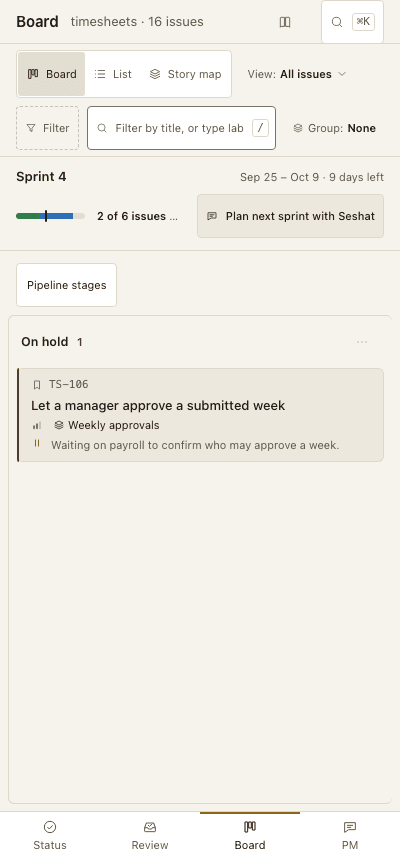
   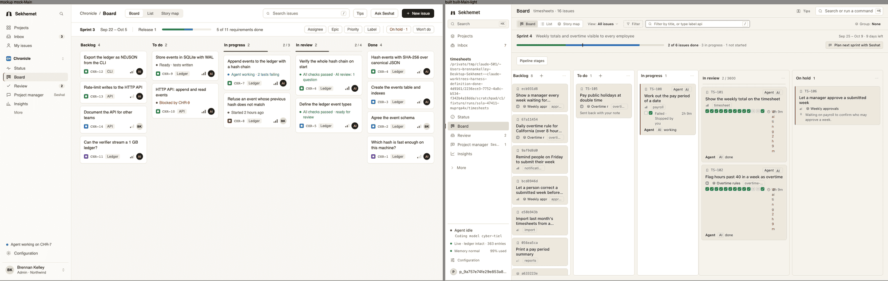

2. **CLI-01.** Confirm severity 4: the CLI cannot accept any issue with AI review findings (`accept --ack`).
3. **INS-01.** Confirm severity 4: the Team image cannot run as written (no socat, no engine for Seshat's role, refused compose arguments).
4. **REL-01.** Confirm severity 4 and say yes or no to automatic daily backups outside the repository (a [backup] setting).
5. **TST-01.** Confirm severity 4: 404 of 537 built criteria have no entry-point test (§G 14); C2 works the list.
6. **SEC-01.** Confirm: Viewers and Stakeholders get a blaming 403 toast on every page, and Audit fills with their 'refusals'.

   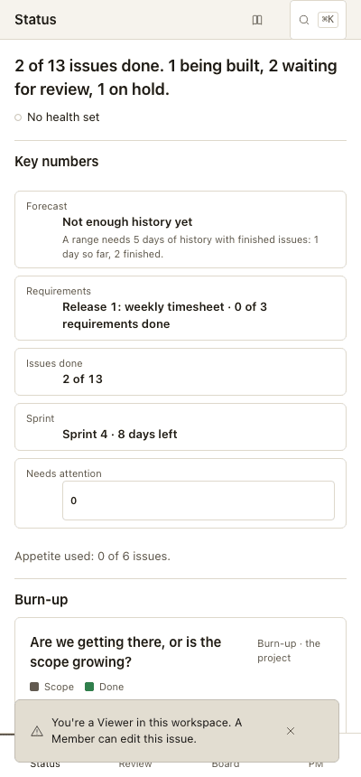

7. **REV-01.** Confirm: skipped checks shown as failed, and four answers to 'did it pass?' on one page.

   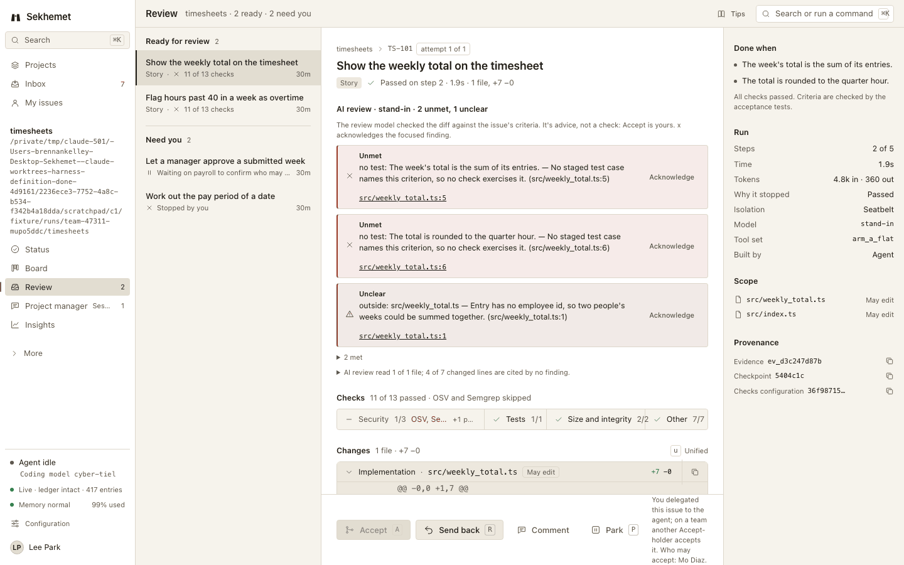

8. **REV-02.** Confirm the Review action bar at 400 px against the ReviewPhone mockup.

   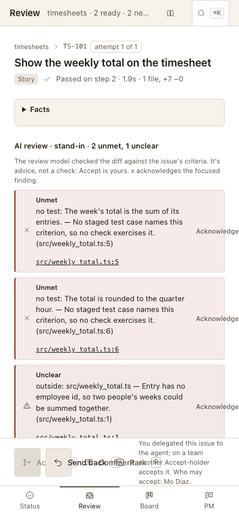
   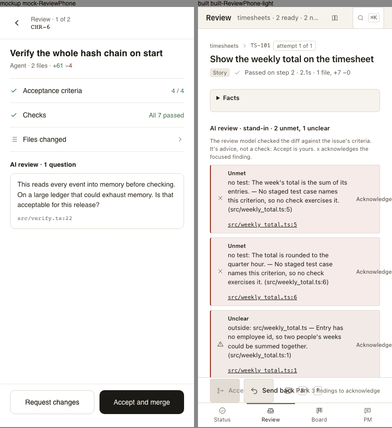

9. **ISS-01.** Mockup deviation: build the Issue mockup's properties rail (recommended).

   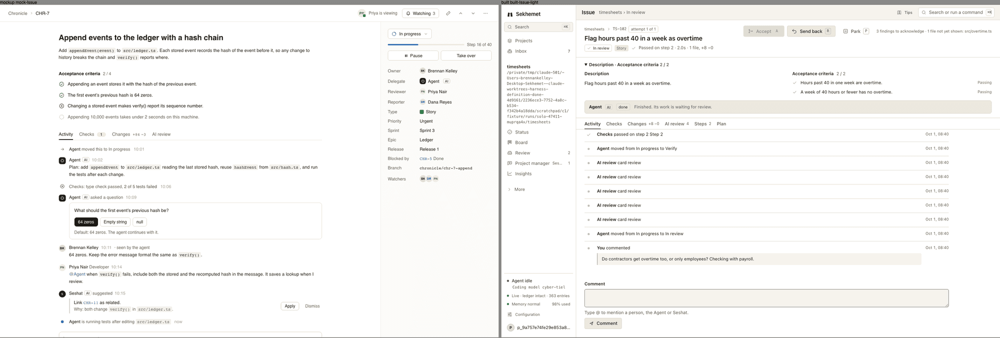

10. **ISS-02, ISS-03.** Confirm: a stopped run reads as failed and running at once, and 'Stopped by you' is shown to everyone.

   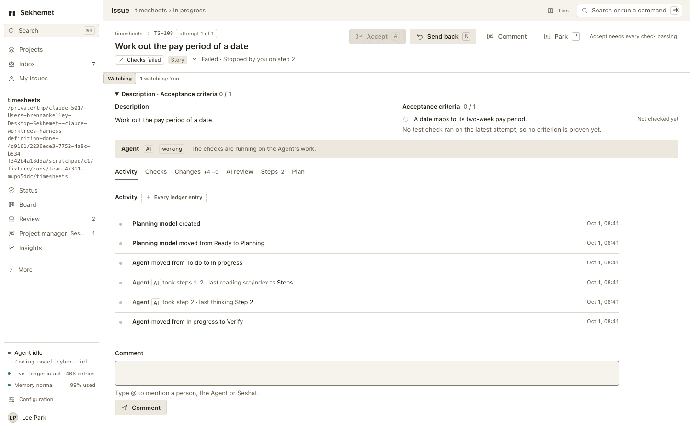

11. **ERR-01, ERR-03.** Confirm: a server error shows 'No issues yet' on a 16-issue project; offline views stay blank.

   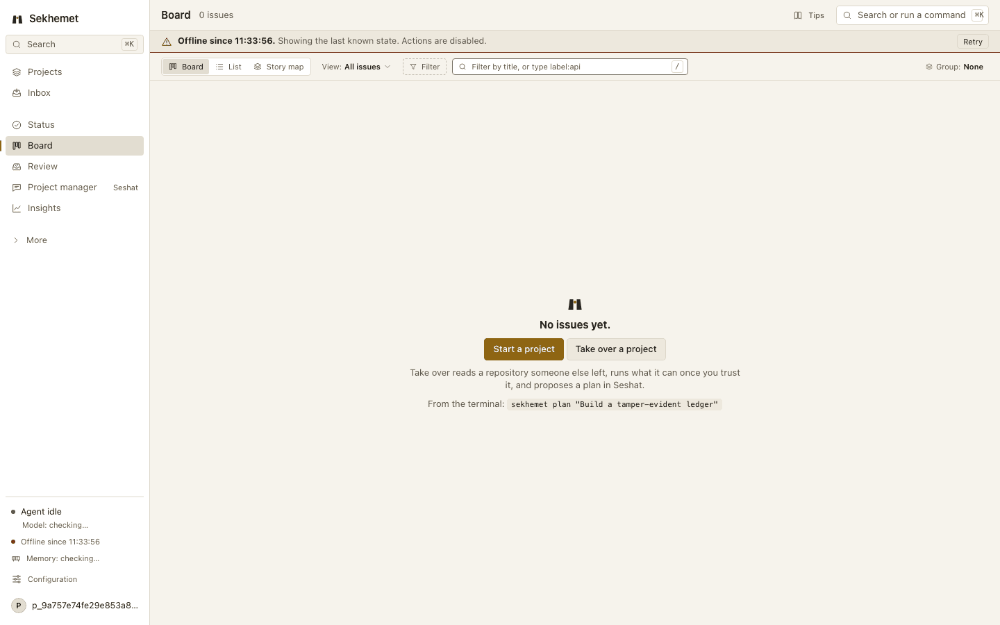

12. **PM-01, PM-02.** Confirm: Seshat's failure reply is a raw exception, and 'How is it going?' fails without a model though /status works.

   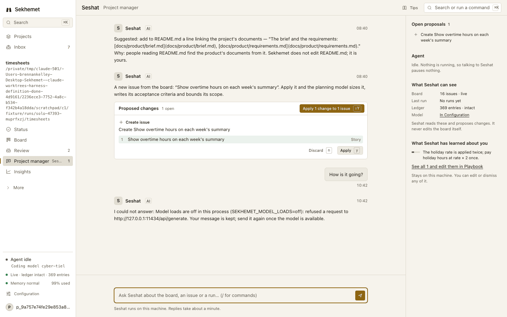

13. **SHL-01, SHL-02.** Confirm: the sidebar shows an absolute path (no project switcher) and Solo shows 'p_9a75…' as your name.

   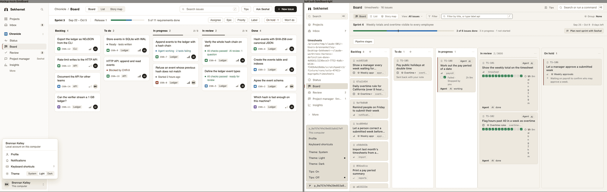

14. **SHL-03, SHL-04.** Confirm: first run lands everyone on Configuration › Models with no welcome, and model status contradicts itself.

   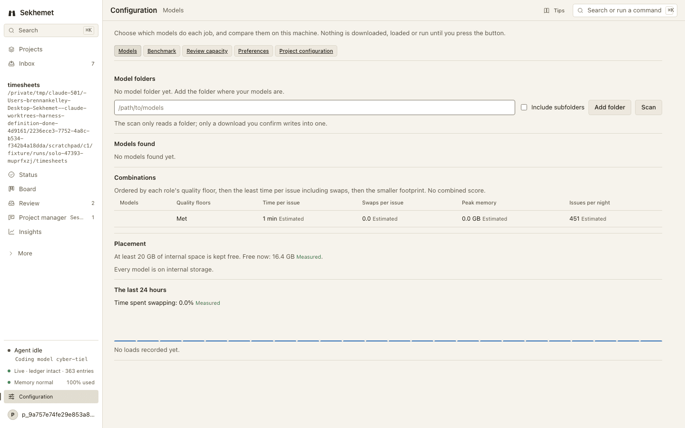

15. **STA-01, STA-02, STA-03.** Confirm: Status disagrees with the board and /status, misroutes 'Needs you', and its key numbers look unfinished.

   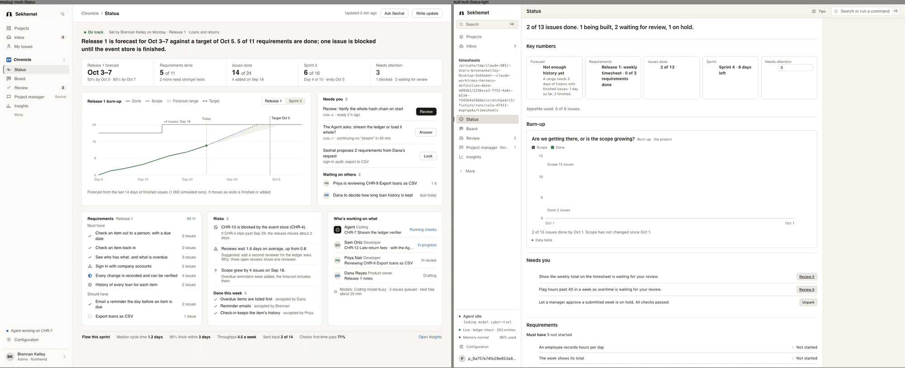
   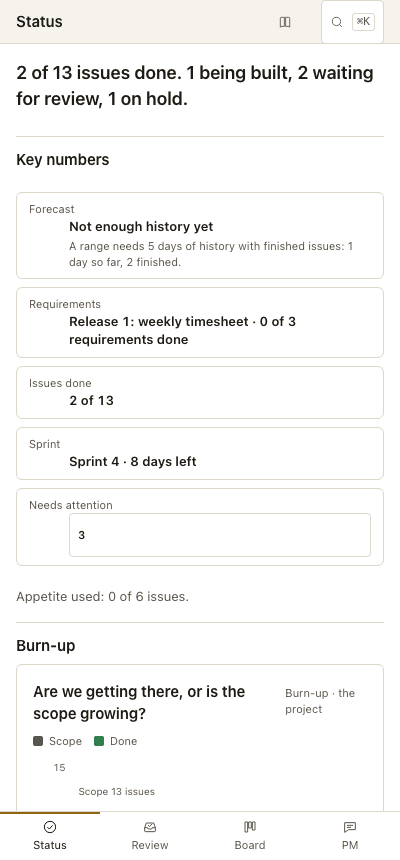

16. **BRD-02, BRD-04.** Confirm: In review tiles break one letter per line, and the WIP limit reads 3600 with a Tip saying reviews take 0 minutes.

   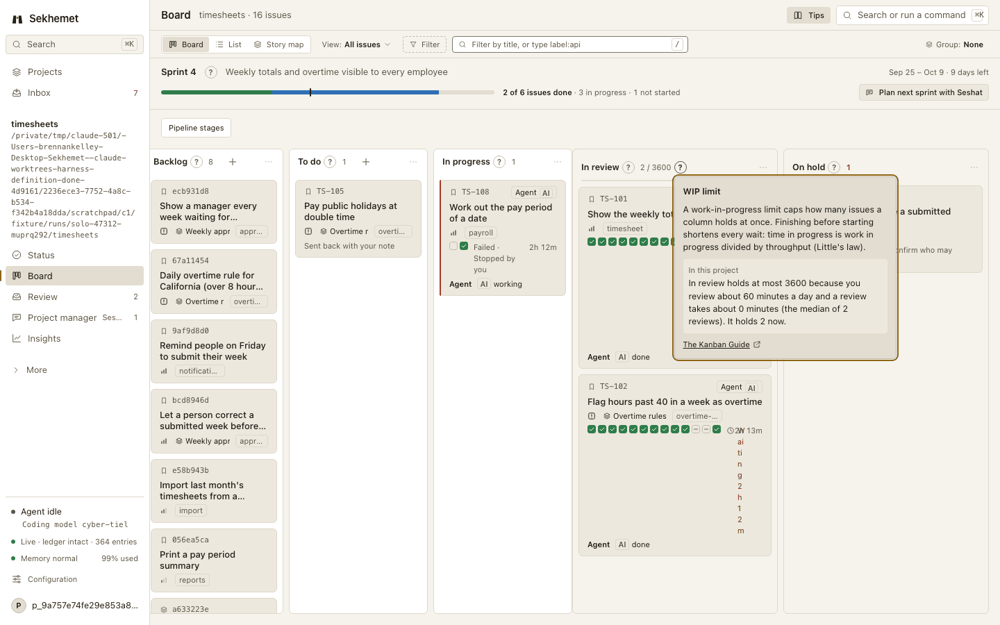

17. **CFG-07, PM-05, SPEC-07, STA-08, TEAM-03, TEAM-04, VIS-02.** Decide the mockup deviations: two-pane Inbox (the spec says one list), Members' Invites and access parts, the Start page with a live draft, the Status grid, Configuration's cards, the brand mark, and the primary button colour (gold vs dark).

   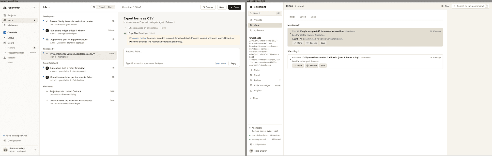
   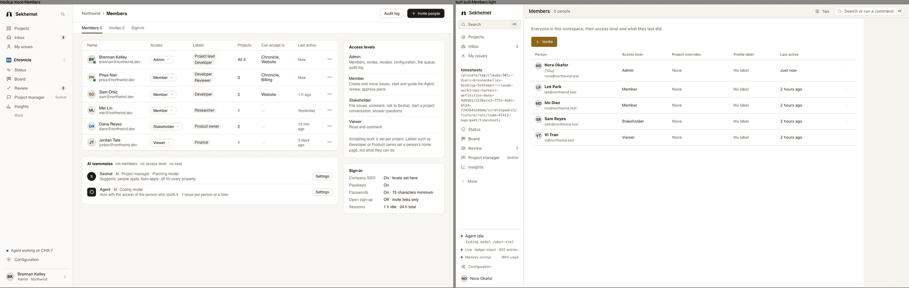
   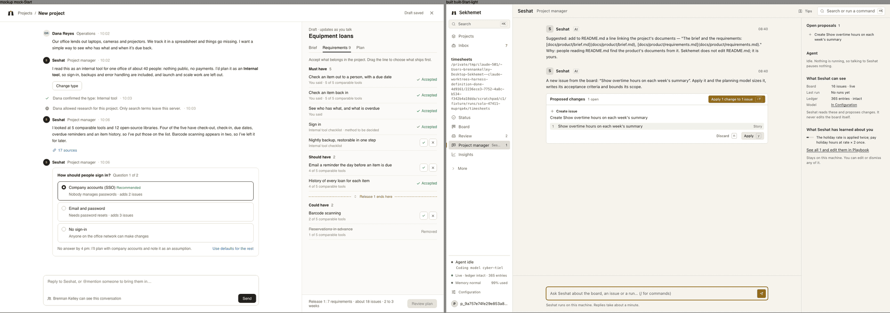
   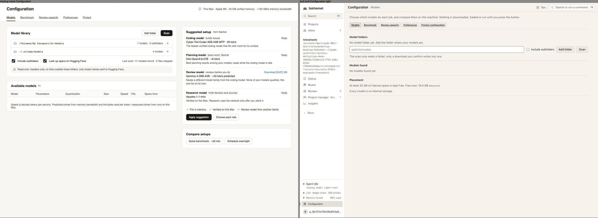
   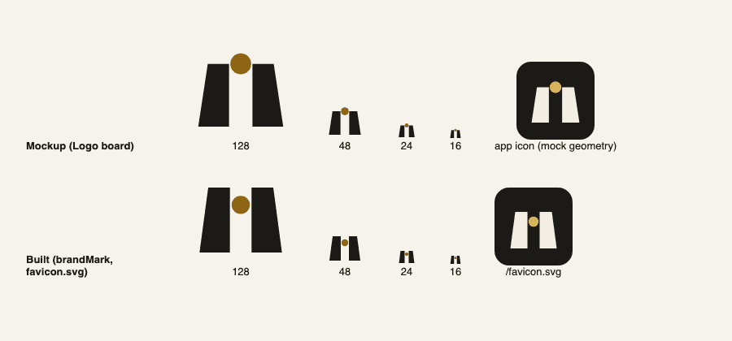

18. **WRD-02, WRD-04, WRD-06, WRD-07, WRD-19, WRD-27.** Amend NAMING (or keep): Owner→Assignee, Send back→Request changes, Ledger→Activity log, Done when→Acceptance criteria, Suspect→Needs re-checking, May edit→Files in scope (rename table rows marked 'owner').
19. **ISS-04, PRC-01, PRC-02, PRC-04, PRC-06.** v1 scope: sprint lifecycle, Stakeholder intake and triage, full-text search, one project per server, and Reopen/Revert in the dashboard — v1 (C2) or a deferral DEC each.
20. **INS-02, INS-04, INS-06.** Release decisions: provenance vs the CI deferral, the public-repository checklist (DEV_LOG, author email), and an opt-in update check.

